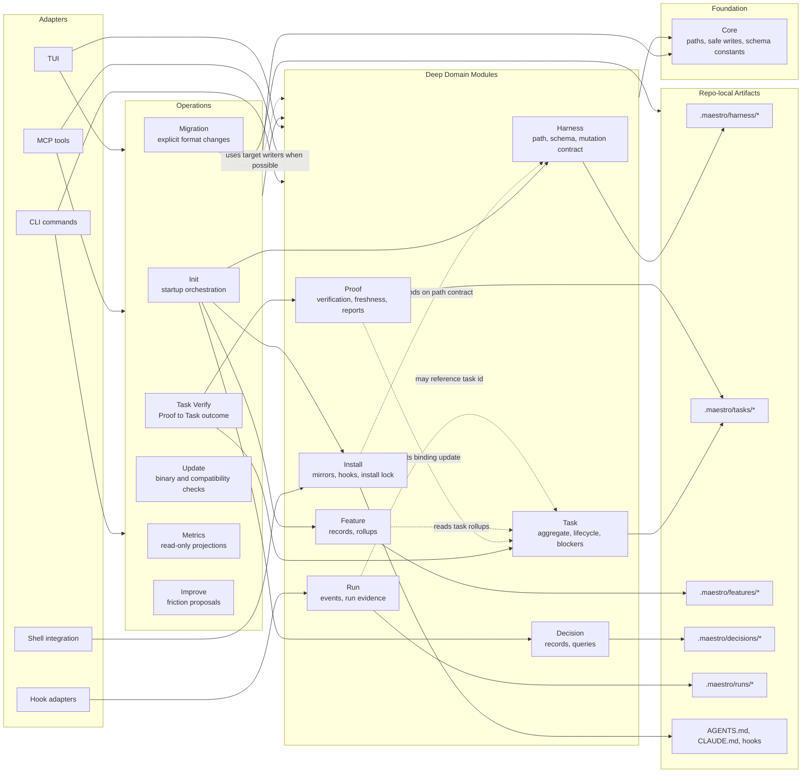
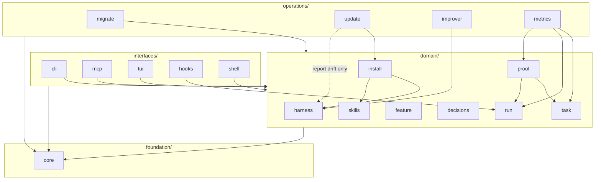
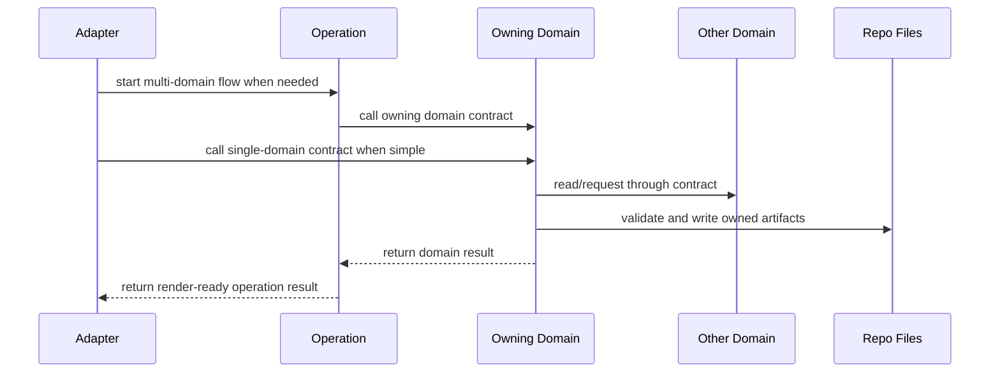

# Maestro Rust Architecture Spec

This document is the maintainer architecture spec for the Rust rewrite of Maestro.
It is written for both future agents and human maintainers, with agents as the
primary execution audience.

## Spec Mode

Each major section should describe both:

- **Current state**: how the codebase works today, including rough edges.
- **Target state**: the architecture the codebase should move toward.

This keeps the document useful during refactors: readers can see what exists now,
what direction future work should follow, and where the gap is intentional.

## Audience

The spec serves two audiences:

- **Future agents** need precise module responsibilities, test expectations,
  safe refactor seams, and maintenance rules that reduce guessing.
- **Human maintainers** need the same map in reviewable language, with enough
  context to judge whether future changes preserve the intended architecture.

When these audiences conflict, prefer wording that is executable by agents while
remaining readable to humans.

## Documentation Shape

The architecture documentation should be split into focused root-level files:

- `ARCHITECTURE.md`: source layout, module responsibilities, domain model,
  architectural seams, current state, and target state.
- `TESTING.md`: test taxonomy, required verification by touched surface, fixture
  policy, and regression coverage expectations.
- `MAINTENANCE.md`: maintenance rules, refactor discipline, docs update rules,
  release-adjacent checks, and long-term scaling guidance.

`ARCHITECTURE.md` is the map. `TESTING.md` defines how changes are proved.
Maintenance guidance should avoid duplicating the map and instead define how
the codebase is kept healthy over time.

## Architecture Documentation Model

`ARCHITECTURE.md` should use a domain-first hybrid structure:

1. Start from Maestro's durable domain concepts.
2. Map each concept to the source modules that implement it.
3. Describe important runtime flows across those modules.
4. Track current state and target state for each major section.

This is based on four documentation principles:

- Architecture docs need multiple views: context, source structure, runtime
  behavior, cross-cutting concepts, decisions, risks, and glossary.
- Architecture should be readable from system context down to code, not only
  from folders upward.
- Documentation structure should match the reader's need. For future agents,
  the first need is knowing which concept they are touching and where it lives.
- Different readers need different views, so source layout, runtime flows, and
  testing strategy should be separate sections.

Reference influences:

- arc42: architecture docs should include goals, constraints, context, building
  blocks, runtime view, cross-cutting concepts, decisions, risks, and glossary.
- C4 model: describe architecture with hierarchical views from system context
  down to code.
- Diataxis: organize documentation around reader needs instead of dumping facts
  in implementation order.
- 4+1 view model: use multiple concurrent architecture views for different
  stakeholder concerns.

## Table Of Contents Target

The completed root architecture spec should use this section order:

1. Architecture Goals
2. Domain Concepts
3. Source Map
4. Runtime Flows
5. Testing Map
6. Current Vs Target Architecture
7. Known Refactor Seams
8. Glossary

## Architecture Goals

### Current State

The codebase is a local-first Rust CLI whose product invariant is correctness
over repo-local files. Commands should derive behavior from files on disk rather
than hidden service state, background daemons, or remote systems.

The codebase already exposes many of the right domain modules, but some command
modules still carry implementation details that should eventually live behind
deeper domain modules.

### Target State

The architecture goals are ordered:

1. **Local-first correctness** is the product invariant.
   Maestro must preserve deterministic file artifacts, safe writes, explicit
   verification, and no hidden daemon assumptions.
2. **Agent maintainability** is the codebase invariant.
   Future agents and human maintainers must be able to find the right module,
   understand the relevant invariants, test the right surface, and refactor
   without guessing.

When these goals conflict, preserve local-first correctness first and improve
agent maintainability without weakening the product invariant.

The target architecture should therefore prefer deep domain modules with small,
explicit interfaces over command modules that directly coordinate artifact
details.

### Maintainability Model

In this spec, maintainability means:

- **Navigability**: a maintainer can start from a domain concept and quickly find
  the files, commands, tests, and artifacts that implement it.
- **Locality**: changing one concept should require edits in that concept's
  module and its tests, not scattered edits across unrelated command modules.
- **Stable contracts**: other modules depend on explicit interfaces, schema
  versions, path contracts, and mutation rules instead of reaching into private
  file choreography.
- **Compatibility**: updates to templates, schemas, or generated artifacts do
  not silently rewrite user-owned repo files or break unrelated workflows.
- **Small adapters**: CLI commands, hook adapters, and installer mirrors should
  translate input/output around domain modules instead of owning domain rules.

The target architecture style is a **modular monolith with deep domain
modules**:

- It stays one local Rust CLI binary.
- Each durable concept gets a module that owns its data model, artifact layout,
  invariants, and write policy.
- Cross-concept interaction happens through narrow interfaces and declared
  contracts.
- Ports or adapter traits are introduced only when there are real alternate
  adapters, external systems, or test seams that repay the added interface.

For example, a Harness template update should be local to the Harness module and
new `init` output unless an explicit Harness-owned apply command or migration
path applies it to an existing repository. Install, Proof, Improve, and Update
should keep working through the Harness path, schema, reference, and mutation
contracts instead of depending on the exact template text.

### Module Contract Model

The same maintainability rule applies to every module. Each module should have a
clear contract. Read the fields this way:

- **Owns**: what this module is the source of truth for. If this thing changes,
  start here.
- **Exposes**: what other modules are allowed to call or rely on.
- **Depends on**: what this module is allowed to use from other modules.
- **Must not own**: what would make this module too wide or too coupled.
- **Verification**: the smallest tests or checks that prove this module still
  keeps its contract.

The simple rule is: if a maintainer edits one module, unrelated modules should
keep working unless the edit changes an explicit contract.

Example:

- Harness owns `.maestro/harness/HARNESS.md`, `harness.yml`, and `backlog.yaml`.
- Install may depend on the Harness path contract.
- Install must not copy or reinterpret the full Harness protocol.
- If Harness template text changes, Install should still work because it points
  at the Harness file instead of depending on the exact text.
- Existing repositories should receive template changes only through explicit
  Harness-owned apply behavior, `init --force` or merge behavior, or a
  documented migration path. Passive update checks and ordinary binary updates
  must not rewrite user-owned Harness files.

Cross-module changes should follow these rules:

- A private implementation change should usually require edits only in that
  module and its tests.
- A public interface change must update the source map, affected runtime flows,
  and tests for the adapters that call it.
- A schema or path change must include an explicit compatibility, migration, or
  force/apply story.
- A generated-template change must define whether it affects only new artifacts
  or also existing user-owned artifacts.
- A command, MCP tool, TUI, hook adapter, or shell adapter must not duplicate
  domain rules from the module it calls.

If editing one domain module unexpectedly breaks unrelated modules, treat that
as architecture feedback. Either the edited module changed a public contract
without updating its dependents, or another module was depending on private
implementation details and should be moved behind the correct interface.



## Domain Concepts

The domain concept sections should be filled one at a time. Each concept should
explain what the concept means, which files implement it, which invariants must
hold, and where the concept should move in the target architecture.

Each target concept should keep the Module Contract Model fields visible enough
for future maintainers to act on them. The domain sections use `Tests` as the
section-local form of `Verification`. When a stable facade or read model exists,
the section should also name what it exposes; until then, `Owns`, `Depends On`,
and `Must Not Own` define the intended contract surface.

The concept order is artifact-substrate first:

- Harness
- Task
- Feature
- Decision
- Run
- Proof
- Install
- Migration

This order is intentional. The product is a local-first file substrate, so the
spec starts with the durable artifacts before describing workflows or command
surfaces. Do not reorder this section around CLI command order.

Each domain concept section should use the same contract shape:

- **Current State**: what exists now and where it lives.
- **Target State**: what the module should become.
- **Owns**: files, data, invariants, and write policy local to the concept.
- **Depends On**: other module contracts this concept may use.
- **Must Not Own**: behavior that belongs somewhere else.
- **Tests**: the smallest tests that prove the contract still works.

### Harness

#### Current State

The Harness is the canonical repo-local instruction and configuration substrate
under `.maestro/harness/`.

`maestro init` currently creates these Harness artifacts:

- `.maestro/harness/HARNESS.md`
- `.maestro/harness/harness.yml`
- `.maestro/harness/backlog.yaml`

The current implementation also creates adjacent repo-local substrate at init
time, including features, decisions, and bundled skills directories. Those are
related startup artifacts, but they should not be treated as part of the Harness
concept itself.

Several workflows already depend on the Harness without owning it:

- `install` writes agent-specific mirrors such as `CLAUDE.md` and `AGENTS.md`
  that point agents back to `.maestro/harness/HARNESS.md`.
- `verify` reads Harness configuration from `harness.yml`.
- `improve` refreshes rule-based proposals into `backlog.yaml`.
- `update` detects Harness schema mismatches without mutating artifacts in the
  schema check path.

The rough edge is that setup and maintenance commands are easy to mentally group
as "the harness" because `init`, `install`, `improve`, and `update` all touch or
reference Harness-adjacent files. The architecture should keep those
responsibilities separate so a Harness change does not accidentally imply a
mirror, skill, proof, or migration change.

#### Target State

Harness should mean only the canonical artifact set:

- `HARNESS.md`: the agent protocol and shared repo instructions.
- `harness.yml`: machine-readable Harness configuration, including verification
  configuration.
- `backlog.yaml`: proposed Harness improvements that still require user review
  or an explicit apply step.

The maintainable target is a narrow Harness with explicit dependent concepts:

- **Install** publishes references to the Harness into agent-specific mirrors.
  It must not duplicate the Harness protocol into those mirrors.
- **Proof** reads Harness verification configuration, but does not own Harness
  schema or mutation policy.
- **Improve** proposes Harness changes by appending backlog items. It must not
  silently apply protocol or config changes.
- **Update** may detect Harness schema drift, but existing user-owned Harness
  artifacts must only change through Harness-owned apply behavior,
  `init --force` or merge behavior, or a documented migration path with a clear
  diff or backup story.

This creates four stable contracts:

1. **Path contract**: `.maestro/harness/HARNESS.md`,
   `.maestro/harness/harness.yml`, and `.maestro/harness/backlog.yaml` are the
   canonical Harness files.
2. **Schema contract**: Harness config and backlog files declare their schema
   versions and are validated before use.
3. **Reference contract**: mirrors point to the canonical Harness instead of
   copying its contents.
4. **Mutation contract**: user-owned Harness artifacts are not rewritten as a
   side effect of install, verify, improve detection, or passive update checks.

If the bundled Harness template changes in a future Maestro release, the change
should affect new `maestro init` runs by default. Existing repositories should
receive that change only through a named explicit mutation path.

The target mutation paths are:

- `maestro update --check` and passive auto-check only report binary or
  compatibility drift. They do not mutate user-owned Harness files.
- ordinary `maestro update` updates the installed binary and bundled resources
  it explicitly owns, but it does not rewrite existing Harness artifacts.
- Harness-owned apply behavior, such as a future
  `maestro harness apply-template`, may update existing Harness files only with
  a visible diff, backup, and explicit force/apply intent.
- Migration may update Harness files only for supported old-format conversion,
  not for routine template refresh on already-current repositories.

#### Harness Backlog Sub-Contract

`backlog.yaml` is part of Harness ownership, but it has its own sub-contract
because Improve, Metrics, Query, MCP, and future planning tools can all read or
propose against it.

Harness Backlog owns:

- `.maestro/harness/backlog.yaml`.
- backlog schema version and validation.
- proposal id or stable key allocation.
- duplicate proposal detection.
- deterministic proposal ordering.
- refresh behavior for rule-generated proposals.
- read models for Metrics, Query, MCP, and TUI consumers.

Current code path: `src/domain/harness/backlog.rs` owns backlog load, save,
proposal merge, schema validation, and applied-status mutation. Improver
detection remains in `src/operations/improver/detect.rs`, and
`src/operations/improver/propose.rs` routes detected proposals through the
Harness Backlog contract.

Improve may propose or refresh backlog items through the Harness Backlog
contract. It must not silently apply Harness protocol or config changes. Any
operation that turns a backlog proposal into a Harness artifact mutation must
use the Harness mutation contract above.

Backlog tests should prove schema validation, duplicate handling, deterministic
ordering, refresh-without-apply behavior, and read-model stability.

### Task

#### Current State

Task means the repo-local task aggregate, not only `task.yaml` and not the
entire CLI workflow.

A task currently lives under `.maestro/tasks/` in a directory derived from the
task id and slug. The aggregate includes:

- `task.yaml`: authoritative task record using `maestro.task.v1`.
- `task.md`: human-readable task companion.
- `acceptance.yaml`: acceptance criteria using `maestro.acceptance.v1`.
- Task-local proof and evidence directories when present.
- `verification.attempts/` and `verification.json` when Proof has run for the
  task.

The task record contains the durable lifecycle data: id, slug, optional feature
id, lane, risk, state, acceptance lock, claimant fields, blockers, state
history, verification binding, and timestamps.

The task lifecycle states are:

- `draft`
- `exploring`
- `ready`
- `in_progress`
- `needs_verification`
- `verified`
- `rejected`
- `abandoned`
- `superseded`

Current task behavior is split across several modules:

- `src/domain/task/template.rs` defines task, acceptance, blocker,
  state-history, and verification-binding data structures, plus artifact
  read/write helpers. `src/task/mod.rs` preserves the legacy compatibility
  surface.
- `src/domain/task/lifecycle.rs` owns core transition validation and state-history
  appends for normal transitions.
- `src/domain/task/blockers.rs` owns blocker add, resolve, and unresolved-blocker
  checks.
- `src/domain/task/lookup.rs`, `src/domain/task/display.rs`, and
  `src/domain/task/doctor.rs` own lookup, rendering, and blocker-graph
  validation.
- `src/interfaces/cli/task.rs` routes CLI verbs, but also still owns some aggregate
  details such as acceptance locking, next task id selection, blocker id
  selection, blocker descriptor construction, and command-specific state-history
  entries.
- `src/operations/task_verify/` coordinates task verification for CLI flows:
  it loads the Task snapshot, asks Proof to write a receipt-keyed attempt under
  `verification.attempts/`, and asks Task to promote `verification.json` and
  apply the outcome through optimistic concurrency.

The rough edge is that task invariants are not all behind one Task aggregate
interface. Some of them live in task modules, some in command code, and some in
the Proof and task-verify modules.

#### Target State

Task should be a deep aggregate module with a small interface. Callers should
not need to know the file choreography required to mutate a task safely.

The Task aggregate should own:

- task directory naming and task id generation rules.
- creation of `task.yaml`, `task.md`, and `acceptance.yaml`.
- loading and saving with optimistic-concurrency snapshots.
- lifecycle transitions and state-history append rules.
- acceptance locking.
- blocker add, resolve, id allocation, and graph-local task blocker semantics.
- verification binding updates requested by Proof.

The verification outcome apply surface is a Task contract for
`operations/task_verify`. Proof may produce typed outcome data, but it must not
call Task mutation paths directly.

The CLI command layer should become an adapter over this aggregate. It should
parse command arguments, call Task operations, and render output. It should not
manually coordinate acceptance files, blocker ids, state-history entries, or
task artifact layout.

Proof should remain separate from Task. Proof owns command execution, evidence
collection, freshness checks, claim matching, and `verification.json`; Task owns
whether and how proof results change task lifecycle state or verification
binding fields.

Feature should remain separate from Task. Task may store a `feature_id`, but
Feature owns feature records and rollups.

Run should remain separate from Task. Task may be referenced by run evidence,
but run event capture and run evidence generation are not part of the Task
aggregate.

The primary Task test surface should be the aggregate interface, not only CLI
integration tests. Tests should cover artifact creation, lifecycle validation,
acceptance locking, blocker behavior, state-history append rules,
optimistic-concurrency saves, and Proof-requested verification binding updates.

### Feature

#### Current State

Feature means the feature aggregate, not only `features.yaml` and not the whole
planning workflow.

Feature records currently live in `.maestro/features/features.yaml` using
`maestro.feature.v1`. `src/domain/feature/schema.rs` defines the registry,
feature records, and feature lifecycle status. The code explicitly keeps task
counts out of stored feature records.

Feature rollups are derived on demand. `src/domain/feature/query.rs` scans
`.maestro/tasks/**/task.yaml` and counts total and verified tasks by
`feature_id`.

The current lifecycle statuses are:

- `proposed`
- `in_progress`
- `shipped`
- `cancelled`

The rough edge is that `src/interfaces/cli/feature.rs` currently owns more than CLI
adapter work. It loads and saves the registry, creates feature records, changes
feature status, formats status labels, and computes rollups for display. Those
rules belong behind the Feature aggregate interface.

#### Target State

Feature should be a deep aggregate module for feature records and feature
rollups.

**Owns**

- `.maestro/features/features.yaml`.
- `maestro.feature.v1` registry and record schema.
- feature id generation from a title.
- feature creation and duplicate-id checks.
- feature status transitions.
- feature display/query read models.
- derived task rollups by reading Task's public read contract.

**Depends On**

- `core` for paths, safe writes, schema constants, timestamps, and slugging.
- `task` read access for task ids, task states, and `feature_id` rollups.

**Must Not Own**

- task creation or task lifecycle transitions.
- task verification or Proof status.
- roadmap sequencing or project planning policy.
- run evidence or hook event capture.
- migration policy for old feature formats outside explicit Migration code.

**Tests**

- empty feature registry uses `maestro.feature.v1`.
- feature records do not persist task counts.
- rollups are computed from task files.
- create/edit/ship/cancel commands call Feature behavior and render expected
  output.
- schema mismatch fails before mutation.
- changing Feature internals does not require edits to Task, Proof, Run, or
  Install tests unless the explicit Feature contract changes.

### Decision

#### Current State

Decision means the decision aggregate: decision files, naming, templates,
lookup, and query behavior. It does not mean task blockers, planning authority,
or full governance workflow.

Decision artifacts currently live under `.maestro/decisions/` as Markdown files
named like `decision-001-use-computed-query-views.md`.

Current decision behavior is split across:

- `src/domain/decisions/template.rs`: decision file names and Markdown template.
- `src/domain/decisions/query.rs`: decision file discovery, id resolution,
  sequence number parsing, and path traversal/symlink avoidance.
- `src/interfaces/cli/decision.rs`: CLI routing, decision creation, list, show, next
  decision number calculation, and output.

The current Markdown template contains:

- `Status`
- `Context`
- `Decision`
- `Alternatives considered`
- `Consequences`
- `Linked tasks`

The rough edge is that Decision is partly an aggregate module and partly a CLI
implementation. Creation sequencing and write orchestration still live in the
command layer. Another rough edge is that `core` declares
`maestro.decision.v1` for decision Markdown frontmatter, but the current
decision template does not embed structured frontmatter.

Until structured decision metadata is introduced, `maestro.decision.v1` is a
reserved schema constant, not an active reader requirement. No current Decision
reader should require frontmatter only because the constant exists. If Decision
frontmatter becomes active, this spec must define the frontmatter fields,
migration behavior, and tests in the same change.

#### Target State

Decision should be a deep aggregate module for durable architectural decisions.

**Owns**

- `.maestro/decisions/`.
- decision file naming.
- decision id and sequence allocation.
- decision Markdown template.
- decision lookup by id or file name.
- safe decision listing and path validation.
- decision schema/frontmatter if structured metadata is introduced.

**Depends On**

- `core` for paths, safe writes, schema constants, and slugging.
- `task` only by reference when a decision links to task ids in text or
  structured metadata.

**Must Not Own**

- task lifecycle or blockers.
- Proof execution or verification verdicts.
- feature status or roadmap planning.
- run evidence or hook event capture.
- automatic enforcement of architectural policy outside explicit validation or
  query behavior.

**Tests**

- decision file names use padded numbers and slugs.
- decision Markdown matches the canonical template.
- decision creation auto-increments from existing files.
- decision list and show resolve valid ids.
- decision lookup rejects path traversal, nested paths, and symlinks.
- changing Decision internals does not require edits to Task, Feature, Proof,
  Run, Install, or Harness tests unless the explicit Decision contract changes.

### Run

#### Current State

Run means the run aggregate: recorded events, session identity, normalized event
shape, run directory naming, and derived run evidence. It does not mean the
whole agent execution workflow.

Run artifacts currently live under `.maestro/runs/`. A hook payload with a
session id is written to:

- `.maestro/runs/<encoded-session-id>/events.jsonl`
- `.maestro/runs/<encoded-session-id>/run_evidence.yaml` after a `Stop` event
  when evidence generation succeeds.

Current run behavior is owned by `src/domain/run/`:

- `src/domain/run/event.rs`: accepted hook event contract (the single source
  for installed and recorded events, embedded from
  `resources/hooks/events.yaml`), event aliases, unattributed session handling,
  and collision-resistant run directory encoding.
- `src/domain/run/record.rs`: event normalization, commit snapshots for
  `SessionStart` and `Stop`, managed append to `events.jsonl`, and triggering
  run evidence generation on `Stop`.
- `src/domain/run/append.rs`: managed, retry-safe JSONL append behavior.
- `src/domain/run/reader.rs`: typed, streaming Run event read models.
- `src/domain/run/discovery.rs`: managed discovery of run event logs and run
  evidence files.
- `src/domain/run/evidence.rs`: aggregation of `events.jsonl` into
  `run_evidence.yaml`.

`src/interfaces/hooks/record.rs` is now a thin adapter that reads stdin, parses
JSON, and calls Run. `src/interfaces/hooks/event.rs` is a thin re-export of Run
event helpers for the hooks interface. `src/domain/proof/events.rs` exposes the
Proof event-discovery surface while delegating discovery to Run.

The normalized event records use `maestro.event.v1`. Run evidence uses
`maestro.run_evidence.v1`. `core` also declares `maestro.run.v1`, but the
current implementation does not have a first-class `run.yaml` artifact.

Until a first-class `run.yaml` artifact is introduced, `maestro.run.v1` is a
reserved schema constant, not an active reader requirement. Run readers should
use `maestro.event.v1` event lines and `maestro.run_evidence.v1` evidence. If
`run.yaml` becomes active, this spec must define its artifact path, schema,
migration behavior, and tests in the same change.

The remaining rough edge is compatibility surface area, not ownership:
`crate::hooks` and `maestro::hooks` still exist as compatibility re-exports.
New code should call `domain/run` for Run behavior and keep hook adapters
focused on process input and output.

#### Target State

Run should be a deep aggregate module for sessions and run artifacts.

**Owns**

- `.maestro/runs/`.
- session id to run directory encoding.
- unattributed-session behavior.
- normalized event schema and accepted event names.
- safe append policy for `events.jsonl`.
- `run_evidence.yaml` derivation from session events.
- managed discovery of run event and run evidence artifacts.
- tolerance policy for bad JSON lines, missing fields, and symlinked run paths.

**Depends On**

- `core` for managed paths, safe writes, schema constants, git snapshots, and
  timestamps.
- no Task code dependency is needed to preserve `task_id` values from events;
  Run treats task ids as opaque strings in event and evidence read models.

**Must Not Own**

- imports of the Task aggregate or calls to Task operations.
- task lifecycle transitions or task verification binding.
- Proof verdicts, claim matching, or stale-proof rules.
- Metrics summaries or improver proposals.
- install policy for hook configuration.
- agent-specific hook installation details.
- feature or decision lifecycle behavior.

**Tests**

- hook payloads normalize to `maestro.event.v1` event lines.
- unsafe session ids encode without collisions.
- missing session ids write to the unattributed run.
- unsupported events are ignored without creating run artifacts.
- concurrent writes to the same session append complete event lines without
  corrupting `events.jsonl`.
- partial event lines are tolerated by readers and never produced by successful
  appends.
- `Stop` events generate `maestro.run_evidence.v1` evidence from events.
- `Stop` event evidence generation is idempotent and deterministic when rerun.
- late events racing with `Stop` do not corrupt evidence; the next evidence
  regeneration sees the complete managed event log.
- run evidence counts tools, prompts, duration, commits, agent, and task id.
- bad event lines and missing fields are tolerated during evidence generation.
- write paths reject symlinked run roots or run targets before appending.
- read paths ignore unmanaged or symlinked run paths and report them through
  diagnostics when useful.
- Proof and Metrics can read Run artifacts without owning Run normalization or
  write policy.
- architecture/import tests prevent Run from importing Task while allowing
  `task_id` strings to remain part of Run read models.

Run append and evidence generation should have a concrete concurrency contract:

- appends use a locking or atomic-append strategy that preserves whole JSONL
  lines per event.
- readers tolerate partial trailing lines, bad JSON, and missing optional
  fields.
- evidence generation can be rerun safely after `Stop`, after late events, or
  after an interrupted generation.
- hook adapters may warn instead of failing the caller, but Run must not leave
  malformed managed records behind after a successful append.

### Proof

#### Current State

Proof means the proof aggregate: verification execution, freshness, evidence
collection, claim matching, persisted verification reports, and proof status.
It does not mean Task lifecycle ownership, Run recording, Metrics summaries, CI,
or release policy.

Proof currently persists task-local verification reports at:

- `.maestro/tasks/<task-dir>/verification.attempts/<receipt>.json`
- `.maestro/tasks/<task-dir>/verification.attempts/latest.json`
- `.maestro/tasks/<task-dir>/verification.json`
- `.maestro/tasks/<task-dir>/verification.json.restore` while canonical report
  promotion is in progress.

The report uses `maestro.verification.v1` and includes:

- task id
- Task snapshot identity used for the verification attempt
- pass/fail status
- verified timestamp
- freshness inputs
- claim checks
- verify command results
- proof sources
- failures

Current proof behavior is split across:

- `src/domain/proof/verify_task.rs`: task loading, freshness input calculation,
  verify command execution from `harness.yml`, completion-claim extraction,
  proof/evidence collection, claim matching, failure generation,
  receipt-keyed attempt writing, and canonical `verification.json` promotion.
- `src/domain/proof/stale.rs`: freshness comparison and stale reason
  generation.
- `src/domain/proof/proof_status.rs`: persisted proof loading, freshness
  status derivation, unapplied-report detection, and user-facing proof status
  rendering.
- `src/domain/proof/events.rs`: managed discovery of Run `events.jsonl` files
  for proof evidence.
- `src/operations/task_verify/`: transaction-like Proof-to-Task coordination
  for `maestro task verify` and the root `maestro verify` alias.
- `src/interfaces/cli/task.rs` and `src/interfaces/cli/verify.rs`: CLI
  adapters for verification commands.
- `src/interfaces/cli/query.rs`: proof status and matrix read paths.

`domain::proof::verify_task` is intentionally not a public facade export in
the target shape because Task verification is a multi-domain operation
coordinated by `operations/task_verify`. The legacy report-returning path that
once lived at `crate::verification` has been removed.

Proof reads several other concepts:

- Harness provides configured verify commands from `.maestro/harness/harness.yml`.
- Task provides task state, task history claims, acceptance, and verification
  binding fields.
- Run provides event evidence through managed `events.jsonl` files.

Current CLI verification routes through `operations/task_verify`, so Proof
writes reports and Task owns the lifecycle and binding mutation.

#### Target State

Proof should be a deep aggregate module for verification and proof status.

**Owns**

- `verification.attempts/` report attempts, latest-attempt marker, bounded
  attempt retention, canonical `verification.json` schema, read behavior, and
  write behavior.
- verify command execution from Harness configuration.
- proof freshness inputs and stale reason calculation.
- task completion claim extraction for verification.
- proof source collection from task-local evidence/proof directories and Run
  events.
- exact claim matching semantics.
- pass/fail failure generation.
- proof status derivation: missing, failed, accepted, stale, unapplied.
- user-facing proof status rendering or a render-ready proof read model.

**Depends On**

- `core` for paths, safe writes, schema constants, hashes, git head, managed
  paths, and timestamps.
- `harness` for verify command configuration.
- `task` for task read data, acceptance data, task-local proof artifacts, and
  typed verification outcome DTOs that `operations/task_verify` applies.
- `run` for managed event evidence read models and event schema.

**Must Not Own**

- calls to Task mutation or verification-apply paths.
- task lifecycle rules outside the explicit verification-result request it sends
  to Task.
- task artifact layout beyond the task-local proof inputs and verification
  reports it owns.
- run event recording or run evidence generation.
- unmanaged Run path readers.
- metrics summaries or improver proposals.
- install policy, hook installation, CI policy, or release policy.
- feature or decision lifecycle behavior.

**Tests**

- verification passes with matching task claims and proof/event evidence.
- verification writes `maestro.verification.v1` attempt reports and promotes
  `verification.json` only through the Task Verify transaction.
- verification records freshness hashes for task contract, acceptance, checks,
  and commit.
- proof status reports missing, failed, accepted, stale, and unapplied states.
- stale proof detection reacts to acceptance, checks, task contract, and commit
  changes.
- verify commands from Harness run and failures fail verification.
- proof reads Run evidence through Run read models, tolerating bad JSON and
  ignoring unmanaged or symlinked Run paths according to Run's read policy.
- phase-specific tool proof events must match exact claims and task ids.
- Proof can request Task verification binding updates without duplicating Task
  lifecycle rules.
- architecture/import tests prevent Proof from applying Task outcomes directly
  or bypassing Run read models.

#### Proof-To-Task Outcome Transaction

The target verification flow must treat Proof report writing and Task lifecycle
updates as a transaction-like protocol even though they are separate artifacts.

The protocol:

1. Task Verify operation loads a Task snapshot, including enough version,
   timestamp, or content-hash data for Task to detect stale writes.
2. Proof evaluates verification against that snapshot, Harness verify config,
   task-local proof/evidence, Run evidence, acceptance checks, and Git state.
3. Proof writes a receipt-keyed attempt report under `verification.attempts/`
   before any Task mutation, updates the managed latest-attempt marker, and
   prunes old attempts to keep status reads bounded. The report records the
   Task snapshot identity and proof freshness inputs.
4. Task applies the Proof outcome only if the Task snapshot is still current.
   While holding the Task optimistic-concurrency lock, the operation promotes
   the attempt to canonical `verification.json`, then Task owns the lifecycle
   transition, verification binding, `updated_at`, and state-history entries.
5. If attempt writing fails, Task is not mutated.
6. If canonical promotion succeeds but the final `task.yaml` save fails, the
   previous canonical `verification.json` is restored through an explicit
   rollback path backed by a durable restore journal. Rollback failure must be
   surfaced instead of hidden, and later proof-status reads repair an
   interrupted promotion when the canonical report is not reflected by Task.
7. If Task application fails because the Task changed or was locked, the attempt
   remains Proof-owned and is reported as unapplied by the proof read model when
   it is not reflected in the current Task state. The command should not present
   the task as verified. The operation reports typed unapplied reasons for at
   least stale Task snapshots, Task locks, and other apply failures.
8. If Task application succeeds, the Task binding should refer to the committed
   report identity and freshness data so readers can detect missing, stale, or
   unapplied reports later. The Task-owned verification binding stores an
   optional applied-report receipt keyed by the report's Task snapshot
   `updated_at`, `verified_at`, and attempt id; Proof status uses that receipt
   instead of reading Task state-history internals.

Required tests:

- Task changes while verification is running cause a stale/conflict outcome, not
  a blind Task lifecycle update.
- attempt report write failure leaves Task unchanged.
- Task apply failure leaves the report readable but not accepted as a current
  Task verification binding.
- canonical report promotion is rollback-safe when the final Task save fails.
- previously verified tasks move back to `needs_verification` only through the
  Task-owned lifecycle operation.

### Install

#### Current State

Install means the install aggregate: agent-specific install plans, managed
mirrors, hook configuration, skill links, install ownership records, rollback,
and uninstall. It does not mean Harness ownership, Update, Migration, shell
setup, or all agent behavior.

Install currently writes and removes repo-local integration files for Claude and
Codex. The install ownership record lives at:

- `.maestro/install-lock.yaml`

The install lock uses `maestro.install_lock.v1` and records per-agent ownership
for managed files, managed JSON keys, previous JSON values, content hashes, and
skill symlink targets. Agent lock state is explicit: `pending` protects
interrupted installs before the final committed lock is saved, including after
mirror writes, `committed` authorizes normal uninstall, and `removing` records a
durable uninstall retry point after removal has started.

Current install behavior is split across:

- `src/domain/install/mirrors.rs`: mirror plans, managed block
  insertion/removal, JSON managed key insertion/removal, previous JSON value
  snapshots, backups, diffs, rollback, mirror ownership validation, and
  uninstall removal.
- `src/domain/install/lock.rs`: install lock schema, pending/committed/removing
  state, load/save, agent ownership, file ownership, mirror kinds, and lock
  removal.
- `src/domain/install/hooks.rs`: agent-specific hook JSON for Claude and Codex.
- `src/domain/skills/symlink.rs`: generic skill symlink destination
  validation, symlink creation, and owned symlink removal. Install owns the
  agent-specific mapping to `.claude/skills` and `.codex/skills`.
- `src/interfaces/cli/install.rs`: thin CLI adapter for repo discovery, CLI
  agent conversion, and Codex hook approval reminder.
- `src/interfaces/cli/uninstall.rs`: thin CLI adapter for repo discovery and
  CLI agent conversion.

Install currently creates or updates these kinds of files:

- `CLAUDE.md` and `AGENTS.md` managed blocks that point to
  `.maestro/harness/HARNESS.md`.
- `.gitignore` managed sections for Maestro local-only paths and local agent
  settings.
- `.claude/settings.local.json` and `.codex/hooks.json` managed hook keys.
- `.codex/config.toml` managed section.
- `.claude/skills` and `.codex/skills` symlinks to `../.maestro/skills`.

Install requires the canonical Harness protocol file to already exist before it
writes agent-facing pointers to that path. A repository should run
`maestro init` first; install does not create or update Harness protocol
content.

The rough edge is that Install coordinates many adjacent concepts. It references
Harness, Hooks, Skills, Core managed blocks, and agent config files. This is
acceptable only if Install stays the owner of wiring and ownership policy, not
the owner of the content or behavior behind those references.

#### Target State

Install should be a deep aggregate module for safe agent-environment wiring.

**Owns**

- install and uninstall orchestration.
- per-agent install plans.
- managed mirror path list and mirror kinds.
- install lock schema and ownership semantics.
- safe managed block insertion and removal policy for install-owned blocks.
- JSON managed key insertion, restore snapshots, and restore validation.
- backup, diff, rollback, and no-partial-write behavior.
- hook configuration files as install targets.
- skill link install policy and install-lock ownership for skill symlinks.
- shared-path preservation when uninstalling one agent while another still owns
  the path.

**Depends On**

- `core` for paths, managed paths, safe writes, managed blocks, backups, diffs,
  hashes, and schema constants.
- `harness` for the canonical Harness path/reference contract only.
- `run` for the accepted event schema and recordable event contract.
- `skills` for canonical bundled skill location and symlink mechanics.

Install may generate hook config that invokes the public `maestro hook record`
command, but it must not depend on hook adapter internals. The behavior behind
that command belongs to Run.

**Must Not Own**

- Harness protocol content or Harness schema.
- bundled skill content or skill extraction templates.
- Run event normalization or event append behavior.
- Proof verification semantics.
- Update or Migration policy.
- shell integration output beyond files that are part of install mirrors.
- agent behavior after the hook invokes `maestro hook record`.

**Tests**

- install writes expected Claude and Codex mirror plans.
- install fails before writing mirrors when the Harness protocol file is
  missing.
- install writes managed blocks without deleting user content.
- install writes hook JSON managed keys and records ownership.
- install creates skill symlinks and records symlink ownership.
- install refuses to overwrite user-managed skill destinations.
- install rejects symlinked managed directories before partial writes.
- lock save failure does not write mirrors.
- mirror write failure rolls back mirrors and install lock.
- uninstall persists a removing state before destructive mirror removal, and a
  retry can finalize after mirrors were already removed.
- interrupted installs after lock save and before mirror writes are detected as
  incomplete and do not authorize unsafe uninstall.
- interrupted installs after partial mirror writes are recovered or reconciled
  before reinstall or uninstall trusts ownership.
- uninstall removes only owned managed blocks and preserves user content.
- uninstall restores preexisting JSON hook values from verified snapshots.
- reinstall preserves valid JSON restore snapshots and does not trust forged
  restore snapshots; corrupted restore metadata fails safely instead of
  re-blessing managed hook state.
- uninstall rejects forged lock entries, unexpected paths, unexpected JSON keys,
  forged previous values, and symlinked managed directories.
- uninstalling one agent preserves files still owned by another agent.

Install needs an explicit transaction and recovery contract because the lock is
an authority for future uninstall behavior:

- Install records a pending or recoverable state before writing managed files,
  or can reconcile the lock against actual file content hashes before trusting
  it.
- A completed install has evidence that every owned file, block, JSON key, and
  symlink matches the ownership record.
- Reinstall must recover or replace incomplete install state before writing new
  ownership.
- Uninstall must refuse to remove user content when ownership cannot be verified
  against the lock and current file content.
- Crash recovery tests should cover interruption after lock save, interruption
  after partial mirror writes, reinstall recovery, and uninstall with stale or
  unverifiable ownership records.

### Migration

#### Current State

Migration means the migration aggregate: old-format detection, migration plans,
diff rendering, safety checks, target artifact creation, backups, rollback, and
apply behavior. It does not mean Update, normal domain behavior, release policy,
or routine Harness template upgrades.

The current migration implementation supports a v0.106.1 to v0.8 path in
`src/operations/migrate/v0_106_to_v0_8.rs`.

That version module name describes the current legacy artifact path. Future
migration version modules should use exact, sortable source and target artifact
versions when the version scheme allows it, and the migration doc should
explain any nonstandard version jump that could otherwise look like a
downgrade.

Current migration behavior includes:

- building a read-only `MigrationPlan`.
- rendering unified diffs for `maestro migrate --check`.
- applying planned changes with source and destination backups.
- rolling back already-applied writes if a later write fails.
- refusing concurrent writer evidence unless `--force` is used.
- rejecting symlinked migration roots and symlinked targets.
- rejecting migrated task ids that escape the task directory.
- converting legacy task JSONL records into V1 task artifacts.
- creating V1 `acceptance.yaml` and `task.md` alongside migrated `task.yaml`.
- migrating legacy verdict data into Task verification binding fields.
- folding old intake and handoff data into the migrated Task record.
- archiving old mission, verdict, handoff, plan, intake, and feature artifacts
  under raw/archive locations.
- moving legacy evidence into `.maestro/runs/migrated/`.
- normalizing legacy feature registries into current Feature shape.
- converting old `ADR-*` files into current decision file names.
- converting old verify policy and workflow defaults into `harness.yml`.

The CLI adapter in `src/interfaces/cli/migrate.rs` selects the repo, builds the plan,
prints the check output, or applies the plan.

The rough edge is that Migration currently builds some target artifacts
directly instead of consistently calling target-domain writers. That is
acceptable for one-off format conversion, but these lower-level writes should
stay migration-only exceptions and must preserve the target domain contracts.

A direct migration write is allowed only when a target-domain writer cannot
preserve dry-run clarity, rollback ordering, legacy normalization, or
cross-artifact conversion semantics. Every direct-write exception should name
the target artifact family, explain why the domain writer is insufficient, and
prove the output through the target-domain loader or contract tests.

Current migration-only direct-write exceptions:

| Target artifact family | Why Migration writes directly | Required contract coverage |
| --- | --- | --- |
| Task `task.yaml`, `acceptance.yaml`, and `task.md` | The v0.106.1 conversion has to fold legacy task JSONL, intake, handoff, and verdict data into one target task directory while preserving dry-run and rollback ordering. | `tests/migrate_integration.rs` loads migrated tasks through the Task facade and parses the migrated acceptance file through the Task contract. |
| Feature registry | Legacy feature files can live at the old root path or current nested path and may need status normalization, task-field removal, or single-feature wrapping before relocation. | `tests/migrate_integration.rs` parses the migrated registry through the Feature schema and checks Feature rollups through Task projections. |
| Decision markdown files | Legacy `ADR-*` files are renamed into current decision file names without invoking normal decision creation sequencing. | `tests/migrate_integration.rs` lists and resolves migrated files through Decision query helpers. |
| Harness `harness.yml` | Legacy verify policies and workflow defaults are converted only during an explicit migration, not as a normal Harness template refresh. | `tests/migrate_integration.rs` parses the migrated file through the Harness schema. |
| Run `events.jsonl` files under `runs/migrated/` | Legacy evidence is byte-preserved and moved into a quarantine-like managed Run location, even when old payloads are not valid current hook JSONL. | `tests/migrate_integration.rs` checks byte preservation and discovers the migrated log through the Run read model. |
| Raw archives, migration backups, and rollback targets | These are Migration-owned audit and recovery artifacts rather than normal target-domain artifacts. | `tests/migrate_integration.rs` asserts archive placement, backups, and rollback on partial failure. |

#### Target State

Migration should be a deep aggregate module for explicit on-disk format
conversion.

**Owns**

- supported migration paths and version-specific migration modules.
- read-only migration planning.
- dry-run/check rendering.
- apply orchestration.
- source and destination backups.
- rollback of partially applied writes.
- concurrent-writer safety checks.
- symlink and path-escape safety checks.
- old-format parsing and normalization.
- target artifact creation for migration-only conversion.
- archive placement for old artifacts.

**Depends On**

- `core` for paths, backups, diffs, safe writes, schema constants, slugging, and
  filesystem helpers.
- target domain modules for schemas, artifact structures, and writers where
  practical.
- `task`, `feature`, `decision`, `harness`, and `run` contracts when creating
  migrated target artifacts.

**Must Not Own**

- normal Task, Feature, Decision, Harness, Run, Proof, Install, or Update
  behavior after migration completes.
- binary update checks or release policy.
- automatic Harness template upgrades for already-current repositories.
- long-term compatibility shims outside explicit migration paths.
- agent install behavior or hook runtime behavior.

**Tests**

- `migrate --check` prints a diff without writing.
- `migrate --check --project <repo>` works without changing the caller's current
  working directory.
- apply writes V1 task, acceptance, feature, decision, harness, run, and archive
  artifacts.
- apply backs up source and destination files.
- writer lock files block apply unless `--force` is used.
- legacy features normalize into current Feature readers.
- root legacy feature files move into the V1 location and are archived.
- single legacy feature mappings wrap into a registry.
- invalid migrated task ids cannot escape the task directory.
- failed writes roll back previously written files.
- symlinked target roots and source roots are refused.
- changing Migration internals does not require edits to normal Task, Feature,
  Decision, Run, Proof, Install, or Update tests unless a target-domain contract
  changes.
- every target artifact family written by Migration is validated through the
  current target-domain loader or an explicit migration-only contract test.

## Source Map

### Current State

The public crate surface currently exposes these top-level source modules from
`src/lib.rs`:

- Transitional role roots added for the architecture migration:
  - `domain`
  - `foundation`
  - `interfaces`
  - `operations`
- Legacy roots that still resolve as documented compatibility re-exports:
  - `commands`
  - `core`
  - `decisions`
  - `feature`
  - `harness`
  - `hooks`
  - `mcp`
  - `shell`
  - `skills`
  - `task`
  - `tui`

`foundation/core` now holds the Core implementation. The legacy `core` crate
root remains as a compatibility re-export while callers migrate to
`foundation::core`.

`interfaces/cli` now holds the CLI adapter implementation. The legacy
`commands` crate root remains as a compatibility re-export while callers
migrate to `interfaces::cli`. `tests/architecture_imports.rs` explicitly allows
the remaining CLI adapter imports into the retained domain compatibility aliases
(`decisions`, `feature`, `harness`). Those allowances must stay file-specific
and shrink as callers move to the owning domain facades.

`interfaces/shell` now holds shell integration rendering. The legacy `shell`
crate root remains as a compatibility re-export while callers migrate to
`interfaces::shell`.

`interfaces/mcp` now holds MCP transport and tool exposure. The legacy `mcp`
crate root remains as a compatibility re-export while callers migrate to
`interfaces::mcp`. MCP tools read through the canonical domain and operation
facades, with no remaining legacy source-read imports.

`interfaces/hooks` now holds hook process adapter code. The legacy `hooks`
crate root remains as a compatibility re-export while callers migrate to
`interfaces::hooks` where they are interface-layer code. Non-interface callers
that still need shared run-event helpers may keep the legacy root until the Run
aggregate exposes a non-interface facade.

`interfaces/tui` now holds TUI/watch rendering. The legacy `tui` crate root
remains as a compatibility re-export while callers migrate to
`interfaces::tui`. Its one remaining legacy import is `crate::feature` in a
single watch file; other read paths use the canonical domain facades.

The current source tree already has useful domain-oriented modules, but the
seams are uneven. Some modules are deep enough to own a meaningful contract;
others are adapters or orchestration modules that still know too much about
artifact details owned by another module.

Current module groups:

- **Foundation**: `foundation/core` owns shared infrastructure such as paths,
  safe writes, schema constants, hashing, diffs, backups, git helpers, slugging,
  and time.
- **CLI adapter**: `interfaces/cli` owns argument parsing and command routing,
  but several command files still coordinate domain details directly.
- **Artifact/domain/operation modules**: `domain/harness`, `domain/task`,
  `domain/feature`, `domain/decisions`, `domain/proof`, `domain/run`,
  `domain/install`, `domain/skills`, `operations/init`, `operations/improver`,
  `operations/metrics`, `operations/migrate`, and `operations/update` own or
  coordinate repo-local artifacts.
- **Interface adapters**: `interfaces/hooks`, `interfaces/shell`,
  `interfaces/mcp`, and `interfaces/tui` expose alternate operator interfaces
  over the same local substrate. Legacy `hooks`, `shell`, `mcp`, and `tui` are
  only compatibility roots during the migration. Current non-interface users
  of hook event helpers may keep using `hooks` until the later Run aggregate
  move provides a non-interface facade.

The rough edge is that adapter modules and domain modules are not always cleanly
separated. For example, the Task section already records command-layer task
mutation details that should move behind the Task aggregate. Similar leakage
should be looked for in each remaining domain section.

### Target State

The target source map should make each module's ownership contract explicit:

- `core`: owns domain-neutral infrastructure only. It must not accumulate
  Harness, Task, Proof, Install, or Migration rules.
- `commands`: owns CLI parsing, command dispatch, and human-readable output. It
  should be a thin adapter over operations and domain modules.
- `harness`: owns canonical Harness templates, Harness schema, and Harness file
  contracts.
- `task`: owns the Task aggregate: task artifacts, lifecycle, acceptance,
  blockers, state history, and verification binding.
- `feature`: owns feature records and feature rollups derived from tasks. It
  must not own task lifecycle mutation.
- `decisions`: owns decision artifacts, decision schema, and decision queries.
  It must not own blocker, proof, or task lifecycle behavior.
- `interfaces/hooks`: owns hook payload normalization and event recording
  adapters for this transition phase. Non-interface users should not depend on
  `interfaces/hooks` directly; shared run-event helpers should move behind the
  future Run facade. It must not own Proof semantics or Task lifecycle rules.
- `evidence`: owns run evidence derivation from recorded events. It must not own
  hook ingestion or Proof verdicts.
- `domain/proof`: owns Proof execution, freshness checks, claim matching,
  verification reports, and proof status. CLI Task verification reaches it
  through `operations/task_verify`.
- `install`: owns install plans, mirrors, hook installation, uninstall behavior,
  and install locks. It is the explicit domain-owned exception for install
  orchestration because wiring and ownership policy are the Install aggregate.
  It should reference Harness, Run, and Skills contracts instead of duplicating
  their contents.
- `skills`: owns bundled skill extraction and agent skill symlink mechanics. It
  must not own install policy beyond skill-specific filesystem operations.
- `improver`: target home is `operations/improver`; it owns rule-based
  friction detection from Task, Run, Decision, and Harness read models plus
  backlog proposal refresh through the Harness Backlog contract. It must not
  silently apply Harness changes.
- `metrics`: target home is `operations/metrics`; it owns read-only projections
  over tasks, runs, events, and proof artifacts. It must not mutate source
  artifacts.
- `migrate`: target home is `operations/migrate`; it owns explicit migrations
  between supported on-disk formats. It should use target-domain writers where
  possible, or document any lower-level writes as migration-only exceptions.
- `operations/update`: owns binary update checks and repo-local drift detection.
  Update must not silently rewrite user-owned Harness, Task, Feature, Decision,
  or Install artifacts.
- `interfaces/mcp`: owns MCP transport and tool exposure. The legacy `mcp`
  root is only a compatibility re-export. It should call the same operations
  and domain interfaces as CLI commands.
- `interfaces/shell`: owns shell integration output. The legacy `shell` root is
  only a compatibility re-export. It should not own install or Harness mutation
  policy.
- `interfaces/tui`: owns terminal presentation and interaction loops. The
  legacy `tui` root is only a compatibility re-export. It should call Task,
  Metrics, and Proof interfaces instead of reimplementing their rules.

### Target Folder Architecture

The future source layout should reduce the flat top-level `src/` list without
introducing a heavy generic architecture. The target shape is a
role-grouped modular monolith:

```text
src/
  main.rs
  lib.rs

  interfaces/
    cli/
    mcp/
    tui/
    hooks/
    shell/

  domain/
    harness/
    task/
    feature/
    decisions/
    run/
    proof/
    install/
    skills/

  operations/
    init/
    task_verify/
    migrate/
    update/
    improver/
    metrics/

  foundation/
    core/
```

The grouping rule:

- `interfaces/`: how users, agents, tools, and shells enter Maestro.
- `domain/`: durable Maestro concepts and artifact ownership.
- `operations/`: workflows that coordinate multiple domain modules.
- `foundation/`: domain-neutral infrastructure only.

The dependency rule:

```text
interfaces -> operations -> domain -> foundation
interfaces -> domain                 # allowed for simple single-domain reads or commands
operations -> domain + foundation
domain -> foundation
domain -> domain                     # only allowed edges documented below
foundation -> no Maestro-specific domain dependencies
```

The adapter rule:

- Interfaces may call Operations for multi-domain workflows such as init,
  migrate, update, task verification, or metrics/improve flows.
- Install is the explicit exception: interfaces may call the Install aggregate
  directly because Install owns install/uninstall wiring, lock authority,
  rollback, and recovery.
- Interfaces may call Domain directly only for simple single-domain reads,
  single-domain commands, or rendering read models.
- Operations must not depend on Interfaces.
- Adapters should not duplicate operation sequencing. If a CLI, MCP, TUI, hook,
  or shell entrypoint starts coordinating multiple domain contracts, move that
  sequencing behind `operations/`.

These boundaries are now test-backed by `tests/architecture_imports.rs`.
`operations_do_not_depend_on_interfaces`,
`domain_does_not_depend_on_interfaces_or_operations`, and
`foundation_does_not_depend_on_domain_operations_or_interfaces` enforce the
dependency direction (the last keeps Foundation domain-neutral),
`install_production_sources_use_domain_facade_not_legacy_shim` keeps Install as
the only domain-owned orchestration exception, and
`update_routes_schema_drift_through_migration_and_does_not_import_harness_writes`
keeps Update off the Harness write surface.

Allowed contract edges:

| From | To | Allowed interaction | Must not do |
| --- | --- | --- | --- |
| `domain/feature` | `domain/task` | Read Task read models for derived task rollups. | Mutate Task lifecycle or store duplicated task counts. |
| `domain/run` | `domain/task` | Store or expose opaque task id references found in events. | Import Task or mutate Task lifecycle or verification binding. |
| `domain/proof` | `domain/harness` | Read Harness verification configuration. | Mutate Harness templates or schema. |
| `domain/proof` | `domain/task` | Read task data and produce typed verification outcome DTOs for `operations/task_verify`. | Call Task mutation or verification-apply paths directly. |
| `domain/proof` | `domain/run` | Read managed Run event/evidence read models as proof sources. | Call unmanaged Run path readers, record Run events, or own Run evidence generation. |
| `domain/install` | `domain/harness` | Reference canonical Harness paths and managed mirror targets. | Copy or reinterpret Harness protocol content. |
| `domain/install` | `domain/run` | Generate hook config compatible with Run's recordable event contract. | Own Run event normalization, append behavior, or evidence generation. |
| `domain/install` | `domain/skills` | Use skill extraction/link contracts and record ownership. | Own bundled skill content. |
| `operations/init` | `domain/harness`, `domain/feature`, `domain/decisions`, `domain/skills` | Coordinate startup artifact creation through owning domain contracts. | Own private template, registry, decision, or extraction details. |
| `operations/task_verify` | `domain/task`, `domain/proof` | Coordinate Task snapshot planning, Proof evaluation, and Task outcome application. | Own Proof semantics or Task lifecycle rules. |
| `operations/improver` | `domain/harness`, `domain/task`, `domain/run`, `domain/decisions`, `domain/proof`, `operations/metrics` | Read domain evidence and Proof-owned verification report commands to propose or refresh Harness Backlog items, and reuse the metrics correction heuristic (`looks_like_correction`) through the metrics root facade. | Apply Harness changes silently, mutate Task, Run, Decision, or Proof artifacts, parse Proof-owned report JSON directly, or import metrics internals below its root facade. |
| `operations/metrics` | `domain/task`, `domain/run`, `domain/proof`, `domain/feature` | Read stable read models for projections. | Mutate source artifacts or scan private layouts when read models exist. |
| `operations/migrate` | target domains | Use target writers where possible, or documented migration-only direct writes. | Become normal domain behavior after migration. |
| `operations/update` | `operations/migrate`, `domain/install`, `domain/skills` | Route schema drift through `operations/migrate` checks/plans and refresh explicitly owned install or skill artifacts. Update is not a silent schema or Harness migration path. | Apply schema migrations, import the Harness template write surface, or rewrite user-owned Harness files silently. |

Cycles between domain aggregates are not allowed through concrete models. If a
relationship would create a cycle, use ids, small value objects, read models, or
an operation-level DTO.

This follows Rust and Cargo conventions while avoiding unnecessary abstraction:
`src/lib.rs` remains the crate module root, `src/main.rs` remains the binary
bootstrap, and modules remain organized by Rust's module system. The difference
is that the first folder level answers "what role does this code play?" instead
of exposing every module as a flat peer.

Detailed target tree, using facade modules plus private internal folders where
a module has earned the extra depth. This tree is conceptual: a directory entry
implies a Rust `mod.rs` facade unless an explicit `*.rs` leaf file is shown.

```text
src/
  main.rs                  # binary bootstrap only
  lib.rs                   # public crate module surface

  interfaces/
    cli/                   # moved from legacy commands/*
      init.rs
      task.rs
      feature.rs
      decision.rs
      hook.rs
      install.rs
      uninstall.rs
      migrate.rs
      update.rs
      query.rs
      metrics.rs
      watch.rs
      mcp.rs
      shell_init.rs
      verify.rs
    mcp/
      server.rs
      tools.rs
    tui/                   # current tui/*
      task_list_watch.rs
    hooks/                 # hook command adapter only
      event.rs
      record.rs
    shell/                 # shell integration output
      mod.rs

  domain/
    harness/
      schema.rs
      templates.rs
      paths.rs             # target: canonical path/reference helpers
      writer.rs            # target: init/update-safe Harness writes
      read_model.rs        # target: render-ready Harness status

    task/
      mod.rs               # facade: exports the Task contract
      model.rs             # task.yaml and acceptance.yaml structs
      repository/          # load/save/snapshot/id allocation
        mod.rs
        load.rs
        save.rs
        ids.rs
        snapshot.rs
        locking.rs
      lifecycle/
        mod.rs
        transitions.rs
        history.rs
      blockers/
        mod.rs
        graph.rs
        mutations.rs
      acceptance/
        mod.rs
        lock.rs
        checks.rs
      verification_binding.rs
      lookup.rs
      display.rs
      doctor.rs
      read_model.rs

    feature/
      schema.rs
      repository.rs        # target: registry load/save/id/status mutation
      query.rs
      read_model.rs

    decisions/
      schema.rs            # target: structured metadata if introduced
      template.rs
      repository.rs        # target: create/list/show/sequence allocation
      query.rs

    run/
      event.rs             # normalized event schema and accepted event names
      repository.rs        # session dirs, append, discovery, symlink policy
      evidence.rs          # run_evidence.yaml derivation
      read_model.rs

    proof/                 # current verification/*
      mod.rs               # facade: exports the Proof contract
      model.rs
      report.rs            # verification.json schema and read/write
      runner/              # command execution internals
        mod.rs
        command.rs
        environment.rs
        output.rs
      freshness.rs
      proof_sources.rs
      claims.rs
      status.rs
      task_outcome.rs      # typed request sent to Task

    install/
      plan.rs
      mirrors.rs
      hooks.rs
      lock.rs
      rollback.rs
      uninstall.rs

    skills/
      bundled.rs
      extract.rs
      symlink.rs

  operations/
    init/
      plan.rs              # startup artifact plan across Harness, Feature, Decision, Skills
      apply.rs             # init orchestration; calls owning domain contracts

    task_verify/
      plan.rs              # Task snapshot and verification request planning
      run.rs               # coordinates Proof evaluation and Task outcome apply
      outcome.rs           # operation-level DTO between Proof and Task

    migrate/
      plan.rs              # read-only plan model
      check.rs             # dry-run/check rendering
      apply/               # apply orchestration
        mod.rs
        orchestrator.rs
        targets.rs         # target-domain writer/loader calls
      backup.rs            # migration-specific backup records
      rollback.rs
      safety/              # writer locks, symlink checks, path checks
        mod.rs
        locks.rs
        paths.rs
        symlinks.rs
      versions/
        v0_106_to_v0_8.rs

    update/
      check.rs             # no-write update checks
      install_method.rs
      release/             # release metadata/version decisions
        mod.rs
        metadata.rs
        version.rs
      download.rs          # download and checksum policy if needed
      replace.rs           # binary replacement and rollback seam
      agent_refresh.rs     # explicit agent-block refresh path
      compatibility.rs     # report schema/data drift; call Migration checks

    improver/
      detect.rs
      propose.rs

    metrics/
      summary.rs
      friction.rs

  foundation/
    core/
      paths.rs
      managed_path.rs
      safe_write.rs
      managed_blocks.rs
      backup.rs
      diff.rs
      error.rs
      fs.rs
      git.rs
      hash.rs
      schema.rs
      slug.rs
      time.rs
```

Migration and Update should stay separate in this layout:

- `operations/migrate/` converts old repo artifact formats into current domain
  contracts. It may write Task, Feature, Decision, Harness, Run, and Install
  artifacts only through target-domain writers or documented migration-only
  exceptions.
- `operations/update/` checks or updates the installed Maestro binary and
  reports repo-local drift. It must not become a silent artifact migration path.
  Update may call Migration check or plan code, but Migration owns schema drift
  decisions, apply behavior, backups, and rollback.

The target `run/` module is the main addition. Current Run ownership is split
across `hooks`, `evidence`, `verification`, and `metrics`. Future code should
move session directory naming, event append/discovery, and run evidence
derivation behind `domain/run/`, leaving `interfaces/hooks/` as a thin adapter.

### Internal Module Layout Policy

The chosen target is Option 2: facade modules with private internal subfolders.
Do not make every domain module a mini Clean Architecture stack by default.

The facade rule:

- Each substantial module has a `mod.rs` facade that names the contract other
  modules are allowed to use.
- Callers should import through the facade or a documented child facade, not a
  deep implementation file.
- Child folders may have their own `mod.rs` when they hide multiple files behind
  a smaller local contract.
- Leaf files are implementation detail unless the module contract explicitly
  exposes them.
- In Rust, prefer private `mod` declarations plus explicit `pub use`
  re-exports from the facade. Do not expose child modules with `pub mod` or
  `pub(crate) mod` unless that child module is an intentional documented
  facade.

Example:

```rust
// domain/task/mod.rs
mod lifecycle;
mod model;
mod repository;

pub use model::{Task, TaskId};
pub use repository::{TaskRepository, TaskSnapshot};

// Not the default:
// pub mod lifecycle;
// pub mod repository;
```

Parent `mod.rs` should contain module docs, private module declarations,
public re-exports, and small constructor/query functions only when they define
the module contract. It should not contain filesystem logic, process execution,
long workflows, parsing/serialization implementation, operation sequencing, or
test-heavy implementation logic.

Add an internal subfolder only when at least one of these is true:

- Three or more files belong to the same sub-concept, such as Task repository
  persistence or Migration safety checks.
- The sub-concept has its own invariants, such as id allocation, acceptance
  locking, command runner output policy, or symlink rejection.
- Multiple callers would otherwise need to know the ordering of several helper
  files.
- The deletion test says removing the folder would spread the same complexity
  across the parent module or adapters.

File count is a smell threshold, not a gate. A two-file subfolder is acceptable
when a child facade protects a real invariant. A three-file subfolder is not
acceptable when the files are incidental helpers without a sub-concept.

Keep files flat when the concept is still small:

- One or two files with obvious names should stay beside the facade.
- Do not create `ports/`, `adapters/`, `use_cases/`, or `services/` folders
  only because a pattern might be needed later.
- Do not split a file only to make the folder look balanced.

Option 3, a full Clean Architecture layout inside a module, is a later escape
hatch rather than the default. Use it only after the module has multiple real
adapters, multiple independent application flows, and a stable domain model
that needs stronger isolation than the facade rule provides.

Target examples:

- Task should deepen first around `repository/`, `lifecycle/`, `blockers/`, and
  `acceptance/`, because those names map to durable artifact behavior and
  concurrency/lifecycle rules.
- Proof should deepen around `runner/` only when command execution needs
  separate command construction, environment, and output parsing internals.
- Migration should deepen around `apply/` and `safety/`, because those are the
  places where write orchestration, target-domain calls, locks, paths, and
  symlink checks must remain local.
- Update should stay mostly flat until release metadata/version decisions or
  replacement rollback policies become too large for one file.

### Cross-Domain Coupling Policy

Domain modules should not import each other's concrete aggregate models when a
small value object, id, read model, or operation can carry the relationship.

Important coupling rules:

- Task may store verification binding value objects or proof ids, but Task
  should not depend on Proof's private report layout or runner internals.
- Proof may emit a proof outcome that is independent of Task lifecycle state.
- A task verification operation should coordinate Proof execution and Task
  lifecycle updates, mapping Proof outcome into Task-owned verification binding.
- Run, Proof, Task, Feature, and Metrics should communicate through read models
  or operation-level DTOs, not by scanning each other's private directories.

### Artifact Writer Rule

Operations may coordinate writes, but durable artifact mutation should go
through the owning domain facade unless the operation is explicitly the owner of
that artifact or a documented migration-only exception.

| Artifact family | Owner | Allowed writers |
| --- | --- | --- |
| Harness files | `domain/harness` | Harness facade; Migration only for explicit format conversion. |
| Task directories and task records | `domain/task` | Task facade; Migration through target-domain writers or documented migration exception. |
| Feature registry | `domain/feature` | Feature facade; Migration through target-domain writers or documented migration exception. |
| Decision records | `domain/decisions` | Decision facade; Migration through target-domain writers or documented migration exception. |
| Run sessions and events | `domain/run` | Run facade; hook adapter only through Run. |
| Verification reports | `domain/proof` | Proof facade or verification operation; Migration only for explicit format conversion. |
| Install mirrors, locks, hooks, and links | `domain/install` and `domain/skills` | Install/Skills facades; Update only through explicit refresh paths. |
| Binary update state | `operations/update` | Update only. |
| Migration backups and rollback records | `operations/migrate` | Migration only. |

### Template And Resource Content Policy

Current state: long human-facing resources are embedded into the binary from
files under `resources/` with `include_str!`, and skill directory trees with
`include_dir!`. Short generated templates and structured defaults still live in
Rust serializers.

| Content | Current location | Current role |
| --- | --- | --- |
| Harness protocol Markdown | `resources/harness/HARNESS.md`, embedded by `src/domain/harness/templates.rs` | Installed by `maestro init`. |
| Default Harness YAML and backlog YAML | `src/domain/harness/templates.rs`, `src/domain/harness/schema.rs` | Structured defaults serialized from Rust structs. |
| Catalog skills | `resources/skills/<name>/`, embedded by `src/domain/skills/catalog.rs` with `include_dir!` | Each skill directory tree (`SKILL.md` plus any sibling files) embedded in the binary. |
| Hook event list | `resources/hooks/events.yaml`, embedded by `src/domain/run/event.rs` | Single source for installed and recorded hook events, read by Install through the Run contract. |
| Install mirror blocks | `src/domain/install/mirrors.rs`, `src/domain/install/hooks.rs` | Short managed blocks and hook JSON assembled by Install; the hook event list comes from `resources/hooks/events.yaml` via the Run contract. |
| Shell init snippets | `resources/shell/posix.sh`, `resources/shell/fish.fish`, embedded by `src/interfaces/shell/mod.rs` | Bash/zsh/fish shell snippets returned by `maestro shell-init`. |
| Decision Markdown template | `src/domain/decisions/template.rs` | Small generated decision file body. |
| Task Markdown template | `src/domain/task/template.rs` | Small generated task body pointing to `acceptance.yaml`. |

Target state: long human-authored text should live in editable resource files,
while Rust owns validation, assembly, serialization, and install/update policy.
The binary should still be self-contained by embedding resources at compile time
with `include_str!` or `include_bytes!`; it should not depend on finding source
checkout files at runtime.

Recommended resource tree:

```text
resources/
  harness/
    HARNESS.md

  skills/
    bundled/
      maestro-task/
        SKILL.md
        references/
        scripts/
        assets/
      maestro-setup/
        SKILL.md
        references/
        scripts/
        assets/
      maestro-verify/
        SKILL.md
        references/
        scripts/
        assets/
      maestro-design/
        SKILL.md
        references/
        scripts/
        assets/

  templates/
    decision.md
    task.md

  shell/
    posix.sh
    fish.fish

  install/
    claude-md-block.md
    agents-md-block.md
    gitignore-block.txt
```

Authoring rules:

- **Move to resource files**: long Markdown, agent-facing protocol text,
  bundled `SKILL.md` files, shell scripts, and templates that a maintainer
  should edit as prose.
- **Keep in Rust structs/serializers**: schema versions, YAML/JSON artifact
  shapes, default structured config, hook JSON assembly, validation rules,
  managed block insertion/removal, rollback, and ownership semantics.
- **Keep small constants in Rust**: short command names, path names, enum labels,
  schema constants, and tiny strings whose meaning is code behavior.
- **Do not read resources from the repo at runtime** for normal CLI behavior.
  Use compile-time embedding so installed binaries work without a source tree.
- **Do not use generated Rust strings as the authoring source** for editable
  content. If a generated Rust registry is ever needed, resource files remain
  the source of truth and a check must fail on drift.

Ownership rules:

- Harness owns `resources/harness/HARNESS.md` and structured Harness defaults.
  Template changes affect new `maestro init` output by default. Existing
  repositories change only through explicit migration, update, force, or apply
  behavior.
- Skills owns `resources/skills/*/SKILL.md` and extraction behavior.
  Install may link or expose skills, but it does not own skill content.
- Install owns short managed mirror blocks and hook config generation. If a
  managed block grows into real prose, move it to `resources/install/`.
- Shell owns shell snippets. Keep them as resource files once they are more than
  tiny wrappers, and test each supported shell rendering path.
- Decision and Task own their Markdown templates. They may stay in Rust while
  tiny, but should move to `resources/templates/` once humans are expected to
  edit wording or sections often.

Bundled skill directory rules:

- A bundled skill is a directory, not only a `SKILL.md` file.
- `SKILL.md` is required and owns the trigger metadata plus the progressive
  disclosure entrypoint.
- `references/` is for supporting Markdown or text docs that the skill tells
  the agent to read only when relevant.
- `scripts/` is for deterministic or repetitive helpers. Scripts must be
  reviewed as code, installed with executable metadata when needed, and tested
  through extraction/update flows.
- `assets/` is for templates, examples, icons, fonts, or other output inputs
  used by the skill.
- `evals/` is development/test material. Keep it in the source tree if useful,
  but do not install it into `.maestro/skills/` unless a specific skill runtime
  needs it.
- Nested directories under `references/`, `scripts/`, and `assets/` are allowed
  when they improve progressive disclosure or keep variant-specific material
  easy to find.

The target extraction contract is recursive: installing bundled skills copies
the complete runtime skill directory to `.maestro/skills/<skill-name>/`, not
just `.maestro/skills/<skill-name>/SKILL.md`. The extractor must preserve file
contents, relative paths, and executable bits for runtime files. Rollback must
restore or remove every file written during extraction.

The installed agent skill links remain directory links:

```text
.claude/skills -> ../.maestro/skills
.codex/skills  -> ../.maestro/skills
```

That keeps subfolders available to every agent through the same installed skill
root without making Install understand skill internals.

If a generated Rust registry is used to embed skill directories in the binary,
the registry is generated output. The source of truth remains
`resources/skills/<skill-name>/...`, and a drift check should fail when
generated metadata does not match resource files.

Testing requirements:

- Resource content changes run the owning module tests plus at least one
  command integration test that writes or renders the resource.
- Harness resource changes run `tests/harness_templates.rs` and
  `tests/init_integration.rs`.
- Bundled skill changes run `tests/skills_extract.rs`; install wiring changes
  also run `tests/skills_symlink_integration.rs` and relevant Install tests.
- Bundled skill subfolder changes must test recursive extraction, nested path
  safety, rollback of every written file, and executable-bit preservation for
  scripts.
- Shell resource changes run `tests/shell_init_integration.rs`.
- Decision and Task template changes run their artifact and command tests.
- If executable resources are introduced, tests must prove executable metadata
  survives extraction/install/update.

Future folder moves should be compatibility-preserving:

- Introduce the target role root before moving implementation files.
- Use transitional re-exports only as compatibility shims. They must point at
  existing behavior, never become a second implementation of the same rule.
- Move one module group at a time.
- Keep old behavior covered by tests before moving files.
- Update imports mechanically after the target module exists.
- Tighten `tests/architecture_imports.rs` for each moved facade before removing
  the old compatibility path.
- Run the owning module tests plus adapter/runtime-flow tests for callers.
- Update `ARCHITECTURE.md`, `TESTING.md`, and `MAINTENANCE.md` in the same
  change when ownership or verification changes.



When a future edit touches one module, the expected first question is: "Which
contract am I changing?" If the answer is only implementation, the blast radius
should stay inside that module's tests. If the answer is path, schema, mutation,
or public interface, the change must update this source map and the relevant
runtime-flow and testing sections.

## Runtime Flows

The runtime flow sections should cover at least:

- `maestro init`
- `maestro install --agent`
- Task lifecycle verbs
- `maestro task verify`
- `maestro hook record`
- `maestro migrate`
- `maestro update`

Runtime flows describe collaboration between modules. They do not change module
ownership. If a runtime flow crosses several concepts, each step should still
call the owning module's contract instead of duplicating its rules.

### Current State



```mermaid
flowchart TD
    Init["maestro init"] --> Harness["Harness artifacts"]
    Init --> FeatureSeed["features.yaml"]
    Init --> SkillsSeed["bundled skills"]

    InstallCmd["maestro install"] --> Install["Install aggregate"]
    Install --> HarnessRef["Harness path reference"]
    Install --> HookConfig["agent hook config"]
    Install --> SkillLinks["agent skill links"]
    Install --> InstallLock["install-lock.yaml"]

    TaskCmd["maestro task ..."] --> Task["Task aggregate"]
    TaskCmd --> Proof["Proof aggregate for verify"]

    HookRecord["maestro hook record"] --> Run["Run aggregate"]
    Run --> Events["events.jsonl"]
    Run --> RunEvidence["run_evidence.yaml"]

    Proof --> HarnessVerify["harness.yml verify commands"]
    Proof --> TaskFiles["task artifacts"]
    Proof --> Events
    Proof --> Verification["verification.json"]

    MigrateCmd["maestro migrate"] --> Migration["Migration operation"]
    Migration --> TargetArtifacts["target domain artifacts"]

    UpdateCmd["maestro update"] --> Update["Update module"]
    Update --> Binary["binary replacement"]
    Update --> SkillsSeed
    Update --> SchemaCheck["schema drift detection"]
```

Current runtime flow summary:

- **`maestro init`**
  - Discovers the repo root, or uses the current working directory when no repo
    root exists.
  - Rejects symlinked `.maestro` paths through managed-path validation.
  - Builds an init plan for Harness, Feature, Decision, and Skills directories.
  - Writes `HARNESS.md`, `harness.yml`, `backlog.yaml`, and `features.yaml`.
  - Supports dry-run, merge, and force-with-backup behavior.
  - Validates and extracts bundled skills.
  - Rough edge: init coordinates Harness, Feature seed files, and Skills
    extraction directly. The target should keep init as an adapter over those
    domain contracts.

- **`maestro install --agent`**
  - Loads `.maestro/install-lock.yaml`.
  - Prepares mirrors for the selected agent.
  - Saves install ownership before writing mirrors.
  - Writes managed mirrors, hook config, and skill symlinks.
  - Restores the prior lock if mirror writing fails.
  - Prints a Codex hook approval reminder for Codex installs.
  - Rough edge: install coordinates Harness references, hook config, and skill
    links. This is valid only because Install owns wiring, not Harness, Run, or
    Skill content.

- **Task lifecycle verbs**
  - `interfaces/cli/task.rs` discovers the repo root, ensures `.maestro/tasks`, and
    routes task subcommands.
  - Normal transitions call `task::lifecycle::transition`.
  - Blocker verbs call `task::blockers`.
  - Task creation calls task artifact writers.
  - Rough edge: `interfaces/cli/task.rs` still owns some aggregate details such as
    acceptance locking, task id allocation, blocker id allocation, and some
    state-history entries.

- **`maestro task verify` and root `maestro verify`**
  - The root verify command and task verify subcommand resolve the task id and
    call `operations/task_verify`.
  - The operation loads a Task snapshot, asks Proof to evaluate Harness verify
    commands, task-local proof/evidence directories, and Run events, then writes
    a receipt-keyed attempt report under a symlink-rejecting
    `verification.attempts/` directory.
  - The canonical `verification.json` is promoted only while the Task
    optimistic-concurrency lock is held and the original Task snapshot is still
    current. The promotion is rollback-safe relative to the final `task.yaml`
    write. Task then stores the applied-report receipt in `task.yaml`.
  - If Task application loses the snapshot race or the Task is locked, the
    attempt remains readable as an unapplied report but must not overwrite a
    canonical report already reflected by `task.yaml`.
  - CLI rendering maps typed unapplied reasons to human output.

- **`maestro hook record`**
  - The hook adapter reads stdin and records a warning instead of failing the
    invoking hook when recording fails.
  - Run normalization accepts shared hook events and skill activation aliases.
  - Normalized events are appended to managed
    `.maestro/runs/<session>/events.jsonl`.
  - `Stop` events trigger run evidence generation.
  - Rough edge: hook adapter and Run ownership are close together today. Target
    code should keep hook process concerns separate from Run artifact rules.

- **`maestro migrate`**
  - Resolves the target repo from `--project` or current repo discovery.
  - Builds a read-only migration plan.
  - `--check` renders the plan as diffs without writing.
  - Apply mode writes planned changes with backups and rollback.
  - `--force` bypasses writer-lock rejection, but not path and symlink safety
    checks.
  - Rough edge: migration creates some target artifacts directly as a
    migration-only exception.

- **`maestro update`**
  - Detects install method from the current executable.
  - `--check` checks binary availability without skill extraction or binary
    replacement.
  - Update mode detects repo-local schema mismatches, prepares a binary update,
    re-extracts bundled skills with backups, then replaces the binary.
  - If binary replacement fails after skill extraction, bundled skill writes are
    rolled back.
  - Passive auto-check only prints when an update is available and is gated by
    install method, repo discovery, interval, and `MAESTRO_AUTO_UPDATE`.
  - Rough edge: Update touches binary state, bundled skills, and schema drift
    reporting. It must not become the owner of schema migration or Harness
    rewriting.

### Target State

Runtime flows should become thin orchestration paths over the domain contracts:

- `init` is owned by `operations/init`. It calls Harness, Feature, Decision,
  and Skills setup contracts without knowing private template, schema, or
  extraction details beyond the init plan.
- `install` is an explicit domain-owned exception. The CLI calls the Install
  aggregate directly because Install owns wiring, ownership records, rollback,
  and uninstall safety. Install may reference Harness, Run, and Skills
  contracts, but does not own their content or behavior.
- Task CLI verbs call Task aggregate operations. CLI code should parse input and
  render output, not perform file choreography.
- `task verify` is owned by `operations/task_verify`. The operation resolves
  the Task snapshot, asks Proof to evaluate, and asks Task to apply the typed
  outcome through the transaction protocol. Proof may request Task verification
  binding updates, but Task owns the lifecycle mutation and Proof does not call
  Task apply paths directly.
- Hook adapters feed payloads into Run. Run owns normalized events and run
  evidence.
- Metrics, Query, TUI, and MCP should read through domain read models instead
  of rescanning private artifact layouts independently.
- Migration may use lower-level writes only inside explicit migration modules,
  and those writes must preserve target-domain contracts.
- Update owns binary replacement and bundled skill refresh. Schema mismatches
  are reported or routed to Migration, not silently fixed by Update.

Target flow ownership:

| Flow | Target owner | Notes |
| --- | --- | --- |
| `maestro init` | `operations/init` | Coordinates Harness, Feature, Decision, and Skills setup contracts. |
| `maestro install --agent` | `domain/install` | Domain-owned exception because Install owns wiring, ownership records, rollback, and uninstall safety. |
| Task lifecycle verbs | `domain/task` | CLI adapter parses and renders only. |
| `maestro task verify` and `maestro verify` | `operations/task_verify` | Coordinates Proof outcome and Task lifecycle application. |
| `maestro hook record` | `interfaces/hooks` adapter plus `domain/run` | Adapter reads process input; Run owns event normalization, append, and evidence. |
| `maestro migrate` | `operations/migrate` | Explicit old-format conversion only. |
| `maestro update` | `operations/update` | Binary/update checks; calls Migration checks for schema drift. |
| Metrics and Improve flows | `operations/metrics`, `operations/improver` | Read models and backlog proposal refresh; no source mutation except Harness Backlog proposals. |

Target runtime flow rule:

1. **Adapter starts the flow.**
   CLI, MCP, hook, shell, or TUI code translates external input into an
   operation or domain call.
2. **Owning domain module changes artifacts.**
   The module that owns the artifact performs validation, writes, backups, and
   state changes.
3. **Other modules interact by contract.**
   Cross-module reads and writes use explicit read models or operations.
4. **Verification follows the touched contracts.**
   A flow test should fail when a cross-module contract breaks, while unit or
   module tests should fail when the owning module's private behavior breaks.



## Testing Map

This section should summarize the testing architecture and point to
`TESTING.md` for detailed rules.

### Current State

Root `TESTING.md` expands this map into runnable verification guidance by
touched surface. The current test map also lives in Rust test files.

The test suite is mostly integration-style tests under `tests/`, with a small
number of module-local tests in `src/`. The package uses Cargo's default Rust
test runner; `Cargo.toml` does not define a custom test command.

Current test types:

- **Module/contract tests**
  - Focus on one module's interface and invariants.
  - Examples: `tests/task_lifecycle.rs`, `tests/task_artifacts.rs`,
    `tests/feature_decision_artifacts.rs`, `tests/install_mirrors.rs`,
    `tests/core_managed_blocks.rs`, `tests/core_paths_fs.rs`,
    `tests/core_schema_error.rs`, `tests/core_backup_diff_git.rs`,
    `tests/harness_templates.rs`, `tests/skills_extract.rs`, and module-local
    tests in `src/operations/update/mod.rs`, `src/interfaces/cli/update.rs`,
    `src/interfaces/tui/task_list_watch.rs`, and
    `src/domain/install/mirrors.rs`.

- **Command integration tests**
  - Run the compiled `maestro` binary and check real repo-local file effects.
  - Examples: `tests/init_integration.rs`,
    `tests/task_commands_integration.rs`,
    `tests/task_verify_integration.rs`,
    `tests/feature_decision_commands_integration.rs`,
    `tests/hook_record_integration.rs`,
    `tests/install_uninstall_integration.rs`,
    `tests/migrate_integration.rs`, `tests/update_integration.rs`,
    `tests/run_evidence_integration.rs`,
    `tests/shell_init_integration.rs`, and
    `tests/doctor_query_integration.rs`.

- **Cross-flow and demo tests**
  - Exercise multiple modules together as user-facing workflows.
  - Examples: `tests/phase3_core_verbs_e2e.rs` and `tests/v1_demo.rs`.

- **Interface contract tests**
  - Exercise non-CLI interfaces or command surface shape.
  - Examples: `tests/cli_help.rs` and MCP tests inside
    `tests/metrics_improve_integration.rs`.

Current module-contract coverage:

| Contract | Existing Coverage |
| --- | --- |
| Core | path discovery, safe writes, schemas, typed errors, managed blocks, backups, diffs, git helpers |
| Harness | templates, detected harness config, init-created harness files |
| Task | artifact writes, optimistic concurrency, lifecycle transitions, blockers, command flows |
| Feature | registry schema, no stored task counts, task-derived rollups, command lifecycle |
| Decision | file naming, Markdown template, new/list/show, traversal and symlink rejection |
| Run | hook event normalization, session directory encoding, event append, run evidence generation |
| Proof | verification report writing, proof status, freshness/staleness, claim matching, event proof handling |
| Install | mirror plans, lock ownership, managed block writes/removals, hook JSON restore, skill symlinks, uninstall safety |
| Migration | check/apply, backups, rollback, old artifact conversion, feature normalization, symlink rejection |
| Update | update checks, download/replace failure behavior, skill extraction rollback, schema mismatch reporting |
| Metrics/Improve/MCP | metrics summaries, backlog proposals, MCP tool listing and calls |
| Shell/TUI/Watch | shell wrapper output, task list watch snapshots |

The rough edge is that test files are organized partly by command surface and
partly by domain contract. That makes it hard for a future maintainer to answer
"which tests protect this module contract?" without scanning many files.

### Target State

`ARCHITECTURE.md` owns the high-level testing map: each module contract should
have a clearly named test surface. `TESTING.md` owns the executable test
taxonomy, command selection rules, module matrix, and full verification gate.

Target per-domain ownership map:

| Domain | Minimum Test Contract |
| --- | --- |
| Harness | template/schema generation, init interaction, existing-file behavior |
| Task | artifact creation, lifecycle, blockers, acceptance lock, optimistic concurrency, verification binding update |
| Feature | registry mutation, status, duplicate ids, task-derived rollups |
| Decision | naming, sequencing, lookup, traversal/symlink safety |
| Run | event normalization, session encoding, append safety, run evidence derivation |
| Proof | verify commands, evidence collection, claim matching, freshness, report read/write, Task update request |
| Install | plans, ownership, managed writes, JSON restore, skill symlinks, rollback, uninstall |
| Migration | plan/check/apply, conversion correctness, backups, rollback, path and symlink safety |
| Update | check/update split, binary replacement seams, skill rollback, schema drift reporting |
| Adapters | CLI/MCP/hook/shell/TUI input/output around domain contracts |

Use `TESTING.md` to choose the exact command set for a changed surface.

## Current Vs Target Architecture

This section should summarize the largest gaps between today's source layout and
the target architecture described above.

### Current State

The current codebase already has many domain-oriented modules, but the depth is
uneven. Several command or projection modules still know artifact details that
should eventually sit behind the owning domain module.

| Module Or Area | Current Shape | Target Shape | Main Gap |
| --- | --- | --- | --- |
| `commands` | Routes CLI input and also performs some domain mutation directly. | Thin adapter over operations and domain contracts. | Command files still own details such as task acceptance locking, feature registry writes, decision sequencing, and flow-specific file choreography. |
| `core` | Shared paths, safe writes, managed blocks, schema constants, backup, diff, git, slug, time. | Domain-neutral foundation only. | Must stay disciplined so domain-specific rules do not accumulate in foundation helpers. |
| `harness` | Owns templates and schema, while init/update/install/proof also reference Harness files. | Canonical Harness artifacts and contracts only. | Dependent modules must continue to rely on path/schema/reference/mutation contracts rather than template content. |
| `task` | Has lifecycle, blockers, lookup, display, doctor, and artifact structs, but command code still mutates some task details directly. | Deep Task aggregate. | Task mutation should be concentrated behind Task operations, especially acceptance locking, id allocation, blocker id allocation, state-history writes, and verification binding updates. |
| `feature` | Schema and rollup reads live in `feature`, but command code creates records and changes status directly. | Deep Feature aggregate. | Registry load/save, creation, duplicate checks, status transitions, and render-ready read models should sit behind Feature. |
| `decisions` | File naming, template, and lookup are in `decisions`, while command code owns creation sequencing and writing. | Deep Decision aggregate. | Decision id allocation, creation, and future structured metadata should move behind Decision. |
| `interfaces/hooks` and `domain/run` | Hook adapter normalizes/appends events; Run derives run evidence. Legacy `hooks` remains a compatibility re-export. | Run aggregate plus hook adapter. | Run rules are split across the hook adapter and Run evidence modules. Hook process behavior should be separated from Run artifact ownership. |
| `domain/proof` | Proof owns report/freshness/claim logic and CLI verification is coordinated by `operations/task_verify`. | Deep Proof aggregate coordinated by `operations/task_verify` for Task outcome application. | Keep production callers on the operation boundary and keep proof status accurate for applied, stale, failed, and unapplied reports. |
| `install` and `skills` | Install owns mirrors/locks and calls skill symlink helpers. Skills owns extraction and symlink mechanics. | Install owns wiring; Skills owns content/extraction. | Keep the split sharp so Install does not own bundled skill content and Skills does not own install policy. |
| `operations/migrate` | Strong migration plan/apply module, with some direct target artifact construction. | Explicit migration operation that preserves target-domain contracts. | Lower-level writes should remain migration-only exceptions or move to target-domain writers. |
| `operations/update` | Binary update, bundled skill refresh, rollback, auto-check, schema mismatch reporting. | Update owns binary/skill refresh and reports drift. | Update must not silently become migration or Harness rewrite logic. |
| `operations/init`, `operations/improver`, `operations/metrics` | Init startup orchestration, rule-based backlog proposal refresh, and metrics projections live behind operation root facades. | Operation-owned workflows with thin adapters and domain read models. | Query, TUI, MCP, and remaining adapters should avoid operation leaf modules or private artifact layouts independently when domain read models exist. |
| `shell` | Emits shell wrappers around the CLI. | Shell adapter only. | Must not absorb install or task lifecycle policy. |

### Target State

The target architecture is not a different product shape. It remains one local
Rust CLI binary. The change is where behavior lives:

- domain modules own artifacts and mutation rules.
- adapter modules translate user or tool input into operations or domain calls.
- projection modules read through domain read models. If a read model does not
  exist and more than one consumer needs the same data, add one before
  duplicating private artifact scans.
- migration and update stay explicit exceptional flows, not hidden side effects.

The target architecture should make the following true:

| Question | Target Answer |
| --- | --- |
| Where do I edit a task lifecycle rule? | `task`, then adapter tests for callers. |
| Where do I edit a proof freshness rule? | `domain/proof`, then proof status and verify-flow tests. |
| Where do I edit Harness template content? | `harness`, with existing repos changed only by explicit Harness apply behavior, `init --force` or merge behavior, or a documented migration path. |
| Where do I edit agent install files? | `install`, unless changing Harness content or Skills content. |
| Where do I edit run evidence derivation? | Run-owned code, not Proof or Metrics. |
| Where do I edit old-format conversion? | `operations/migrate`, preserving target-domain contracts. |
| Where do I edit binary update behavior? | `operations/update`, without adding schema migration side effects. |

The most important target gap is ownership locality. A future maintainer should
be able to change one module's private implementation and run that module's
contract tests without unrelated modules failing. When unrelated modules fail,
that is evidence of either a public contract change or a hidden dependency on
private implementation details.

## Known Refactor Seams

This section should list the high-leverage seams that future refactors should
prefer. Each seam should explain the current friction, target depth, and tests
that should guard it.

### Current State

The strongest refactor seams are the places where current code crosses module
ownership boundaries. Priority here means maintenance leverage, not emergency.

| Priority | Seam | Files | Current friction |
| --- | --- | --- | --- |
| P0 | Task aggregate boundary | `src/interfaces/cli/task.rs`, `src/domain/task/template.rs`, `src/domain/task/lifecycle.rs`, `src/domain/task/blockers.rs`, `src/domain/task/doctor.rs` | The CLI adapter still owns task id allocation, acceptance locking, blocker id allocation, and several state-history writes. |
| P0 | Proof result to Task lifecycle | `src/domain/proof/verify_task.rs`, `src/operations/task_verify/`, `src/domain/task/mod.rs` | CLI verification now uses `operations/task_verify` for Proof report writing and Task-owned outcome application. The remaining friction is read-model discipline: proof status must distinguish applied reports from unapplied written reports. |
| P1 | Run aggregate boundary | `src/interfaces/hooks/record.rs`, `src/interfaces/hooks/event.rs`, `src/domain/run/evidence.rs`, `src/domain/proof/events.rs`, `src/operations/metrics/summary.rs` | Hook recording, run evidence creation, proof event discovery, and metrics discovery all know pieces of the Run artifact layout. |
| P1 | Feature aggregate boundary | `src/interfaces/cli/feature.rs`, `src/domain/feature/schema.rs`, `src/domain/feature/query.rs` | Feature schema and rollups live in `domain/feature`, but CLI command code still creates records, changes status, saves the registry, and formats display status. |
| P1 | Decision aggregate boundary | `src/interfaces/cli/decision.rs`, `src/domain/decisions/template.rs`, `src/domain/decisions/query.rs` | Decision naming and lookup are partly centralized, but command code still owns id allocation and file creation. |
| P1 | Install and Skills ownership | `src/domain/install/*`, `src/domain/skills/symlink.rs`, `src/domain/skills/extract.rs` | Install owns mirrors, locks, agent-specific skill-link mapping, pending/committed recovery state, rollback, and uninstall safety while Skills owns generic skill filesystem mechanics. The split is mostly healthy, but future changes can easily blur install policy with skill content ownership. |
| P2 | Migration target writers | `src/operations/migrate/v0_106_to_v0_8.rs`, target domain modules | Migration intentionally writes many target artifacts directly. That is acceptable as an explicit migration exception, but it can drift from target domain write rules. |
| P2 | Projection and read-model access | `src/interfaces/cli/query.rs`, `src/interfaces/mcp/tools.rs`, `src/interfaces/tui/*`, `src/operations/metrics/summary.rs`, `src/interfaces/cli/watch.rs`, `src/interfaces/cli/event.rs` | Query, MCP, TUI, watch, event, and metrics surfaces read task/run/proof artifacts directly or through partial helpers. |

### Target State

Each seam should become a stable module contract before the surrounding code is
made more sophisticated. The target is not more layers for their own sake; the
target is better locality.

| Seam | Target interface or depth | Guarding tests |
| --- | --- | --- |
| Task aggregate boundary | Task exposes operations such as create, accept, claim, transition, add blocker, resolve blocker, complete, and apply verification result. CLI code translates flags into those operations and renders the result. | Task module tests for id allocation, acceptance lock writes, blocker ids, lifecycle transitions, optimistic save conflicts, and history entries. Keep `tests/task_artifacts.rs` and `tests/task_commands_integration.rs` green. |
| Proof result to Task lifecycle | `operations/task_verify` coordinates Proof report writing and Task outcome application. Proof returns a typed verification outcome with Task snapshot identity. Task decides how that outcome affects state, verification binding, and history. | Verification tests should prove both sides: Proof report writing, Task outcome application, stale Task snapshot rejection, report-write failure leaving Task unchanged, and Task-apply failure leaving proof unapplied. Keep `tests/task_verify_integration.rs` green, then add focused Task tests for pass/fail verification binding behavior. |
| Run aggregate boundary | Run owns session directory naming, `events.jsonl`, event discovery, run evidence derivation, append concurrency, and run read models. Hook code becomes an adapter that sends process input to Run. Metrics and Proof call Run read APIs instead of scanning private layout. | Keep `tests/hook_record_integration.rs`, `tests/run_evidence_integration.rs`, and event-proof cases in `tests/task_verify_integration.rs` green. Add Run contract tests for session encoding, symlink rejection, concurrent appends, partial-line tolerance, stop-event evidence generation, Stop races, and invalid evidence tolerance. |
| Feature aggregate boundary | Feature owns registry load/save, feature id generation, duplicate checks, status transitions, and display/query read models. CLI only selects the command and prints the returned model. | Keep `tests/feature_decision_artifacts.rs` and `tests/feature_decision_commands_integration.rs` green. Add Feature module tests for duplicate ids, status transitions, empty registry behavior, and derived task rollups. |
| Decision aggregate boundary | Decision owns id allocation, file naming, template rendering, creation, listing, lookup, path safety, and optional structured metadata. CLI only passes title/status/context/decision/consequence fields. | Keep decision coverage in `tests/feature_decision_artifacts.rs` and `tests/feature_decision_commands_integration.rs` green. Add Decision module tests for sequence allocation, slug collisions, lookup by id, and path traversal rejection. |
| Install and Skills ownership | Install owns wiring: mirror plans, managed blocks, hook config, ownership records, pending/committed install state, rollback, uninstall, and crash recovery. Skills owns bundled skill extraction and symlink mechanics. Their shared interface is explicit install ownership records, not private filesystem assumptions. | Keep `tests/install_mirrors.rs`, `tests/install_uninstall_integration.rs`, `tests/skills_extract.rs`, and `tests/skills_symlink_integration.rs` green. Add contract tests when ownership record fields, recovery state, or symlink policy change. |
| Migration target writers | Migration may keep direct writes only inside explicit migration modules, with tests proving the output matches target domain contracts. If a target domain gains a writer API, migration should prefer it unless doing so weakens rollback or dry-run clarity. | Keep `tests/migrate_integration.rs` green. Add fixture tests that compare migrated artifacts against current domain loaders for Task, Feature, Decision, Harness, Install lock, and Run where applicable. |
| Projection and read-model access | Query, MCP, TUI, watch, event, and metrics should consume domain read models. They can format and filter, but they should not encode private artifact layout when a domain module already exposes the needed data. | Keep `tests/metrics_improve_integration.rs`, `tests/v1_demo.rs`, MCP tool tests, watch tests, query tests, and render-check tests green. Add read-model contract tests before changing artifact layout. |

Refactor order should start with the P0 seams. P1 and P2 work becomes safer
after Task, Proof, and Run expose clearer contracts, because those modules are
the highest fan-out surfaces for task status, verification truth, and evidence.

## Glossary

### Domain Terms

| Term | Meaning |
| --- | --- |
| Acceptance | The task-local acceptance contract stored in `acceptance.yaml`. It records the checks and lock metadata that make a task ready to implement and verify. |
| Backlog | The Harness backlog artifact at `.maestro/harness/backlog.yaml`. It is part of Harness, not Task, Feature, or Migration ownership. |
| Decision | A durable architecture or product decision recorded under `.maestro/decisions/`. Decision owns naming, template, lookup, and future structured metadata. |
| Feature | A durable feature record stored in `.maestro/features/features.yaml`. Feature owns roadmap-level status and derived task rollups, not Task lifecycle. |
| Freshness | Proof's comparison between the stored verification report and current task inputs, acceptance checks, verification checks, and Git commit. |
| Harness | The canonical repo-local operating contract under `.maestro/harness/`: `HARNESS.md`, `harness.yml`, and `backlog.yaml`. |
| Install | The module that wires Maestro into agent environments through mirrors, hook configs, skill links, ownership records, rollback, and uninstall. |
| Install lock | `.maestro/install-lock.yaml`, the ownership record that tells Install and Uninstall which files or blocks Maestro owns for each agent. |
| Migration | An explicit, tested conversion from older on-disk Maestro layouts to the current layout. Migration may perform direct target writes only as a controlled exception. |
| Proof | The verification aggregate: command execution, evidence collection, claim matching, freshness, proof status, attempt reports, and canonical `verification.json`. |
| Proof source | Evidence used by Proof to justify verification, such as task-local evidence/proof files or Run event evidence. |
| Run | A recorded agent/session execution, including normalized events in `.maestro/runs/<session>/events.jsonl` and derived `run_evidence.yaml`. |
| Task | The task aggregate: `task.yaml`, `task.md`, `acceptance.yaml`, lifecycle, blockers, state history, artifact layout, and verification binding. |
| Verification binding | Task-owned fields that remember the latest successful proof details, including verified commit, run source, and freshness hashes. |
| Verification report | A Proof-owned task-local report. Attempts are stored under `verification.attempts/`; `verification.json` is the canonical report reflected by Task when application succeeds. |

### Architecture Terms

| Term | Meaning |
| --- | --- |
| Adapter | A module that translates an external interface into domain calls. Examples: CLI commands, MCP tools, hook command handling, shell output, and TUI surfaces. |
| Aggregate | A module that owns a coherent artifact set and its invariants. Task, Feature, Decision, Run, Proof, and Install are domain aggregates. Migration is an operation aggregate because it owns explicit conversion artifacts and rollback records. |
| Contract | The explicit surface another module may depend on: paths, schemas, public operations, read models, mutation rules, errors, and required tests. |
| Deep domain module | A module with a small public interface and substantial private behavior behind it. The target architecture prefers deep modules for domain concepts. |
| Depends On | The module contracts this module may call or read. A dependency should target public behavior, not private artifact layout. |
| Locality | The ability to change one module's private implementation without breaking unrelated modules. Breakage outside the module should indicate a contract change or hidden dependency. |
| Managed block | A marked section in a user-owned file that Maestro may update or remove only when Install ownership rules say it owns that block. |
| Module contract | The ownership record for a module: Owns, Exposes, Depends On, Must Not Own, and Verification. |
| Must Not Own | Boundaries that keep a module from absorbing another module's decisions, artifacts, or invariants. |
| Owns | The artifacts, invariants, mutations, and rules that belong inside a module. |
| Projection | A read-oriented view derived from source artifacts, such as status output, metrics summaries, query results, MCP responses, or TUI rows. |
| Read model | A stable shape produced for readers so adapters do not need to understand private artifact details. |
| Runtime flow | A user-visible command or hook path that composes multiple module contracts, such as init, install, task verify, hook record, migrate, or update. |
| Schema version | The explicit version string inside durable artifacts, such as `maestro.task.v1`, `maestro.feature.v1`, or `maestro.verification.v1`. |
| Seam | A boundary where code can be refactored behind a contract. High-leverage seams reduce coupling and future blast radius. |
| Target state | The architecture this codebase should move toward. It is a refactoring direction, not a claim that the code already works that way. |
| Current state | The architecture and rough edges that exist now, based on checked repository code. |
| Verification | The smallest test or command set that can falsify a module contract or runtime flow after a change. |

## Settled Decisions

This section intentionally avoids restating the full architecture contract. The
authoritative rules live in the sections that define them:

- Spec shape and goal ordering live in Architecture Goals.
- Module ownership lives in Domain Concepts, Source Map, and Runtime Flows.
- Role-grouped source layout and dependency policy live in Target Folder
  Architecture, Internal Module Layout Policy, and Cross-Domain Coupling Policy.
- Safety protocols for Harness mutation, Proof-to-Task outcomes, Run append,
  Install recovery, reserved schema constants, and Harness Backlog live in their
  owning domain sections.
- Verification ownership lives in the Testing Map here and in `TESTING.md`.
- Refactor priority lives in Known Refactor Seams.

New decisions should be added next to the rule they affect. Add an entry here
only when the decision cuts across multiple sections and would otherwise be hard
to discover.

## Companion And Next Design Documents

This root architecture spec is the durable source for module ownership,
boundaries, and target direction. Companion docs should stay narrower:

- `TESTING.md`: expands the Testing Map into runnable verification guidance by
  touched surface.
- `MAINTENANCE.md`: document recurring maintenance, refactor, release, update,
  and agent handoff routines.
- Repo-local `AGENTS.md`: keep operational agent rules current when architecture
  contracts or verification expectations change.
