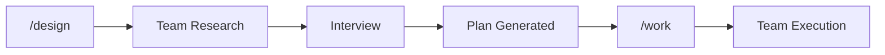

# Maestro

> AI agent workflow plugin for Claude Code. Plan first, code once.

[](LICENSE)

## Install

**Claude Code:**
```bash
/plugin install https://github.com/ReinaMacCredy/maestro
```

**Amp:**
```bash
amp skill add https://github.com/ReinaMacCredy/maestro --global
```

## Quick Start



1. **`/design`** — Start an interview-driven planning session (with team research)
2. **Review plan** — Prometheus generates structured plan
3. **`/work`** — Confirm plan, then execute via Agent Teams
4. **Verify** — Wisdom accumulated, learnings extracted

## Setup

Enable Agent Teams in `~/.claude/settings.json`:

```json
{
  "env": {
    "CLAUDE_CODE_EXPERIMENTAL_AGENT_TEAMS": "1"
  }
}
```

## Triggers

| Trigger | Action |
|---------|--------|
| `/design <request>` | Start Prometheus interview mode (supports `--quick`) |
| `/work` | Execute plan with Agent Teams (supports `--resume`) |
| `@tdd` | TDD implementation (kraken) |
| `@spark` | Quick fixes |
| `@oracle` | Strategic advisor (opus) |
| `@explore` | Codebase search |
| `/setup-check` | Verify and auto-fix plugin prerequisites |
| `/status` | Show Maestro state |
| `/review` | Post-execution review |
| `/reset` | Clean stale state |
| `/plan-template <name>` | Scaffold blank plan |

## Agents

| Agent | Purpose | Model | Team Lead? |
|-------|---------|-------|------------|
| `prometheus` | Interview-driven planner | sonnet | Yes |
| `orchestrator` | Execution coordinator | sonnet | Yes |
| `kraken` | TDD implementation | sonnet | No |
| `spark` | Quick fixes | sonnet | No |
| `oracle` | Strategic advisor | opus | No |
| `explore` | Codebase search | sonnet | No |
| `wisdom-synthesizer` | Knowledge consolidator | haiku | No |
| `progress-reporter` | Status tracker | haiku | No |

## Key Rules

- **Interview before code** — Run `/design` to explore before implementing
- **TDD by default** — Use kraken for new features
- **Both phases use teams** — Planning and execution are team-based
- **Verify subagent claims** — Always verify, agents can make mistakes

## Recommended MCP Servers

These MCP servers enhance the Maestro experience:

| Server | Purpose |
|--------|---------|
| [Context7](https://github.com/upstash/context7) | Up-to-date library documentation |
| [Sequential Thinking](https://github.com/modelcontextprotocol/servers/tree/main/src/sequentialthinking) | Dynamic reasoning for complex planning |

## Documentation

| Topic | Path |
|-------|------|
| Workflow Skill | [.claude/skills/maestro/SKILL.md](.claude/skills/maestro/SKILL.md) |
| Agent Definitions | [.claude/agents/](.claude/agents/) |
| Agent Teams Guide | [docs/AGENT-TEAMS.md](docs/AGENT-TEAMS.md) |
| Architecture | [docs/ARCHITECTURE.md](docs/ARCHITECTURE.md) |
| Troubleshooting | [docs/TROUBLESHOOTING.md](docs/TROUBLESHOOTING.md) |
| Customization | [docs/CUSTOMIZATION.md](docs/CUSTOMIZATION.md) |

## Credits

- **[BMAD-METHOD](https://github.com/bmadcode/BMAD-METHOD)** — Multi-agent design methodology
- **[conductor](https://github.com/cyanheads/conductor)** — Context-driven development patterns

## License

[MIT](LICENSE)
