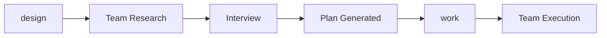

# Maestro

> AI agent workflow skillpack. Plan first, code once.

[](LICENSE)

## Install

**Universal install (`skills.sh` CLI):**
```bash
npx skills add ReinaMacCredy/maestro
```

**Install specific skills and agents:**
```bash
npx skills add ReinaMacCredy/maestro --skill planning --agent claude-code --agent amp
```

**Legacy direct installs (still supported):**
```bash
# Claude Code plugin route
/plugin install https://github.com/ReinaMacCredy/maestro

# Amp route
amp skill add https://github.com/ReinaMacCredy/maestro --global
```

## Quick Start



1. **`/design`** — Start an interview-driven planning session (with team research)
2. **Review plan** — Prometheus generates structured plan
3. **`/work`** — Confirm plan, then execute via Agent Teams
4. **Verify** — Wisdom accumulated, learnings extracted

## Setup

Enable Agent Teams in `~/.claude/settings.json`:

```json
{
  "env": {
    "CLAUDE_CODE_EXPERIMENTAL_AGENT_TEAMS": "1"
  }
}
```

## Commands

| Command | Description |
|---------|-------------|
| `/design <request>` | Interview-driven planning (supports `--quick`) |
| `/work [<plan-name>] [--resume]` | Execute plan with Agent Teams |
| `/review` | Post-execution review with auto-fix (supports planless git-diff mode) |
| `/setup-check` | Verify plugin prerequisites |
| `/status` | Show Maestro state |
| `/reset` | Clean stale state |
| `/plan-template <name>` | Scaffold blank plan |
| `/styleguide` | Detect languages and inject code style guides into CLAUDE.md |
| `/setup` | Scaffold project context (product, tech stack, guidelines) |
| `/pipeline <preset>` | Sequential agent chains with context passing |
| `/analyze <problem>` | Deep read-only investigation with structured report |
| `/note [--priority <P0-P3>] <text>` | Capture decisions and context to persistent notepad |
| `/learner [--from-session \| <topic>]` | Extract principles as reusable learned skills |
| `/security-review [<files> \| --diff]` | Security analysis with severity ratings |
| `/ultraqa [--tests\|--build\|--lint]` | Iterative fix-and-verify loop (max 5 cycles) |
| `/research <topic> [--auto]` | Multi-stage research with parallel agents |

## Agent Triggers

| Trigger | Action |
|---------|--------|
| `@tdd` | TDD implementation (kraken) |
| `@spark` | Quick fixes |
| `@oracle` | Strategic advisor (sonnet) |

`explore` remains available as an internal teammate spawned by orchestrated workflows.

## Agents

| Agent | Purpose | Model | Team Lead? |
|-------|---------|-------|------------|
| `prometheus` | Interview-driven planner | sonnet | Yes |
| `orchestrator` | Execution coordinator | sonnet | Yes |
| `kraken` | TDD implementation | sonnet | No |
| `spark` | Quick fixes | sonnet | No |
| `build-fixer` | Build/compile/lint error specialist | sonnet | No |
| `oracle` | Strategic advisor | sonnet | No |
| `critic` | Post-implementation reviewer | sonnet | No |
| `security-reviewer` | Security analysis specialist | sonnet | No |
| `explore` | Codebase search | haiku | No |
| `leviathan` | Deep plan reviewer | sonnet | No |
| `wisdom-synthesizer` | Knowledge consolidator | haiku | No |
| `progress-reporter` | Status tracker | haiku | No |

## Key Rules

- **Interview before code** — Run `/design` to explore before implementing
- **TDD by default** — Use kraken for new features
- **Both phases use teams** — Planning and execution are team-based
- **Verify subagent claims** — Always verify, agents can make mistakes

## Recommended MCP Servers

These MCP servers enhance the Maestro experience:

| Server | Purpose |
|--------|---------|
| [Context7](https://github.com/upstash/context7) | Up-to-date library documentation |
| [Sequential Thinking](https://github.com/modelcontextprotocol/servers/tree/main/src/sequentialthinking) | Dynamic reasoning for complex planning |

## Documentation

| Topic | Path |
|-------|------|
| Workflow Skill | [skills/maestro/SKILL.md](skills/maestro/SKILL.md) |
| Agent Definitions | [.claude/agents/](.claude/agents/) |
| Agent Teams Guide | [docs/AGENT-TEAMS.md](docs/AGENT-TEAMS.md) |
| Universal Skills Format | [docs/AGENT-SKILLS.md](docs/AGENT-SKILLS.md) |
| Architecture | [docs/ARCHITECTURE.md](docs/ARCHITECTURE.md) |
| Skill Interop | [docs/SKILL-INTEROP.md](docs/SKILL-INTEROP.md) |
| Troubleshooting | [docs/TROUBLESHOOTING.md](docs/TROUBLESHOOTING.md) |
| Customization | [docs/CUSTOMIZATION.md](docs/CUSTOMIZATION.md) |

## Credits

- **[BMAD-METHOD](https://github.com/bmadcode/BMAD-METHOD)** — Multi-agent design methodology
- **[conductor](https://github.com/cyanheads/conductor)** — Context-driven development patterns

## License

[MIT](LICENSE)
