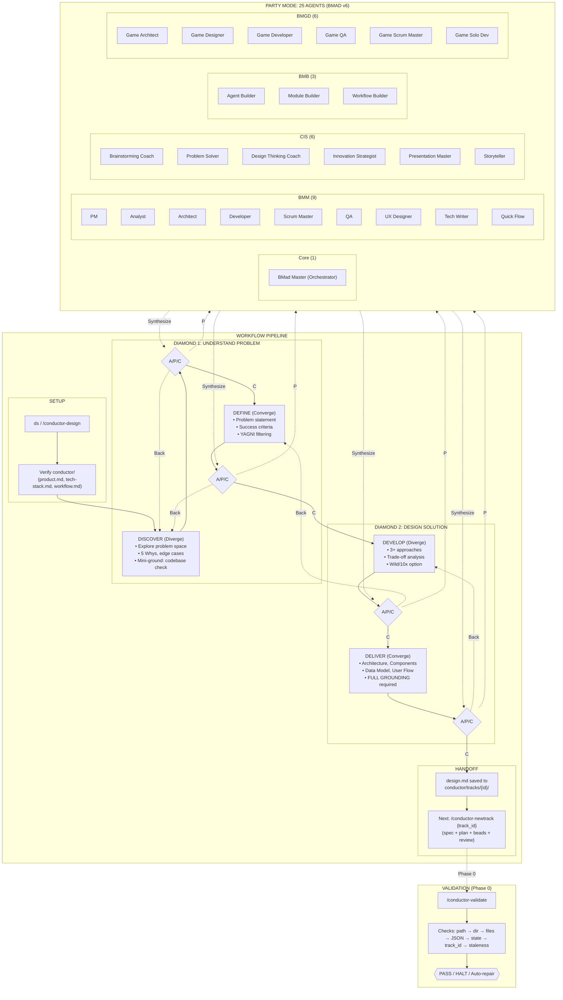

# Maestro

[](https://opensource.org/licenses/MIT)

This plugin is my **personal source of truth** for structured AI-assisted development.
It contains the exact skills, workflows, and patterns I use across _every_ project — continuously updated as I discover better ways to work.

Think of this as the **official, up-to-date playbook** for context-driven development:
how I plan features, how I track work across sessions, how I debug systematically, and how the whole system stays reliable.

If you're exploring structured AI coding workflows, this plugin shows the stack that actually works:
a combination of persistent memory (Beads), structured planning (Conductor), TDD methodology, and systematic debugging.
These workflows are not theoretical — they're refined daily through real builds.

Everything here evolves as I refine my process.
If a skill is in this plugin, it's because I actively use it.

## Install

### Claude Code

**Plugin install (recommended):**

```
/plugin install https://github.com/ReinaMacCredy/maestro
```

**Or via agent prompt:**

```
Follow https://raw.githubusercontent.com/ReinaMacCredy/maestro/main/SETUP_GUIDE.md to install Maestro.
```

### OpenAI Codex

**Quick install/update (one command):**

```bash
curl -fsSL https://raw.githubusercontent.com/ReinaMacCredy/maestro/main/scripts/install-codex.sh | bash
```

**Install (recommended, updateable):**

```bash
git clone https://github.com/ReinaMacCredy/maestro.git ~/.codex/skills/maestro
```

**Update:**

```bash
git -C ~/.codex/skills/maestro pull
```

**Install a specific skill only (optional):**

```bash
python ~/.codex/skills/.system/skill-installer/scripts/install-skill-from-github.py --repo ReinaMacCredy/maestro --path skills/conductor
```

Restart Codex to pick up new skills.

### Amp

```bash
amp skill add https://github.com/ReinaMacCredy/maestro --global
```

### Cursor / Windsurf / Other tools

Tell your AI agent:

```
Follow https://raw.githubusercontent.com/ReinaMacCredy/maestro/main/SETUP_GUIDE.md to install Maestro.
```

### Manual Setup

See [SETUP_GUIDE.md](./SETUP_GUIDE.md) for detailed instructions.

---

## Table of Contents

- [Quick Start for Agents](#quick-start-for-agents)
- [The Skills](#the-skills)
- [Skill Reference](#skill-reference)
  - [Conductor (Planning & Design)](#conductor-planning--design)
  - [Beads (Issue Tracking)](#beads-issue-tracking)
  - [TDD (Execution)](#tdd-execution)
- [Workflow Pipeline](#workflow-pipeline)
- [Understanding Handoff](#understanding-handoff)
- [Slash Commands](#slash-commands)
- [Documentation](#documentation)
- [Troubleshooting](#troubleshooting)
- [Credits](#credits)

---

## Quick Start for Agents

### The Complete Workflow

```
/conductor-setup                   # 1. Initialize project (once)
ds                                 # 2. Design session → design.md
/conductor-newtrack                # 3. Create spec + plan + beads + review
/conductor-implement               # 4. Execute with TDD
```

### Quick Start (Existing Project)

```bash
# Start
bd ready --json                    # What's available?
/conductor-implement               # Execute next task (auto-claims from beads)

# Work (with TDD)
tdd                                # Enter TDD mode
# RED → GREEN → REFACTOR

# Session ends automatically tracked via beads
```

### When Stuck

```
debug                              # Systematic debugging (external: superpowers)
trace                              # Root cause tracing (external: superpowers)
/conductor-design                  # Design alternatives
```

### Rules

- **Always** use `--robot-*` flags with `bv` (bare `bv` launches TUI and will hang)
- **Always** use `--json` flags with `bd` for structured output
- **Never** write production code without a failing test first (TDD)
- **Always** commit `.beads/` with your code changes

---

## The Skills

| Category          | Skills                                                                                                        |
| ----------------- | ------------------------------------------------------------------------------------------------------------- |
| **Core Workflow** | conductor, design (Double Diamond + Party Mode), beads                                                        |
| **Development**   | test-driven-development, using-git-worktrees, finishing-a-development-branch                                  |
| **Utilities**     | dispatching-parallel-agents, subagent-driven-development, continuity                                          |
| **Meta**          | verification-before-completion, writing-skills, sharing-skills                                                |

---

## Skill Reference

### Conductor (Planning & Design)

**What it does**: Structured design and planning flow that turns ideas into `design.md`, `spec.md` and `plan.md`.

**Design Sessions (Double Diamond)**: `/conductor-design` (or `ds` trigger) runs a Double Diamond design session with four phases: DISCOVER → DEFINE → DEVELOP → DELIVER. Each phase ends with A/P/C checkpoints:

- **[A] Advanced**: Deeper analysis, assumption audit
- **[P] Party**: Multi-agent collaborative review (see `skills/design/references/bmad/`)
- **[C] Continue**: Proceed to next phase



**Triggers**:

```
/conductor-setup                   # Initialize project (once)
/conductor-design "description"    # Design through dialogue → design.md
/conductor-newtrack                # Create spec.md + plan.md from design
/conductor-implement               # Execute tasks using beads
/conductor-status                  # View progress
/conductor-revert                  # Git-aware revert of work
/conductor-revise                  # Update spec/plan mid-track
/conductor-finish                  # Complete track: learnings, context refresh, archive
```

**Output structure**:

```
conductor/
├── product.md              # Product vision
├── tech-stack.md           # Technology choices
├── workflow.md             # Development standards
├── tracks.md               # Master track list
├── AGENTS.md               # Learnings hub (auto-updated by /conductor-finish)
├── CODEMAPS/               # Token-aware architecture docs
│   ├── overview.md         # System architecture overview
│   └── <module>.md         # Per-module codemaps
├── archive/                # Completed tracks
└── tracks/<track_id>/
    ├── design.md           # High-level design (from /conductor-design)
    ├── spec.md             # Requirements + acceptance
    ├── plan.md             # Phased task list
    └── LEARNINGS.md        # Track learnings (created by /conductor-finish)
```

**Key insight**: Spend tokens once on a good plan; reuse it many times.

### Beads (Issue Tracking)

**What it does**: Persistent issue tracking across sessions with dependency graphs. **Integrated with Conductor** via facade pattern for zero-manual-bd-commands workflow.

**Conductor Integration** (automatic, no manual bd required):
- `/conductor-newtrack` → creates epic + issues from plan.md
- `/conductor-implement` → claims, TDD checkpoints, closes tasks
- `/conductor-finish` → compacts summaries, cleans up old issues

**Commands** (requires `bd` CLI):

```bash
# Finding work
bd ready --json              # What's unblocked?
bd blocked --json            # What's waiting?
bd list --status in_progress # What's active?

# Working
bd update bd-123 --status in_progress   # Claim task
bd show bd-123                          # Read context
bd close bd-123 --reason "Done"         # Complete

# Dependencies
bd dep add bd-child bd-blocker --type blocks
bd dep tree bd-123
```

**Skill triggers**:

```
fb                          # File beads from plan (parallel subagents)
rb                          # Review filed beads (parallel + cross-epic validation)
bd status                   # Check project status
```

**Key insight**: Beads survive context compaction; chat history doesn't.

### TDD (Execution)

**What it does**: RED-GREEN-REFACTOR methodology for safe implementation.

**Trigger**: Say `tdd` to enter TDD mode.

**The cycle**:

```
RED     → Write one failing test (watch it fail)
GREEN   → Write minimal code to pass (watch it pass)
REFACTOR → Clean up (stay green)
REPEAT  → Next failing test
```

**Iron law**: No production code without a failing test first.

**Key insight**: If you didn't watch the test fail, you don't know if it tests the right thing.

---

## Workflow Pipeline

### Beads-Conductor Lifecycle

| Phase | Conductor Command | Beads Action (Automatic) |
|-------|-------------------|--------------------------|
| Preflight | All commands | Mode detect (SA/MA), validate `bd`, create session state |
| Track Init | `/conductor-newtrack` | Create epic + issues from plan.md, wire dependencies |
| Claim | `/conductor-implement` | `bd update --status in_progress` |
| TDD Checkpoints | Default (disable with `--no-tdd`) | `bd update --notes "RED/GREEN/REFACTOR..."` |
| Close | `/conductor-implement` | `bd close --reason completed\|skipped\|blocked` |
| Sync | All (session end) | `bd sync` with retry, pending ops recovery |
| Compact | `/conductor-finish` | AI summaries for closed issues |
| Cleanup | `/conductor-finish` | Remove oldest when >150 closed |

For detailed pipeline documentation, see [docs/PIPELINE_ARCHITECTURE.md](./docs/PIPELINE_ARCHITECTURE.md).

### Session-Based Flow

```mermaid
flowchart LR
    subgraph SESSION1["SESSION 1 (Planning)"]
        direction TB
        setup["/conductor-setup"]
        design["ds → Double Diamond design"]
        ground["ground decisions"]
        newtrack["/conductor-newtrack<br/>(spec + plan + beads + review)"]
        handoff["outputs HANDOFF block"]

        setup --> design
        design --> ground
        ground --> newtrack
        newtrack --> handoff
    end

    subgraph SESSION2["SESSION 2 (Epic 1)"]
        direction TB
        paste["User pastes HANDOFF"]
        implement["/conductor-implement"]
        tdd["claims tasks → TDD → verify"]
        choice{"Epic complete"}
        rb2["rb → review beads"]
        handoff2["HANDOFF to next epic"]

        paste --> implement
        implement --> tdd
        tdd --> choice
        choice -->|"fewer mistakes"| rb2
        choice -->|"continue"| handoff2
    end

    subgraph SESSION3["SESSION 3 (Epic 2...)"]
        direction TB
        paste2["User pastes HANDOFF"]
        implement2["/conductor-implement"]
        tdd2["claims tasks → TDD → verify"]
        complete["track complete"]

        paste2 --> implement2
        implement2 --> tdd2
        tdd2 --> complete
    end

    handoff -.-> paste
    rb2 -.-> handoff2
    handoff2 -.-> paste2
```



### Epic Completion: Quality Gate

After completing each epic, `/conductor-implement` presents an explicit choice:

1. **`rb` (recommended)** — Review remaining beads to catch mistakes before they propagate. Uses more tokens but reduces errors.
2. **Handoff** — Continue directly to next epic with `Start epic <next-epic-id>`

This prevents auto-continuation and gives you control between epics.

---

## Understanding Handoff

**Handoff** is how work survives between AI agent sessions. It's the structured transfer of context that ensures no progress is lost when a session ends.

### Why Handoff Matters

AI coding assistants have a fundamental limitation: **sessions end, but projects continue**. Without handoff:

- Context windows fill up and compact, losing conversation history
- Sessions crash, timeout, or simply get closed
- Tomorrow's session has no memory of today's decisions

### How Maestro Handles Handoff

Every artifact in Maestro is a handoff checkpoint:

| Artifact    | What It Preserves                      |
| ----------- | -------------------------------------- |
| `design.md` | Architecture decisions and trade-offs  |
| `spec.md`   | Requirements and acceptance criteria   |
| `plan.md`   | Step-by-step tasks with status markers |
| `.beads/`   | Issue state, dependencies, and notes   |

**The handoff flow:**

```
Session 1 (Planning):
  ds → design.md
  /conductor-newtrack → spec.md + plan.md + beads
  rb → reviewed beads
  → HANDOFF

Session 2+ (Execution):
  /conductor-implement → execute Epic 1 → HANDOFF
  /conductor-implement → execute Epic 2 → HANDOFF
  ...one epic per session
```

### Handoff in Practice

**At session end:**

```bash
bd update <id> --notes "COMPLETED: X. NEXT: Y."
git add -A && git commit -m "progress"
git push
```

**At session start:**

```bash
bd ready --json          # What's unblocked?
bd show <id>             # Read context from notes
```

The notes field in beads is your session-to-session memory. Write it like you're leaving instructions for yourself in two weeks.

### Manual Specialist Tools

Outside the automated flow (external: superpowers plugin):

- `debug` — Systematic debugging
- `trace` — Root cause tracing

---

## Slash Commands

| Command                          | Description                                                            |
| -------------------------------- | ---------------------------------------------------------------------- |
| `/conductor-setup`               | Initialize Conductor for project                                       |
| `/conductor-design [desc]`       | Design through Double Diamond dialogue (A/P/C checkpoints, Party Mode) |
| `ds`                             | Start design session (alias for `/conductor-design`)                   |
| `/conductor-newtrack [id]`       | Create spec + plan from design                                         |
| `/conductor-implement [id]`      | Execute ONE EPIC from track's plan                                     |
| `/conductor-status`              | View progress                                                          |
| `/conductor-revert`              | Git-aware revert of work                                               |
| `/conductor-revise`              | Update spec/plan when implementation reveals issues                    |
| `/conductor-finish [id]`         | Complete track: learnings, context refresh, archive (6 phases)         |
| `/conductor-validate [id]`       | Validate track health and state consistency                            |
| `/conductor-block [id] [reason]` | Mark a task as blocked                                                 |
| `/conductor-skip [id] [reason]`  | Skip a task with documented reason                                     |
| `/ground <pattern>`              | Verify patterns against current truth                                  |
| `/decompose-task <phase>`        | Break phases into atomic beads                                         |
| `/compact`                       | Checkpoint and compact session                                         |
| `review code`                    | Request code review (external: superpowers plugin)                     |

---

## Documentation

### Start Here

| If you want to...                      | Read                                                             |
| -------------------------------------- | ---------------------------------------------------------------- |
| Understand the philosophy and workflow | [TUTORIAL.md](./TUTORIAL.md)                                     |
| Set up a new project                   | [SETUP_GUIDE.md](./SETUP_GUIDE.md)                               |
| Configure global agent                 | [docs/GLOBAL_CONFIG.md](./docs/GLOBAL_CONFIG.md)                 |
| Understand the pipeline architecture   | [docs/PIPELINE_ARCHITECTURE.md](./docs/PIPELINE_ARCHITECTURE.md) |
| Use commands manually without skills   | [docs/manual-workflow-guide.md](./docs/manual-workflow-guide.md) |
| See all skills at a glance             | [Skills table above](#the-skills)                                |

### Repository Structure

```
maestro/
├── README.md              # This file
├── SETUP_GUIDE.md         # Installation guide
├── TUTORIAL.md            # Complete workflow guide
├── AGENTS.md              # Agent instructions
├── skills/                # Skill directories (conductor, design, beads, tdd, etc.)
│   ├── conductor/         # Planning methodology with references/
│   ├── design/            # Design sessions (ds trigger) with bmad/
│   ├── beads/             # Issue tracking (fb, rb triggers)
│   ├── continuity/        # Session state preservation (replaces session-compaction)
│   ├── test-driven-development/
│   └── ...                # See SETUP_GUIDE.md for full list
├── agents/                # Agent definitions
├── hooks/                 # Lifecycle hooks
├── lib/                   # Shared utilities
└── templates/             # Templates
```

---

## Troubleshooting

### Common Issues

| Issue                         | Fix                                                                |
| ----------------------------- | ------------------------------------------------------------------ |
| Skills not loading            | Run `/plugin list` to verify installation                          |
| `bd: command not found`       | Install via Agent Mail installer (see SETUP_GUIDE.md)              |
| `bv` hangs                    | You forgot `--robot-*` flag. Kill and restart with flag            |
| Agent ignores workflow        | Use trigger phrase explicitly: `tdd`, `debug`, `/conductor-design` |
| Tests pass immediately        | You wrote code first. Delete it. Start with failing test.          |
| Context compacted, lost state | Run `bd show <issue-id>` — notes field has recovery context        |
| Plan seems incomplete         | Use `rb` (review beads) to check and refine issues                 |

### Tips & Tricks

| Tip                              | Details                                                                                            |
| -------------------------------- | -------------------------------------------------------------------------------------------------- |
| **Plan before each epic**        | Switch to plan mode before `/conductor-implement`. Claude Code: `Shift+Tab`, Codex: `/create-plan` |
| **Handoff in Amp**               | Use handoff command (command palette) or reference threads with `@T-<id>`                          |
| **Handoff in Claude Code/Codex** | Run `/compact` before session end — beads notes survive, conversation doesn't                      |

### Agent-Specific Rules

**Critical**: These tools have TUI modes that will hang AI agents:

- `bv` → Always use `bv --robot-*` flags
- `cass` → Always use `cass --robot` or `--json` flags

### Without CLI Tools

The plugin still provides value without `bd`:

- Skills work as mental models and methodologies
- Use `TodoWrite` for session-local task tracking
- Track issues manually in GitHub Issues or markdown
- Full TDD, debugging, and code review workflows still apply

**The skills are the methodology; the CLIs are the persistence layer.**

---

## Credits

Built on foundations from:

- [BMAD-METHOD](https://github.com/bmad-code-org/BMAD-METHOD) - Multi-agent orchestration with 16 specialized personas
- [superpowers](https://github.com/obra/superpowers) by Jesse Vincent - TDD, debugging, and code review skills
- [conductor](https://github.com/NguyenSiTrung/conductor) by NguyenSiTrung - Context-driven planning
- [beads](https://github.com/steveyegge/beads) by Steve Yegge - Persistent issue tracking
- [beads-village](https://github.com/LNS2905/mcp-beads-village) by LNS2905 - Multi-agent coordination
- [Knowledge & Vibes](https://github.com/kyleobrien91/knowledge-and-vibes) by Kyle O'Brien - Workflow patterns

## License

MIT
