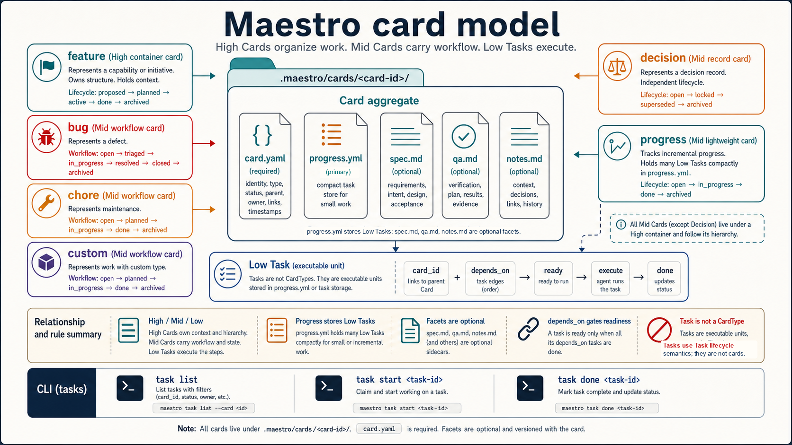
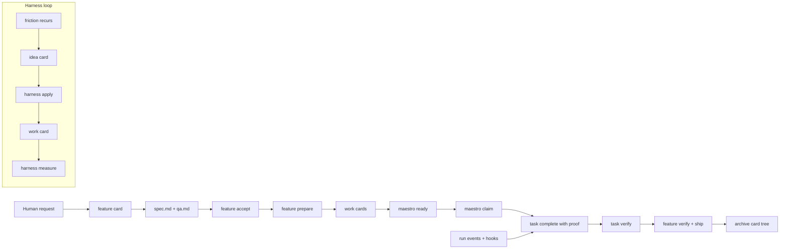
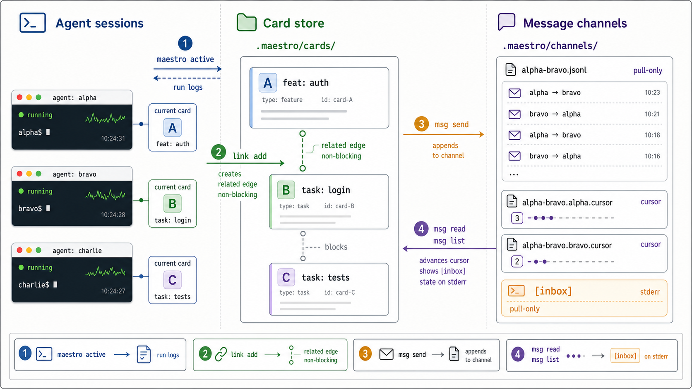
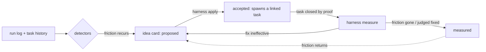

# maestro

Local-first harness for agent-built codebases. Humans steer, agents execute, maestro is the substrate.

[](https://github.com/ReinaMacCredy/maestro/actions/workflows/ci.yml)


maestro is a single Rust binary that gives a coding agent a durable place to work. Every
unit of work, what is being built, who is doing it, and the proof it was done, lives as
plain files under `.maestro/` in your repo. No daemon, no hidden service state, no cloud.
The agent runs the lifecycle through the CLI; you review the artifacts.

## Why

Coding agents are fast but forgetful. They lose the thread across sessions, collide on
numbered work items, ship work that was never verified, and leave no trail you can audit.
maestro fixes that by making the work itself durable, queryable, and gated:

- One flat card store replaces scattered feature, task, decision, and harness trees.
- A **feature card** owns the contract; work cards dock to it through `parent`.
- `maestro ready` computes unblocked work from card dependencies instead of a global counter.
- `maestro claim` stamps the current `agent#session`, so multi-session work stays visible.
- **Proof** and **QA** gates keep "done" and "shipped" evidence-backed.
- Harness suggestions and decisions are cards too, so tool-improvement and reasoning survive context loss.

Everything is repo-local and reviewable in a diff.

## Card model

maestro's durable unit is a **card**. Features, tasks, bugs, chores, ideas, and
decisions all live under `.maestro/cards/<id>/`; `card.yaml` carries the typed
state, parent, dependencies, claim, and timestamps, while sidecars such as
`spec.md`, `qa.md`, and `notes.md` carry the human-readable contract and evidence.



Feature cards are the containers. Workable cards (`task`, `bug`, `chore`) dock
under a feature through `parent`, enter `maestro ready` when their blocking
dependencies are closed, and can be claimed by an agent session. Ideas and
decisions are cards too, but they keep their own typed lifecycle verbs through
the harness and decision flows.

The flat query verbs give agents a Beads-style operating surface:
`maestro ready`, `maestro list`, `maestro show`, `maestro claim`,
`maestro note`, `maestro dep`, and `maestro archive`. When several sessions are
working at once, `maestro active`, `maestro link`, and `maestro msg` add the
cross-agent coordination layer on top of the same cards.

## How It Works

Everything durable is a card. The agent uses flat card queries to find and claim work, then
uses typed lifecycle verbs only where gates matter: feature contract gates, task proof gates,
decision locks, and harness measurement.


```mermaid
flowchart LR
    A[Human request] --> B[feature card]
    B --> C[spec.md + qa.md]
    C --> D[feature accept]
    D --> E[feature prepare]
    E --> F[work cards]
    F --> G[maestro ready]
    G --> H[maestro claim]
    H --> I[task complete with proof]
    I --> J[task verify]
    J --> K[feature verify + ship]
    K --> L[archive card tree]

    R[run events + hooks] --> I

    subgraph Harness loop
        M[friction recurs] --> N[idea card]
        N --> O[harness apply]
        O --> P[work card]
        P --> Q[harness measure]
    end
```

The card type controls which verbs are valid:

| Type | Role | Main verbs |
| --- | --- | --- |
| `feature` | Product contract and parent container | `feature accept`, `feature prepare`, `feature verify`, `feature ship`, `archive` |
| `task` / `bug` / `chore` | Workable implementation cards | `ready`, `claim`, `task complete`, `task verify`, `close` |
| `idea` | Harness/self-improvement proposal | `harness list`, `harness apply`, `harness dismiss`, `harness measure` |
| `decision` | Durable reasoning record | `decision new`, `decision lock`, `decision show` |

`parent` is hierarchy, not a blocker. A card appears in `ready` only when it is workable
and every `blocks` dependency is closed. `related` carries context without blocking the
board and also gates linked-card messaging; `supersedes` records replacement history.

## Install

From source (always works):

```
git clone https://github.com/ReinaMacCredy/maestro
cd maestro
cargo install --path . --locked
```

With Cargo, directly from git:

```
cargo install --git https://github.com/ReinaMacCredy/maestro --locked
```

Release binary (macOS and Linux, arm64 and amd64):

```
curl -fsSL https://raw.githubusercontent.com/ReinaMacCredy/maestro/main/scripts/install.sh | bash
```

The installer drops the binary in `~/.local/bin` (override with `MAESTRO_INSTALL_DIR`).
Verify with `maestro version` and `maestro doctor`.

## Let your agent set it up

maestro is meant to be driven by your coding agent. The installer wires agent skills and hooks
into your repo, including a `maestro-setup` skill that tunes the harness to your build/test
commands and conventions, so the agent learns the lifecycle and records its own work. Point
your agent (Claude Code, Codex, or any CLI agent) at the repo and paste:

```
Set up maestro in this repo: run `maestro init --yes`, then `maestro install --agent claude`
(or `--agent codex`). Then follow the maestro-setup skill it installs to tune the harness to
this repo. Start each session with `maestro status`, inspect available work with
`maestro ready` and `maestro show <id>`, then claim and close cards through the `maestro`
CLI from there.
```

## Quickstart

Scaffold the repo and install the agent integration:

```
maestro init --yes                 # create .maestro/ and extract bundled skills/hooks
maestro install --agent claude     # wire skills + hooks into CLAUDE.md/AGENTS.md (or --agent codex)
maestro doctor                     # check the installation
maestro status                     # resume with the next agent action
```

The smallest useful loop is a feature card with one child work card. The feature owns the
contract and QA sidecar; the work card is what an agent claims and proves:

````
maestro feature new "CSV export"                         # -> proposed
maestro feature set csv-export --acceptance "Export a report to CSV" --area "src/export"

# accept is gated on a captured behavior baseline. The maestro-card skill (qa-baseline
# reference) writes the feature's qa.md for you during an agent run; by hand it is a
# markdown file with an amend_log_position frontmatter and [bl-NNN] scenario lines:
cat > .maestro/cards/csv-export/qa.md <<'EOF'
---
amend_log_position: 0
---
# Behavior baseline: CSV export

## Scenario Matrix
- [bl-001] Exporting an empty report yields a header-only CSV file.
EOF

maestro feature accept csv-export                        # freeze the contract -> ready
cat > PLAN-csv-export.md <<'EOF'
## Task T1: Implement CSV writer
check: cargo test export passes
EOF
maestro feature prepare csv-export --from PLAN-csv-export.md   # spawns ready child cards
maestro ready csv-export                                      # show unblocked child work
maestro claim <task-card-id>                                  # stamp agent#session
maestro task complete <task-card-id> --summary "wrote csv writer" \
  --claim "cargo test export passes" --proof "observed: cargo test export passes"

# ship is gated on QA coverage: every [bl-NNN] baseline scenario needs a proven slice.
# The maestro-card skill (qa-slice reference) writes this for you; by hand, append one
# fenced yaml block to qa.md mapping each scenario to its evidence:
cat >> .maestro/cards/csv-export/qa.md <<'EOF'

```yaml
slices:
  - scenarios: ["bl-001"]
    evidence: ["cargo test export::empty_report_header_only passes"]
```
EOF

# ship also sweeps the acceptance contract for fresh evidence:
maestro feature verify csv-export --prove ac-1 --evidence "observed: cargo test export passes"
maestro feature verify csv-export
maestro feature ship csv-export --outcome "Shipped streaming CSV export"   # -> shipped
````

`maestro feature show <id>` and `maestro task show <id>` render the current state and the
recorded reasoning at any point. Features keep slug ids (`csv-export`); tasks, decisions, and
ideas get hash ids (`card-<hex>`). Every entity lives as a card under `.maestro/cards/<id>/`.

maestro surfaces improvement proposals once it has enough run history to spot friction, so a
fresh repo shows none (`harness list` -> "no improvement proposals found"). The proposal id
below (`card-<hex>`) is illustrative; once the backlog has a real entry, run it through the
same task loop:

```
maestro harness list                          # what friction the run log surfaced
maestro harness apply <proposal-id>           # accept a proposal -> spawns a task with a check preset
maestro claim <task-card-id>
maestro task complete <task-card-id> --summary "stabilized the suite" \
  --claim "cargo test integration passes" --proof "observed: cargo test integration passes"
maestro harness measure <proposal-id>         # close the loop once that task is verified
```

`harness apply` spawns the fix task with a `--check` already set from the proposal title, so you
can claim it straight away. `harness measure` will not mark the improvement `measured` until that
linked task is verified (pass `--force` to close it anyway).

### Cross-agent coordination

When multiple agents are working in the same checkout, `maestro active` reads the run logs and
shows live sessions, bound cards, skill mode, link state, status, progress, age, and last action.
It is a read verb: it can print copy-paste commands, but it never creates a link by itself.

```
maestro active
maestro link add <your-card> <their-card>
maestro msg send <their-card> "ready for review"
maestro msg read
maestro msg list
```



`maestro link add` writes a non-blocking `related` edge between two live cards. The relation is
unordered for users: either side can see it, and `maestro link remove <a> <b>` removes it no
matter which side stored the edge. Removing the link hides the message channel without deleting
its history; relinking the same pair restores the visible channel. New links to finished cards
are refused because there is no live coordination left to open.

Messages are pull-only and card-scoped. The sender is the running session's current card, so claim
or touch a card before sending. `msg send` confirms the route as
`sent to <their-card> (from <your-card>)`. `msg read [card]` prints recent seen context plus unread
partner messages and advances this card's cursor. `msg list [card]` shows either a channel overview
(`your unread`, peer read-through when known, and last-message direction) or one partner's full
timeline.

Channels live under `.maestro/channels/` as gitignored machine-local state: a JSONL file per linked
pair plus per-card cursor files. If your current card has unread messages on still-linked channels,
maestro prints a best-effort inbox hint on stderr before ordinary commands, keeping JSON stdout
clean:

```
[inbox] 2 new (card-a 1, card-b 1) -> maestro msg read
```

### Suggested workflow

The card model composes into one operating rhythm. The [Quickstart](#quickstart) above is the
terse command path; this section narrates it: the agent prompt you hand off for each flow, and what
the run actually looks like, gates and all. `maestro install` puts the matching skills in your repo:
`maestro-card` bundles the work, feature, verify, qa-baseline, and qa-slice references, and
`maestro-design` / `maestro-setup` / `maestro-audit` stay separate. Each prompt below hands off to the
reference that owns that flow rather than spelling out every verb. The command surface below is
checked against the current source tree.

#### From a high-level idea to a shipped product

One feature, start to finish: a raw idea becomes a frozen contract, the work is proven slice by slice,
and it ships only once QA covers the baseline. This is the prompt you paste into a fresh agent session:

> We want to add rate limiting to the public API: requests over a key's limit should get an HTTP 429.
> Set it up as a maestro feature, driving each step through the right skill reference: `maestro-design`
> to map the contract and record the fixed-window-vs-token-bucket decision, the maestro-card skill's
> qa-baseline reference to capture a behavior baseline, then its work and verify references to drive it
> to shipped through proof-gated tasks, and its qa-slice reference for the ship gate. Don't skip the gates.

How it looks end to end (the `qa.md` baseline and slices bodies are in flows 1 and 3 below,
and copy-paste-ready in the Quickstart):

```
$ maestro feature new "API rate limiting"
created feature api-rate-limiting (proposed)
spec: .maestro/cards/api-rate-limiting/spec.md
decisions: maestro decision new "<title>" --feature api-rate-limiting

$ maestro feature set api-rate-limiting \
    --acceptance "Requests over a key's limit get HTTP 429 with Retry-After" \
    --acceptance "Counters reset on a fixed window boundary" \
    --area "src/api/middleware" --non-goal "No multi-node coordination in this pass" \
    --question "Per-key or per-IP buckets?"
set api-rate-limiting
  acceptance replaced (2); other fields untouched
  areas replaced (1); other fields untouched
  non_goals replaced (1); other fields untouched
  questions replaced (1); other fields untouched
  totals: acceptance=2, areas=1, non_goals=1, questions=1
next: maestro-card skill (qa-baseline) -> .maestro/cards/api-rate-limiting/qa.md

$ maestro decision new "Fixed-window counter, not a token bucket, for v1" --feature api-rate-limiting
opened card-8eb078 (status: open)
store: .maestro/cards/card-8eb078/card.yaml

# (write .maestro/cards/api-rate-limiting/qa.md first; see flow 1) accept then succeeds:
$ maestro feature accept api-rate-limiting
accepted api-rate-limiting (-> ready); contract frozen (acceptance=2, areas=1); note: 1 open question(s) carried (non-blocking)
$ maestro feature prepare api-rate-limiting --from PLAN-api-rate-limiting.md
prepared 1 task(s)
started api-rate-limiting -> in_progress
prepared:
  card-764dd7 ready           Fixed-window counter middleware
next: maestro ready api-rate-limiting
$ maestro ready api-rate-limiting
Ready work (1 card, no blockers):
  1. [P1] card-764dd7  task  Fixed-window counter middleware  (unclaimed)
$ maestro claim card-764dd7
# prints: claimed card-764dd7 as <agent>#<session>
$ maestro task complete card-764dd7 --summary "fixed-window counter in the request middleware" --claim "cargo test ratelimit passes" --proof "observed: cargo test ratelimit passes"
completed card-764dd7 -> needs_verification
auto: recorded task_proof event
auto: maestro task verify card-764dd7
verification passed for card-764dd7 (1 claim(s), 1 proof source(s))
next: maestro-card skill (qa-slice) -> replay affected baseline scenarios

# (write the qa.md slices block + sweep the contract first; see flow 3) ship then succeeds:
$ maestro feature ship api-rate-limiting --outcome "Shipped fixed-window rate limiting"
shipped api-rate-limiting (-> shipped)
```

The same journey, flow by flow: each leads with the gate that blocks you until the evidence exists,
because that gate is the point.

#### 1. Design as a feature

`feature new` then `feature set` map the contract (acceptance, affected areas, non-goals, open
questions); `decision new` records each fork as a durable card. `feature accept` freezes the contract
into `ready`, but only once you have captured a behavior baseline, and `feature prepare` turns a
reviewed plan file into ready child tasks.

*Prompt:* "Follow the `maestro-design` skill to set up <idea> as a maestro feature: `feature new`, then
`feature set` with the acceptance criteria, affected areas, non-goals, and open questions, recording
each fork with `decision new --feature <id>`. Capture the `[bl-NNN]` behavior baseline at
`.maestro/cards/<id>/qa.md` with the maestro-card skill's qa-baseline reference, then `feature accept`,
`feature prepare --draft`, and `feature prepare --from <plan-file>`."

The gate: `accept` refuses until a baseline exists and names the file it wants.

```
$ maestro feature accept api-rate-limiting
Error: cannot accept api-rate-limiting - contract incomplete:
  qa-baseline (.maestro/cards/api-rate-limiting/qa.md missing)
    skill: maestro-card (qa-baseline)
    target: .maestro/cards/api-rate-limiting/qa.md
    retry: maestro feature accept api-rate-limiting
```

#### 2. Spin off tasks, each closed by proof

`feature prepare --from <plan-file>` creates the feature's child task queue from explicit `## Task`,
`check:`, `blocker:`, and `after:` lines. Then drive every task through the same gated loop:
`maestro ready <feature>` -> `maestro claim <id>` -> work ->
`task complete --summary "..." --claim "..." --proof "..."`.
Completion records the inline proof and runs `task verify`; a `verified` task is always evidence
you can open.

*Prompt:* "Follow the maestro-card skill's work reference: inspect ready cards with
`maestro ready`, claim one with `maestro claim <id>`, do the work, then `task complete`
with a `--claim` stating what proves it and `--proof` containing the observed evidence.
Use the maestro-card skill's verify reference and
`maestro query proof` if verification fails."

The gate: `verify` refuses until the claim is backed by recorded proof and prints the exact command
to record it.

```
$ maestro task verify card-cad8af
verification failure: missing proof: no task events or proof artifacts found; hooks record proof during agent runs, or add one with `maestro event create --task-id card-cad8af --claim "..."`
verification failure: claim not backed by events/proof: cargo test ratelimit passes; record matching proof with `maestro event create --task-id card-cad8af --claim "cargo test ratelimit passes"`
Error: verification failed for card-cad8af
```

#### 3. Ship the feature once QA is proven

A feature ships only when it has no live child tasks *and* its QA coverage is green: every `[bl-NNN]`
scenario in the baseline must be matched by a slice in the `qa.md` slices block carrying non-empty
evidence, *and* every acceptance item must have fresh evidence from the contract sweep
(`maestro feature verify`). Coverage is checked, not asserted, so a green ship is a real signal.

*Prompt:* "With the maestro-card skill's qa-slice reference, map every `[bl-NNN]` baseline scenario of
<feature> to a slice in the fenced yaml `slices:` block appended to `.maestro/cards/<id>/qa.md`, with
the test that proves it as `evidence`. Sweep the contract with `maestro feature verify <id>`, then
`feature ship --outcome "..."`. Verify the gate passes; don't `--force` it."

The gate: `ship` refuses while any baseline scenario lacks a covering slice or any acceptance item
lacks fresh evidence, and lists which.

```
$ maestro feature ship api-rate-limiting --outcome "Shipped fixed-window rate limiting"
Error: cannot ship api-rate-limiting:
  qa-slice coverage incomplete - 2 baseline scenario(s) without a counting slice: bl-001, bl-002
    skill: maestro-card (qa-slice)
    target: .maestro/cards/api-rate-limiting/qa.md
    retry: maestro feature ship api-rate-limiting --outcome "<outcome>"
  contract sweep missing - 2 acceptance item(s) need feature-level evidence
    fix: maestro feature verify api-rate-limiting
    retry: maestro feature ship api-rate-limiting --outcome "<outcome>"
```

#### 4. Improve the harness - maestro's self-improvement

The first three flows build the product; this one sharpens the tool that builds it, through the very
same proof loop. maestro watches its own run log and task history, and surfaces a proposal when the
same friction *recurs*, which means work keeps going wrong the same way. It never acts on its own:
proposals are listed on demand and only become work when you apply them.

What it catches (the rule-based detectors, no LLM calls): the same blocker reason across two or more
tasks (`recurring_blocker`); a session full of correction prompts (`recurring_intervention`); a task
verified with a command that is not in your reusable harness stack (`missing_verification`); a work
domain whose tasks take far longer to verify than the rest (`missing_skill`); a topic rediscovered
across tasks with no decision on record (`rediscovered_decision`).

*Prompt:* "Follow the maestro-card skill's work reference for the harness loop: run
`maestro harness list`, and for each proposal worth doing, `harness apply <id>` to spawn the fix task
(it arrives with a check preset), close that task through the proof loop (`maestro claim <id>`, complete `--claim`,
record proof, `verify`), then `harness measure <id>` to record the outcome."

A fresh repo has no history, so nothing is proposed. Here two tasks hit the same blocker, which is the
recurring friction, and the detector turns it into a tracked proposal:

```
$ maestro harness list
no improvement proposals found

$ maestro task block card-109e1d --reason "staging credentials missing"
blocked card-109e1d (blk-001)
$ maestro task block card-8f4dc3 --reason "staging credentials missing"
blocked card-8f4dc3 (blk-001)

$ maestro harness list
ID	!	STATUS	TYPE	SEEN	TITLE
card-5eb94a		proposed	recurring_blocker	2x/2s	Reduce recurring blocker: staging credentials missing

$ maestro harness apply card-5eb94a            # accept -> spawns the fix task with a check preset
accepted card-5eb94a (spawned card-01d0fd)
  check preset: "Reduce recurring blocker: staging credentials missing is resolved and detector is silent"
next: maestro claim card-01d0fd

# close the spawned task through the proof loop (it already has its check)
$ maestro claim card-01d0fd
# prints: claimed card-01d0fd as <agent>#<session>
$ maestro task complete card-01d0fd --summary "added staging creds to onboarding" --claim "onboarding doc lists staging creds" --proof "observed: onboarding doc lists staging creds"
completed card-01d0fd -> needs_verification
auto: recorded task_proof event
auto: maestro task verify card-01d0fd
verification passed for card-01d0fd (1 claim(s), 1 proof source(s))

$ maestro harness measure card-5eb94a
card-5eb94a is now measured
note: friction is still detected; this behavioral item was closed by judgment, not by a silence check
```

That closing note is the honest part: `measure` confirms the friction is *gone* only for
state-based detectors (`missing_verification`, `rediscovered_decision`), which it re-runs
and expects to fall silent. A behavioral item like `recurring_blocker` is drawn from
history, so `measure` closes it by *your* judgment that you addressed the root cause, and says so rather than pretending the signal
vanished. Either way, the improvement is tracked and backed by a verified task, never a silent edit.

### Feature Cards

A feature card is the product contract and the parent container for work. `proposed` is the
editable design state; `accept` freezes the contract into `ready` and requires a behavior baseline;
`prepare` turns a reviewed plan into child work cards; `verify` records feature-level evidence; and
`ship` requires no live child work plus QA coverage and a passing contract sweep. Each feature is a
card under `.maestro/cards/<id>/`: `card.yaml` holds typed state, `qa.md` holds the behavior baseline
and slices block, `spec.md` is the design write-up, and `notes.md` accumulates the running design log.

### Work Cards Gated by Proof

`task`, `bug`, and `chore` are the workable card types. They can be discovered with `maestro ready`,
claimed with `maestro claim <id>`, blocked with `maestro dep add <child> <blocker>`, and closed with
the proof-gated task flow. Typed task verbs still own proof: `task complete` records the summary,
claim, and observed proof, then `task verify` checks that evidence before the card counts as done.
The result is that "done" is always backed by evidence you can open.

### QA: baseline and slices

QA lives in one file per feature, `.maestro/cards/<id>/qa.md`: the behavior baseline (markdown with
an `amend_log_position` frontmatter and `[bl-NNN]` scenario lines) plus a fenced yaml `slices:`
block appended at the end, each slice mapping `scenarios` to `evidence`. A feature ships only when its
baseline is fresh and every scenario is covered by a slice with non-empty evidence. Coverage is
checked, not asserted, so a green ship is a real signal.

### Decisions

`maestro decision new "<the fork>" --feature <id>` records an architectural decision as a card under
`.maestro/cards/card-<hex>/`, so the reasoning outlives any single agent session.

### The archive is memory

Closing work does not discard it. `maestro archive <feature>` moves a closed feature tree
into `.maestro/archive/cards/`, and `maestro archive --loose` sweeps closed loose tasks,
ideas, and superseded decisions after it. Every archived card appends a one-line digest to
`.maestro/archive/cards/INDEX.md`; `maestro resume` opens with the most recent of those
lines, `maestro list --grep <term> --archived` searches the full history (kept fast by the
local text index, which falls back to a plain scan when missing or stale), and
`maestro query graph <id>` renders a card's dependency neighborhood with `[archived]`
targets marked. Closing verbs print the `next: maestro archive <id>` nudge, and
`maestro doctor` warns when closed cards pile up in the live store.

### Harness self-improvement

The harness is the part of maestro that improves the tool you build with, through the same
proof loop the product work uses. It watches its own run log and task history and proposes a
fix when the same friction *recurs*. It is rule-based, no LLM calls, and passive: nothing is
detected or acted on in the background. `maestro harness list` surfaces idea cards on demand,
`maestro harness apply <id>` accepts one and spawns a real task to do the work, and
`maestro harness measure <id>` records the outcome.

The loop, end to end: your run log and task history feed the detectors; a recurring friction
becomes a proposed `idea` card; `apply` accepts it and spins off a linked task; you close that task
through the normal proof loop; and `measure` confirms the outcome.


```mermaid
flowchart LR
    H[run log + task history] --> D{detectors}
    D -->|"friction recurs"| P[idea card: proposed]
    P -->|"harness apply"| A[accepted: spawns a linked task]
    A -->|"task closed by proof"| M[harness measure]
    M -->|"friction gone / judged fixed"| V[measured]
    M -->|"fix ineffective"| P
    V -.->|"friction returns"| P
```

**What it catches.** Five detectors run, in two classes. **State detectors** read current repo
state, so their silence reliably means the friction is fixed. `measure` re-runs them and
closes the item automatically once they fall silent. **Behavioral detectors** are drawn from
history, so `measure` closes them on your judgment that you fixed the root cause, and says so
rather than pretending the signal vanished.

| Detector | Class | What it catches | Fires when |
| --- | --- | --- | --- |
| `missing_verification` | state | a task verified with a command not in your reusable `harness.yml` stack | a verified task uses such a command |
| `rediscovered_decision` | state | a topic worked across tasks with no decision on record | 2+ tasks, no matching decision |
| `recurring_blocker` | behavioral | the same blocker reason hit by more than one task | 2+ tasks, same reason |
| `recurring_intervention` | behavioral | a session full of correction-like prompts | 3+ in one session |
| `missing_skill` | behavioral | a work domain far slower to verify than the rest | 2+ tasks, domain median > 2x overall |

**Identity and lifecycle.** Each proposal carries a stable fingerprint,
`<detector>:<subject>`, so re-running detection never piles up duplicates: the same friction stays one tracked item
as it moves `proposed -> accepted -> measured`. `measure` sends an ineffective fix back to
`proposed`, and reopens a `measured` *state* item to `proposed` if its friction later returns (a
regression). `measure` requires the linked task verified unless you pass `--force`.

**What it looks like.** A fresh repo proposes nothing. Here two tasks hit the same blocker:
`maestro task block <task-card-id> --reason "staging credentials missing"` on two different tasks,
which is the recurring friction the `recurring_blocker` detector watches for. This is the command
shape from the current source tree:

```
$ maestro harness list
no improvement proposals found

# after the two blockers, the detector has something to surface:
$ maestro harness list
ID	!	STATUS	TYPE	SEEN	TITLE
card-5eb94a		proposed	recurring_blocker	2x/2s	Reduce recurring blocker: staging credentials missing

# accept it: maestro spawns the fix task with a check preset and tells you the next step:
$ maestro harness apply card-5eb94a
accepted card-5eb94a (spawned card-01d0fd)
  check preset: "Reduce recurring blocker: staging credentials missing is resolved and detector is silent"
next: maestro claim card-01d0fd

# show reveals the evidence, the fingerprint's spawned task, and the append-only history:
$ maestro harness show card-5eb94a
id: card-5eb94a
title: Reduce recurring blocker: staging credentials missing
type: recurring_blocker
status: accepted
priority: medium
seen: 2x/2s
sessions_hit: card-109e1d, card-8f4dc3
first_seen: 2026-06-09T23:43:44.592Z
last_seen: 2026-06-09T23:43:51.188Z
source: blockers
provenance: detector
topic: staging credentials missing
spawned_task: card-01d0fd
evidence:
- same blocker pattern appeared in 2 tasks: card-109e1d, card-8f4dc3
history:
- accepted (card-01d0fd) 2026-06-09T23:43:51.254Z

# close card-01d0fd through the proof loop (claim, complete with --proof, verify):
$ maestro task verify card-01d0fd
verification passed for card-01d0fd (1 claim(s), 1 proof source(s))

# with the linked task verified, close the loop; no --force needed:
$ maestro harness measure card-5eb94a
card-5eb94a is now measured
note: friction is still detected; this behavioral item was closed by judgment, not by a silence check

# measured items leave the default list; the ledger lives under --all:
$ maestro harness list
no improvement proposals found
# 1 terminal proposal(s) hidden; use --all to include
$ maestro harness list --all
ID	!	STATUS	TYPE	SEEN	TITLE
card-5eb94a		measured	recurring_blocker	2x/2s	Reduce recurring blocker: staging credentials missing
```

That closing `note` is the honest part: `recurring_blocker` is a behavioral detector, so
`measure` closes it on your judgment rather than claiming the historical signal vanished. A
state detector (`missing_verification`, `rediscovered_decision`) would instead be re-run and
only reach `measured` once it actually fell silent.

The [Suggested workflow](#4-improve-the-harness--maestros-self-improvement) walks this same loop
in context, alongside the feature and task flows.

### Skills and hooks

`maestro install` extracts agent skills into `.maestro/skills/` and wires hook scripts so the
agent's actions are recorded as run events. The lifecycle ships as one bundled `maestro-card` skill
(a router `SKILL.md` plus `reference/{work,feature,verify,qa-baseline,qa-slice}.md`); `maestro-design`,
`maestro-setup`, and `maestro-audit` remain separate skills.
It also syncs Maestro-owned global skills under `~/.maestro/skills` and links them into
supported agent roots (`~/.agents/skills`, `~/.claude/skills`) so Maestro skills are available
outside the current repo. `~/.codex/skills` is not managed in v1.
`maestro sync` refreshes repo-local bundled resources to the running binary, preserving your
edits. `maestro sync --global-skills` refreshes only the user-level global skill cache and links.

## Command reference

| Command | What it does |
| --- | --- |
| `init` | Scaffold `.maestro/` and extract bundled resources |
| `install` / `uninstall` | Wire or remove agent hooks and config (`--agent claude\|codex`) |
| `sync` | Resync repo-local bundled resources, or global skills with `--global-skills` |
| `upgrade` | Upgrade the binary and refresh resources |
| `doctor` | Diagnose the installation |
| `status` / `resume` | Print the current handoff, next action, or clean-session resume packet |
| `active` | Show other live sessions, their bound cards, link state, progress, and copy-paste link/message hints |
| `migrate-v2` | Fold old v1 artifacts into the reduced v2 layout |
| `migrate` | Snapshot `.maestro/` and fold legacy feature/task/decision/harness trees into `.maestro/cards/` |
| `feature` | Manage the product contract and its lifecycle |
| `task` | Complete, verify, block, and query proof-gated work cards |
| `verify` | Verify a task against its recorded proof |
| `decision` | Create, lock, show, and list decision cards |
| `harness` | List, show, apply, dismiss, and measure self-improvement idea cards |
| `create` / `update` / `close` | Create generic cards, mutate workable-card fields, or close workable cards |
| `ready` / `list` / `show` | Discover and inspect cards in the flat store (`--parent`, `--type`, `--assignee`, `--status`, `--grep`) |
| `claim` / `note` / `dep` / `archive` | Claim a workable card, append a note, add a blocking edge, or archive a closed feature tree (`--loose` sweeps loose closed cards) |
| `link` | Add or remove non-blocking `related` edges between live cards; linked cards can use `msg` |
| `msg` | Send, read, and list pull-only messages on linked-card channels |
| `event` / `query` | Record harness events and inspect computed read models, including `query graph` for a card's dependency web |
| `index` | Maintain the local text index that accelerates `list --grep` |
| `mcp` / `hook` / `watch` | Advanced integrations for MCP, agent hooks, and task snapshots |
| `version` | Print the version and binary path |

The entity verbs (`feature`, `task`, `harness`, `decision`, `verify`) are the only surface for the
proof- and QA-gated lifecycle; the flat card verbs are for discovery and lightweight edits. `ready`
only shows workable cards (`task`, `bug`, `chore`) whose `blocks` dependencies are closed. `list`
accepts the coarse status filter `open`, `in_progress`, or `closed`. Run
`maestro <command> --help` from the checked-out source build for the full surface.

## Migration

There are two migration paths, depending on what produced the existing `.maestro/` data.

### From the TypeScript maestro

Earlier maestro was a TypeScript build. The Rust rewrite is a different, leaner, repo-local
product, so moving TypeScript-era data over is still a best-effort, agent-driven step.
[MIGRATE.md](./MIGRATE.md) is written as an instruction for a coding agent: back up the old
TypeScript data, map what has a clean Rust home, and leave skipped files in the backup.

Install the Rust binary, then paste this into a fresh agent session (Claude Code, Codex, or
any CLI agent):

```
Migrate my maestro data from the TypeScript build to the Rust build by fetching and following
https://raw.githubusercontent.com/ReinaMacCredy/maestro/main/MIGRATE.md: back up the old data
first, map it into the new `.maestro/` model, and write me the mapping report. Never delete
the original data.
```

### From pre-card Rust maestro

Repos already using the Rust v2 artifact layout can use the source command `maestro migrate`.
It snapshots `.maestro/` under `.maestro/backups/<timestamp>-card-migrate/`, folds legacy
`features/`, `tasks/`, `decisions`, and harness backlog entries into `.maestro/cards/`, copies
feature sidecars beside the feature card, remints non-feature records to stable `card-<hash>` ids,
rewrites structured references, and then prints `next: maestro doctor`.

Run it from the source build or an updated installed binary:

```
cargo run -- migrate
maestro doctor
```

The migration is idempotent: a later run skips cards it already folded. The source trees are left
in place for rollback and inspection; the card store becomes the flat query surface used by
`ready`, `list`, `show`, `claim`, `note`, `dep`, and `archive`.

## Project layout

```
src/         Rust crate: domain, operations, interfaces, foundation
tests/       contract, adapter, runtime-flow, and safety tests
embedded/    shipped harness, hook, shell, and skill resources
.maestro/    repo-local artifacts for this checkout
```

## Documentation

- [AGENTS.md](./AGENTS.md): agent notes, code map, and conventions
- [TESTING.md](./TESTING.md): the smallest falsifying checks by touched surface
- [MAINTENANCE.md](./MAINTENANCE.md): refactor discipline, drift rules, handoff standard
