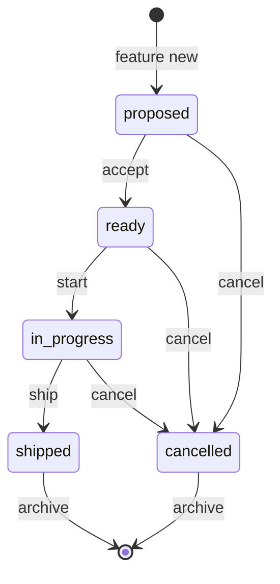
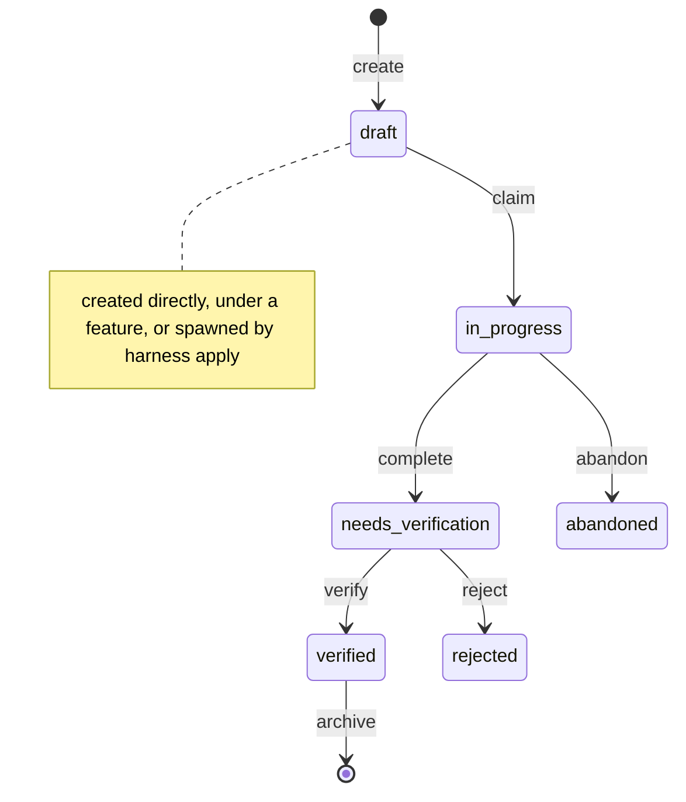
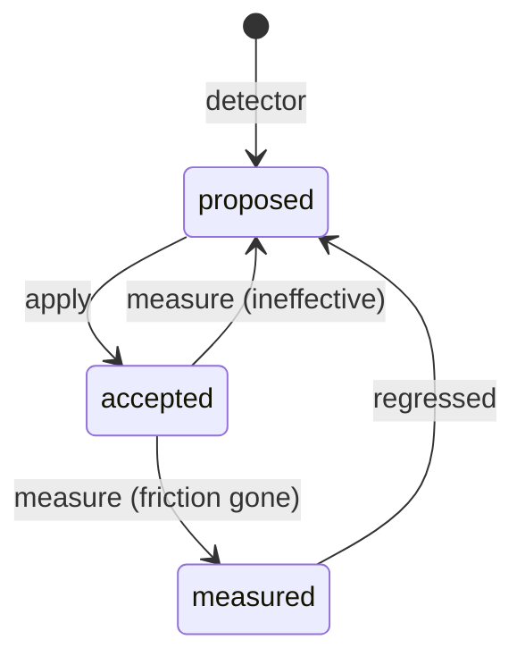
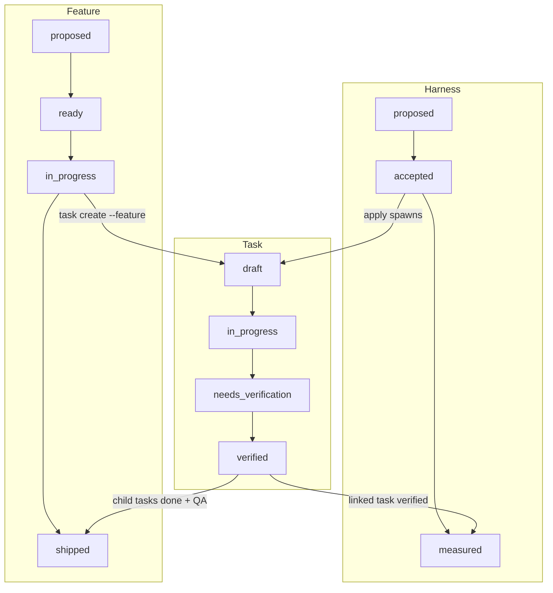

# maestro

Local-first harness for agent-built codebases. Humans steer, agents execute, maestro is the substrate.

[](https://github.com/ReinaMacCredy/maestro/actions/workflows/ci.yml)


maestro is a single Rust binary that gives a coding agent a durable place to work. Every
unit of work, what is being built, who is doing it, and the proof it was done, lives as
plain files under `.maestro/` in your repo. No daemon, no hidden service state, no cloud.
The agent runs the lifecycle through the CLI; you review the artifacts.

## Why

Coding agents are fast but forgetful. They lose the thread across sessions, ship work that
was never verified, and leave no trail you can audit. maestro fixes that by making the work
itself durable and gated:

- A **feature** carries the product contract and walks a real lifecycle: `proposed -> ready -> in_progress -> shipped`.
- A **task** cannot be called done until its claim is backed by **proof** that you can read.
- **QA** (baseline plus slices) gates a ship, so "shipped" means covered, not just compiled.
- **Decisions** are recorded as files, so the why survives the agent's context window.

Everything is repo-local and reviewable in a diff.

## Lifecycle

Features, tasks, and harness improvements each walk an explicit, gated state machine. The
agent drives the transitions through the CLI; the gates are enforced, not advisory.

A **feature** carries the product contract:


```mermaid
stateDiagram-v2
    [*] --> proposed: feature new
    proposed --> ready: accept
    ready --> in_progress: start
    in_progress --> shipped: ship
    proposed --> cancelled: cancel
    ready --> cancelled: cancel
    in_progress --> cancelled: cancel
    shipped --> [*]: archive
    cancelled --> [*]: archive
```

`accept` is gated on a frozen contract plus a behavior baseline. `ship` is gated on no live
child tasks plus QA coverage. `amend` grows a frozen contract additively with an audit reason.

A **task** is a unit of work, gated by proof:


```mermaid
stateDiagram-v2
    [*] --> draft: create
    note right of draft : created directly, under a feature, or spawned by harness apply
    draft --> in_progress: claim
    in_progress --> needs_verification: complete
    needs_verification --> verified: verify
    in_progress --> abandoned: abandon
    needs_verification --> rejected: reject
    verified --> [*]: archive
```

The task is the shared unit of work: a feature spins off child tasks (`task create --feature`)
and the harness spins off a standalone task (`harness apply`), both landing here in `draft`.
`claim` fast-tracks the internal accept steps when the feature contract or task checks are
present (a standalone task needs at least one `--check` first). `verify` is the evidence gate:
it passes only when the claim is backed by recorded proof.

A **harness improvement** is a self-improvement proposal the harness surfaces from the run log
and task history; it walks its own lifecycle behind features and tasks:


```mermaid
stateDiagram-v2
    [*] --> proposed: detector
    proposed --> accepted: apply
    accepted --> measured: measure (friction gone)
    accepted --> proposed: measure (ineffective)
    measured --> proposed: regressed
```

`apply` accepts a proposal and spawns a linked task, so the fix runs through the task lifecycle
above. `measure` re-runs the originating detector to close the loop: it reaches `measured` only
when the friction is actually gone, reverts to `proposed` if the fix was ineffective, and
reopens a `measured` item if the friction later returns. `measure` requires the linked task
verified unless `--force`.

### How the three fit together

Features and the harness are the two things that produce tasks, and both only reach their
terminal state once those tasks are verified. The task lifecycle is the hub:


```mermaid
flowchart TB
    subgraph feature [Feature]
        F1[proposed] --> F2[ready] --> F3[in_progress] --> F4[shipped]
    end
    subgraph harness [Harness]
        H1[proposed] --> H2[accepted] --> H3[measured]
    end
    subgraph task [Task]
        T1[draft] --> T2[in_progress] --> T3[needs_verification] --> T4[verified]
    end
    F3 -->|"task create --feature"| T1
    H2 -->|"apply spawns"| T1
    T4 -->|"child tasks done + QA"| F4
    T4 -->|"linked task verified"| H3
```

## Install

From source (always works):

```
git clone https://github.com/ReinaMacCredy/maestro
cd maestro
cargo install --path . --locked
```

With Cargo, directly from git:

```
cargo install --git https://github.com/ReinaMacCredy/maestro --locked
```

Release binary (macOS and Linux, arm64 and amd64):

```
curl -fsSL https://raw.githubusercontent.com/ReinaMacCredy/maestro/main/scripts/install.sh | bash
```

The installer drops the binary in `~/.local/bin` (override with `MAESTRO_INSTALL_DIR`).
Verify with `maestro version` and `maestro doctor`.

## Let your agent set it up

maestro is meant to be driven by your coding agent. The installer wires agent skills and hooks
into your repo — including a `maestro-setup` skill that tunes the harness to your build/test
commands and conventions — so the agent learns the lifecycle and records its own work. Point
your agent (Claude Code, Codex, or any CLI agent) at the repo and paste:

```
Set up maestro in this repo: run `maestro init --yes`, then `maestro install --agent claude`
(or `--agent codex`). Then follow the maestro-setup skill it installs to tune the harness to
this repo, and drive the feature and task lifecycle through the `maestro` CLI from there.
```

## Quickstart

Scaffold the repo and install the agent integration:

```
maestro init --yes                 # create .maestro/ and extract bundled skills/hooks
maestro install --agent claude     # wire skills + hooks into CLAUDE.md/AGENTS.md (or --agent codex)
maestro doctor                     # check the installation
```

The smallest loop is a single task. A standalone task (no feature) carries its own
acceptance check, and closes once a recorded run backs its claim:

```
maestro task create "Patch null deref in parser"            # -> draft
maestro task set task-001 --check "regression test passes"  # standalone tasks need their own check
maestro task claim task-001                                 # -> in_progress
maestro task complete task-001 --summary "guard the None case" --claim "cargo test parser passes"

# verify is gated on recorded proof. During a real agent run the installed hooks
# record that proof automatically from your tool runs; by hand, record it explicitly:
maestro event create --task-id task-001 --claim "cargo test parser passes"
maestro task verify task-001                                # passes once the claim is backed by recorded proof
```

For a larger change, wrap the work in a feature contract and spin off child tasks:

```
maestro feature new "CSV export"                         # -> proposed
maestro feature set csv-export --acceptance "Export a report to CSV" --area "src/export"

# accept is gated on a captured behavior baseline. The qa-baseline skill writes this
# for you during an agent run; by hand it is just a non-empty file of [bl-NNN] scenarios:
cat > .maestro/features/csv-export/baseline.md <<'EOF'
# Behavior baseline: CSV export

## Scenario Matrix
- [bl-001] Exporting an empty report yields a header-only CSV file.
EOF

maestro feature accept csv-export                        # freeze the contract -> ready
maestro feature start csv-export                         # -> in_progress

maestro task create "Implement CSV writer" --feature csv-export   # inherits the feature's contract; no --check
maestro task claim task-001
maestro task complete task-001 --summary "wrote csv writer" --claim "cargo test export passes"
maestro event create --task-id task-001 --claim "cargo test export passes"   # hooks record this in an agent run
maestro task verify task-001

# ship is gated on QA coverage: every [bl-NNN] baseline scenario needs a proven slice.
# The qa-slice skill writes this for you; by hand it maps each scenario to its evidence:
cat > .maestro/features/csv-export/qa-slices.yaml <<'EOF'
slices:
  - scenarios: ["bl-001"]
    evidence: ["cargo test export::empty_report_header_only passes"]
EOF

maestro feature ship csv-export --outcome "Shipped streaming CSV export"   # -> shipped
```

`maestro feature show <id>` and `maestro task show <id>` render the current state and the
recorded reasoning at any point.

maestro surfaces improvement proposals once it has enough run history to spot friction, so a
fresh repo shows none (`harness list` -> "no improvement proposals found"). The `hb-001` below
is illustrative; once the backlog has a real entry, run it through the same task loop:

```
maestro harness list                       # what friction the run log surfaced
maestro harness apply hb-001                # accept a proposal -> spawns a standalone task
maestro task set task-003 --check "deflake the integration suite"   # standalone tasks need a check first
maestro task claim task-003
maestro task complete task-003 --summary "stabilized the suite" --claim "cargo test integration passes"
maestro event create --task-id task-003 --claim "cargo test integration passes"   # proof (hooks do this live)
maestro task verify task-003                # gated on the claim's recorded proof
maestro harness measure hb-001              # close the loop once that task is verified
```

`harness apply` spawns a *standalone* task, so it needs a `--check` before you can claim it.
`harness measure` will not mark the improvement `measured` until that linked task is verified
(pass `--force` to close it anyway).

### Suggested workflow

The three lifecycles compose into one operating rhythm. The [Quickstart](#quickstart) above is the
terse command path; this section narrates it — the agent prompt you hand off for each flow, and what
the run actually looks like, gates and all. Every transcript below is real output from the current
binary.

#### From a high-level idea to a shipped product

One feature, start to finish: a raw idea becomes a frozen contract, the work is proven slice by slice,
and it ships only once QA covers the baseline. This is the prompt you paste into a fresh agent session:

> We want to add rate limiting to the public API: requests over a key's limit should get an HTTP 429.
> Set it up as a maestro feature — map the contract, capture a behavior baseline, record the
> fixed-window-vs-token-bucket decision, then drive it to shipped through proof-gated tasks. Don't skip
> the gates.

How it looks end to end (the `baseline.md` and `qa-slices.yaml` file bodies are in flows 1 and 3 below,
and copy-paste-ready in the Quickstart):

```
$ maestro feature new "API rate limiting"
created feature api-rate-limiting (proposed)

$ maestro feature set api-rate-limiting \
    --acceptance "Requests over a key's limit get HTTP 429 with Retry-After" \
    --acceptance "Counters reset on a fixed window boundary" \
    --area "src/api/middleware" --non-goal "No multi-node coordination in this pass" \
    --question "Per-key or per-IP buckets?"
set api-rate-limiting (replace-per-field); acceptance=2, areas=1, non_goals=1, questions=1

$ maestro decision new "Fixed-window counter, not a token bucket, for v1"
created decision decision-001

# (write .maestro/features/api-rate-limiting/baseline.md first — see flow 1) — accept then succeeds:
$ maestro feature accept api-rate-limiting
accepted api-rate-limiting (→ ready); contract frozen (acceptance=2, areas=1); note: 1 open question(s) carried (non-blocking)
$ maestro feature start api-rate-limiting
started api-rate-limiting (→ in_progress)

$ maestro task create "Add fixed-window counter middleware" --feature api-rate-limiting
created task-001
$ maestro task claim task-001
auto-accepted task-001 (draft -> ready, acceptance locked)
updated task-001 -> in_progress
$ maestro task complete task-001 --summary "fixed-window counter in the request middleware" --claim "cargo test ratelimit passes"
updated task-001 -> needs_verification
$ maestro event create --task-id task-001 --claim "cargo test ratelimit passes"   # hooks do this live
created task_proof event for run manual
$ maestro task verify task-001
verification passed for task-001 (1 claim(s), 1 proof source(s))

# (write .maestro/features/api-rate-limiting/qa-slices.yaml first — see flow 3) — ship then succeeds:
$ maestro feature ship api-rate-limiting --outcome "Shipped fixed-window rate limiting"
shipped api-rate-limiting (→ shipped)
```

The same journey, flow by flow — each leads with the gate that blocks you until the evidence exists,
because that gate is the point.

#### 1. Design as a feature

`feature new` then `feature set` map the contract (acceptance, affected areas, non-goals, open
questions); `decision new` records each fork as a durable file. `feature accept` freezes the contract
into `ready` — but only once you have captured a behavior baseline — and `feature start` moves it to
`in_progress`.

*Prompt:* "Set up <idea> as a maestro feature: `feature new`, then `feature set` with the acceptance
criteria, affected areas, non-goals, and open questions. Record each fork with `decision new`. Write a
behavior baseline of `[bl-NNN]` scenarios to `.maestro/features/<id>/baseline.md`, then `feature accept`
and `feature start`."

The gate: `accept` refuses until a baseline exists, and names the file it wants.

```
$ maestro feature accept api-rate-limiting
Error: cannot accept api-rate-limiting — contract incomplete:
  qa-baseline (.maestro/features/api-rate-limiting/baseline.md missing) — fix: capture current behavior before edits via the qa-baseline skill (a non-empty baseline.md); tagging scenarios [bl-NNN] now satisfies the ship gate later
```

#### 2. Spin off tasks, each closed by proof

`task create --feature <id>` per slice — feature-linked tasks inherit the contract, while a standalone
task needs its own `--check` first. Then drive every task through the same gated loop: `task claim` →
`task complete --summary "..." --claim "..."` → the proof (the installed hooks record it as the agent
runs its tools; by hand it is `maestro event create --task-id <id> --claim "<same text>"`) →
`task verify`. A `verified` task is always evidence you can open.

*Prompt:* "For each slice of <feature>, `task create --feature <id>`, claim it, do the work, then
`task complete` with a `--claim` stating what proves it. The installed hooks record that proof as you
run your tools; then `task verify` to gate the task on it. Use the same wording in the claim and the
proof."

The gate: `verify` refuses until the claim is backed by recorded proof — and prints the exact command
to record it.

```
$ maestro task verify task-001
verification failure: missing proof: no task events or proof artifacts found; hooks record proof during agent runs, or add one with `maestro event create --task-id task-001 --claim "..."`
verification failure: claim not backed by events/proof: cargo test ratelimit passes; record matching proof with `maestro event create --task-id task-001 --claim "cargo test ratelimit passes"`
Error: verification failed for task-001
```

#### 3. Ship the feature once QA is proven

A feature ships only when it has no live child tasks *and* its QA coverage is green: every `[bl-NNN]`
scenario in the baseline must be matched by a slice in `qa-slices.yaml` carrying non-empty evidence.
Coverage is checked, not asserted, so a green ship is a real signal.

*Prompt:* "Map every `[bl-NNN]` baseline scenario of <feature> to a slice in
`.maestro/features/<id>/qa-slices.yaml` with the test that proves it as `evidence`. Then
`feature ship --outcome "..."`. Verify the gate passes; don't `--force` it."

The gate: `ship` refuses while any baseline scenario lacks a covering slice, and lists which.

```
$ maestro feature ship api-rate-limiting --outcome "Shipped fixed-window rate limiting"
Error: cannot ship api-rate-limiting:
  qa-slice coverage incomplete — 2 baseline scenario(s) without a counting slice: bl-001, bl-002; fix: add to .maestro/features/api-rate-limiting/qa-slices.yaml a `slices:` entry per scenario with `scenarios: [bl-NNN]` and non-empty `evidence: [...]`, or run the qa-slice skill
```

#### 4. Improve the harness — maestro's self-improvement

The first three flows build the product; this one sharpens the tool that builds it, through the very
same proof loop. maestro watches its own run log and task history, and surfaces a proposal when the
same friction *recurs* — that is, when work keeps going wrong the same way. It never acts on its own:
proposals are listed on demand and only become work when you apply them.

What it catches (the rule-based detectors, no LLM calls): the same blocker reason across two or more
tasks (`recurring_blocker`); a session full of correction prompts (`recurring_intervention`); a task
verified with a command that is not in your reusable harness stack (`missing_verification`); a work
domain whose tasks take far longer to verify than the rest (`missing_skill`); a topic rediscovered
across tasks with no decision on record (`rediscovered_decision`).

*Prompt:* "Run `maestro harness list`. For each proposal worth doing, `harness apply <id>` to spawn the
fix task, close that task through the proof loop (`set --check`, claim, complete `--claim`, record
proof, `verify`), then `harness measure <id>` to record the outcome."

A fresh repo has no history, so nothing is proposed. Here two tasks hit the same blocker — that *is* the
recurring friction — and the detector turns it into a tracked proposal:

```
$ maestro harness list
no improvement proposals found

$ maestro task block task-001 --reason "staging credentials missing"
blocked task-001 (blk-001)
$ maestro task block task-002 --reason "staging credentials missing"
blocked task-002 (blk-001)

$ maestro harness list
ID	STATUS	TYPE	TITLE
hb-001	proposed	recurring_blocker	Reduce recurring blocker: staging credentials missing

$ maestro harness apply hb-001                 # accept → spawns a standalone task
accepted hb-001 (spawned task-003)
next: `maestro task set task-003 --check "..."` then `maestro task claim task-003`

# close the spawned (standalone) task through the proof loop
$ maestro task set task-003 --check "staging credentials documented in onboarding"
updated task-003 checks
$ maestro task claim task-003
auto-accepted task-003 (draft -> ready, acceptance locked)
updated task-003 -> in_progress
$ maestro task complete task-003 --summary "added staging creds to onboarding" --claim "onboarding doc lists staging creds"
updated task-003 -> needs_verification
$ maestro event create --task-id task-003 --claim "onboarding doc lists staging creds"
created task_proof event for run manual
$ maestro task verify task-003
verification passed for task-003 (1 claim(s), 1 proof source(s))

$ maestro harness measure hb-001
hb-001 is now measured
note: friction is still detected; this behavioral item was closed by judgment, not by a silence check
```

That closing note is the honest part: `measure` confirms the friction is *gone* only for the
state-based detectors (`missing_verification`, `rediscovered_decision`), which it re-runs and expects to
fall silent. A behavioral item like `recurring_blocker` is drawn from history, so `measure` closes it by
*your* judgment that you addressed the root cause, and says so rather than pretending the signal
vanished. Either way, the improvement is tracked and backed by a verified task — never a silent edit.

### Feature lifecycle

A feature is the product contract. `proposed` is the design state where the contract is
editable; `accept` freezes it into `ready` (and requires a behavior baseline); `start` moves
it to `in_progress`; `ship` requires no live child tasks plus QA coverage. Each feature owns
a directory under `.maestro/features/<id>/` with its contract, baseline, QA slices, amend log,
and a free-form `notes.md` running design log.

### Tasks gated by proof

Tasks move `draft -> in_progress -> needs_verification -> verified`. `verify` reads the proof
recorded for the task and checks it against the claim; a task with no checks cannot be claimed.
The result is that "done" is always backed by evidence you can open.

### QA: baseline and slices

A feature ships only when its behavior baseline is fresh and its QA slices cover the scenarios.
Coverage is checked, not asserted, so a green ship is a real signal.

### Decisions

`maestro decision new "<the fork>"` records an architectural decision as a file under
`.maestro/decisions/`, so the reasoning outlives any single agent session.

### Harness self-improvement

maestro watches its own run log and task history and proposes improvements to the harness
itself when the same friction recurs (a recurring blocker, repeated correction prompts, a
non-reusable verification command, a slow work domain, a decision worth recording).
`maestro harness list` shows the backlog; `maestro harness apply <id>` accepts a proposal and
spawns a real task to do the work; `maestro harness measure <id>` records the outcome. For the
state-based detectors it re-runs the check and only marks `measured` once the friction is gone;
behavioral items it closes by your judgment on a verified task, and says so. It is passive:
proposals are surfaced on demand, never acted on without you. See the
[Suggested workflow](#4-improve-the-harness--maestros-self-improvement) for a full run.

### Skills and hooks

`maestro install` extracts agent skills (design, feature, task, verify, QA) into
`.maestro/skills/` and wires hook scripts so the agent's actions are recorded as run events.
`maestro sync` refreshes those bundled resources to the running binary, preserving your edits.

## Command reference

| Command | What it does |
| --- | --- |
| `init` | Scaffold `.maestro/` and extract bundled resources |
| `install` / `uninstall` | Wire or remove agent hooks and config (`--agent claude\|codex`) |
| `sync` | Resync bundled resources to this binary, offline, preserving edits |
| `update` | Upgrade the binary and refresh resources |
| `doctor` | Diagnose the installation |
| `feature` | Manage the product contract and its lifecycle |
| `task` | Create, claim, complete, verify, and query tasks |
| `verify` | Verify a task against its recorded proof |
| `decision` | Create and list decision records |
| `harness` | List, show, apply, and measure self-improvement proposals |
| `version` | Print the version and binary path |

Run `maestro <command> --help` for the full surface.

## Migrating from the TypeScript maestro

Earlier maestro was a TypeScript build. The Rust rewrite is a different, leaner, repo-local
product, so moving an existing repo over is a best-effort, agent-driven step (the binary does
no data conversion itself). [MIGRATE.md](./MIGRATE.md) is written as an instruction for a
coding agent.

Install the Rust binary, then paste this into a fresh agent session (Claude Code, Codex, or
any CLI agent):

```
Migrate my maestro data from the TypeScript build to the Rust build by fetching and following
https://raw.githubusercontent.com/ReinaMacCredy/maestro/main/MIGRATE.md: back up the old data
first, map it into the new `.maestro/` model, and write me the mapping report. Never delete
the original data.
```

## Project layout

```
src/         Rust crate: domain, operations, interfaces, foundation
tests/       contract, adapter, runtime-flow, and safety tests
embedded/    shipped harness, hook, shell, and skill resources
.maestro/    repo-local artifacts for this checkout
```

## Documentation

- [AGENTS.md](./AGENTS.md): agent notes, code map, and conventions
- [TESTING.md](./TESTING.md): the smallest falsifying checks by touched surface
- [MAINTENANCE.md](./MAINTENANCE.md): refactor discipline, drift rules, handoff standard
