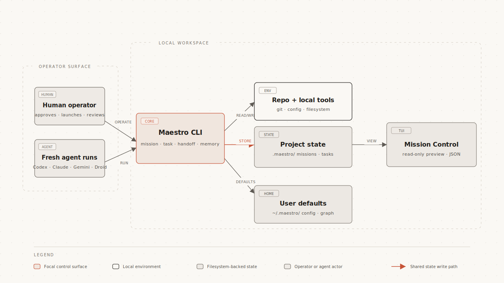
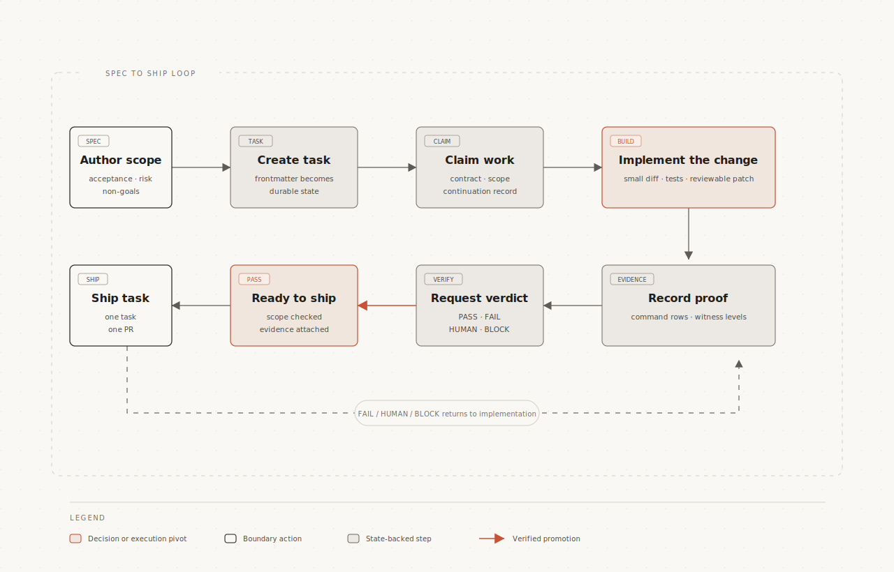
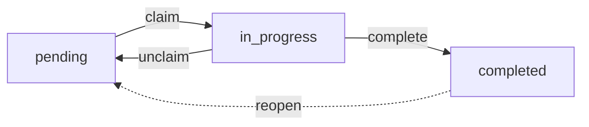

# maestro

Maestro is a local-first agent harness for the spec-to-ship loop. It gives agents one CLI and one on-disk state model for specs, tasks, evidence, contracts, handoffs, and principles so separate sessions can collaborate without a server, database, or background daemon.

In day-to-day use it acts as a conductor: a human operator drives multiple terminals while Maestro keeps the shared state disciplined and inspectable. The vocabulary is `spec -> task -> verify -> ship`. One task equals one PR (ADR-0006). Multi-PR work decomposes into an exec-plan via `maestro plan`. See `docs/harness-positioning.md` for the principle-to-primitive mapping.

## Why Maestro

- Shared state lives on disk in `.maestro/`, not in chat history.
- Specs define acceptance criteria, risk class, and non-goals before code is written.
- Tasks carry durable, per-session continuation records so the next agent resumes exactly where the last left off.
- Handoff envelopes are emitted passively at each lifecycle transition; the next agent reads the file on disk.
- Evidence turns agent claims into auditable, witnessed rows tied to tasks and contracts.
- The trust substrate (contracts, verifier, verdict, CI) gates completion on witnessed evidence, not convention.
- Mission Control gives you a read-only TUI and JSON snapshots of current state.
- The runtime stays local-first: filesystem, git, config, and terminal tools.

## System Map



Maestro is the shared state layer in the middle. The operator and fresh agent runs both go through the CLI, the CLI persists shared state locally, and Mission Control projects that same state without mutating it.

## What Maestro Is Not

- It is not a hosted orchestration service or remote agent platform.
- It is not tied to a single model vendor or harness.
- It does not require a database, queue, or network API to work.
- It does not schedule or background anything. "Automatic" means computed from the result of the verb the agent just called.

The human operator is the bridge between terminals. Maestro is the shared state layer underneath that workflow.

## Core Concepts

| Concept | Purpose |
|---|---|
| Spec | A product-spec markdown file with YAML frontmatter: acceptance criteria, non-goals, risk class, mode, and work type. The input to the task lifecycle. |
| Task | The atomic unit of work. One task equals one PR. Carries a state machine, continuation record, optional contract, and linked evidence. |
| Exec-plan | A container for multiple child tasks decomposed from a heavy-mode spec. Auto-completes when all children reach a terminal state. |
| Evidence | An auditable row tied to a task: command run, exit code, optional log path, and a witness level. |
| Contract | A machine-checked scope agreement attached to a task: files expected, files forbidden, and explicit done-when criteria. |
| Handoff | A passive JSON envelope emitted at lifecycle transitions. The next agent reads `.maestro/handoffs/<id>.json` to learn what happened and why. |
| Principle | A behavioral rule stored at `.maestro/principles.jsonl` and injected into agent prompts. |
| Verdict | The deterministic gating decision after verification: `PASS`, `FAIL`, `HUMAN`, or `BLOCK`. |
| Mission Control | A read-only terminal dashboard and JSON snapshot surface for inspecting current state. |

## How Work Flows



The loop is deliberately simple: author a spec, create a task, claim it, implement and verify in a loop, then ship. Each transition emits evidence and a handoff envelope so any subsequent agent can resume without a briefing.

## Installation

### Requirements

- [Bun](https://bun.sh/)
- Git
- A local agent harness in another terminal, such as Codex, Claude Code, or Hermes

### Install From Release

Install the latest published Maestro binary:

```bash
curl -fsSL https://raw.githubusercontent.com/ReinaMacCredy/maestro/main/scripts/install.sh | bash
```

Install a specific published release:

```bash
MAESTRO_VERSION=<version> curl -fsSL https://raw.githubusercontent.com/ReinaMacCredy/maestro/main/scripts/install.sh | bash
```

After installation, refresh to the latest published release with:

```bash
maestro update
```

### Build From Source

```bash
bun install
bun run build
```

This produces the compiled binary at `./dist/maestro`.

### Install Locally

```bash
bun run release:local
command -v maestro
maestro --version
```

If you also want to initialize global config and inject supported agent instruction blocks:

```bash
maestro install
```

This syncs bundled Maestro skills into Codex, Claude Code, Hermes, and the shared AgentSkills root when those targets are available. See [Provider Registry and Skills](docs/providers.md) for roots, diagnostics, and external skill installs.

`./dist/maestro` is the fresh repo build. `maestro` on your `PATH` is the installed local binary.

## Quick Start

### 1. Initialize a project

```bash
maestro init
```

Creates the local `.maestro/` workspace for the current repository and writes `.maestro/MAESTRO.md` — a read-order compass that points fresh agents at the right files.

### 2. Bootstrap the directory layout

```bash
maestro setup bootstrap
```

Creates the canonical subdirectories under `.maestro/` with `.gitkeep` placeholders. Idempotent: safe to re-run.

### 3. Check setup

```bash
maestro setup check
```

Audits the directory layout, principles pack, and config file. Exits 1 only when an entry is `missing`; `warn` is informational. Add `--json` for machine output.

### 4. Author a spec

```bash
maestro spec new my-feature --title "My first feature"
```

Scaffolds `.maestro/specs/my-feature.md` with YAML frontmatter. Open the file and fill in `acceptance`, `non_goals`, `risk_class`, `mode`, and `work_type`. For a guided interview, run the `maestro-design` skill before this step.

The frontmatter shape:

```yaml
---
slug: my-feature
title: My first feature
status: draft
acceptance:
  - "The new endpoint returns 200 for valid input"
non_goals:
  - "Migrating existing data"
risk_class: medium
mode: light
work_type: feature
blocked_by: []
---
```

Run `maestro spec validate .maestro/specs/my-feature.md` to check frontmatter before proceeding.

### 5. Create the task

```bash
maestro task from-spec .maestro/specs/my-feature.md
```

Creates a task in `draft` state and prints the task ID (`tsk-...`).

### 6. Claim the task

```bash
maestro task claim <tsk-id>
# or the hot-path alias:
claim <tsk-id>
```

Transitions the task to `claimed`, records a transition evidence row, and emits a handoff envelope at `.maestro/handoffs/<id>.json`. For heavy-mode specs, a worktree is auto-created at this step. To skip worktree creation:

```bash
maestro task claim <tsk-id> --skip-worktree
```

### 7. Do the work, then verify

Implement the change. When ready:

```bash
maestro task verify <tsk-id>
# or:
verify <tsk-id>
```

Exit codes:

| Code | Meaning | Next action |
|---|---|---|
| `0` | PASS | Task auto-advances to `ready`. Run `ship`. |
| `1` | FAIL | Fix the cited violations. Run `verify` again. |
| `2` | HUMAN | Task stays at `verifying`. Hand off and stop. |
| `3` | BLOCK | Task transitions to `blocked`. Surface the reason. |

### 8. Ship

```bash
maestro task ship <tsk-id>
# or:
ship <tsk-id>
```

Transitions `ready -> shipped`. Optionally attach a PR URL:

```bash
maestro task ship <tsk-id> --pr-url https://github.com/owner/repo/pull/123
```

## The Six Skills

Maestro ships a bundle of six agent-facing skills. Agents load them at session start. Each skill is a markdown document in `skills/bundled/`.

### maestro-design

Interview-driven product-spec authoring. Runs the grill protocol: a one-question-at-a-time interview that walks acceptance criteria, non-goals, risk class, mode, and work type, challenging user language against `CONTEXT.md` and committed ADRs. Output is a committed `.maestro/specs/<slug>.md` ready for `maestro task from-spec`. Use this skill before authoring any spec.

### maestro-handoff

Session handoff awareness for the passive handoff model. Describes the envelope schema, which lifecycle verbs emit envelopes (`task:claim`, `task:block`), and the read-only pickup protocol an incoming agent follows to resume a task left by a prior agent. Also documents the four handoff MCP tools for runtimes that prefer structured tool calls over direct file reads. Read this skill at session start in any `.maestro/` project to learn what the last agent left behind.

### maestro-plan

Heavy-mode workflow. Takes an approved `mode: heavy` product-spec and turns it into an exec-plan with child tasks via `maestro plan from-spec` followed by `maestro plan decompose`. The decompose step runs the grill protocol against the spec, `CONTEXT.md`, and the architecture lint set before emitting the task batch. The exec-plan auto-completes when every child task reaches `shipped` or `abandoned` (ADR-0011). Use this skill when the work spans three or more vertical slices or multiple feature directories.

### maestro-task

Single-task execution loop for light-mode specs. Guides the agent from `task from-spec` through `claim`, the `doing <-> verifying` iteration, blocking when stuck, and finally `ship`. Auto-activates when a `.maestro/` directory is detected in the working tree. Every state transition emits a handoff envelope and an evidence row. Use this skill for any single-PR implementation task.

### maestro-verify

The canonical verification protocol. Documents exit-code routing (PASS / FAIL / HUMAN / BLOCK), the architecture-lint corpus, the Trust Verifier checks, and the ProofMap acceptance-criteria coverage gate. Cross-referenced by `maestro-task` and `maestro-plan`. Read this skill before declaring any task complete; it is the shared pre-ship ritual every agent follows.

### maestro-setup

Repository onboarding. The skill generates context docs under `.maestro/context/`, a hierarchical `AGENTS.md`, language style guides, and a setup report. The CLI mirrors the skill: `setup check` audits drift, `setup bootstrap` scaffolds directories, `setup migrate-v2` performs the 11-step upgrade from a pre-rebuild `.maestro/`, and `setup migrate-corrections` moves legacy corrections into `docs/principles/legacy/`. Use this skill when initializing a new project or upgrading an older `.maestro/` directory.

## Handoffs

Handoffs in Maestro are passive. Lifecycle verbs drop a small JSON envelope on disk at each meaningful transition; the next agent reads the file to understand what was happening and why. There is no launch daemon, no remote queue, and no active broker.

### Which verbs emit envelopes

| Verb | Emits | Envelope `trigger_verb` |
|---|---|---|
| `maestro task claim` | yes | `task:claim` |
| `maestro task block` | yes | `task:block` |
| `maestro task ship` | roadmap | — |
| `maestro task verify` | roadmap | — |
| `maestro task abandon` | roadmap | — |

`task:claim` and `task:block` are the only wired emitters. The remaining triggers are reserved in the port and will emit when wired.

### Envelope schema

Envelopes land at `.maestro/handoffs/<hnd-<base36>-<rand>>.json`:

```json
{
  "id": "hnd-...",
  "task_id": "tsk-...",
  "trigger_verb": "task:claim",
  "created_at": "<ISO-8601>",
  "agent_id": "<optional>",
  "worktree_path": "<optional>",
  "spec_path": "<optional>",
  "reason": "<optional, present on task:block>"
}
```

### Pickup protocol

1. Scan recent envelopes: `ls -1t .maestro/handoffs/*.json | head -10`
2. Read the envelope that matches the task you intend to pick up.
3. Check `trigger_verb`:
   - `task:claim` — a prior agent had it; verify they are gone before re-claiming.
   - `task:block` — read `reason`; resolve the blocker before re-claiming.
4. Re-claim: `maestro task claim <task_id> --agent <your-agent-id>`
5. Continue the verification loop per `maestro-verify`.

Pickup sidecars live at `<id>.picked_up.json`. The `*.json` glob matches envelope files only; pickup sidecars are excluded by `maestro_handoff_list` by default.

## Task System

Tasks are Maestro's lightweight, mutable issue graph for the daily queue. A task answers "what do I do next?" Tasks live in `.maestro/tasks/tasks.jsonl`, are repo-tracked, and review like regular diffs.

### Lifecycle


```mermaid
flowchart LR
    pending -->|claim| in_progress
    in_progress -->|unclaim| pending
    in_progress -->|complete| completed
    completed -.->|reopen| pending
```

- `pending` tasks sit in the queue.
- `in_progress` tasks are claimed by exactly one session.
- `completed` tasks are locked; edits or re-runs require `task reopen`, which restores the task and its continuation summary.
- Legacy statuses (`open`, `blocked`, `deferred`, `closed`) still parse from older state files and collapse to `pending` or `completed` on read.

Every task carries a `type` (`task`, `bug`, `feature`, `epic`, `chore`), a `priority` (`P0`-`P4`, default `P2`), freeform `labels`, optional `parentId`, ownership metadata (`assignee`, `claimedAt`, `lastActivityAt`), optional `contractId`, and an optional `receipt` (`summary`, `surprise`, `verifiedBy`) captured at completion.

### Dependencies and blocking

Blocking is symmetric and stored on both sides. Each task has a `blockedBy` list of prerequisites and a `blocks` list of dependents. Declaring that `A` blocks `B, C` atomically updates all three tasks.

```bash
maestro task block <id> <blockedTaskIds...>
maestro task unblock <id> <blockedTaskIds...>
maestro task create "..." --blocked-by <ids>
```

Rules enforced by the domain layer:

- A task is **ready** only when every entry in its `blockedBy` is `completed` (or missing from the store). `task ready` returns exactly the pending, unblocked, unassigned set, ranked `P0`/`P1` first and then by creation time.
- Status moves into `in_progress` or `completed` fail with a blocker error when any prerequisite is still open.
- The retired `task deps add|remove` verbs now error and point to `task block` / `task unblock`.

### Discovery

| Command | Returns |
|---|---|
| `maestro task status` | Hybrid board: compact active/ready/blocked lists plus expanded dependency tracks. |
| `maestro task ready` | Pending, unblocked, unassigned tasks, `P0`/`P1` first. |
| `maestro task mine` | Tasks claimed by the active session. |
| `maestro task stuck` | `in_progress` tasks idle past `--older-than` (default `4h`). |
| `maestro task similar <id>` | Tasks that look alike by title, completion reason, receipt text, and linked contract text. |
| `maestro task list` | Full filter set: `--status`, `--priority`, `--type`, `--label`, `--parent`, `--assignee`, `--limit`. Add `--tracks` for headline-only output. |

### Ownership and claim

Claiming is exclusive and session-scoped. Session IDs come from the `sessionDetection` config (Claude Code out of the box) or `--session <id>` when scripting.

```bash
maestro task claim <id>
maestro task claim <id> --busy-check        # refuse if this session already owns open work
maestro task claim <id> --force             # steal from another session
maestro task claim <id> --stale-after 4h   # auto-release a dead owner's stale claim
maestro task unclaim <id>                   # in_progress demotes to pending
maestro task release-owned <sessionId>      # release everything a session held
maestro task heartbeat <id>                 # bump lastActivityAt without other edits
```

### Batch planning

Agents can stage a whole queue upfront from one JSON file. References between tasks use a batch-local `name` slot that resolves to real ids inside a single atomic write.

```bash
maestro task plan --file plan.json
maestro task plan --file - < plan.json
maestro task plan --file plan.json --start scaffold    # auto-claim the named task
maestro task plan --file plan.json --dry-run           # validate without writing
```

```json
{
  "batchId": "auth-slice",
  "tasks": [
    { "name": "scaffold", "title": "Scaffold auth module", "type": "chore", "priority": 2 },
    { "name": "tests", "title": "Add login tests", "blockedBy": ["scaffold"] },
    { "title": "Wire login route", "blockedBy": ["scaffold", "tests"], "labels": ["auth"] }
  ]
}
```

### Resumable continuation

Every task has a durable, on-disk continuation record that tells the next agent where work stands. It is the source of truth for resume across sessions, across agents, and across context compaction. Handoff envelopes are the transfer signal; the continuation is the state.

Two files back each task:

- `.maestro/tasks/continuations/active/<taskId>.json` — live summary. Moves to `completed/<taskId>.json` at `task update --status completed` and returns to `active/` on `task reopen`.
- `.maestro/tasks/local-history/<taskId>.jsonl` — append-only event log (per-machine).

Summary fields: `currentState`, `nextAction`, `keyDecisions`, `activeAgent`, `lastActiveAt`. Event kinds: `snapshot`, `decision`, `next_action_set`, `blocker_set`, `handoff_created`, `handoff_picked_up`, `agent_takeover`, `task_completed`, `task_reopened`.

#### Three ways work resumes

1. **Same session, chat intent.** Maestro installs Claude Code hooks that hydrate the active continuation into the agent's context with no CLI call:
   - `SessionStart` injects a short pointer when an active task exists: id, title, status, last-active timestamp, and a nudge to say `continue` or `resume`.
   - `UserPromptSubmit` watches for these exact phrases (case- and punctuation-insensitive) and expands them into the full resume payload before the model sees the prompt:
     - `continue`
     - `continue work`
     - `resume`
     - `resume work`
     - `pick up where we left off`
     - `resume where we left off`
     - `resume from where we left off`
   - `PreCompact` preserves the continuation in the compacted summary so resume survives a context reset.

   These are plain chat intents, not Maestro CLI commands.

2. **Different agent, handoff pickup.** Read the envelope at `.maestro/handoffs/`, confirm `task_id` and `trigger_verb`, then re-claim the task. See the [Handoffs](#handoffs) section for the full pickup protocol.

3. **Manual inspection.** `maestro task show <id>` prints the raw task and continuation state for offline review.

#### Keep the continuation fresh while working

```bash
maestro task update <id> \
  --current-state "Tests pass locally; rebased on main" \
  --next-action "Open PR and request review" \
  --add-decision "Use bcrypt over argon2 for parity with legacy" \
  --remove-decision "Use JWTs in localStorage"
```

Refresh when current state or next action changes, when a load-bearing decision or constraint changes, or when blockers appear or clear.

### Contracts

A contract is a machine-checked agreement attached to a task: what to touch, what to avoid, and what "done" means. At completion, Maestro diffs `claimedAtCommit..HEAD` and renders a verdict.

Lifecycle: `draft` -> `locked` or `amended` -> `fulfilled` or `broken`, with `discarded` as an early-exit from `draft`. A closed contract can be reopened alongside its task.

```bash
maestro task contract new <taskId> --editor "$EDITOR"   # or --from template.yaml
maestro task contract edit <ref>
maestro task contract lock <ref>                         # freeze scope + claim commit
maestro task contract amend <ref>                        # record a post-lock change
maestro task contract show <ref>
maestro task contract list
maestro task contract verdict <ref>                      # preview without closing
maestro task contract discard <ref>                      # draft only
maestro task contract reopen <ref>                       # after fulfilled/broken
maestro task contract criteria mark <ref> <criterionId> --evidence "bun test"
maestro task contract criteria add <ref> "New criterion text"
maestro task contract criteria remove <ref> <criterionId>
```

Completion gating: `task update --status completed` against a task with a locked contract closes the contract, renders a verdict, and fails completion when the verdict is broken and either `contracts.strict=true` is set or `--strict` is passed.

### Task storage

```text
.maestro/tasks/
├── tasks.jsonl                 # authoritative task graph (repo-tracked)
├── contracts/                  # per-task locked contracts and verdicts (repo-tracked)
├── contract-templates/         # reusable YAML drafts for `contract new --from`
├── continuations/              # per-task resume summaries + event logs
├── batches/                    # batch plan manifests
├── candidates/                 # captured work candidates awaiting promotion
└── local-history/              # per-machine audit log (ignored)
```

`tasks.jsonl`, `contracts/`, and `principles.jsonl` are intentionally repo-tracked so the queue and its policies review like any other code change.

## Evidence

Maestro has a lightweight logbook for recording verifiable outputs tied to a task. Use it to document commands that ran, their exit codes, and optional manual notes — before or after completing work.

Evidence rows are stored under `.maestro/evidence/` (gitignored, per-machine) and stamped with a `WitnessLevel` that captures how trustworthy the claim is: `witnessed-by-maestro` for Maestro-invoked commands, `agent-claimed-locally` for evidence the agent self-reported, and `agent-claimed-and-not-reproducible` for manual notes.

```bash
# Record a command run
maestro evidence record --task tsk-aaaaaa --command "bun test" --exit 0

# Record with duration and optional log path
maestro evidence record --task tsk-aaaaaa --command "bun run build" --exit 0 --duration 12345 --log ./build.log

# Record a manual note
maestro evidence record --task tsk-aaaaaa --kind manual-note --note "Verified UI on staging"

# List evidence for a task
maestro evidence list --task tsk-aaaaaa

# Show one evidence row
maestro evidence show evd-xxxxxx
```

Evidence rows are linked to a task id and optionally to a contract criterion via `--criterion <id>`. Run `maestro evidence record --help` for the full flag set.

## Trust Substrate

Maestro's trust substrate is a stack of opt-in layers that turn agent claims into deterministic, auditable, gated decisions. Each layer is independently useful; together they compose. Contracts narrow the scope of work, the Trust Verifier checks the diff against that scope, the Verdict gates completion on witnessed evidence, CI makes the verdict authoritative, and the optional layers above (auto-merge, deploy safety, cross-task conflict) extend the same primitives outward.

The sections below cover each layer in turn. They are presented in the order a team typically adopts them, but every layer past contracts is opt-in and can be enabled independently.

## Contracts and the Trust Verifier

This is the foundation. A contract pins down what a task is allowed to touch; the Trust Verifier checks the diff against that contract. Three behaviors define this layer:

1. **Plan proposes a contract.** During `maestro-plan`, the plan must include a `proposed_contract` with `allowed_files`, `forbidden_paths`, `done_when` criteria, and an `amendment_budget`. Plan-time proposals are not amendments — they seed the contract that gets locked when the agent claims the task.

2. **Agent works within scope; amends on genuine discovery.** When work uncovers a file that lies outside the locked contract scope, the agent must amend before touching it:

   ```bash
   maestro contract amend --task <id> --add-path src/new-file.ts --reason "discovered at runtime"
   ```

   Each amendment writes a new versioned contract snapshot and a `contract-amended` Evidence row. The budget defaults are `max_amendments: 3`, `max_paths_per_amendment: 5`. Amendments are versioned Evidence and never silent edits.

3. **Agent verifies before completing.** `maestro task verify` runs the Trust Verifier against the current diff and the locked contract:

   ```bash
   maestro task verify --task <id>
   ```

   The verifier runs 6 checks in parallel: scope adherence, lockfile parity, generated-file parity, sensitive-path policy, commit metadata, and secrets-in-diff. Findings are printed with severity (`info`, `warn`, `error`). Exit codes: `0` when no `error` findings, `1` when at least one `error` finding, `2` when the task has no locked contract.

### CLI surface

```bash
# Versioned contract inspection and amendment
maestro contract show --task <id>
maestro contract show --task <id> --version <n>
maestro contract amend --task <id> --add-path <path> --reason "<why>"
maestro contract amend --task <id> --remove-path <path> --reason "<why>"
maestro contract history --task <id>

# Trust Verifier
maestro task verify --task <id>
maestro task verify --task <id> --base <git-ref>
maestro task verify --task <id> --json

# Spec (acceptance criteria and non-goals)
maestro spec new <slug> [--title <text>] [--mode light|heavy]
maestro spec validate <path>
```

### Policy files

`maestro init` bootstraps two policy files committed under `.maestro/policies/`:

- `sensitive-paths.yaml` — glob list; paths matching these globs trigger `checkSensitivePaths` findings.
- `owners.yaml` — three role lists (`policy_approver`, `ratchet_approver`, `sensitive_waiver`). See `docs/owners-yaml-format.md` for the schema reference.

## Verdicts and Risk Class

The verdict layer turns a verifier run into a deterministic gating decision. After `maestro task verify`, an agent requests a verdict that produces one of four outcomes:

| Verdict | Meaning |
|---|---|
| `PASS` | All acceptance criteria are met with evidence at or above the required witness level for the effective risk class. Completion is unblocked. |
| `FAIL` | Evidence is present but insufficient: a criterion is unmet, or the evidence witness level is below the autopilot policy threshold. |
| `HUMAN` | Criteria are met but the effective risk class or autopilot policy requires a human reviewer before the task can be sealed. |
| `BLOCK` | A hard blocker is active: broken contract, `critical` risk class with no human signoff, or a policy loosening still in its 30-day soak window. |

### Witness levels

Every Evidence row carries a `witness_level` that captures how trustworthy the claim is. The ladder, strongest to weakest:

1. `witnessed-by-maestro` — Maestro itself ran the command and captured the result.
2. `witnessed-by-ci` — A trusted CI gate ran the command and posted the result back.
3. `agent-claimed-locally` — The agent self-reported a local run; Maestro did not observe it.
4. `agent-claimed-and-not-reproducible` — A manual note; cannot be reproduced. Weakest level.

The Risk Engine demotes `PASS` to `HUMAN` if any evidence row's witness level is below the threshold required by the effective autopilot policy for the derived risk class.

See `docs/witness-levels.md` for the full reference.

### Risk class

The Risk Engine derives a risk class from deterministic diff signals and takes the higher of agent-proposed vs Maestro-derived. An agent can never lower the derived class. The four levels are `low`, `medium`, `high`, and `critical`. See `docs/risk-class-derivation.md` for the signal-to-class mapping table.

### ProofMap

`maestro task proof --task <id>` produces a per-criterion coverage map: for each acceptance criterion in the linked Spec, it shows which Evidence rows satisfy it and at what witness level.

### Asymmetric policy editing

Policy tightenings (stricter rules, lower budgets) take effect immediately. Policy loosenings (relaxed rules, higher budgets) soak for 30 days before becoming effective. Pending loosenings accumulate in `.maestro/policies/.pending-loosenings.json` (gitignored). Use `maestro policy pending` to inspect.

### CLI surface

```bash
# Verdict
maestro verdict request --task <id>           # exit 0=PASS 1=FAIL 2=HUMAN 3=BLOCK
maestro verdict request --task <id> --json
maestro verdict show --task <id>
maestro verdict show --task <id> --version <id>

# ProofMap
maestro task proof --task <id>
maestro task proof --task <id> --json

# Policy inspection
maestro policy check --task <id>
maestro policy pending
```

### Policy files

`maestro init` bootstraps three additional policy files under `.maestro/policies/`:

- `risk.yaml` — extends or tightens the default signal-to-class mapping. Absent means defaults apply.
- `autopilot.yaml` — per-risk-class required witness level and auto-pass eligibility.
- `release.yaml` — release-gate rules (e.g., minimum witness level required before a release commit is stamped).

See `docs/policy-format.md` for the schema reference for all five policy files.

## The Pre-Claim Loop

The pre-claim loop closes the inner agent loop: the agent runs plan, implement, verify, and verdict steps without human intervention; humans still review and merge. The cycle is enforced by the tools, not by convention.

### The pre-claim ritual

Before claiming any non-trivial task done, the agent runs this ordered loop:

1. **Intake** — run `maestro intake --paths <paths>` to classify the work as `tiny`, `normal`, or `high-risk` before writing code.
2. **Plan** — write a plan file and run `maestro plan check` to catch problems before code is written.
3. **Implement** — write code and record evidence after each verification command.
4. **Verify** — run `maestro task verify` and address every `error` finding.
5. **ProofMap** — run `maestro task proof` and confirm every acceptance criterion is covered.
6. **Verdict** — run `maestro verdict request` and branch on the exit code.

The canonical source for this ritual is the `maestro-verify` bundled skill.

### Intake

`maestro intake` is a deterministic plan-time risk classifier. It returns a lane and a recommended next step before code is written.

| Lane | Trigger | Next step |
|---|---|---|
| `tiny` | 0–1 risk flags, no hard gate | Patch directly, run validation, close with reason. |
| `normal` | 2–3 risk flags, no hard gate | Create a task via `maestro task plan` and follow the standard pre-claim loop. |
| `high-risk` | Any hard gate, or 4+ flags | Build a Spec with acceptance criteria, plus a `threat-model` Evidence row when the diff intersects sensitive paths. |

Hard gates (any one promotes to `high-risk`): `auth`, `authz`, `data-model`, `audit-security`, `external-systems`.

```bash
maestro intake --paths src/auth/session.ts --flag auth
maestro intake --paths src/foo.ts,src/bar.ts --json
```

### Plan-check

`maestro plan check` evaluates a plan file against the locked contract and spec before any code is written. It catches three classes of problems: `scope-widens`, `missing-proof`, and `risk-class-too-low`.

```bash
maestro plan check --task <id> --plan-file ./plan.yaml
maestro plan check --task <id> --plan-file ./plan.yaml --json
```

### Dev-time observability

`maestro task observe` is ad-hoc per-worktree observability for the agent during implementation. It does **not** gate any verdict — use `runtime check` for verdict-bearing signal recording.

Two subcommands:

```bash
# One-shot PromQL query against the dev metrics backend
maestro task observe metrics <promql>
maestro task observe metrics <promql> --prometheus-url <url>   # override MAESTRO_PROMETHEUS_URL
maestro task observe metrics <promql> --json                   # emit JSON envelope
maestro task observe metrics <promql> --record --task <id>     # write a manual-note evidence row

# Tail the dev log file
maestro task observe logs
maestro task observe logs --log-file <path>                    # override MAESTRO_DEV_LOG_FILE
maestro task observe logs --lines <n>                          # default: 100
maestro task observe logs --filter <string>                    # substring filter
maestro task observe logs --json
maestro task observe logs --record --task <id>
```

Exit codes:

| Code | Meaning |
|---|---|
| `0` | Success |
| `1` | Config error (no URL / no log path configured) |
| `2` | Backend error (query failed or file unreadable) |

When `--record --task <id>` is passed, the result is written as a `manual-note` evidence row tagged `[dev-observation:metrics]` or `[dev-observation:logs]`. This is informational evidence; it does not satisfy any ProofMap criterion on its own.

### AI Reviewer Evidence

Agents can record reviewer findings as structured evidence via `maestro evidence record --kind ai-review`. Three reviewer kinds are available: `bug`, `security`, and `architecture`.

Any `error`-severity finding raises the effective risk class by one notch. A `security`-reviewer `error` always lifts to `critical`. A clean review never lowers the deterministic baseline derived from diff signals.

See `docs/ai-reviewer-protocol.md` for the finding schema, confidence semantics, and recording guidance.

### Threat-model evidence

When the diff intersects security-relevant sensitive paths, the Verdict is `HUMAN` with reason `threat-model-required` unless a `threat-model` Evidence row is present:

```bash
maestro evidence record --task <id> --kind threat-model \
  --threat-model-file ./threat-model.json
```

See `docs/threat-model-format.md` for the schema.

### Cost budgets

Contracts can declare cost limits: `maxRetries`, `maxWallClockSeconds`, and `maxTokens`. When any limit is exceeded, the next `verdict request` returns `BLOCK` (exit 3) with reason `cost-budget-exhausted`.

```bash
maestro task budget --task <id>
maestro task budget --task <id> --json
```

### CLI surface

```bash
# Intake
maestro intake --paths <list>

# Plan-check
maestro plan check --task <id> --plan-file <path>
maestro plan check --task <id> --plan-file <path> --json

# Dev-time observability (does not gate verdicts)
maestro task observe metrics <promql> [--prometheus-url <url>] [--json] [--record --task <id>]
maestro task observe logs [--log-file <path>] [--lines <n>] [--filter <s>] [--json] [--record --task <id>]

# Cost-budget inspection (read-only, always exits 0)
maestro task budget --task <id>
maestro task budget --task <id> --json

# AI Reviewer evidence
maestro evidence record --task <id> --kind ai-review \
  --reviewer <bug|security|architecture> \
  --findings '<inline-json-or-path>' \
  --confidence <0-1>

# Threat-model evidence
maestro evidence record --task <id> --kind threat-model \
  --threat-model-file <path>
```

## CI Integration

Local Maestro is advisory; CI Maestro is authoritative. The PR check status posted by `maestro ci verify` is the merge gate.

1. Bootstrap your repo with `maestro setup` — the maestro-setup skill installs `.github/workflows/maestro-verify.yml` from its bundled template (when `.github/` exists).
2. Pin the Maestro binary version in the workflow (default: latest tagged release).
3. Open a PR. GitHub Actions runs `maestro ci verify`, which runs Trust Verifier, ingests CI job results as `witnessed-by-ci` Evidence, computes the Verdict, and posts a GitHub Check.
4. Merge when the check is green. Use `maestro verdict show --pr <n>` locally to inspect the latest verdict for a PR (looked up by current HEAD tree SHA).

Verdicts are bound to (pr, tree_sha), so squashes survive but force-pushes to a different tree invalidate them.

See `docs/ci-integration.md` for the full reference.

## Auto-Merge

When all 8 eligibility predicates pass, `maestro merge auto` triggers `gh pr merge --auto` without further human intervention.

### Opt-in

Auto-merge is disabled for all risk classes by default. Opt in per class in `.maestro/policies/autopilot.yaml`:

```yaml
autoMergeAllowed:
  low: true
  medium: true
  high: false
  critical: false
```

### Eligibility predicates

All 8 must pass for `merge auto` to trigger. In canonical check order:

| Code | Condition |
|---|---|
| `verdict-not-pass` | Verdict decision must be `PASS` |
| `auto-merge-class-disabled` | `autoMergeAllowed.<riskClass>` must be `true` in `autopilot.yaml` |
| `evidence-witness-too-weak` | All gating evidence rows must be at `witnessed-by-ci` or stronger |
| `forbidden-paths-touched` | Diff must not intersect `contract.scope.filesForbidden` |
| `sensitive-paths-untouched-without-waiver` | If diff touches sensitive paths, a `verdict-override` waiver must exist |
| `rollback-not-witnessed` | When the spec declares a rollout plan or a `deploy-readiness` row exists, a successful `rollback-exercised` Evidence row at `witnessed-by-ci` or stronger must exist |
| `review-ack-missing` | HUMAN verdicts at `>=medium` risk require a `review-ack` Evidence row |
| `spec-score-below-threshold` | If a Spec is linked, its quality score must be 1.0 |

### CLI shapes

```bash
# Check eligibility and trigger if eligible
maestro merge auto --pr <number> --task <id> [--base <ref>] [--repo <owner/name>] [--json]

# Record override waiver (requires sensitive_waiver authorization in owners.yaml)
maestro verdict override --task <id> --pr <number> --reason "<text>" [--verdict <id>] [--base <ref>]

# Record human review acknowledgement (for HUMAN verdicts at >=medium risk)
maestro review ack --task <id> --verdict <id> --criterion "<text>" [--criterion "<text>" ...]
```

Exit codes for `merge auto`: 0 = eligible and triggered, 1 = ineligible (reasons printed).

See `docs/auto-merge-eligibility.md` for the full predicate reference.

## Deploy Safety

Deploy Safety is opt-in. Producing `deploy-readiness` and `runtime-signal` Evidence does not by itself flip Verdict semantics; teams wire the new Evidence into `policies/risk.yaml` if they want it to gate.

### `maestro deploy gate`

Runs four checks and records a `deploy-readiness` Evidence row. Exits 0 when all checks pass, 1 when any fail.

| Check | Passes when |
|---|---|
| `feature_flag` | `Spec.rollout_plan.feature_flag` is a non-empty string |
| `canary_plan` | `Spec.rollout_plan.canary.stages` has at least one stage |
| `rollback` | A successful `rollback-exercised` Evidence row at `witnessed-by-ci` or stronger exists |
| `owner` | `owners.yaml.deploy_approver` has at least one entry |

### `maestro deploy rollback`

Runs the provided shell command, records a `rollback-exercised` Evidence row, and exits 1 if the command fails.

### `maestro runtime check`

Queries each signal declared in `Spec.runtime_signals` via the configured provider (Prometheus). Records one `runtime-signal` Evidence row per signal. Exit code is always 0; `pass=false` rows are advisory unless wired into risk policy.

Provider base URL precedence: `--provider-base-url` flag → `MAESTRO_PROMETHEUS_URL` env → `http://localhost:9090`.

### CLI shapes

```bash
maestro deploy gate --task <id> [--base <ref>] [--json]
maestro deploy rollback --task <id> --command <cmd> [--json]
maestro runtime check --task <id> [--provider-base-url <url>] [--json]
```

See `docs/deploy-gate.md` and `docs/runtime-monitoring.md` for the full references.

## Cross-Task Conflict and Trust Benchmarks

### Cross-task conflict detection

`maestro ci verify` checks whether other open PRs touch any of the same file paths as the current PR. When overlap is detected, it records a `kind=cross-task-conflict` Evidence row at `witnessed-by-ci` and passes it to the Risk Engine. The Risk Engine raises the effective risk class one tier per signal (capped at `critical`; multiple conflict rows still produce only a one-tier raise total).

See `docs/cross-task-conflict.md` for the port/adapter/use-case flow, payload schema, and troubleshooting.

### Trust benchmark corpus

`tests/e2e/trust-benchmark/` is an end-to-end regression corpus of 9 scenarios drawn from a master edge-case list of 32. The corpus covers: out-of-scope edits, generated-file drift, sensitive-path violations, security-thin diffs, amendment creep, proof not tied to criteria, rebase/squash verdict identity, deploy-gate decision authority, and PR self-weakening. Each scenario includes a positive assertion (mitigation fires) and a negative assertion (mitigation does not fire without the trigger).

```bash
bun test tests/e2e/trust-benchmark/
```

See `docs/trust-benchmark.md` for the full scenario table, fixture pattern, and how to add new scenarios.

## MCP Server

Maestro ships a Model Context Protocol (MCP) server that exposes its core verbs to MCP-aware agent runtimes. Agents call `maestro_task_claim`, `maestro_evidence_record`, `maestro_verdict_request`, and so on as structured tools instead of shelling out to the CLI and parsing text. The server is the same maestro binary, run with `maestro mcp serve` over stdio.

### Tool surface

20 tools across 8 surfaces, each a 1:1 wrapper around an existing maestro use case:

| Surface | Tools |
|---|---|
| Task | `maestro_task_list`, `maestro_task_get`, `maestro_task_from_spec`, `maestro_task_claim`, `maestro_task_ship`, `maestro_task_block` |
| Evidence | `maestro_evidence_record`, `maestro_evidence_list` |
| Contract | `maestro_contract_show`, `maestro_contract_amend` |
| Verdict | `maestro_verdict_show`, `maestro_verdict_request` |
| Policy | `maestro_policy_check` |
| Principle | `maestro_principle_promote` |
| Setup | `maestro_setup_check`, `maestro_setup_migrate_v2` |
| Handoff | `maestro_handoff_list`, `maestro_handoff_show`, `maestro_handoff_emit`, `maestro_handoff_pickup` |

`maestro_task_list`, `maestro_evidence_list`, and `maestro_handoff_list` are paginated (`limit`/`offset` in, `pagination: { total, limit, offset, hasMore }` out). Every tool declares both a strict `inputSchema` (unknown fields error rather than being silently dropped) and an `outputSchema` mirroring the success-path `structuredContent`. Failures set `isError: true` with a stable `{ code, message, hints }` payload.

**Handoff tools:**

| Tool | Purpose |
|---|---|
| `maestro_handoff_list` | List open envelopes. Filters: `task_id`, `trigger_verb`, `include_picked_up` (default `false`). Returns `id`, `task_id`, `trigger_verb`, `created_at`, `picked_up`. |
| `maestro_handoff_show` | Fetch one envelope by `hnd-*` id. Returns the envelope and pickup metadata when present. |
| `maestro_handoff_emit` | Write an envelope. Use only when emitting outside the lifecycle verbs that already emit. |
| `maestro_handoff_pickup` | Mark an envelope picked up via a `<id>.picked_up.json` sidecar. Second pickup returns `HANDOFF_ALREADY_PICKED_UP`. Does not claim the task — call `maestro_task_claim` after pickup. |

### Auto-configure on install

`maestro install` and `bun run release:local` register the MCP entry with each supported runtime. The entry lands in the canonical file each runtime reads:

| Runtime | Config file |
|---|---|
| Claude Code (user scope) | `~/.claude.json` (top-level `mcpServers.maestro`) |
| Codex | `~/.codex/config.toml` (`[mcp_servers.maestro]` table) |

### CLI surface

```bash
maestro mcp serve                                  # stdio transport, default
maestro mcp serve --project-root /abs/path         # override project root detection
maestro mcp check                                  # verify installed binary + runtime configs
maestro mcp check --json
```

See [`docs/mcp-server.md`](docs/mcp-server.md) for the full tool and error-code reference, and [`docs/mcp-setup.md`](docs/mcp-setup.md) for the manual configuration path and troubleshooting.

## Common Commands

| Command | Use it when you want to... |
|---|---|
| `maestro init` | Create local project state and install the `.maestro/MAESTRO.md` compass. |
| `maestro install` | Initialize global config and inject supported agent instruction blocks. |
| `maestro update` | Upgrade the local binary to the latest release and refresh agent instruction blocks. |
| `maestro doctor` | Check whether the local environment is configured correctly. |
| `maestro providers list` / `maestro providers doctor` | Inspect runtime and skill-target provider configuration. |
| `maestro skills list` / `maestro skills install <source>` | Discover, inspect, install, remove, and sync AgentSkills-compatible skills. |
| `maestro status` | Inspect the current Maestro state quickly. |
| `maestro setup bootstrap` | Scaffold the canonical `.maestro/` directory layout. |
| `maestro setup check` | Audit the directory layout, principles pack, and config file for drift. |
| `maestro setup migrate-v2` | Upgrade a pre-rebuild `.maestro/` to the current layout. |
| `maestro spec new <slug>` | Author a product-spec with the grill protocol (`maestro-design` skill). |
| `maestro spec validate <path>` | Check frontmatter and schema before creating a task. |
| `maestro task from-spec <path>` | Create a task in `draft` state from a validated spec. |
| `maestro task claim <id>` | Claim a task for the current session. Emits a handoff envelope. |
| `maestro task verify <id>` | Run the Trust Verifier and route on exit code (PASS/FAIL/HUMAN/BLOCK). |
| `maestro task ship <id>` | Transition `ready -> shipped`. Optionally attach a PR URL. |
| `maestro task block <id> --reason "..."` | Raise a blocker and emit a handoff envelope so the next agent knows why. |
| `maestro task observe metrics <promql>` | Ad-hoc PromQL query against the dev metrics backend (does not gate verdict). |
| `maestro task observe logs` | Tail the dev log file (does not gate verdict). |
| `maestro task update <id> --current-state "..." --next-action "..."` | Refresh the resumable continuation summary for the next agent. |
| `maestro task status` | Hybrid board: active, ready, blocked, and dependency tracks. |
| `maestro task ready` | List actionable pending tasks with no unresolved blockers. |
| `maestro evidence record --task <id> --command "bun test" --exit 0` | Log a command run as evidence for a task. |
| `maestro evidence list --task <id>` | List all evidence rows for a task. |
| `maestro verdict request --task <id>` | Request a verdict (exit 0=PASS 1=FAIL 2=HUMAN 3=BLOCK). |
| `maestro verdict show --task <id>` | Show the latest verdict for a task. |
| `maestro plan from-spec <path>` | Create an exec-plan from a heavy-mode spec. |
| `maestro plan decompose <id> --file <path>` | Decompose an exec-plan into child tasks from a batch file. |
| `maestro intake --paths <list>` | Classify intended work as `tiny`, `normal`, or `high-risk` before writing code. |
| `maestro mcp serve` | Start the MCP server on stdio. Agents launch this; you do not start it manually. |
| `maestro mcp check` | Verify the installed maestro binary and the canonical agent runtime config files. |
| `maestro principle list` / `principle promote <evd-id>` | Inspect or promote a correction to a behavioral principle. |
| `maestro bundle export <id> --out ./review.bundle.tar.gz` | Package a plan or task + artifacts as a portable archive. |
| `maestro mission-control --preview` | Render a read-only dashboard preview in the terminal. |
| `maestro mission-control --json` | Get a machine-readable snapshot of current state. |

Run `maestro <command> --help` for full flags and examples.

## Mission Control

Mission Control is a read-only dashboard over Maestro state. It supports:

- Interactive TTY mode with `maestro mission-control`
- Single-frame previews with `maestro mission-control --preview`
- Machine-readable snapshots with `maestro mission-control --json`
- Render validation with `maestro mission-control --render-check --size 120x40`

Available preview screens include:

- `dashboard`
- `features`
- `config`
- `memory`
- `graph`
- `agents`
- `events`
- `tasks`
- `principles`
- `help`

For non-interactive environments, prefer `--preview`, `--preview all`, or `--json`.

## Architecture


The implementation follows a forward-only layered architecture enforced by `docs/architecture.yaml` and checked at every `maestro task verify`:

| Layer | Path | Role |
|---|---|---|
| `types` | `src/types/` | Domain types: task state machine, exec-plan state machine, product-spec shape, evidence kinds |
| `config` | `src/config/` | Per-project and per-repo configuration loading |
| `repo` | `src/repo/` | Ports and adapters: task store, plan store, spec store, evidence store, worktree store, handoff store |
| `service` | `src/service/` | Use cases: task-claim, task-verify, plan-decompose, migrate-v2, setup-check, principle-promote, emit-handoff |
| `runtime` | `src/runtime/` | CLI command registration: spec, task, plan, principle, setup verbs |
| `providers` | `src/providers/` | Cross-cutting service wiring (importable from any layer) |

Layer-order imports are enforced mechanically. A service may not import from runtime; a repo adapter may not import from service. The `providers` layer is exempt in both directions.

For the full WHERE TO LOOK table, see `AGENTS.md`.

## Storage Model

Maestro stores project-local state in `.maestro/` and user-level defaults in `~/.maestro/`.

```text
.maestro/
├── config.yaml
├── specs/              product-spec markdown files (<slug>.md, YAML frontmatter)
├── tasks/
│   ├── tasks.jsonl     append-only task ledger (repo-tracked)
│   ├── contracts/      per-task locked contracts and verdicts (repo-tracked)
│   ├── contract-templates/
│   ├── continuations/  per-task resume summaries + event logs
│   ├── batches/        batch plan manifests
│   ├── candidates/     captured work candidates
│   └── local-history/  per-machine audit log (gitignored)
├── plans/
│   ├── plans.jsonl     exec-plan ledger (repo-tracked)
│   └── <slug>.md       optional human-readable plan sidecar
├── evidence/
│   └── <date>.jsonl    transition + ad-hoc evidence rows (per-machine)
├── runs/
│   └── <task-id>/
│       └── observability.jsonl   per-task observability mirror (per-machine)
├── handoffs/           handoff envelopes (<hnd-...>.json) and pickup sidecars
├── worktrees/
│   └── <task-id>.json  worktree binding records
├── context/            operator-authored context docs
├── policies/           risk, autopilot, release, sensitive-paths, owners
├── backups/            migration backup tarballs (pre-v2-<ts>.tar.gz)
├── .migrated-v2.json   migration idempotency stamp
└── principles.jsonl    behavioral principles (repo-tracked)

~/.maestro/
├── config.yaml
└── graph/
    └── projects.json
```

`tasks.jsonl`, `contracts/`, and `principles.jsonl` are intentionally repo-tracked so the queue and its policies review like any other code change. Local histories, evidence, and observability files stay per-machine.

## Codebase Layout

Maestro is organized as a feature-first hexagonal codebase:

- `src/features/<name>/` — each feature is a bounded context containing its own `commands/`, `usecases/`, `domain/`, `ports/`, `adapters/`, plus a `services.ts` composition factory and `index.ts` public surface. Current features: `bundle`, `ci`, `deploy`, `evidence`, `gc`, `mcp`, `merge`, `plan`, `policy`, `principle`, `recover`, `reply`, `review`, `risk`, `runtime`, `skills`, `verdict`, `worktree`.
- `src/runtime/` — v2 CLI command registration: `spec`, `task`, `plan`, `principle`, `setup` command trees.
- `src/infra/` — plumbing that isn't a feature: init, doctor, status, install, update, uninstall, providers, and mission-control commands; config and git ports/adapters; infra-owned domain types.
- `src/shared/` — generic utilities with no domain knowledge: filesystem, YAML, shell, path safety, and output formatting under `lib/`; cross-cutting primitives like IDs and UI config under `domain/`.
- `src/tui/` — read-only rendering and input for Mission Control.
- `src/repo/` — ports and adapters: task store, plan store, spec store, evidence store, worktree store, handoff emitter.
- `src/service/` — use cases: task-claim, task-verify, plan-decompose, emit-handoff, migrate-v2, setup-check, principle-promote.
- `src/types/` — domain types for the task and exec-plan state machines.
- `src/services.ts` — composition root that wires every feature's adapters into a single service object.
- `src/index.ts` — Commander CLI entry point.

Cross-feature imports must go through `@/features/<name>`, which resolves to the feature's `index.ts`. Deep imports across feature boundaries are forbidden and enforced by `bun run check:boundaries` in CI.

The runtime is intentionally narrow: filesystem-backed stores, git integration, config handling, and a terminal UI. There is no database adapter or network service in the main workflow.

## Migrating from a pre-rebuild `.maestro/`

The current harness has no backward-compatibility shims for the pre-rebuild `.maestro/` directory layout. To upgrade:

```bash
maestro setup migrate-v2
```

This writes a backup tarball to `.maestro/backups/pre-v2-<timestamp>.tar.gz`, rewrites `.maestro/` to the current shape, and stamps `.migrated-v2.json` for idempotency. Pin to the `v0.LAST` tag on `main` if you are not ready to upgrade. Full verb-rename tables and the file-layout mapping are in `UPGRADING.md`.

## Development

```bash
bun run build
bun run typecheck
bun test
bun run tui:dev
bun run release:local
```

Useful verification commands:

```bash
./dist/maestro --version
maestro --version
maestro --help
maestro mission-control --render-check --size 120x40
maestro mission-control --preview --size 120x40 --format plain
```

After code changes: `bun run build && ./dist/maestro --version && bun test`.

## Provider and Skill Targets

Maestro treats agent integrations as providers. Runtime providers can launch handoffs; skill-target providers receive Maestro-managed skills.

| Provider | Runtime | Skill target | Skills root |
|---|---:|---:|---|
| Codex | yes | yes | `$CODEX_HOME/skills` or `~/.codex/skills` |
| Claude Code | yes | yes | `~/.claude/skills` |
| Hermes | yes | yes | `~/.hermes/skills/maestro` |
| AgentSkills | no | yes | `~/.agents/skills` |

`maestro install`, `maestro update --agents-only`, and `maestro uninstall --agents-only` keep the bundled Maestro skills synced across every available skill target.

### Provider and skill commands

```bash
maestro providers list [--json]
maestro providers doctor [provider] [--json]

maestro skills list [--scope project|user|shared|all] [--json]
maestro skills inspect <name> [--json]
maestro skills install <source> [--scope user|project|shared] [--targets all|codex,claude,hermes,agentskills]
maestro skills remove <name> [--scope user|project|shared]
maestro skills sync [--targets ...]
```

See [Provider Registry and Skills](docs/providers.md) for the full reference.

## Documentation

In-depth references live under [`docs/`](docs/):

| Topic | File |
|---|---|
| Principle-to-primitive mapping | [`harness-positioning.md`](docs/harness-positioning.md) |
| Full verb-by-verb CLI reference | [`cli-reference.md`](docs/cli-reference.md) |
| Architecture rules | [`architecture.yaml`](docs/architecture.yaml) |
| ADR register | [`docs/adr/`](docs/adr/) |
| Provider registry, skills, Hermes setup | [`providers.md`](docs/providers.md) |
| CI integration (`maestro ci verify`, GitHub Checks) | [`ci-integration.md`](docs/ci-integration.md) |
| Auto-merge eligibility (8 predicates) | [`auto-merge-eligibility.md`](docs/auto-merge-eligibility.md) |
| Override authorization and audit trail | [`override-flow.md`](docs/override-flow.md) |
| Risk class derivation from diff signals | [`risk-class-derivation.md`](docs/risk-class-derivation.md) |
| Witness levels (the trust ladder) | [`witness-levels.md`](docs/witness-levels.md) |
| Policy file schemas (risk, autopilot, release, sensitive paths, owners) | [`policy-format.md`](docs/policy-format.md), [`sensitive-paths-defaults.md`](docs/sensitive-paths-defaults.md), [`owners-yaml-format.md`](docs/owners-yaml-format.md) |
| AI Reviewer protocol (veto-only; raises class but never lowers it) | [`ai-reviewer-protocol.md`](docs/ai-reviewer-protocol.md) |
| Threat-model schema | [`threat-model-format.md`](docs/threat-model-format.md) |
| Cross-task conflict detection | [`cross-task-conflict.md`](docs/cross-task-conflict.md) |
| Deploy gate (4 checks + `Spec.rollout_plan`) | [`deploy-gate.md`](docs/deploy-gate.md) |
| Runtime monitoring (Prometheus adapter) | [`runtime-monitoring.md`](docs/runtime-monitoring.md) |
| Dev observability (`task observe`, `DevObservabilityPort`) | [`dev-observability.md`](docs/dev-observability.md) |
| Trust benchmark corpus (regression seed) | [`trust-benchmark.md`](docs/trust-benchmark.md) |
| MCP server tools and result shapes | [`mcp-server.md`](docs/mcp-server.md) |
| MCP setup for Claude Code and Codex | [`mcp-setup.md`](docs/mcp-setup.md) |
| Upgrade guide from pre-rebuild `.maestro/` | [`UPGRADING.md`](UPGRADING.md) |

The agent-facing protocol is documented inside the bundled skills under [`skills/bundled/`](skills/bundled/). `maestro-verify` is the canonical verification protocol; `maestro-task`, `maestro-plan`, `maestro-design`, `maestro-handoff`, and `maestro-setup` cross-reference it. `maestro install` syncs all six into `~/.claude/skills/` and `~/.codex/skills/`.

## Contributing

See [CONTRIBUTING.md](CONTRIBUTING.md) for the dev loop, repository layout, conventions, required pre-PR checks, and the port → adapter → use-case → command → test pattern. For security-sensitive reports, see [SECURITY.md](SECURITY.md).

Conventions at a glance:

- Bun-first, ESM, strict TypeScript. `bun run build` produces `dist/maestro`.
- Conventional commits: `feat(scope):`, `fix(scope):`, `refactor(scope):`. Bump the CLI version for every behavior change.
- Every skill change must update `skills/bundled/maestro-*/SKILL.md` in the same commit.
- Hand-editing generated embed files under `src/infra/domain/` is an anti-pattern; run `bun run sync:bundled-skills`.
- `bun run release:local` is the only way to test the installed binary.

## License

[MIT](LICENSE)
