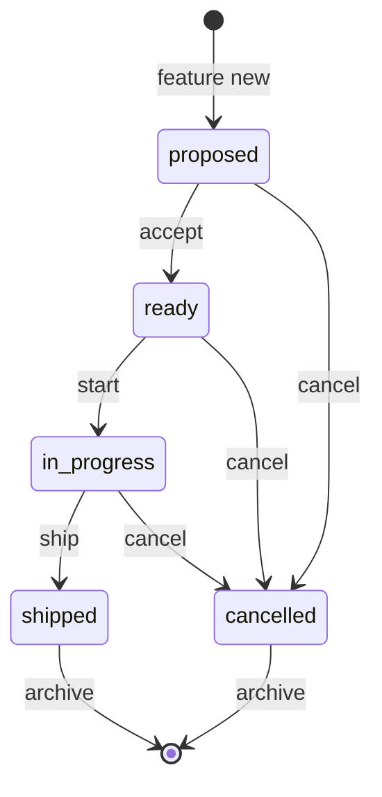
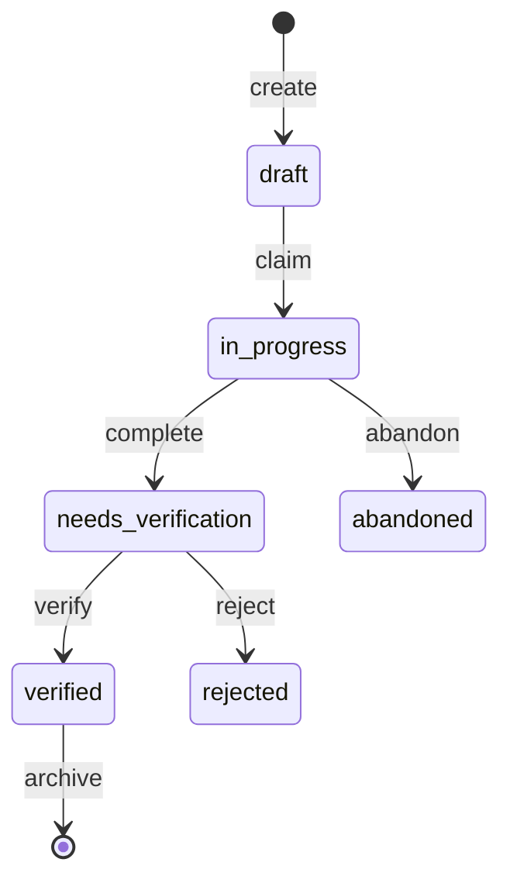

# maestro

Local-first harness for agent-built codebases. Humans steer, agents execute, maestro is the substrate.

[](https://github.com/ReinaMacCredy/maestro/actions/workflows/ci.yml)


maestro is a single Rust binary that gives a coding agent a durable place to work. Every
unit of work, what is being built, who is doing it, and the proof it was done, lives as
plain files under `.maestro/` in your repo. No daemon, no hidden service state, no cloud.
The agent runs the lifecycle through the CLI; you review the artifacts.

## Why

Coding agents are fast but forgetful. They lose the thread across sessions, ship work that
was never verified, and leave no trail you can audit. maestro fixes that by making the work
itself durable and gated:

- A **feature** carries the product contract and walks a real lifecycle: `proposed -> ready -> in_progress -> shipped`.
- A **task** cannot be called done until its claim is backed by **proof** that you can read.
- **QA** (baseline plus slices) gates a ship, so "shipped" means covered, not just compiled.
- **Decisions** are recorded as files, so the why survives the agent's context window.

Everything is repo-local and reviewable in a diff.

## Lifecycle

Features and tasks each walk an explicit, gated state machine. The agent drives the
transitions through the CLI; the gates are enforced, not advisory.

A **feature** carries the product contract:


```mermaid
stateDiagram-v2
    [*] --> proposed: feature new
    proposed --> ready: accept
    ready --> in_progress: start
    in_progress --> shipped: ship
    proposed --> cancelled: cancel
    ready --> cancelled: cancel
    in_progress --> cancelled: cancel
    shipped --> [*]: archive
    cancelled --> [*]: archive
```

`accept` is gated on a frozen contract plus a behavior baseline. `ship` is gated on no live
child tasks plus QA coverage. `amend` grows a frozen contract additively with an audit reason.

A **task** is a unit of work, gated by proof:


```mermaid
stateDiagram-v2
    [*] --> draft: create
    draft --> in_progress: claim
    in_progress --> needs_verification: complete
    needs_verification --> verified: verify
    in_progress --> abandoned: abandon
    needs_verification --> rejected: reject
    verified --> [*]: archive
```

`claim` fast-tracks the internal accept steps when the feature contract or task checks are
present (a standalone task needs at least one `--check` first). `verify` is the evidence gate:
it passes only when the claim is backed by recorded proof.

## Install

From source (always works):

```
git clone https://github.com/ReinaMacCredy/maestro
cd maestro
cargo install --path . --locked
```

With Cargo, directly from git:

```
cargo install --git https://github.com/ReinaMacCredy/maestro --locked
```

Release binary (macOS and Linux, arm64 and amd64):

```
curl -fsSL https://raw.githubusercontent.com/ReinaMacCredy/maestro/main/scripts/install.sh | bash
```

The installer drops the binary in `~/.local/bin` (override with `MAESTRO_INSTALL_DIR`).
Verify with `maestro version` and `maestro doctor`.

## Let your agent set it up

maestro is meant to be driven by your coding agent. The installer wires agent skills and hooks
into your repo — including a `maestro-setup` skill that tunes the harness to your build/test
commands and conventions — so the agent learns the lifecycle and records its own work. Point
your agent (Claude Code, Codex, or any CLI agent) at the repo and paste:

```
Set up maestro in this repo: run `maestro init --yes`, then `maestro install --agent claude`
(or `--agent codex`). Then follow the maestro-setup skill it installs to tune the harness to
this repo, and drive the feature and task lifecycle through the `maestro` CLI from there.
```

## Quickstart

Scaffold the repo and install the agent integration:

```
maestro init --yes                 # create .maestro/ and extract bundled skills/hooks
maestro install --agent claude     # wire skills + hooks into CLAUDE.md/AGENTS.md (or --agent codex)
maestro doctor                     # check the installation
```

Run one unit of work through the lifecycle:

```
maestro feature new "CSV export"                         # -> proposed
maestro feature set csv-export --acceptance "Export a report to CSV" --area "src/export"
maestro feature accept csv-export                        # freeze the contract -> ready (gated)
maestro feature start csv-export                         # -> in_progress

maestro task create "Implement CSV writer" --feature csv-export
maestro task claim task-001
maestro task complete task-001 --summary "wrote csv writer" --claim "cargo test export passes"
maestro task verify task-001                             # checks the claim against recorded proof

maestro feature ship csv-export --outcome "Shipped streaming CSV export"   # gated on QA coverage
```

`maestro feature show <id>` and `maestro task show <id>` render the current state and the
recorded reasoning at any point.

## Highlights

### Feature lifecycle

A feature is the product contract. `proposed` is the design state where the contract is
editable; `accept` freezes it into `ready` (and requires a behavior baseline); `start` moves
it to `in_progress`; `ship` requires no live child tasks plus QA coverage. Each feature owns
a directory under `.maestro/features/<id>/` with its contract, baseline, QA slices, amend log,
and a free-form `notes.md` running design log.

### Tasks gated by proof

Tasks move `draft -> in_progress -> needs_verification -> verified`. `verify` reads the proof
recorded for the task and checks it against the claim; a task with no checks cannot be claimed.
The result is that "done" is always backed by evidence you can open.

### QA: baseline and slices

A feature ships only when its behavior baseline is fresh and its QA slices cover the scenarios.
Coverage is checked, not asserted, so a green ship is a real signal.

### Decisions

`maestro decision new "<the fork>"` records an architectural decision as a file under
`.maestro/decisions/`, so the reasoning outlives any single agent session.

### Skills and hooks

`maestro install` extracts agent skills (design, feature, task, verify, QA) into
`.maestro/skills/` and wires hook scripts so the agent's actions are recorded as run events.
`maestro sync` refreshes those bundled resources to the running binary, preserving your edits.

## Command reference

| Command | What it does |
| --- | --- |
| `init` | Scaffold `.maestro/` and extract bundled resources |
| `install` / `uninstall` | Wire or remove agent hooks and config (`--agent claude\|codex`) |
| `sync` | Resync bundled resources to this binary, offline, preserving edits |
| `update` | Upgrade the binary and refresh resources |
| `doctor` | Diagnose the installation |
| `feature` | Manage the product contract and its lifecycle |
| `task` | Create, claim, complete, verify, and query tasks |
| `verify` | Verify a task against its recorded proof |
| `decision` | Create and list decision records |
| `version` | Print the version and binary path |

Run `maestro <command> --help` for the full surface.

## Migrating from the TypeScript maestro

Earlier maestro was a TypeScript build. The Rust rewrite is a different, leaner, repo-local
product, so moving an existing repo over is a best-effort, agent-driven step (the binary does
no data conversion itself). [MIGRATE.md](./MIGRATE.md) is written as an instruction for a
coding agent.

Install the Rust binary, then paste this into a fresh agent session (Claude Code, Codex, or
any CLI agent):

```
Migrate my maestro data from the TypeScript build to the Rust build by fetching and following
https://raw.githubusercontent.com/ReinaMacCredy/maestro/main/MIGRATE.md: back up the old data
first, map it into the new `.maestro/` model, and write me the mapping report. Never delete
the original data.
```

## Project layout

```
src/         Rust crate: domain, operations, interfaces, foundation
tests/       contract, adapter, runtime-flow, and safety tests
embedded/    shipped harness, hook, shell, and skill resources
.maestro/    repo-local artifacts for this checkout
```

## Documentation

- [AGENTS.md](./AGENTS.md): agent notes, code map, and conventions
- [TESTING.md](./TESTING.md): the smallest falsifying checks by touched surface
- [MAINTENANCE.md](./MAINTENANCE.md): refactor discipline, drift rules, handoff standard
