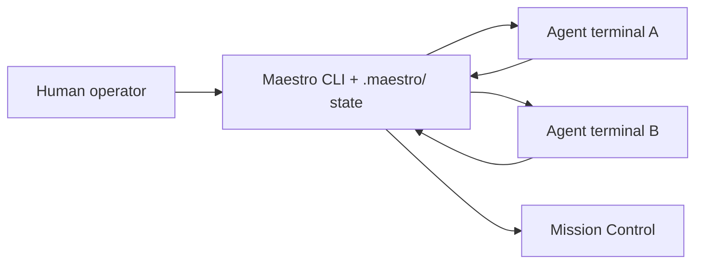
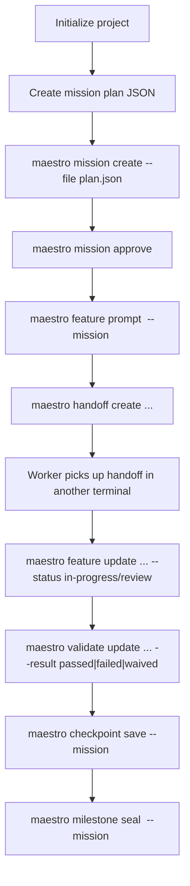
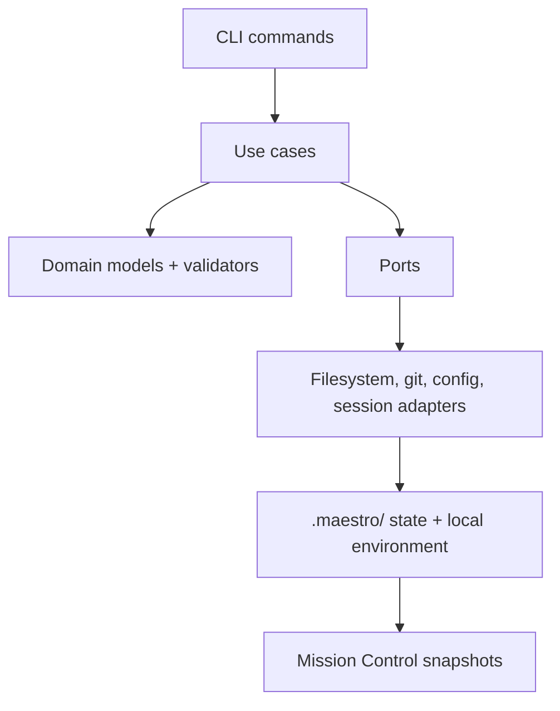

# maestro

Maestro is a local-first conductor for multi-agent software engineering. It gives you one CLI and one on-disk state model for missions, features, assertions, handoffs, checkpoints, memory, and project context so separate agent sessions can collaborate without a server, database, or background daemon.

It is designed for a workflow where a human operator coordinates multiple terminals, while Maestro keeps the shared state disciplined and inspectable.

## Why Maestro

- Shared state lives on disk in `.maestro/`, not in chat history.
- Missions break work into milestones, features, and validation assertions.
- UKI v5.2 handoffs let one agent session pass compact context to another.
- Memory commands turn corrections and learnings into reusable guidance.
- Mission Control gives you a read-only TUI and JSON snapshots of current state.
- The runtime stays local-first: filesystem, git, config, and terminal tools.

## At A Glance


```mermaid
flowchart LR
  human["Human operator"]
  maestro["Maestro CLI + .maestro/ state"]
  workerA["Agent terminal A"]
  workerB["Agent terminal B"]
  tui["Mission Control"]

  human --> maestro
  maestro --> workerA
  maestro --> workerB
  workerA --> maestro
  workerB --> maestro
  maestro --> tui
```

Maestro is the shared state layer in the middle. The human moves between terminals; agents read and write through the same local CLI surface.

## What Maestro Is Not

- It does not spawn or supervise LLM agents for you.
- It is not a hosted orchestration service.
- It is not tied to a single model vendor or harness.
- It does not require a database, queue, or network API to work.

The human operator is the bridge between terminals. Maestro is the shared state layer underneath that workflow.

## Core Concepts

| Concept | Purpose |
|---|---|
| Mission | The top-level unit of work with a lifecycle such as `draft`, `approved`, or `executing`. |
| Milestone | A phase within a mission. Milestones can act as work phases or validation gates. |
| Feature | A concrete piece of work assigned to a worker type, with verification steps and optional dependencies. |
| Assertion | A validation target tied to a feature. Assertions are updated to `passed`, `failed`, `blocked`, or `waived`. |
| Handoff | A UKI v5.2 payload used to pass compact context between agent sessions. |
| Memory | Corrections, learnings, and compiled guidance that feed back into future worker prompts. |
| Checkpoint | A timestamped mission snapshot you can save and later restore. |
| Mission Control | A read-only dashboard for previewing mission state interactively or as JSON. |

## How Work Flows


```mermaid
flowchart TD
  init["Initialize project"] --> plan["Create mission plan JSON"]
  plan --> mission["maestro mission create --file plan.json"]
  mission --> approve["maestro mission approve <mission-id>"]
  approve --> prompt["maestro feature prompt <feature-id> --mission <mission-id>"]
  prompt --> handoff["maestro handoff create ..."]
  handoff --> worker["Worker picks up handoff in another terminal"]
  worker --> progress["maestro feature update ... --status in-progress/review"]
  progress --> validate["maestro validate update ... --result passed|failed|waived"]
  validate --> checkpoint["maestro checkpoint save --mission <mission-id>"]
  checkpoint --> seal["maestro milestone seal <milestone-id> --mission <mission-id>"]
```

The loop is deliberately simple: define work, hand it off, update progress, validate the outcome, and checkpoint before sealing the milestone.

## Installation

### Requirements

- [Bun](https://bun.sh/)
- Git
- A local agent harness in another terminal, such as Claude Code, Codex, Gemini CLI, or Droid CLI

### Build From Source

```bash
bun install
bun run build
```

This produces the compiled binary at `./dist/maestro`.

### Install Locally

```bash
./dist/maestro install
```

Or rebuild and refresh the installed binary in one step:

```bash
bun run release:local
```

`./dist/maestro` is the fresh repo build. `maestro` on your `PATH` is the installed local binary.

## Quick Start

### 1. Initialize a project

```bash
maestro init
```

This creates the local `.maestro/` workspace for the current repository.

### 2. Create a mission plan file

`mission create` expects a JSON plan file. A minimal example:

```json
{
  "title": "Add authentication",
  "description": "Ship the first authentication slice",
  "milestones": [
    {
      "id": "plan",
      "title": "Planning",
      "description": "Define the implementation approach",
      "order": 0,
      "kind": "work",
      "profile": "planning"
    },
    {
      "id": "implement",
      "title": "Implementation",
      "description": "Build and verify the feature",
      "order": 1,
      "kind": "work",
      "profile": "implementation"
    }
  ],
  "features": [
    {
      "id": "auth-plan",
      "milestoneId": "plan",
      "title": "Plan the auth flow",
      "description": "Define the login shape, risks, and acceptance criteria",
      "workerType": "codex",
      "verificationSteps": [
        "Review the proposed flow with the team"
      ]
    },
    {
      "id": "auth-impl",
      "milestoneId": "implement",
      "title": "Implement the auth flow",
      "description": "Build the first working authentication slice",
      "workerType": "codex",
      "dependsOn": [
        "auth-plan"
      ],
      "verificationSteps": [
        "Run build",
        "Run targeted tests",
        "Verify the login flow manually"
      ],
      "fulfills": [
        "auth-login-works"
      ]
    }
  ]
}
```

### 3. Create and approve the mission

```bash
maestro mission create --file plan.json
maestro mission list
maestro mission approve <mission-id>
```

### 4. Generate a worker prompt

```bash
maestro feature list --mission <mission-id>
maestro feature prompt <feature-id> --mission <mission-id> --out worker-prompt.md
```

This writes the prompt to `worker-prompt.md` and also stores it under `.maestro/missions/<mission-id>/workers/<feature-id>/prompt.md`.

### 5. Create and pick up a handoff

Create a UKI handoff from structured slots:

```bash
maestro handoff create \
  --session-core "Implement the auth flow feature" \
  --summary "Planning is complete; implementation is ready" \
  --next-action "Pick up feature auth-impl" \
  --artifact file_src/auth.ts \
  --confidence-work 0.9
```

In another terminal, the worker can inspect or claim it:

```bash
maestro handoff list
maestro handoff pickup --markdown
maestro handoff pickup --claim --agent codex
```

### 6. Track progress, validate, and seal

```bash
maestro feature update auth-impl --mission <mission-id> --status in-progress
maestro feature update auth-impl --mission <mission-id> --status review
maestro validate show --mission <mission-id>
maestro validate update auth-login-works --mission <mission-id> --result passed --evidence "bun test"
maestro checkpoint save --mission <mission-id>
maestro milestone seal implement --mission <mission-id>
```

## Common Commands

| Command | Use it when you want to... |
|---|---|
| `maestro init` | Create local project state. |
| `maestro install` | Initialize global config and inject supported agent instruction blocks. |
| `maestro doctor` | Check whether the local environment is configured correctly. |
| `maestro status` | Inspect the current Maestro state quickly. |
| `maestro mission create --file plan.json` | Create a mission from a plan file. |
| `maestro feature prompt <feature-id> --mission <mission-id>` | Generate the next worker prompt. |
| `maestro handoff create ...` | Package context for another terminal or agent session. |
| `maestro handoff pickup --markdown` | Read the next pending handoff in a human-friendly format. |
| `maestro mission-control --preview` | Render a read-only dashboard preview in the terminal. |
| `maestro mission-control --json` | Get a machine-readable snapshot of mission state. |
| `maestro mission-control --render-check --size 120x40` | Validate TUI render integrity non-interactively. |
| `maestro memory-correct <rule>` | Capture a correction that should influence future runs. |
| `maestro memory-compile` | Turn raw learnings into reusable guidance. |
| `maestro ratchet-check` | Run the regression ratchet suite. |

Run `maestro <command> --help` for full flags and examples.

## Mission Control

Mission Control is a read-only dashboard over Maestro state. It supports:

- Interactive TTY mode with `maestro mission-control`
- Single-frame previews with `maestro mission-control --preview`
- Machine-readable snapshots with `maestro mission-control --json`
- Render validation with `maestro mission-control --render-check --size 120x40`

Available preview screens include:

- `dashboard`
- `features`
- `dependencies`
- `handoffs`
- `config`
- `memory`
- `graph`

For non-interactive environments, prefer `--preview`, `--preview all`, or `--json`.

## Architecture


```mermaid
flowchart TD
  cli["CLI commands"] --> usecases["Use cases"]
  usecases --> domain["Domain models + validators"]
  usecases --> ports["Ports"]
  ports --> adapters["Filesystem, git, config, session adapters"]
  adapters --> state[".maestro/ state + local environment"]
  state --> tui["Mission Control snapshots"]
```

The codebase follows a hexagonal shape: commands call use cases, use cases depend on domain rules and ports, and adapters implement those ports against the local filesystem and environment.

## Storage Model

Maestro stores project-local state in `.maestro/` and user-level defaults in `~/.maestro/`.

```text
.maestro/
├── config.yaml
├── handoffs/
├── memory/
│   ├── corrections/
│   ├── learnings/
│   └── ratchet/
├── missions/
│   └── <mission-id>/
│       ├── mission.json
│       ├── assertions.json
│       ├── checkpoints/
│       ├── features/
│       └── workers/
└── notes.json

~/.maestro/
├── config.yaml
└── graph/
    └── projects.json
```

The design is intentionally transparent: state is inspectable, diffable, and easy to back up.

## Architecture

Maestro follows a hexagonal structure:

- `src/index.ts` wires the CLI entrypoint.
- `src/commands/` defines the command surface.
- `src/usecases/` contains application logic.
- `src/domain/` defines the core entities and validators.
- `src/ports/` defines interfaces for persistence and external interactions.
- `src/adapters/` implements those ports using the filesystem, git, and environment state.
- `src/tui/` renders Mission Control from read-only snapshots.

The runtime is intentionally narrow: filesystem-backed stores, git integration, config handling, and a terminal UI. There is no database adapter or network service in the main workflow.

## Development

```bash
bun run build
bun run typecheck
bun test
bun run tui:dev
bun run release:local
```

Useful verification commands for CLI and TUI work:

```bash
./dist/maestro --version
./dist/maestro --help
./dist/maestro mission-control --preview --size 120x40 --format plain
./dist/maestro mission-control --render-check --size 120x40
```

## Supported Agent Config Injection

`maestro install` and `maestro update` can inject instruction blocks for:

- Claude Code
- Codex
- Gemini CLI
- Droid CLI

These instruction blocks help each harness read and write shared Maestro state consistently.

## License

MIT
