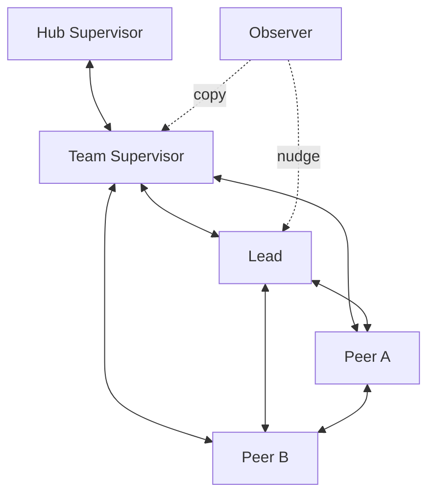

# maestro

Maestro is a local-first coordination system for human and agent work. It keeps
durable work, decisions, sessions, evidence, dispatches, and handbacks in each
repository's shared Git root. It is written in TypeScript, runs on Bun, and does
not require a background service.

Documentation: [maestro.maccredyreina.me](https://maestro.maccredyreina.me/)

Version 0.108.0 is the first TypeScript release. It continues the version line
after 0.107.x, the final Rust release.

## Three layers

- **Mechanism kernel** owns the SQLite store, event log, sessions, CLI dispatch,
  plugin loading, and readiness projection. It does not impose workflow policy.
- **Plugins** provide verbs and optional policy gates. Repositories enable or
  disable policies such as proof and breakdown in `.maestro/config`.
- **Recipes and skills** provide prompt-first working methods as Markdown. Use
  `maestro recipe list` to browse recipes and `maestro recipe show <name>` to
  read one without copying it into a repository.

## Install, update, and remove

Maestro is distributed from source. Install with one command (needs `git`
and [Bun](https://bun.sh)):

```sh
curl -fsSL https://raw.githubusercontent.com/ReinaMacCredy/maestro/main/scripts/install.sh | sh
```

The script clones the repository into `~/.maestro/source` (override with
`MAESTRO_SOURCE_DIR`; `MAESTRO_REF` picks the branch, default `main`) and runs
the installer from that checkout, which `maestro update` then follows. From
your own checkout, run the installer directly:

```sh
bun bin/maestro.ts install
maestro version
```

Install copies the runtime to `~/.maestro/runtime`, writes the shim at
`~/.local/bin/maestro`, records the source checkout in
`~/.maestro/source.json`, and wires the current repository. When replacing an
older executable, it preserves that executable as `maestro-legacy` if no
rollback executable already exists.

Install also scaffolds `~/maestro`, the Supervisor room, and registers the
current repository there. It materializes four managed skills under
`~/maestro/skills`: `maestro-bundle`, `maestro-design`, `maestro-work`, and
`maestro-verify`. The installer links those skills for Claude without
overwriting unmanaged skills.

Use `maestro update` to fetch the recorded source checkout, accept only a
fast-forward, and resync the runtime. It refuses dirty, diverged, missing, or
unreachable sources without partially updating the runtime. Use
`maestro install` from the source checkout for an offline resync.

Use `maestro uninstall` to remove Maestro-managed hooks, settings keys, and
mirror blocks from the current repository. It is idempotent and does not delete
repository data, the machine runtime, the shim, or the Supervisor room.

`maestro doctor` inspects the shim, runtime stamp, recorded source, repository
wiring, permissions, and store access without repairing them. A healthy report
exits zero; a reported problem names the next command when the repair is
mechanical.

## SLP supervised teams

SLP v2 uses one direct Herdr workspace per running team generation:


```mermaid
flowchart TB
  Hub["Hub Supervisor"] <--> Team["Team Supervisor"]
  Team <--> Lead
  Team <--> PeerA["Peer A"]
  Team <--> PeerB["Peer B"]
  Lead <--> PeerA
  Lead <--> PeerB
  PeerA <--> PeerB
  Observer["Observer"] -. nudge .-> Lead
  Observer -. copy .-> Team
```

In the supported SLP flow, the Hub Supervisor reaches the team only through
its Team Supervisor. Inside the team, the Team Supervisor, Lead, and Peers
communicate directly. The Observer is a fourth seat with no work: a sentinel
tab in the team workspace hands it one packet every five minutes, and at once
when a role pane blocks, and its only mutation is `work note --stall`, which
Maestro turns into one fixed nudge to the stuck seat plus a copy to the Team
Supervisor. There is no Advisor, scheduler, or background agent role.

SLP is a cooperative-agent protocol, not a shell security sandbox. Maestro
checks the nine SLP operations at their supported boundaries: Hub operations
must run from the Hub room, while project role operations require the current
generation's stored Herdr pane binding. It does not block native commands,
administrative Maestro commands, or direct Herdr calls; topology and
external-effect limits remain obligations enforced by the Human and host
policy.

The canonical Workspace Pack lives at `~/maestro/SLP.md`. Starting a team
copies its exact bytes to `<project>/.maestro/SLP.md`, pins its version and
digest for that generation, creates exactly one Team Supervisor and one Lead,
and creates initial `OPEN` work for the Lead. Peers are opened lazily by
assigned work. Install seeds the Hub pack only when it is absent; later installs
and updates preserve owner edits.

SLP roles use exactly nine operations:

```text
maestro team start
maestro team stop
maestro status [work-id]
maestro work add
maestro work take
maestro work note
maestro work return
maestro work accept
maestro decide
```

Work moves only through `OPEN -> ACTIVE -> RETURNED -> DONE`. Lead accepts
Peer returns; Team Supervisor accepts Lead returns. Settled choices use one
immutable `maestro decide` record and explicit replacement.

The Team Supervisor may open one optional foreground Watch Pane with existing
Herdr pane control. Watch labels currently available raw output, but is not an
agent and has no prompt, store write, gate, intervention, or decision
authority. Its rolling transcript is runtime-only and is deleted at stop.
A seat that needs a fact from above records `work note --blocked`; Maestro
pushes the `BLOCKED` line one seat up without changing the work state.

Normal stop uses one transient foreground non-agent helper pane in the Hub so
the Team Supervisor can close itself safely. This is internal, not another SLP
operation: `STOPPED` is recorded only after the team workspace is absent, and
a partial close remains `RUNNING` for retry.

Read the compact operating guide with `maestro recipe show slp` and the full
setup at [SLP setup and storage](https://maestro.maccredyreina.me/getting-started/slp-setup/).

## Work, decisions, and evidence

- `maestro status` shows session identity, held work, and live peers;
  `maestro ready` shows work that can start and the gates blocking other work.
- `maestro work` manages work trees, dependencies, leases, notes, cancellation,
  claims, and proof.
- Method depth is **quickfix** for a one-sentence diff with inline verification
  and no record, **Light** for one session and branch tracked with a work item,
  and **Full** for multi-session, shared-scope, high-risk, or repeated work
  tracked with a SPEC/NOTES/VERIFY bundle.
- `maestro decision` records draft, locked, and superseded choices with their
  rationale and work links. Supersession takes effect when the replacement is
  locked, not while it is still a draft.
- Cross-role decisions are drafted in the store before a Herdr prompt names the
  sender role and decision id. The answer is the locked or superseding record;
  non-decision questions and answers are work notes.
- `maestro dispatch` stores lane contracts and council state;
  `maestro handback` stores shape-checked return packets, including explicit
  dependency, council, challenge, reopen, unknown, and failure outcomes.
- `maestro search` searches native work, decisions, notes, terms, memory facts,
  events, bundles, and imported Rust records, in this store and in the Hub room
  at `~/maestro`; `--local` stays in this store.
- `maestro term` keeps the glossary in the store so a term answers the same
  search as the work and decisions that use it.
- `maestro memory` runs in the Hub room: `ingest` promotes facts from the Claude
  auto-memory and Codex ad-hoc buffers through supersession, dedup and evidence
  gates, `retract` retires one for good, and `render` writes the injected global
  index from the store and refuses to overwrite a hand edit.

Proof is layered as `source`, `artifact`, `installed`, `live`, and `journey`.
Claims stop at the last proven layer and name untested links rather than
rounding them up to completion. Repeated failures route by holder: Peer-held
work reaches the Lead through the repository brief; Lead-held work reaches the
Supervisor through the room brief.

Failed commands emit a JSON error envelope on stderr and exit nonzero. Empty or
whitespace-only required arguments are rejected rather than interpreted as
missing identities or targets.

## Verb tour

- `maestro status` shows sessions and leases; `maestro ready` shows startable
  and gated work.
- `maestro work add|start|note|done|show|list` manages the work lifecycle.
- `maestro decision draft|lock|show|list` manages durable choices.
- `maestro dispatch open|accept|show|list` stores lane contracts, while
  `maestro handback file|show` stores and reads return packets.
- `maestro attention` scans the current repository and `maestro brief`
  summarizes every registered repository.
- `maestro term add|list|show` keeps the glossary; `maestro memory
  ingest|list|show|retract|render` runs the Hub memory.
- `maestro recipe list|show` serves methods; `maestro plugin list|enable|disable`
  manages the configured extension set.
- `maestro import rust` imports preserved Rust data; `maestro legacy show`
  reads imported cards and files.
- `maestro install`, `maestro update`, `maestro uninstall`, and
  `maestro doctor` manage and diagnose the source-installed runtime.
- `maestro version` reports the package version and installed commit.

## Attention and brief

`maestro attention` computes current attention packets at read time. It detects
stalled leases, repeated failures, stale decisions, scope collisions,
unreturned dispatches, and returned handbacks that have not been reviewed. It
records no mailbox message and runs no daemon.

`maestro brief` reads the registry in `~/maestro/registry`, opens each project
in observer mode, and reports only what needs attention. Missing repositories
are named and skipped. When every registered project is running normally, the
brief says so in one line. The `hm` shell function focuses the Supervisor room
and prints this brief; it does not start an agent.

## Observer mode

This is the read-only store mode for administrative inspection. It is not the
SLP Observer seat and does not create a background observer.

Set `MAESTRO_READ_ONLY=1` to run Maestro as an observer. Pure commands such as
status, search, recipes, and read-only list/show operations remain available.
Mutating commands fail with `READ_ONLY`; external plugins are not loaded; and
session, lease, and liveness state is not persisted. Search fails closed if its
index cannot be refreshed rather than returning stale results as current.

## Harness integration

`maestro install` writes managed adapters for Claude and Codex and merges only
the managed hook entries. `SessionStart` and `UserPromptSubmit` record the
session and print its current brief. Small managed blocks in `CLAUDE.md` and
`AGENTS.md` point agents to status, ready work, and recipes. No hook sends
mail, pushes a dispatch into another session, or delivers PostToolUse packets.

## Recipes, skills, and plugins

`maestro recipe list` and `maestro recipe show <name>` serve the shipped
Markdown methods. The four installed skills drive bundle, design, work, and
verification lifecycles. `maestro plugin` lists and manages built-in, global,
and repository plugins; policy plugins remain removable instead of being
baked into the kernel.

Use `maestro help` for the complete verb list and `maestro <verb> --help` for
the current syntax and flags.

## Rust-era data

The last Rust stores are preserved under `legacy/rust/`. Import the card store
read-only with:

```sh
maestro import rust --path legacy/rust/store.sqlite
```

Add `--promote` to create native work, decisions, and provenance notes:

```sh
maestro import rust --path legacy/rust/store.sqlite --promote
```

Promotion preserves card kinds, terminal outcomes, decision links,
supersession chronology, and receipt provenance. Orphan receipts are skipped
and counted. The `legacy_map` table makes repeated promotion idempotent.

Archived Rust snapshots can also be imported for search:

```sh
maestro import rust --path legacy/rust/archive-cards.sqlite
```

Bun decodes zstd snapshot payloads when possible and falls back to stored
search text when it cannot. Imported records remain available through
`maestro search` and `maestro legacy show <id>`. See
[`legacy/rust/README.md`](legacy/rust/README.md) for the preserved datasets and
their exact counts.

## Contributing, security, and license

Contributions follow the toolchain, layout, and pre-pull-request checks in
[`CONTRIBUTING.md`](CONTRIBUTING.md). Report a suspected vulnerability through
the private channel in [`SECURITY.md`](SECURITY.md), never a public issue.
Maestro is released under the MIT license; see [`LICENSE`](LICENSE).
