# Maestro

[](https://opensource.org/licenses/MIT)

This plugin is my **personal source of truth** for structured AI-assisted development.
It contains the exact skills, workflows, and patterns I use across *every* project — continuously updated as I discover better ways to work.

Think of this as the **official, up-to-date playbook** for context-driven development:
how I plan features, how I track work across sessions, how I debug systematically, and how the whole system stays reliable.

If you're exploring structured AI coding workflows, this plugin shows the stack that actually works:
a combination of persistent memory (Beads), structured planning (Conductor), TDD methodology, and systematic debugging.
These workflows are not theoretical — they're refined daily through real builds.

Everything here evolves as I refine my process.
If a skill is in this plugin, it's because I actively use it.

## Install

### Claude Code

**Plugin install (recommended):**
```
/plugin install https://github.com/ReinaMacCredy/maestro
```

**Or via agent prompt:**
```
Follow https://raw.githubusercontent.com/ReinaMacCredy/maestro/main/SETUP_GUIDE.md to set up maestro for this project.
```

### OpenAI Codex

```
$skill-installer ReinaMacCredy/maestro
```

Or install a specific skill:
```
$skill-installer conductor from ReinaMacCredy/maestro
```

### Amp / Cursor / Other Agent Skills-compatible tools

Tell your AI agent:
```
Follow https://raw.githubusercontent.com/ReinaMacCredy/maestro/main/SETUP_GUIDE.md to set up maestro for this project.
```

### Manual Setup

See [SETUP_GUIDE.md](./SETUP_GUIDE.md) for detailed instructions.

---

## Table of Contents

- [Quick Start for Agents](#quick-start-for-agents)
- [The Skills](#the-skills)
- [Skill Reference](#skill-reference)
  - [Conductor (Planning)](#conductor-planning)
  - [Beads (Issue Tracking)](#beads-issue-tracking)
  - [TDD (Execution)](#tdd-execution)
  - [Debugging](#debugging)
  - [Code Review](#code-review)
- [Workflow Pipeline](#workflow-pipeline)
- [Slash Commands](#slash-commands)
- [Documentation](#documentation)
- [Troubleshooting](#troubleshooting)

---

## Quick Start for Agents

### The Complete Workflow

```
/conductor-setup                   # 1. Initialize project (once)
/conductor-design "feature"        # 2. Design through dialogue → design.md
/conductor-newtrack                # 3. Create spec.md + plan.md
fb                                 # 4. File beads from plan
rb                                 # 5. Review beads
/conductor-implement               # 6. Execute with TDD + beads tracking
```

### Quick Start (Existing Project)

```bash
# Start
bd ready --json                    # What's available?
/conductor-implement               # Execute next task (auto-claims from beads)

# Work (with TDD)
tdd                                # Enter TDD mode
# RED → GREEN → REFACTOR

# Session ends automatically tracked via beads
```

### When Stuck

```
debug                              # Systematic debugging
trace                              # Root cause tracing
/conductor-design                  # Design alternatives
```

### Rules

- **Always** use `--robot-*` flags with `bv` (bare `bv` launches TUI and will hang)
- **Always** use `--json` flags with `bd` for structured output
- **Never** write production code without a failing test first (TDD)
- **Always** commit `.beads/` with your code changes

---

## The Skills

| Category | Skills |
|----------|--------|
| **Core Workflow** | conductor, design (Double Diamond + Party Mode), beads, file-beads (parallel), review-beads (parallel) |
| **Development** | test-driven-development, using-git-worktrees, finishing-a-development-branch |
| **Utilities** | codemaps, doc-sync, dispatching-parallel-agents, subagent-driven-development |
| **Meta** | using-superpowers, verification-before-completion, writing-skills, sharing-skills |
| **Debugging** *(external: superpowers plugin)* | systematic-debugging, root-cause-tracing, condition-based-waiting, defense-in-depth |
| **Code Review** *(external: superpowers plugin)* | requesting-code-review, receiving-code-review |

---

## Skill Reference

### Conductor (Planning & Design)

**What it does**: Structured design and planning flow that turns ideas into `design.md`, `spec.md` and `plan.md`.

**Design Sessions (Double Diamond)**: `/conductor-design` (or `ds` trigger) runs a Double Diamond design session with four phases: DISCOVER → DEFINE → DEVELOP → DELIVER. Each phase ends with A/P/C checkpoints:
- **[A] Advanced**: Deeper analysis, assumption audit
- **[P] Party**: Multi-agent collaborative review (see `workflows/party-mode/`)
- **[C] Continue**: Proceed to next phase

```mermaid
flowchart TB
    subgraph PIPELINE["WORKFLOW PIPELINE"]
        direction TB
        
        subgraph SETUP["SETUP"]
            TRIGGER["ds / /conductor-design"]
            CHECK["Verify conductor/<br/>(product.md, tech-stack.md, workflow.md)"]
        end
        
        subgraph DIAMOND1["DIAMOND 1: UNDERSTAND PROBLEM"]
            DISCOVER["DISCOVER (Diverge)<br/>• Explore problem space<br/>• 5 Whys, edge cases<br/>• Mini-ground: codebase check"]
            APC1{"A/P/C"}
            DEFINE["DEFINE (Converge)<br/>• Problem statement<br/>• Success criteria<br/>• YAGNI filtering"]
            APC2{"A/P/C"}
        end
        
        subgraph DIAMOND2["DIAMOND 2: DESIGN SOLUTION"]
            DEVELOP["DEVELOP (Diverge)<br/>• 3+ approaches<br/>• Trade-off analysis<br/>• Wild/10x option"]
            APC3{"A/P/C"}
            DELIVER["DELIVER (Converge)<br/>• Architecture, Components<br/>• Data Model, User Flow<br/>• FULL GROUNDING required"]
            APC4{"A/P/C"}
        end
        
        subgraph HANDOFF["HANDOFF"]
            DESIGNMD["design.md saved to<br/>conductor/tracks/{id}/"]
            NEXT["Next: /conductor-newtrack {track_id}<br/>(spec + plan + beads + review)"]
        end
    end
    
    subgraph AGENTS["PARTY MODE: 12 AGENTS (BMAD v6)"]
        subgraph PRODUCT["Product Module"]
            PM["📋 John (PM)"]
            ANALYST["📊 Mary (Analyst)"]
            UX["🎨 Sally (UX)"]
        end
        
        subgraph TECHNICAL["Technical Module"]
            ARCH["🏗️ Winston (Architect)"]
            DEV["💻 Amelia (Developer)"]
            QA["🧪 Murat (QA)"]
            DOCS["📚 Paige (Docs)"]
        end
        
        subgraph CREATIVE["Creative Module"]
            STORY["📖 Sophia (Storyteller)"]
            BRAIN["🧠 Carson (Brainstorm)"]
            DESIGN["🎯 Maya (Design Thinking)"]
            STRAT["⚡ Victor (Strategist)"]
            SOLVER["🔬 Dr. Quinn (Solver)"]
        end
    end
    
    TRIGGER --> CHECK
    CHECK --> DISCOVER
    DISCOVER --> APC1
    APC1 -->|C| DEFINE
    APC1 -.->|Back| DISCOVER
    DEFINE --> APC2
    APC2 -->|C| DEVELOP
    APC2 -.->|Back| DISCOVER
    DEVELOP --> APC3
    APC3 -->|C| DELIVER
    APC3 -.->|Back| DEFINE
    DELIVER --> APC4
    APC4 -->|C| DESIGNMD
    APC4 -.->|Back| DEVELOP
    DESIGNMD --> NEXT
    
    APC1 & APC2 & APC3 & APC4 -.->|P| AGENTS
    AGENTS -.->|"Synthesize"| APC1 & APC2 & APC3 & APC4
```



**Triggers**:
```
/conductor-setup                   # Initialize project (once)
/conductor-design "description"    # Design through dialogue → design.md
/conductor-newtrack                # Create spec.md + plan.md from design
/conductor-implement               # Execute tasks using beads
/conductor-status                  # View progress
/conductor-revert                  # Git-aware revert of work
/conductor-revise                  # Update spec/plan mid-track
/conductor-refresh                 # Sync context docs with codebase
```

**Output structure**:
```
conductor/
├── product.md              # Product vision
├── tech-stack.md           # Technology choices
├── workflow.md             # Development standards
├── tracks.md               # Master track list
└── tracks/<track_id>/
    ├── design.md           # High-level design (from /conductor-design)
    ├── spec.md             # Requirements + acceptance
    └── plan.md             # Phased task list
```

**Key insight**: Spend tokens once on a good plan; reuse it many times.

### Beads (Issue Tracking)

**What it does**: Persistent issue tracking across sessions with dependency graphs.

**Commands** (requires `bd` CLI):
```bash
# Finding work
bd ready --json              # What's unblocked?
bd blocked --json            # What's waiting?
bd list --status in_progress # What's active?

# Working
bd update bd-123 --status in_progress   # Claim task
bd show bd-123                          # Read context
bd close bd-123 --reason "Done"         # Complete

# Dependencies
bd dep add bd-child bd-blocker --type blocks
bd dep tree bd-123
```

**Skill triggers**:
```
fb                          # File beads from plan (parallel subagents)
rb                          # Review filed beads (parallel + cross-epic validation)
bd status                   # Check project status
```

**Key insight**: Beads survive context compaction; chat history doesn't.

### TDD (Execution)

**What it does**: RED-GREEN-REFACTOR methodology for safe implementation.

**Trigger**: Say `tdd` to enter TDD mode.

**The cycle**:
```
RED     → Write one failing test (watch it fail)
GREEN   → Write minimal code to pass (watch it pass)
REFACTOR → Clean up (stay green)
REPEAT  → Next failing test
```

**Iron law**: No production code without a failing test first.

**Key insight**: If you didn't watch the test fail, you don't know if it tests the right thing.

### Debugging (external: superpowers plugin)

**Skills**:

| Trigger | Skill | Use When |
|---------|-------|----------|
| `trace` | root-cause-tracing | Need to find original trigger |
| `flaky` | condition-based-waiting | Race conditions, timing issues |

**Key insight**: Evidence before assertions. Show the error, show the fix working.

### Code Review (external: superpowers plugin)

| Trigger | Skill | Use When |
|---------|-------|----------|
| `review code` | requesting-code-review | Before merging, after major work |
| — | receiving-code-review | When handling feedback |

**Key insight**: Require technical rigor, not performative agreement.

---

## Workflow Pipeline

### Complete Workflow Architecture


For detailed pipeline documentation, see [docs/PIPELINE_ARCHITECTURE.md](./docs/PIPELINE_ARCHITECTURE.md).

### Session-Based Flow

```mermaid
flowchart LR
    subgraph SESSION1["SESSION 1 (Planning)"]
        direction TB
        setup["/conductor-setup"]
        design["ds → Double Diamond design"]
        ground["ground decisions"]
        newtrack["/conductor-newtrack<br/>(spec + plan + beads + review)"]
        handoff["outputs HANDOFF block"]
        
        setup --> design
        design --> ground
        ground --> newtrack
        newtrack --> handoff
    end
    
    subgraph SESSION2["SESSION 2 (Epic 1)"]
        direction TB
        paste["User pastes HANDOFF"]
        implement["/conductor-implement"]
        tdd["claims tasks → TDD → verify"]
        choice{"Epic complete"}
        rb2["rb → review beads"]
        handoff2["HANDOFF to next epic"]
        
        paste --> implement
        implement --> tdd
        tdd --> choice
        choice -->|"fewer mistakes"| rb2
        choice -->|"continue"| handoff2
    end
    
    subgraph SESSION3["SESSION 3 (Epic 2...)"]
        direction TB
        paste2["User pastes HANDOFF"]
        implement2["/conductor-implement"]
        tdd2["claims tasks → TDD → verify"]
        complete["track complete"]
        
        paste2 --> implement2
        implement2 --> tdd2
        tdd2 --> complete
    end
    
    handoff -.-> paste
    rb2 -.-> handoff2
    handoff2 -.-> paste2
```



### Epic Completion: Quality Gate

After completing each epic, `/conductor-implement` presents an explicit choice:

1. **`rb` (recommended)** — Review remaining beads to catch mistakes before they propagate. Uses more tokens but reduces errors.
2. **Handoff** — Continue directly to next epic with `Start epic <next-epic-id>`

This prevents auto-continuation and gives you control between epics.

### Manual Specialist Tools

Outside the automated flow:
- `debug` — Systematic debugging
- `trace` — Root cause tracing

---

## Slash Commands

| Command | Description |
|---------|-------------|
| `/conductor-setup` | Initialize Conductor for project |
| `/conductor-design [desc]` | Design through Double Diamond dialogue (A/P/C checkpoints, Party Mode) |
| `ds` | Start design session (alias for `/conductor-design`) |
| `/conductor-newtrack [id]` | Create spec + plan from design |
| `/conductor-implement [id]` | Execute ONE EPIC from track's plan |
| `/conductor-status` | View progress |
| `/conductor-revert` | Git-aware revert of work |
| `/conductor-revise` | Update spec/plan when implementation reveals issues |
| `/conductor-refresh` | Sync context docs with current codebase |
| `/doc-sync` | Sync AGENTS.md from completed threads |
| `/ground <pattern>` | Verify patterns against current truth |
| `/decompose-task <phase>` | Break phases into atomic beads |
| `/compact` | Checkpoint and compact session |
| `/review` | Request code review |

---

## Documentation

### Start Here

| If you want to... | Read |
|-------------------|------|
| Understand the philosophy and workflow | [TUTORIAL.md](./TUTORIAL.md) |
| Set up a new project | [SETUP_GUIDE.md](./SETUP_GUIDE.md) |
| Configure global agent (CLAUDE.md/AGENTS.md) | [docs/GLOBAL_CONFIG_TEMPLATE.md](./docs/GLOBAL_CONFIG_TEMPLATE.md) |
| Use commands manually without skills | [docs/manual-workflow-guide.md](./docs/manual-workflow-guide.md) |
| See all skills at a glance | [Skills table above](#the-skills) |

### Repository Structure

```
maestro/
├── README.md              # This file
├── SETUP_GUIDE.md         # Installation guide
├── TUTORIAL.md            # Complete workflow guide
├── AGENTS.md              # Agent instructions
├── skills/                # 16 skill directories
│   ├── conductor/         # Planning methodology
│   ├── design/            # Design sessions (ds trigger)
│   ├── beads/             # Issue tracking (+ file-beads, review-beads)
│   ├── test-driven-development/
│   └── ...                # See SETUP_GUIDE.md for full list
├── commands/              # 25+ slash commands
├── agents/                # Agent definitions
├── workflows/             # Workflow definitions
├── hooks/                 # Lifecycle hooks
├── lib/                   # Shared utilities
└── templates/             # Templates
```

---

## Troubleshooting

### Common Issues

| Issue | Fix |
|-------|-----|
| Skills not loading | Run `/plugin list` to verify installation |
| `bd: command not found` | Install via Agent Mail installer (see SETUP_GUIDE.md) |
| `bv` hangs | You forgot `--robot-*` flag. Kill and restart with flag |
| Agent ignores workflow | Use trigger phrase explicitly: `tdd`, `debug`, `/conductor-design` |
| Tests pass immediately | You wrote code first. Delete it. Start with failing test. |
| Context compacted, lost state | Run `bd show <issue-id>` — notes field has recovery context |
| Plan seems incomplete | Use `rb` (review-beads) to check and refine issues |

### Agent-Specific Rules

**Critical**: These tools have TUI modes that will hang AI agents:
- `bv` → Always use `bv --robot-*` flags
- `cass` → Always use `cass --robot` or `--json` flags

### Without CLI Tools

The plugin still provides value without `bd`:
- Skills work as mental models and methodologies
- Use `TodoWrite` for session-local task tracking
- Track issues manually in GitHub Issues or markdown
- Full TDD, debugging, and code review workflows still apply

**The skills are the methodology; the CLIs are the persistence layer.**

---

## Credits

Built on foundations from:
- [superpowers](https://github.com/obra/superpowers) by Jesse Vincent
- [conductor](https://github.com/NguyenSiTrung/conductor) by NguyenSiTrung
- [beads](https://github.com/steveyegge/beads) by Steve Yegge
- [beads-village](https://github.com/LNS2905/mcp-beads-village) by LNS2905
- [Knowledge & Vibes](https://github.com/kyleobrien91/knowledge-and-vibes) methodology

## License

MIT
