# Maestro

[](https://opensource.org/licenses/MIT)

This plugin is my **personal source of truth** for structured AI-assisted development.
It contains the exact skills, workflows, and patterns I use across *every* project — continuously updated as I discover better ways to work.

Think of this as the **official, up-to-date playbook** for context-driven development:
how I plan features, how I track work across sessions, how I debug systematically, and how the whole system stays reliable.

If you're exploring structured AI coding workflows, this plugin shows the stack that actually works:
a combination of persistent memory (Beads), structured planning (Conductor), TDD methodology, and systematic debugging.
These workflows are not theoretical — they're refined daily through real builds.

Everything here evolves as I refine my process.
If a skill is in this plugin, it's because I actively use it.

## Install

### Claude Code

**Plugin install (recommended):**
```
/plugin install https://github.com/ReinaMacCredy/maestro
```

**Or via agent prompt:**
```
Follow https://raw.githubusercontent.com/ReinaMacCredy/maestro/main/SETUP_GUIDE.md to set up maestro for this project.
```

### OpenAI Codex

```
$skill-installer ReinaMacCredy/maestro
```

Or install a specific skill:
```
$skill-installer brainstorming from ReinaMacCredy/maestro
```

### Amp / Cursor / Other Agent Skills-compatible tools

Tell your AI agent:
```
Follow https://raw.githubusercontent.com/ReinaMacCredy/maestro/main/SETUP_GUIDE.md to set up maestro for this project.
```

### Manual Setup

See [SETUP_GUIDE.md](./SETUP_GUIDE.md) for detailed instructions.

---

## Table of Contents

- [Quick Start for Agents](#quick-start-for-agents)
- [The Skills](#the-skills)
- [Skill Reference](#skill-reference)
  - [Conductor (Planning)](#conductor-planning)
  - [Beads (Issue Tracking)](#beads-issue-tracking)
  - [TDD (Execution)](#tdd-execution)
  - [Debugging](#debugging)
  - [Code Review](#code-review)
- [Workflow Pipeline](#workflow-pipeline)
- [Slash Commands](#slash-commands)
- [Documentation](#documentation)
- [Troubleshooting](#troubleshooting)

---

## Quick Start for Agents

### The Three Triggers You Need

```
/conductor-newtrack "feature"   # 1. Plan the work
fb                              # 2. File beads from plan
tdd                             # 3. Execute with TDD
```

### Session Workflow

```bash
# Start
bd ready --json                    # What's available?
bd update bd-123 --status in_progress  # Claim it
bd show bd-123                     # Read context

# Work (with TDD)
tdd                                # Enter TDD mode
# RED → GREEN → REFACTOR

# End
bd close bd-123 --reason "Completed"
git add -A && git commit && git push
```

### When Stuck

```
debug                              # Systematic debugging
trace                              # Root cause tracing
bs                                 # Brainstorm alternatives
```

### Rules

- **Always** use `--robot-*` flags with `bv` (bare `bv` launches TUI and will hang)
- **Always** use `--json` flags with `bd` for structured output
- **Never** write production code without a failing test first (TDD)
- **Always** commit `.beads/` with your code changes

---

## The Skills

| Category | Skills |
|----------|--------|
| **Core Workflow** | conductor, beads, file-beads, review-beads |
| **Planning** | brainstorming, writing-plans, executing-plans |
| **Development** | test-driven-development, using-git-worktrees, finishing-a-development-branch |
| **Debugging** | systematic-debugging, root-cause-tracing, condition-based-waiting, defense-in-depth |
| **Code Review** | requesting-code-review, receiving-code-review |
| **Meta** | using-superpowers, verification-before-completion, writing-skills, sharing-skills |

---

## Skill Reference

### Conductor (Planning)

**What it does**: Structured planning flow that turns fuzzy goals into `spec.md` and `plan.md`.

**Triggers**:
```
/conductor-setup                   # Initialize project (once)
/conductor-newtrack "description"  # Create feature track
/conductor-implement               # Execute track tasks
/conductor-status                  # View progress
```

**Output structure**:
```
conductor/
├── product.md              # Product vision
├── tech-stack.md           # Technology choices
├── workflow.md             # Development standards
├── tracks.md               # Master track list
└── tracks/<track_id>/
    ├── spec.md             # Requirements + acceptance
    └── plan.md             # Phased task list
```

**Key insight**: Spend tokens once on a good plan; reuse it many times.

### Beads (Issue Tracking)

**What it does**: Persistent issue tracking across sessions with dependency graphs.

**Commands** (requires `bd` CLI):
```bash
# Finding work
bd ready --json              # What's unblocked?
bd blocked --json            # What's waiting?
bd list --status in_progress # What's active?

# Working
bd update bd-123 --status in_progress   # Claim task
bd show bd-123                          # Read context
bd close bd-123 --reason "Done"         # Complete

# Dependencies
bd dep add bd-child bd-blocker --type blocks
bd dep tree bd-123
```

**Skill triggers**:
```
fb                          # File beads from plan
rb                          # Review filed beads
bd status                   # Check project status
```

**Key insight**: Beads survive context compaction; chat history doesn't.

### TDD (Execution)

**What it does**: RED-GREEN-REFACTOR methodology for safe implementation.

**Trigger**: Say `tdd` to enter TDD mode.

**The cycle**:
```
RED     → Write one failing test (watch it fail)
GREEN   → Write minimal code to pass (watch it pass)
REFACTOR → Clean up (stay green)
REPEAT  → Next failing test
```

**Iron law**: No production code without a failing test first.

**Key insight**: If you didn't watch the test fail, you don't know if it tests the right thing.

### Debugging

**Skills**:

| Trigger | Skill | Use When |
|---------|-------|----------|
| `debug` | systematic-debugging | Any bug or unexpected behavior |
| `trace` | root-cause-tracing | Need to find original trigger |
| `flaky` | condition-based-waiting | Race conditions, timing issues |

**Four-phase methodology** (systematic-debugging):
1. **Reproduce** — Confirm the problem exists
2. **Isolate** — Find minimal reproduction
3. **Identify** — Trace to root cause
4. **Fix** — Fix with TDD (failing test first)

**Key insight**: Evidence before assertions. Show the error, show the fix working.

### Code Review

| Trigger | Skill | Use When |
|---------|-------|----------|
| `review code` | requesting-code-review | Before merging, after major work |
| — | receiving-code-review | When handling feedback |

**Key insight**: Require technical rigor, not performative agreement.

---

## Workflow Pipeline

```mermaid
flowchart LR
    subgraph SESSION1["SESSION 1 (Planning)"]
        direction TB
        brainstorm["conductor/brainstorm"]
        design["creates design + spec + plan"]
        fb["fb → creates beads epic"]
        rb1["rb → review/refine issues"]
        handoff["outputs HANDOFF block"]
        
        brainstorm --> design
        design --> fb
        fb --> rb1
        rb1 --> handoff
    end
    
    subgraph SESSION2["SESSION 2 (Execution)"]
        direction TB
        paste["User pastes HANDOFF block"]
        load["execution-workflow loads epic"]
        find["finds linked plan in conductor/tracks/"]
        tdd["claims tasks → TDD → verify"]
        rb2["rb → verify threads + doc-sync + archive"]
        
        paste --> load
        load --> find
        find --> tdd
        tdd --> rb2
    end
    
    handoff -.-> paste
```



### Manual Specialist Tools

Outside the automated flow:
- `bs` (brainstorm) — Deep exploration for complex unknowns
- `debug` — Systematic debugging

---

## Slash Commands

| Command | Description |
|---------|-------------|
| `/conductor-setup` | Initialize Conductor for project |
| `/conductor-newtrack [desc]` | Create new feature/bug track |
| `/conductor-implement` | Execute track tasks |
| `/conductor-status` | View progress |
| `/doc-sync` | Sync AGENTS.md from completed threads |
| `/brainstorm` | Start brainstorming session |
| `/ground <pattern>` | Verify patterns against current truth |
| `/decompose-task <phase>` | Break phases into atomic beads |
| `/compact` | Checkpoint and compact session |
| `/review` | Request code review |

---

## Documentation

### Start Here

| If you want to... | Read |
|-------------------|------|
| Understand the philosophy and workflow | [TUTORIAL.md](./TUTORIAL.md) |
| Set up a new project | [SETUP_GUIDE.md](./SETUP_GUIDE.md) |
| Configure global agent (CLAUDE.md/AGENTS.md) | [docs/GLOBAL_CONFIG_TEMPLATE.md](./docs/GLOBAL_CONFIG_TEMPLATE.md) |
| See all skills at a glance | [Skills table above](#the-skills) |

### Repository Structure

```
maestro/
├── README.md              # This file
├── SETUP_GUIDE.md         # Installation guide
├── TUTORIAL.md            # Complete workflow guide
├── AGENTS.md              # Agent instructions
├── skills/                # 15 skill directories
│   ├── conductor/         # Planning methodology
│   ├── beads/             # Issue tracking (+ file-beads, review-beads)
│   ├── test-driven-development/
│   ├── systematic-debugging/
│   └── ...
├── commands/              # 25+ slash commands
├── agents/                # Agent definitions
├── workflows/             # Workflow definitions
├── hooks/                 # Lifecycle hooks
├── lib/                   # Shared utilities
└── templates/             # Templates
```

---

## Troubleshooting

### Common Issues

| Issue | Fix |
|-------|-----|
| Skills not loading | Run `/plugin list` to verify installation |
| `bd: command not found` | Install via Agent Mail installer (see SETUP_GUIDE.md) |
| `bv` hangs | You forgot `--robot-*` flag. Kill and restart with flag |
| Agent ignores workflow | Use trigger phrase explicitly: `tdd`, `debug`, `bs` |
| Tests pass immediately | You wrote code first. Delete it. Start with failing test. |
| Context compacted, lost state | Run `bd show <issue-id>` — notes field has recovery context |
| Plan seems incomplete | Use `rb` (review-beads) to check and refine issues |

### Agent-Specific Rules

**Critical**: These tools have TUI modes that will hang AI agents:
- `bv` → Always use `bv --robot-*` flags
- `cass` → Always use `cass --robot` or `--json` flags

### Without CLI Tools

The plugin still provides value without `bd`:
- Skills work as mental models and methodologies
- Use `TodoWrite` for session-local task tracking
- Track issues manually in GitHub Issues or markdown
- Full TDD, debugging, and code review workflows still apply

**The skills are the methodology; the CLIs are the persistence layer.**

---

## Credits

Built on foundations from:
- [superpowers](https://github.com/obra/superpowers) by Jesse Vincent
- [conductor](https://github.com/NguyenSiTrung/conductor) by NguyenSiTrung
- [beads](https://github.com/steveyegge/beads) by Steve Yegge
- [beads-village](https://github.com/LNS2905/mcp-beads-village) by LNS2905
- [Knowledge & Vibes](https://github.com/kyleobrien91/knowledge-and-vibes) methodology

## License

MIT
