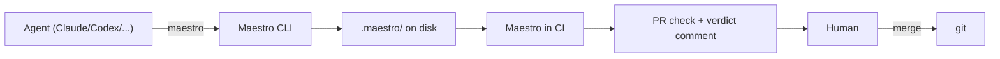
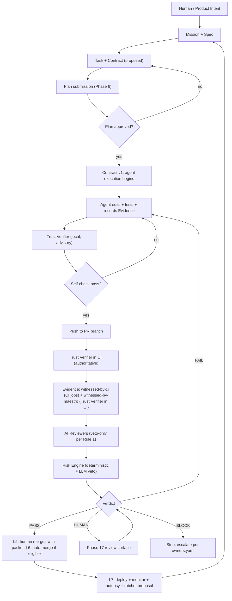

# Maestro Roadmap: Trust Substrate for Multi-Agent Software Engineering

> **Decision lock-in date: 2026-05-03.** This document supersedes prior framings. Sections marked _Capability Index_ are reference material, not a build sequence.

## Final Product Sentence

Maestro is the shared trust substrate that lets agents execute autonomously and humans merge confidently — by carrying the contract, the evidence, the verdict, and the historical guardrails between them.

## Table of Contents

- [Final Product Sentence](#final-product-sentence)
- [Core Thesis](#core-thesis)
- [Architecture](#architecture)
- [Adoption Levels (Primary Build Structure)](#adoption-levels-primary-build-structure)
- [The Twelve Invariant Rules](#the-twelve-invariant-rules)
  - LLM containment (1–2)
  - Contract integrity (3–7)
  - Trust signal hygiene (8–11)
  - Authority isolation (12)
- [Witness Levels](#witness-levels-replaces-proof-strength)
- [Core Artifacts](#core-artifacts)
  - [HandoffPacket schema](#handoffpacket-schema)
  - [Risk Class Enumeration](#risk-class-enumeration)
- [Learning Layer: Memory and Ratchet](#learning-layer-memory-and-ratchet)
- [Verification Boundary](#verification-boundary)
- [CI Integration](#ci-integration)
- [Override and Escalation](#override-and-escalation)
- [Modes](#modes)
- [Default Values and Thresholds](#default-values-and-thresholds)
- [Skills Bundle Evolution](#skills-bundle-evolution)
- [Capability Index (Phases 0–28)](#capability-index-phases-028)
- [Required Edge Cases (with mitigations)](#required-edge-cases-with-mitigations)
- [Compatibility With Current Maestro](#compatibility-with-current-maestro)
- [Persona](#persona)
- [Economic Model](#economic-model)
- [Master Flow](#master-flow-updated)
- [Implementation Phases](#implementation-phases)
- [Definition-of-done summary per level](#definition-of-done-summary-per-level)
- [Glossary](#glossary)
- [Cross-reference Matrix](#cross-reference-matrix)
- [Repository Topology](#repository-topology)

## Core Thesis

```text
Agents do the work.
Maestro carries the trust.
Humans merge with proof, not with hope.
```

The terminal product (L5) is *auto-PR with full evidence packet*. Auto-merge (L6) and auto-deploy (L7) are advanced optional levels for teams that explicitly opt in.

The central warning still applies:

```text
Maestro will perfectly verify a wrongly-defined thing.
```

You cannot escape this with more LLM judgment — the same model class produces and judges the spec. The structural escapes are: (a) LLM signals are veto-only (Rule 1); (b) deterministic gates the LLM cannot influence (Rule 2); (c) cheap revert via L7 mechanisms; (d) ratchet-encoded historical patterns (Phase 25b). The risk is contained, not eliminated. L6 without L7 is structurally invalid.

## Architecture

```text
Storage:        filesystem, .maestro/ on disk
Agent API:      maestro <verb> CLI
Runtime:        no daemon, no backend, no server-side state
Recovery:       packet-based, not process-supervised
Distribution:   single static binary + thin GitHub Action wrapper
Persona:        team lead is primary; solo dev and platform/compliance are derived
Economics:      bring-your-own-key (BYOK); Maestro never makes LLM calls itself
```

Maestro never spawns or supervises agents. Agents call into Maestro. Maestro reads files, writes files, returns verdicts. CI re-runs Maestro on the PR diff to produce the authoritative verdict. Local Maestro is advisory.



## Adoption Levels (Primary Build Structure)

The 7 adoption levels are the shipping plan. Each level is a release with its own acceptance criteria. The 28 phases below are a _Capability Index_ — they describe bodies of work that one or more levels pull from. They are not a sequence.

| Level | Ships | Status | Phase fragments |
|---|---|---|---|
| **L1** | Evidence-only logbook: agent records what it did, human reads it | shipped (v0.65.0) | P9α (Evidence schema), P10α (basic provenance), P11α (diff capture only) |
| **L2** | Contract-required: diff must respect declared scope | shipped (v0.66.0) | P5 (Contract on Task; P8 merged in), P11 full (Trust Verifier), P6 partial (plan check) |
| **L3** | Risk verdict: Maestro produces PASS/FAIL/HUMAN/BLOCK | shipped (v0.67.0) | P14 (Risk engine), P15 (Policy authoring), P12 (Proof Strength → Witness Levels) |
| **L4** | Autopilot inner loop, no merge: agent runs the loop, human merges | mid | P7 partial, P13 partial (1–2 reviewers), P16 partial (Mission Control), P2 minimal (acceptance-criteria predicate) |
| **L5** | **Auto-PR with full evidence packet — terminal default** | **headline** | P18 (CI/PR gate), P17 (Human Review UX) |
| L6 | Auto-merge for declared safe scope | advanced optional; **requires L7-minimum (L7.1+L7.2+L7.5) shipped in same release** | P19, P20, P13 full, P4 (Spec Quality as gate threshold) |
| L7 | Deploy + monitor + learn | advanced optional; L7 capabilities are **independently reachable from L5** without L6; only the L7-minimum subset is *coupled* to L6 | P21, P22, P23, P24, P25 |

L5 is the default journey. L6 and L7 are opt-in advanced levels with honest scope acknowledgment: in a typical repo, L6 covers ~5–15% of merged PRs.

**Coupling clarification (resolves the "decoupled vs structurally invalid" question):**

- L7 *capabilities* (runtime monitoring, autopsy, ratchet proposals) are independently reachable from L5 — teams can build them without ever shipping L6.
- L6 specifically *requires* the L7-minimum subset — Phase L7.1 (deployment safety contract additions), L7.2 (feature-flag/canary scaffolding), L7.5 (witnessed rollback) — to ship in the same release as L6. Without that subset, L6 has no answer to "what catches the wrongly-defined-thing that auto-merged?".
- Saying L6 is "structurally invalid" without L7 means: invalid without the L7-minimum subset. Not invalid without all of L7.

## The Twelve Invariant Rules

These rules are load-bearing. Every phase, every CLI verb, every skill update must respect them.

### LLM containment

**Rule 1 — LLM signals are veto-only.**
Any LLM-judgment signal (AI reviewer, spec quality score, intent intake) can downgrade verdicts. None can upgrade them. Default deny on LLM signal: silence or confusion is a vote against auto-pass, never for it.

**Rule 2 — L6 requires deterministic gates the LLM cannot influence.**
Auto-merge requires at least one purely deterministic predicate (scope adherence, lockfile parity, generated-file parity, sensitive-paths intersection, witnessed-by-ci green) gating the merge. LLM-judged signals can stop a merge but never carry it.

### Contract integrity

**Rule 3 — Contract amendments are versioned Evidence, never silent edits.**
Every amendment appends an `Evidence` row of `kind=contract-amendment` with the original contract version, added/removed paths, agent-supplied reason, and session id. The contract file versions (`v1 → v2 → v3`); prior versions are preserved. The PR packet shows the original contract plus the amendment trail.

**Rule 4 — Amendments are budgeted.**
`Contract.amendment_budget` carries: `max_amendments`, `max_paths_per_amendment`, `forbidden_amendment_paths` (intersects `policies/sensitive-paths.yaml`). Budget exhaustion hard-fails. Forbidden-path attempts hard-fail regardless of budget.

**Rule 5 — Amendment count raises risk, never lowers.**
0 amendments is clean baseline. 3+ amendments or any forbidden-path attempt downgrades auto-pass eligibility. Many amendments = "this task should have been re-planned."

**Rule 6 — Plan-time `proposed_contract` is not an amendment.**
Phase 6 plan submission carries a `proposed_contract` field. Once approved with the plan, that's `v1`. Amendment counter starts at 0 *after* approval. Plan-time iteration on the proposed contract is free.

**Rule 7 — Blocked amendments are Evidence too.**
Failed amendment attempts are recorded as `Evidence` of `kind=contract-amendment-blocked`. Risk Engine treats blocked attempts as risk-raising stronger than successful amendments. Gaming attempts leave a trail.

### Trust signal hygiene

**Rule 8 — Per-test flake rate downgrades witness strength.**
Risk Engine tracks per-test pass/fail history across runs (stored in `.maestro/runs/` cache, gitignored but durable across CI via cache or artifact). A green run on a test with `flake_rate > threshold` is downgraded from `witnessed-by-ci` to `agent-claimed-locally`. Flaky CI green is weak proof, not strong proof.

**Rule 9 — Asymmetric policy editing.**
Tightening risk policy (adding restrictions, raising thresholds, narrowing eligibility) is immediate. Loosening risk policy (removing restrictions, lowering thresholds, widening eligibility) requires a recorded justification (`why are we loosening?`) and soaks for 30 days before taking effect on auto-pass eligibility.

Applied to ratchets:
- **Ratchet promotion** (a new restrictive rule from a RatchetProposal) counts as tightening — immediate effect.
- **Ratchet revocation** (manual) or **sunset** (decay) that removes a restriction counts as loosening — 30-day soak unless the underlying rule has been demonstrably wrong (incident-evidenced revocation, recorded as Evidence with the supporting incident references; bypasses the soak only when the Evidence is `witnessed-by-maestro` or `witnessed-by-ci`).

Protects against gradual policy erosion (edge case 17) and against single-incident over-correction in the soft direction.

**Rule 10 — Rollback claims must be witnessed.**
For L7, the rollback path must be CI-exercised in the same change. If not exercised, the rollback is `agent-claimed-locally` strength and L7 auto-deploy eligibility is denied. "Rollback exists technically but is operationally unsafe" is the failure this prevents.

**Rule 11 — Contracts carry a cost budget.**
`Contract.cost_budget`: `max_retries`, `max_wall_clock`, optional `max_tokens` (when reported by runtime). When exhausted, the agent must hard-stop and escalate. Mutation-budget machinery (Rule 4) covers files/lines; cost budget covers compute/tokens. Both live on Contract (Phase 5).

### Authority isolation

**Rule 12 — A PR cannot weaken its own gates.**
CI Maestro reads `policies/`, `ratchets/`, contract templates, and `owners.yaml` from the **PR's base branch** (target), not the PR head. A PR that modifies these files does not gate the same PR — modifications take effect only after merge, for subsequent PRs.

Per-task Contracts created during the PR's own lifecycle are still read from the PR head (they describe the work being done), but their `forbidden_paths`, `amendment_budget`, and `risk_class` cannot be looser than the base-branch policy minimums. Per-task Contracts can only tighten relative to base-branch policy, never loosen.

Why this matters: without Rule 12, an agent could add itself as `policy_approver` in `owners.yaml`, weaken `sensitive-paths.yaml`, or promote a self-serving ratchet in the same PR that needs the change to land. The gate would gate nothing. Combined with Rule 9 (loosening soaks 30 days), Rule 12 closes both the same-PR and follow-up-PR weakening vectors.

**`owners.yaml` role-list changes are subject to Rule 9 soak.** Edits to `owners.yaml` that *expand* a role list (add new authorized users to `sensitive_waiver`, `policy_approver`, or `ratchet_approver`) count as loosening per Rule 9 and soak 30 days before taking effect on CI gating. Edits that *contract* a role list (remove users) are tightening and apply immediately. This protects against compromised maintainers granting authority to attacker-controlled identities: an attacker who gains write access cannot immediately grant themselves override authority on subsequent PRs — the 30-day soak window allows detection and revocation.

**Bootstrap exemption:** The *initial* population of `owners.yaml` (transitioning a role list from empty to non-empty for the first time, recorded by `maestro setup` or by a single commit immediately following setup) counts as *establishment*, not *expansion*, and takes effect immediately. Subsequent additions to a non-empty role list are expansions and soak 30 days. The bootstrap exemption is a one-shot per role list — once a role has its first user, all future additions are expansions.

## Witness Levels (Replaces "Proof Strength")

Every Evidence row carries a witness level. Verdicts depend on the levels of the evidence they reference.

```text
witnessed-by-maestro                  : strongest. Trust Verifier output produced IN CI on the
                                                   PR's tree-SHA. Reproducible from git.
                                                   Local Trust Verifier runs do NOT produce this level.
witnessed-by-ci                       : strong.    CI job exit code + log hash, signed by CI run id.
                                                   Includes test/build/typecheck/lint results from CI.
agent-claimed-locally                 : weak.      Agent recorded; CI did not witness. Advisory.
                                                   Includes local Trust Verifier runs (per Phase L2.5).
agent-claimed-and-not-reproducible    : weakest.   Manual smoke test, verdict-override, etc.
                                                   Surfaces as "human must confirm."
```

**Why local Trust Verifier is `agent-claimed-locally`, not `witnessed-by-maestro`:** the local environment is under the agent's control; the local working tree may diverge from what's pushed; the agent could lie about which checks ran. CI is the only environment where Maestro's run is independently witnessed. Resolution is consistent across all phases that wire this: L2.5 (local) writes `agent-claimed-locally`; L5.2 (CI) writes `witnessed-by-maestro`.

Verdict policy by level:
- L5 auto-PR: any combination is acceptable; weak signals show in the packet so the human sees what they're approving.
- L6 auto-merge: every gating signal must be `witnessed-by-maestro` or `witnessed-by-ci`. Agent-claimed signals can never gate auto-merge. Per Rule 2.
- L7 auto-deploy: rollback must be `witnessed-by-ci`. Per Rule 10. Runtime signals must match `Spec.runtime_signals` declared on the change.

Phase 12 (Proof Strength Mapping) is renamed and concretized: `ProofMap` is a *view* that joins `Spec.acceptance_criteria` with `Evidence` rows, annotated by witness level. Every acceptance criterion needs at least one Evidence row at level 1 or 2 to count as "covered."

## Core Artifacts

Collapsed from the roadmap's original 15 to 9. Existing types are unchanged; new types attach to existing ones rather than floating independently.

```text
Mission         (existing)  multi-step goal with milestones
Task            (existing)  claimable unit of work
Spec            (NEW, on Mission)  intent + acceptance criteria + non-goals + runtime_signals
Contract        (NEW, on Task)     allowed_files, forbidden_paths, risk_class, amendment_budget, cost_budget
Evidence        (NEW, polymorphic) discriminated by kind: command, verifier, ai-review,
                                   contract-amendment, contract-amendment-blocked, runtime-signal, manual-note
Verdict         (NEW)              decision + witnessed evidence refs + category (risk, runtime, policy)
Policy          (NEW)              rules in .maestro/policies/; turn Evidence into Verdict
Memory          (existing)         durable team-shared notes (advisory only; subsumes "Learning")
HandoffPacket   (existing)         transferable bundle (schema below)
```

`AgentRun`, `VerificationResult`, `ProofMap`, `ReviewFinding`, `RiskVerdict`, `PolicyDecision`, `RuntimeVerdict`, `Learning`, `RatchetRule` are queries, subtypes, or attributes — not top-level types.

### HandoffPacket schema

```text
mission_ref              : Mission id
task_ref                 : Task id
spec_snapshot            : Spec at handoff time
contract_snapshot        : Contract with version + amendment trail
evidence_rows            : all Evidence for the task, with witness levels
latest_verdict           : current Verdict if any
open_hypotheses          : what the agent is considering but hasn't confirmed
ruled_out_approaches     : what the agent tried and rejected, with reasons
outstanding_questions    : what blocks the agent right now
next_action_recommendation : agent's best guess at next step
provenance               : maestro version, contract version, policy version, ratchet versions, session id
```

`open_hypotheses` and `ruled_out_approaches` are the parts most often lost in real handoffs. They are required, not optional. Edge case 20 is mitigated by carrying them.

### Risk Class Enumeration

`Contract.risk_class` and `Verdict.risk_class` use a four-level scale. The agent proposes a class during planning; Maestro can raise it (per Rule 1, the LLM cannot lower it).

```text
low      : isolated change, no sensitive paths, no production behavior shift, easily reversible.
           Eligible for L6 auto-merge when L6 is shipped.

medium   : touches non-trivial logic, reversible, no sensitive paths.
           Default for most tasks. L5 default; L6 only if all gating evidence is
           witnessed-by-maestro or witnessed-by-ci.

high     : touches sensitive paths, alters production behavior, or has
           hard-to-reverse data effects. L5 with required human review;
           L6 ineligible by default.

critical : touches auth, payments, secrets, migrations, dependency manifests,
           CI workflows, or permission model. Always human review at L5;
           L6 ineligible regardless of evidence; L7 requires witnessed
           rollback per Rule 10.
```

Risk class drives auto-pass eligibility, required reviewer set, required witness levels, and rollback requirements. Each level's policy file may add stricter requirements per class but cannot weaken them below these defaults (per Rule 12).

**Risk class is independently validated by the Risk Engine** (Phase L3.4), not just accepted from the Contract. The Risk Engine derives a class from deterministic diff analysis (which sensitive paths intersected, whether manifests changed, whether migrations are present, whether CI workflows changed, etc.) and takes the **higher** of agent-proposed class and Maestro-derived class. Per Rule 1, an LLM-proposed class can never *lower* the Maestro-derived class. This closes the gameable path where an agent could propose `medium` to qualify for L6 auto-merge despite touching auth code.

**Signal → Derived class mapping** (evaluated in order; first match wins; configurable in `policies/risk.yaml` so teams can extend or tighten):

```text
Signal                                                              Derived class
---                                                                 ---
Diff intersects sensitive_paths.security set                        critical
  (auth/**, secrets/**, permissions/**, payments/**)
Diff modifies dependency manifests                                  high
  (package.json, bun.lock, Cargo.toml, requirements.txt, etc.)
Diff includes database migration files                              high
  (paths matching policies/migration_paths)
Diff modifies CI workflow files                                      high
  (.github/workflows/**, .circleci/**, .gitlab-ci.yml)
Diff modifies policies/, ratchets/, or owners.yaml in .maestro/    high
Diff modifies build configuration                                   medium
  (tsconfig.json, bunfig.toml, vite.config.*, etc.)
Any source code change not matched by the above rows              medium  (default)
Diff is docs-only, comment-only, or formatting-only                low
```

> **Note:** The deriver does not heuristically classify changes as "trivial" or "non-trivial" — that requires LLM judgment and would violate Rule 1. The default is `medium` for any source change not matched by a prior row; `low` is reserved for docs/comments/formatting-only diffs (deterministically detectable via file extension and/or AST-vs-comment-only diff).

This table is the normative implementation spec for `deriveRiskClassFromDiff`. Reference this table in L3.4 deliverables. L3.4 acceptance criteria must include tests for at least 3 different signal combinations producing the correct derived class.

## Learning Layer: Memory and Ratchet

How the Memory and Policy artifacts evolve over time. The "Learning Layer" is two distinct surfaces with different governance.

### Soft layer (fast, advisory, free-form)

- `Memory` entries: durable notes the agents read.
- AI-reviewer prompt heuristics: tuned with repo-specific past-failure examples.
- No enforcement effect. Advisory only. Low promotion cost.

### Hard layer (slow, audited, deterministic)

- `RatchetProposal` artifact emitted by Phase 24 (autopsy). Lands in `.maestro/ratchets/proposed/`. Behavior does not change from a proposal alone.
- Promotion to `Policy` requires:
  - **Human approval** by the role declared in `owners.yaml` (`ratchet_approver`).
  - **N≥2 distinct incidents** matching the proposed pattern for *broad-scope* promotion. Single-incident promotions must be narrow (specific path, specific kind of change).
- Promoted rules carry a **default 90-day sunset**; configurable via `policies/risk.yaml:ratchet_sunset_days`. After sunset, rules downgrade to soft (warns, doesn't block). Without re-validation, they delete. **Sunset is computed from `effective_from + ratchet_sunset_days`, not stored as a `sunset_at` field** — storing a custom `sunset_at` in a ratchet file is forbidden and prevents timestamp injection attacks. Reducing `ratchet_sunset_days` counts as loosening per Rule 9 and soaks 30 days; increasing it is tightening and applies immediately.
- **Per-repo by default.** Cross-repo only via explicit `maestro ratchet export` then `maestro ratchet import --review` (every imported rule surfaces for explicit approval).
- Every promoted rule carries provenance: originating incident, approver, approval date, supporting incidents, computed sunset date.

The honest framing: **Maestro proposes; the team decides; rules decay unless re-validated.** The "continuous learning" claim is replaced with this slower, audited, decaying mechanism.

> *Capability Index reference: this is the elaboration of P25 (the original "Phase 25" in the legacy 28-phase numbering). The L1–L7 implementation phases that build this are L7.4 (autopsy emits proposals), L7.6 (ratchet CLI verbs), L7.7 (N≥2 broad-promotion guard), and L7.8 (sunset machinery).*

## Verification Boundary

Maestro itself runs only checks where Maestro is the better authority than the agent:

```text
git diff inspection
contract scope check (changed files ⊆ allowed_files; intersection with forbidden_paths)
lockfile / manifest parity (e.g., bun.lock vs package.json)
generated-file parity (regenerate, compare)
commit metadata, branch policy
secret scanning of the diff
```

Maestro never re-executes:

```text
tests, builds, typechecks, lint, E2E, custom verification scripts
```

Heavy verification is agent-reported (locally) or CI-witnessed (authoritatively). Maestro stores `Evidence` rows for both with the appropriate witness level.

Phase 11 (Verification Engine) splits into:
- **Trust Verifier**: what Maestro runs (γ above). Runs in both local (advisory) and CI (authoritative).
- **Evidence Recorder**: what agent reports. Runs locally, written by agents, witness level `agent-claimed-locally` unless CI confirms.

## CI Integration

```text
Local Maestro    : advisory. Outputs are agent-claimed-locally.
                   .maestro/evidence/ and .maestro/runs/ are gitignored.

CI Maestro       : authoritative. Re-runs Trust Verifier on the PR diff.
                   Reads policies/, ratchets/, contract templates, and owners.yaml
                   from the PR's BASE branch (target), not the PR head — per Rule 12.
                   Reads task-specific Contracts from the PR head (they describe
                   the work being done), but base-branch policy minimums still apply.
                   Ingests CI job results as witnessed-by-ci.
                   Posts the gating PR check status + a verdict comment.

Verdict identity : bound to PR + tree SHA at verify time, not commit SHA.
                   Squash preserves tree SHA on the merge commit.
                   Force-push to PR branch invalidates prior verdicts and triggers re-verification.
                   Rebase changes commit SHAs but typically preserves tree SHA per commit.

Source of truth  : the PR check status. No server-side verdict store.

Provenance       : every verdict comment references
                   maestro_version + contract_version + policy_version + ratchet_versions.
                   All are committed, so the verdict is reproducible from git.
```

`.maestro/` directory layout:

```text
.maestro/
  contracts/          REQUIRED COMMITTED.  Contract files versioned (v1.json, v2.json, ...).
  policies/           REQUIRED COMMITTED.  Risk rules, sensitive paths, owners.
    risk.yaml
    sensitive-paths.yaml
    autopilot.yaml
    release.yaml
    owners.yaml       Decision authority: policy_approver, ratchet_approver, sensitive_waiver roles.
  ratchets/           REQUIRED COMMITTED.  Promoted policy edits with provenance and sunset dates.
    proposed/         RatchetProposals from autopsy (not yet effective).
  specs/              REQUIRED COMMITTED.  Mission-level Specs.
  memory/             COMMITTED.            Team-shared advisory notes.
  evidence/           GITIGNORED.           Per-session evidence rows.
  runs/               GITIGNORED.           Local cache of run history (test flake rates etc.).
```

## Override and Escalation

When Maestro returns `BLOCK`, the change cannot proceed via the normal flow. Two escalation paths exist; both are explicit and audited.

### Override (deliberate human authority)

- Only roles declared in `policies/owners.yaml` (e.g., `sensitive_waiver`) can override a `BLOCK`.
- Override is performed via `maestro verdict override --pr <number> --reason <str>` (or the equivalent CI step that posts the override). **Implemented in Phase L5.6a.**
- Every override writes an `Evidence` row of `kind=verdict-override` with witness level `agent-claimed-and-not-reproducible` — the override is by definition a human judgment that bypasses deterministic gates.
- The override surfaces in the PR check status as "verdict overridden by `<user>`" and in the verdict comment alongside the original `BLOCK` reasons.
- Overrides do **not** silently rewrite the verdict. The original `BLOCK` remains; the override is an annotation alongside it.
- Overrides are subject to retroactive review: a Phase 24 autopsy can flag override patterns as RatchetProposals (e.g., "this override has been needed 5 times for auth-config edits — consider tightening the policy or carving out a specific exception").

### Escalation (re-plan or re-contract)

- If override is not appropriate, the path forward is to re-plan or amend the contract via the normal flow.
- A `BLOCK` reason of `cost-budget-exhausted` (Rule 11) typically resolves via amending the contract's `cost_budget` (with human approval per Rule 6) or splitting the work into multiple tasks.
- A `BLOCK` reason of `sensitive-path-touched` typically resolves via human-approved Contract amendment that explicitly authorizes the path with rationale (subject to Rule 4 and Rule 12), or by splitting into a separate task with a new Contract.
- A `BLOCK` reason of `incomplete-config` (no `.maestro/policies/` or required files missing) resolves by running `maestro setup` to scaffold the missing files.

### No silent-pass overrides

- Override does not turn `BLOCK` into `PASS`. The verdict remains `BLOCK`; the override is a separate, witnessed decision.
- L6 auto-merge **never** acts on an overridden `BLOCK`. Overrides require human merge.
- L7 auto-deploy **never** acts on an overridden L7-gating verdict.

## Modes

```text
Guided     : human approves spec, contract, plan, and risky steps.
Verified   : agent works automatically; completion requires strong proof
             (witness levels 1 or 2 on every gating signal).
Autopilot  : agent runs the inner loop; humans merge (L4–L5).
Auto-merge : declared safe scope auto-merges (L6 only; requires L7 minimum in same release).
Auto-deploy: declared safe scope auto-deploys with witnessed rollback (L7 only).
```

"Lights-Out" is removed as primary terminology — it overpromised a capability the roadmap then hedged. The precise terms above replace it.

## Default Values and Thresholds

All thresholds are configurable in `policies/risk.yaml` and `policies/autopilot.yaml`. The defaults below are conservative and tuned for the team-lead persona. Edits to these defaults follow Rule 9 (asymmetric editing): tightening immediate, loosening soaks 30 days. Per Rule 12, defaults are read from the PR's base branch.

### Trust signal thresholds (Rule 8)

```text
flake_rate_threshold              : 0.05  (5% — at or above, downgrade green CI runs of that test
                                            from witnessed-by-ci to agent-claimed-locally)
flake_history_window              : 100   (per-test history scope for flake_rate)
min_runs_before_flake_judgment    : 10    (avoid downgrading on tiny samples)
```

### Spec quality (L6+, Phase 4)

```text
spec_quality_threshold            : 0.7   (deterministic-checklist pass-rate;
                                            below threshold disables L6 auto-merge per Rule 1)

# Required slots are evaluated against the level-appropriate list.
# A repo at L6 is scored against required_spec_slots_l6 only.
# A repo at L7 is scored against required_spec_slots_l7 (which adds runtime_signals
# and rollback_expectations on top of the L6 list).
required_spec_slots_l6            : ["acceptance_criteria", "non_goals",
                                     "user_visible_behavior"]
required_spec_slots_l7            : required_spec_slots_l6 + ["runtime_signals",
                                                              "rollback_expectations"]
```

### Contract amendment budget defaults (Rules 3–7)

```text
max_amendments                    : 3
max_paths_per_amendment           : 5
forbidden_amendment_paths         : intersection with policies/sensitive-paths.yaml (always)
```

### Contract cost budget defaults (Rule 11)

```text
max_retries                       : 5
max_wall_clock_seconds            : 1800  (30 minutes)
max_tokens                        : unset (only enforced when runtime reports it)
```

### Policy editing soak (Rule 9)

```text
loosening_soak_seconds            : 2592000  (30 days)
tightening_soak_seconds           : 0        (immediate)
```

### Ratchet (§25b)

```text
ratchet_sunset_days               : 90
min_incidents_for_broad_promotion : 2
narrow_scope_definition           : glob matches a single file or a path prefix
                                     containing ≤3 directory levels
```

### Auto-merge eligibility (L6)

All conditions must hold:

```text
- All gating evidence at witness level 1 or 2.
- Spec.score >= spec_quality_threshold.
- Risk class is low (medium only with all gating evidence at level 1 or 2).
- No forbidden_paths touched.
- No paths matching sensitive-paths.yaml touched without sensitive_waiver Evidence.
- Rollback witnessed per Rule 10 (when L7 is engaged).
- All required-acknowledgment checklist items satisfied (Phase L5.6).
- Verdict is PASS, not overridden.
```

### Auto-deploy eligibility (L7)

All L6 conditions plus:

```text
- Spec.runtime_signals declared and matched by ingested signals during canary window.
- Rollback exercised in CI at witness level witnessed-by-ci.
- Deploy gate Evidence of kind=deploy-readiness present.
- Risk class is low or medium (high and critical require human deploy).
```

## Skills Bundle Evolution

The skill bundle (`skills/bundled/`) is the agent-facing spec. Per `CLAUDE.md`, when the CLI diverges from a skill, fix the CLI; when a skill needs to change, ask the user first. Build order per level: (1) build CLI verbs, (2) update skills to reference them, (3) sync via `bun run sync:bundled-skills`.

| Level | Skills changed | New skills | New CLI verbs |
|---|---|---|---|
| L1 | `maestro-task` (record evidence after verification commands), `maestro-setup` (gitignore evidence/runs) | none | `maestro evidence record`, `maestro evidence list`, `maestro evidence show` |
| L2 | `maestro-task` (respect Contract; amend per Rules 3–7), `maestro-plan` (proposed_contract field), `maestro-setup` (scaffold owners.yaml) | none | `maestro contract show`, `maestro contract amend`, `maestro task verify`, `maestro spec show`, `maestro spec edit` |
| L3 | `maestro-plan` (Risk-aware planning), `maestro-task` (handle Verdict feedback) | none | `maestro verdict show`, `maestro verdict request`, `maestro policy check`, `maestro task proof` |
| L4 | `maestro-task` (full inner loop with self-check) | **`maestro-verify`** (canonical verification protocol) | `maestro autopilot status` |
| L5 | `maestro-handoff` (full evidence packet in HandoffPacket) | none | `maestro ci verify`, `maestro pr publish`, `maestro verdict override` |
| L6 | `maestro-verify` (deterministic gates for auto-merge) | none | `maestro merge auto` |
| L7 | `maestro-verify` (witnessed rollback, declared runtime signals) | none | `maestro deploy gate`, `maestro autopsy run`, `maestro ratchet propose/review/import/export` |

Total skills at L5: 7 (the existing 6 plus `maestro-verify`). Skill-CLI parity (`bun run check:bundled-skills`) is a per-level acceptance criterion.

## Capability Index (Phases 0–28)

These are bodies of work, not a build sequence. Each phase contributes to one or more levels per the Adoption Levels table. Listed for navigation, not ordering.

```text
P0  Product Spine
P1  Agent API / CLI Contract           (level-aligned table above replaces flat verb list)
P2  Intent Intake + Clarification      (L4+ only; structured-extraction predicate, not LLM judgment)
P3  Spec Layer                         (L1–L3 informal; L4 structured slots; L5+ scored)
P4  Spec Quality Score                 (L4+ only; gate threshold, not quality measure)
P5  Contract-First Workflow            (L2; absorbs P8 mutation budget machinery)
P6  Agent Planning Check               (L2 partial; L3 full; carries proposed_contract per Rule 6)
P7  Autopilot Runtime Loop             (no agent spawning; loop = task-discover/work/record/verify; human merges at L5)
P8  [merged into P5]                   Mutation Budget machinery lives on Contract
P9  Evidence Packet                    (L1+; polymorphic rows + ProofMap view)
P10 Provenance / Audit Log             (L1 minimal; L5 full — committed contract/policy/ratchet versions)
P11 Trust Verifier + Evidence Recorder (split; γ scope above)
P12 Witness Levels                     (replaces "Proof Strength"; concrete 4-level scale)
P13 AI Review Pipeline                 (veto-power infrastructure per Rule 1)
P14 Risk / Policy Engine               (deterministic-first; LLM signals only raise risk)
P15 Policy Authoring                   (.maestro/policies/; asymmetric editing per Rule 9)
P16 Mission Control Trust Console      (operator views; preview/JSON paths stay read-only per existing CLAUDE.md)
P17 Human Review UX                    (minimum interaction surface for high-risk verdicts; rubber-stamp mitigation)
P18 CI / PR Gate                       (GitHub Action wrapper + binary; PR check = source of truth)
P19 Merge / Release Gate               (L6)
P20 Auto-merge for Declared Safe Scope (L6; replaces "Lights-Out"; honest scope acknowledgment)
P21 Deployment Safety                  (L7; witnessed rollback per Rule 10; declared runtime_signals)
P22 Runtime Monitoring                 (L7; signals declared on Spec; missing signals → suspicious by default)
P23 Autopilot Recovery / Handoff       (packet-based; HandoffPacket schema above; no process supervision)
P24 Failure / Success Autopsy          (emits RatchetProposal, not policy edit)
P25 Learning / Ratchet                 (split into 25a soft + 25b hard per above)
P26 Maestro Trust Benchmark            (regression corpus in tests/e2e/; covers verifier, parser, schema)
P27 Adoption / Maturity Levels         (the 7 levels above; this is the primary build structure, not P28-final)
P28 [removed]                          Adoption is P27, not the last phase
```

## Required Edge Cases (with mitigations)

```text
1.  Contract right but intent wrong          → Rule 1; L4+ Intent Intake; humans-in-loop at L1–L4;
                                                L7 runtime signals catch the residual.
2.  Tests pass but behavior wrong            → Same as #1. Witness levels do not certify behavior;
                                                they certify command execution.
3.  Agent adds shallow tests                 → ProofMap requires evidence per acceptance criterion;
                                                witness levels surface unwitnessed criteria.
4.  AI reviewers all wrong together          → Rule 1: they can only veto, never approve.
5.  Out-of-scope change looks harmless       → Trust verifier scope check; Rule 5 (amendments raise risk).
6.  Generated files / lockfiles drift        → Trust verifier parity check.
7.  Flaky tests                              → Rule 8: per-test flake rate downgrades witness strength.
8.  Local pass / CI fail                     → Witness levels: only CI is authoritative.
9.  Sensitive path changed                   → forbidden_paths in Contract; sensitive-paths.yaml policy.
10. Dependency upgrade out of scope          → lockfile parity; sensitive_paths includes manifests by default.
11. Database migration without rollback      → Rule 10: rollback must be CI-witnessed.
12. Security reviewer pass but threat model thin → Rule 1: pass cannot upgrade verdict; needs deterministic gate.
13. Agent gaming criteria                    → Rule 7: blocked amendments are Evidence; trail visible.
14. Long-running task drift scope            → Rule 4 budget; Rule 11 cost budget; Rule 5 risk-rising.
15. Human rubber-stamp evidence packet       → P17 minimum interaction surface for high-risk verdicts.
16. Runtime monitor misses business regression → Spec.runtime_signals required for L7; default suspicious.
17. Auto-pass policy loosened too fast       → Rule 9: asymmetric policy editing; loosening soaks 30 days.
18. Learning rule too broad                  → 25b: N≥2 incidents for broad promotion; sunset by default.
19. Agent crashes mid-task                   → Packet-based recovery; HandoffPacket carries enough state.
20. Handoff loses critical context           → HandoffPacket schema requires open_hypotheses + ruled_out.
21. Spec internally contradictory            → L4+ structured slots + library of known-conflict pairs (ratcheted).
22. Contract amendments hide scope creep     → Rules 3, 4, 5, 6, 7 collectively.
23. Proof exists but not tied to criteria    → ProofMap view joins acceptance_criteria with Evidence by witness.
24. Reviewer confidence high but evidence weak → Rule 1; witness levels gate L6/L7 regardless of LLM confidence.
25. Rollback technically exists but unsafe   → Rule 10: rollback path must be CI-exercised.
26. Multi-agent concurrent edits             → CI Maestro surfaces cross-task-conflict findings; risk-raising.
27. Rebase / force-push / squash breaks provenance → Verdict identity bound to PR + tree SHA, not commit SHA.
28. Evidence schema evolution                → Schema versions on rows; CLI ships backward-compatible readers.
29. Maestro CLI itself has bugs              → tests/e2e/ corpus grown by every reported false-pos/false-neg;
                                                P26 Trust Benchmark is L7 formalization of this.
30. Token / cost runaway                     → Rule 11: Contract.cost_budget hard-stops the agent.
31. Decision authority unspecified           → .maestro/policies/owners.yaml declares roles for approvals.
32. PR weakens its own gates                 → Rule 12: policies/ratchets/owners.yaml read from base branch;
                                                per-task Contracts can only tighten relative to base.
```

The biggest residual edge case (#1, #2) is *not solved* — it is contained:
- L1–L4: humans gate every merge. The wrongly-defined thing fails human review or doesn't.
- L5: humans gate every merge with full evidence packet. Same.
- L6 (auto-merge): Rules 1+2 require deterministic gates the LLM didn't influence. Eligible scope is narrow. Most teams will not enable L6.
- L7 (auto-deploy): runtime signals + canary + witnessed rollback + autopsy + ratchet are the only structural answer to "we shipped a wrong thing." L6 without L7 is structurally invalid.

## Compatibility With Current Maestro

Existing repos with `.maestro/` (Missions, Tasks, Notes, Memory) are not invalidated. Each level is additive:

```text
L1 compat: no existing data invalidated. evidence record is opt-in until your skills are updated.
           .gitignore additions are safe (existing files unaffected).
L2 compat: Tasks without a Contract default to permissive (allowed_files: ['**']);
           agents that don't propose Contracts still work; verdicts mark them as "unconstrained" risk.
L3 compat: Verdict is informational at L3 unless policy.yaml opts in to gating;
           teams adopt at their pace.
L4–L5 compat: per-team opt-in; L4 mode requires explicit profile in .maestro/policies/autopilot.yaml.
L6–L7 compat: opt-in only; never default; sensitive_paths defaults block most paths from auto-merge.
```

### Repository without `.maestro/`

Fresh repos that have not run `maestro setup` see fail-open behavior:

- `maestro ci verify` returns `Verdict.kind=unverified` at witness level 4.
- No PR check status is posted; Maestro is silently absent.
- This makes adoption opt-in and avoids breaking repos that have not adopted.

Once `.maestro/policies/` exists but required files are missing, behavior switches to fail-closed:

- `maestro ci verify` returns `BLOCK` with reason `incomplete-config` and an itemized missing-file list.
- This catches "we set up Maestro but only halfway" as a louder signal than silent skip.

The transition from absent to present is one-way: a repo that has ever had `.maestro/policies/` committed cannot revert to fail-open by deleting the directory in a PR (per Rule 12, the deletion is read from the head, but base-branch policy still applies until merge).

## Persona

Primary: **team lead** in a small-to-medium engineering team that uses Claude Code, Codex, or both, on a single repo or small monorepo.

Derived configurations:
- **Solo dev**: L1–L2 with light setup. Skip `owners.yaml`. Use defaults.
- **Platform / compliance**: L5+ with `owners.yaml` configured, audit log retention, CI integration as required check.
- **Multi-team org**: L7 + cross-repo ratchet export (long-term).

Default values, error messages, and feature priority are tuned for the team-lead persona. Other personas are supported but not the primary design target.

## Economic Model

```text
Maestro is BYOK (bring your own key) at every level.
Maestro never holds API keys.
Maestro never makes LLM calls directly.
The agent runtime (Claude Code, Codex CLI, etc.) makes all LLM calls and pays.
AI Reviewers are role assignments the agent runtime executes, not Maestro services.
This keeps Maestro local-first and removes any cloud/SaaS dependency at L5.
```

This kills the question "who pays for AI reviewer tokens" at the design level. The team's existing agent-runtime billing covers it.

## Master Flow (Updated)



## Implementation Phases

Each level decomposes into numbered phases. **An agent can pick up any phase cold from its definition** — every phase has goal, prerequisites, deliverables (files, CLI verbs, schemas), and verifiable acceptance criteria.

Sequencing rules:
- Phases within a level must be done in numeric order unless explicitly marked parallelizable.
- A level's E2E phase (`L<N>.E2E`) is the gate to ship that level.
- Each level ends with a release phase (`L<N>.RELEASE`) that bumps version and updates compat docs.
- Level definition-of-done: new CLI verbs implemented + bundled skills updated (`bun run check:bundled-skills` passes) + compat statement + E2E test in `tests/e2e/` + release notes.

---

### L1 — Evidence-Only Logbook

**Status**: shipped in v0.65.0.

**Goal of level**: Agent records what it did during a task; human reads the record.

**Why now**: existing `maestro task` already has acceptance criteria and claim/complete cycle. L1 is the smallest addition that delivers shipping value.

#### Phase L1.1: Evidence domain types

**Status**: shipped.

- **Goal**: Define TypeScript types for Evidence rows.
- **Prerequisites**: none.
- **Deliverables**:
  - `src/features/evidence/domain/types.ts` exporting `EvidenceRow`, `EvidenceKind`, `WitnessLevel`, `EvidencePayload<K>`.
  - `EvidenceKind` initial enum: `"command"`, `"manual-note"`. (Other kinds added in later levels.)
  - `WitnessLevel` enum: `"witnessed-by-maestro" | "witnessed-by-ci" | "agent-claimed-locally" | "agent-claimed-and-not-reproducible"`.
  - Schema-version field on every row (`schema_version: 1`).
- **Acceptance criteria**:
  - `bun run build` passes.
  - `bun test tests/unit/features/evidence/types.test.ts` passes with at least one test instantiating each field.
- **Scope**: small (1–2 hours).

#### Phase L1.2: Evidence file-storage adapter

**Status**: shipped.

- **Goal**: Persist Evidence rows to disk under `.maestro/evidence/`.
- **Prerequisites**: L1.1.
- **Deliverables**:
  - `src/features/evidence/ports/storage.ts` (port interface).
  - `src/features/evidence/adapters/file-storage.ts` writing to `.maestro/evidence/<task-id>/<evidence-id>.json`.
  - `evidence-id` is ULID-style (sortable, unique).
  - List operation supports filter by `task_id`, `session_id`, `kind`.
- **Acceptance criteria**:
  - Tests in `tests/unit/features/evidence/file-storage.test.ts` cover write, read-by-id, list-by-task, list-by-session.
  - Concurrent writes (10 parallel) all succeed without id collision.
- **Scope**: small.

#### Phase L1.3: Evidence use-cases

**Status**: shipped.

- **Goal**: Implement `recordEvidence` and `listEvidence` use-cases.
- **Prerequisites**: L1.2.
- **Deliverables**:
  - `src/features/evidence/usecases/record-evidence.ts`.
  - `src/features/evidence/usecases/list-evidence.ts`.
  - Each use-case takes the storage port via DI; no direct fs imports.
- **Acceptance criteria**:
  - Use-case unit tests pass with an in-memory storage adapter.
- **Scope**: small.

#### Phase L1.4: `maestro evidence record` CLI verb

**Status**: shipped. Verb landed at `src/features/evidence/commands/evidence.command.ts` (project convention) rather than the roadmap's `src/infra/commands/evidence-record.command.ts` path.

- **Goal**: Wire the use-case to a CLI command.
- **Prerequisites**: L1.3.
- **Deliverables**:
  - `src/infra/commands/evidence-record.command.ts` registered in `src/index.ts`.
  - Flags: `--task <id>` (required), `--kind <kind>` (default `command`), `--command <str>`, `--exit <int>`, `--log <path>`, `--duration <ms>`, `--criterion <id>`, `--note <text>` (used with `--kind manual-note` for free-form human notes; always witness level 4).
  - **`--criterion <id>` becomes required after L2.0 ships** for any Mission that has a Spec — at that point an Evidence row without a criterion reference cannot satisfy ProofMap (L3.5). At L1 the flag is optional (no Specs exist yet); at L2.0 onward, the L1.4 command validates against the Mission's Spec and rejects records that omit the criterion when one is required.
  - Defaults `session_id` from existing maestro session.
  - Outputs the new evidence id on success.
- **Acceptance criteria**:
  - `./dist/maestro evidence record --task t1 --command "bun test" --exit 0` writes a row and prints the id.
  - Missing `--task` fails fast with a clear error.
  - After L2.0, missing `--criterion` against a Mission with a Spec fails fast with a clear error and lists the available criterion ids.
- **Scope**: small.

#### Phase L1.5: `maestro evidence list` and `evidence show` CLI verbs

**Status**: shipped. Both subcommands live in `src/features/evidence/commands/evidence.command.ts` alongside `evidence record`.

- **Goal**: Read paths for evidence.
- **Prerequisites**: L1.4.
- **Deliverables**:
  - `src/infra/commands/evidence-list.command.ts` (filters: `--task`, `--session`, `--kind`).
  - `src/infra/commands/evidence-show.command.ts` (`<evidence-id>` as positional arg; `--json` flag for machine-readable output).
- **Acceptance criteria**:
  - `evidence list --task t1` returns rows in chronological order.
  - `evidence show <id> --json` is parseable JSON; default output is human-readable.
- **Scope**: small.

#### Phase L1.6: Mission Control evidence view

**Status**: shipped. Implemented in `src/tui/state/task-board.ts` (`buildTaskBoard` accepts an optional `evidenceStore`) and `src/tui/state/screen-types.ts` (`TaskBoardItem.evidenceCount`, `recentEvidence`); `src/tui/state/snapshot.ts` is a re-export shell, so the per-task projection lives in `task-board.ts` instead.

- **Goal**: Surface evidence in the existing Task view in the TUI.
- **Prerequisites**: L1.5.
- **Deliverables**:
  - Update `src/tui/state/snapshot.ts` to include `evidenceCount` per task.
  - Add an "Evidence" section to the Task render with the most recent 5 rows.
  - Preserve the read-only invariant for snapshot/preview/render-check (no writes).
- **Acceptance criteria**:
  - `./dist/maestro mission-control --preview --size 120x40 --format plain` shows evidence rows for tasks that have them.
  - `bun test tests/unit/tui/snapshot.test.ts` passes; snapshot includes evidence fields.
- **Scope**: medium.

#### Phase L1.7: `maestro-task` skill update

**Status**: shipped.

- **Goal**: Tell agents to record evidence after verification commands.
- **Prerequisites**: L1.4.
- **Deliverables**:
  - Edit `skills/bundled/maestro-task/SKILL.md` to add an "Evidence" section: "After each verification command (test, build, typecheck, lint), run `maestro evidence record --task <id> --kind command --command \"...\" --exit <N>`. Recorded evidence appears in `maestro task show`."
  - Run `bun run sync:bundled-skills` to regenerate `src/infra/domain/bundled-skill-templates.ts`.
- **Acceptance criteria**:
  - `bun run check:bundled-skills` passes (parity between `skills/bundled/` and the embed).
  - The new "Evidence" section is present in the skill markdown.
- **Scope**: small.

#### Phase L1.8: `maestro-setup` gitignore additions

**Status**: shipped. There is no `maestro setup` CLI verb in this repo; the gitignore-writing logic lives in `RUNTIME_GITIGNORE_LINES` in `src/infra/usecases/init.usecase.ts`, which `maestro init` already drives.

- **Goal**: New repos and existing repos get `.maestro/evidence/` and `.maestro/runs/` gitignored.
- **Prerequisites**: independent (parallelizable with L1.7).
- **Deliverables**:
  - Update `maestro setup` (or equivalent) to append `.maestro/evidence/` and `.maestro/runs/` to `.gitignore` if not present.
  - Idempotent: running setup twice does not duplicate entries.
- **Acceptance criteria**:
  - On a fresh repo, `maestro setup` produces a `.gitignore` containing both entries.
  - On a repo that already has them, `maestro setup` is a no-op for the gitignore.
- **Scope**: small.

#### Phase L1.DOCS: Documentation updates

**Status**: shipped.

- **Goal**: Update repo documentation so a new contributor or agent can discover L1 additions without reading source code.
- **Prerequisites**: L1.1–L1.8.
- **Deliverables**:
  - **`AGENTS.md` (root)** — add `maestro evidence record/list/show` to the Commands section; add a row to "Where to look" pointing to `src/features/evidence/`; mention Evidence Recorder in the Conventions section.
  - **`README.md`** — add Quick Reference entries for the three evidence verbs; add a brief "Evidence" section in the main body explaining the L1 logbook concept.
  - **`src/AGENTS.md`** — document the new `src/features/evidence/` directory under feature boundaries; cross-reference the Evidence types defined there.
  - **`.maestro/AGENTS.md`** — note that `.maestro/evidence/` and `.maestro/runs/` are gitignored runtime state.
  - **`skills/AGENTS.md`** — note the `maestro-task` skill update for evidence recording.
  - **`CLAUDE.md`** — only updated if a new convention is introduced (none for L1).
  - Run `bun run init-deep` (or the project's equivalent) to regenerate any auto-managed AGENTS.md hierarchy blocks.
- **Acceptance criteria**:
  - `grep -r "evidence record" AGENTS.md README.md src/AGENTS.md skills/AGENTS.md` returns hits in all four files.
  - A new contributor reading root `AGENTS.md` alone can find the evidence feature without reading source.
  - All AGENTS.md files still pass `bun run check:boundaries` and any AGENTS-hierarchy validators.
- **Scope**: small (1–2 hours).

#### Phase L1.E2E: L1 end-to-end test

**Status**: shipped. See `tests/e2e/l1-evidence-flow.test.ts`.

- **Goal**: Compiled-binary test of the full L1 flow.
- **Prerequisites**: L1.1–L1.8.
- **Deliverables**:
  - `tests/e2e/l1-evidence-flow.test.ts`: claim a task, record 3 evidence rows of different kinds, list them, show one, complete the task. Assert evidence is preserved and shown in Mission Control snapshot.
  - Test runs against `./dist/maestro` (via `tests/helpers/run-compiled-cli.ts`).
- **Acceptance criteria**:
  - `bun test tests/e2e/l1-evidence-flow.test.ts` passes after `bun run build`.
- **Scope**: medium.

#### Phase L1.RELEASE: L1 release

**Status**: shipped in v0.65.0.

- **Goal**: Ship L1 to users.
- **Prerequisites**: L1.E2E.
- **Deliverables**:
  - Version bump (minor for new feature).
  - `CHANGELOG.md` entry: "L1 — Evidence-only logbook. New verbs: `evidence record/list/show`. Skill updates: `maestro-task` records after verification commands. Compat: additive only; existing data unchanged."
  - Update ROADMAP.md compat table to mark L1 as shipped.
  - Run `bun run release:local`; verify installed `maestro --version` matches.
- **Acceptance criteria**:
  - `command -v maestro` resolves to the new install; `maestro --version` matches the bumped version.
  - Release notes published.
- **Scope**: small.

---

### L2 — Contract-Required + Scope Check

**Goal of level**: Diff must respect declared scope; out-of-scope changes are surfaced (but not yet gating).

#### Phase L2.0: Spec domain types and storage

- **Goal**: Define `Spec` as a first-class artifact attached to Mission, so later phases (ProofMap at L3.5; Spec Quality at L6.3; runtime_signals at L7.1) have something to extend.
- **Prerequisites**: L1 shipped.
- **Deliverables**:
  - `src/features/spec/domain/types.ts` exporting `Spec`, `AcceptanceCriterion` (with required `id: string`), `NonGoal`, `RuntimeSignal` (placeholder, populated at L7.1).
  - File-storage adapter at `.maestro/specs/<mission-id>.json`.
  - Use-cases: `createSpec`, `updateSpec`, `getSpec`, `listAcceptanceCriteria`.
  - CLI: `maestro spec show --mission <id>`, `maestro spec edit --mission <id>` (opens `$EDITOR`).
  - Each `AcceptanceCriterion` has a stable `id` (ULID-style) — this is the key the ProofMap (L3.5) joins on.
  - **Retroactive L1.4 validation**: patch `evidence record` (Phase L1.4) to validate `--criterion` against the Mission's Spec when the Task belongs to a Mission that has a Spec. Reject records that omit `--criterion` in that case, printing the available criterion ids in the error message. When no Spec exists (solo tasks, or Missions without a Spec), `--criterion` remains optional.
- **Acceptance criteria**:
  - `bun test tests/unit/features/spec/` passes.
  - A Mission with a Spec containing 3 criteria returns those criteria with stable ids across reads.
  - `maestro evidence record --task <id>` against a task whose Mission has a Spec and no `--criterion` flag fails with an error listing available criterion ids.
  - `maestro evidence record --task <id> --criterion <valid-id>` against the same task succeeds.
- **Scope**: medium.

#### Phase L2.0a: Evidence kind enum expansion

- **Goal**: Expand `EvidenceKind` to support all kinds used through L2.
- **Prerequisites**: L2.0.
- **Deliverables**:
  - Update `EvidenceKind` enum to include: `command`, `verifier`, `contract-amendment`, `contract-amendment-blocked`. Bump `schema_version` to 2.
  - Backward-compat reader: v1 rows continue to parse (default `witness_level: agent-claimed-locally`, `kind` stays as recorded).
  - Migration tested.
- **Acceptance criteria**:
  - All v1 fixtures still readable; v2 schema validates new kinds.
- **Scope**: small.

#### Phase L2.0b: Minimal `owners.yaml` schema and scaffolding

- **Goal**: Define decision-authority roles starting at L2 so Rule 12 and the Override mechanism are operative from L5 onwards (per Critical-2 audit finding).
- **Prerequisites**: L2.0.
- **Deliverables**:
  - `.maestro/policies/owners.yaml` schema: lists `policy_approver`, `ratchet_approver`, `sensitive_waiver` roles; each role is a list of usernames or team handles.
  - `maestro setup` scaffolds an empty `owners.yaml` with comments explaining each role and a default of "any maintainer" (resolved via CODEOWNERS or repo-admin status if `gh` is available).
  - Loader + parser; helpful errors on malformed YAML.
  - L7.9 will *extend* this schema (additional roles, finer-grained permissions); L2.0b establishes the baseline.
- **Acceptance criteria**:
  - Fresh `maestro setup` produces a parseable `owners.yaml` stub.
  - Existing fixtures with no `owners.yaml` produce a clear error message ("run `maestro setup` to scaffold owners.yaml") rather than silent fallback.
- **Scope**: small.

#### Phase L2.1: Contract domain types

- **Goal**: Define TypeScript types for Contract.
- **Prerequisites**: L2.0.
- **Deliverables**:
  - `src/features/contract/domain/types.ts` exporting `Contract`, `ContractAmendment`, `AmendmentBudget`, `CostBudget`, `RiskClass`.
  - Schema fields per ROADMAP §"Core Artifacts": `task_id`, `mission_id`, `version`, `allowed_files: string[]` (globs), `forbidden_paths: string[]` (globs), `risk_class`, `amendment_budget: { max_amendments, max_paths_per_amendment, forbidden_amendment_paths }`, `cost_budget: { max_retries, max_wall_clock_seconds, max_tokens? }`.
  - The `RiskClass` enum is `low | medium | high | critical` per ROADMAP §"Risk Class Enumeration".
- **Acceptance criteria**:
  - Types compile, exported, tested.
- **Scope**: small.

#### Phase L2.2: Contract file-storage adapter and use-cases

- **Goal**: Persist Contracts under `.maestro/contracts/<task-id>/v<N>.json`. Versioned, append-only.
- **Prerequisites**: L2.1.
- **Deliverables**:
  - Storage adapter (port + file impl).
  - Use-cases: `proposeContract`, `approveContract` (locks v1), `amendContract`, `getCurrentContract`, `getContractHistory`.
  - Amendment use-case enforces `amendment_budget` (Rule 4) and writes a `contract-amendment` Evidence row (Rule 3) on success, `contract-amendment-blocked` on failure (Rule 7).
- **Acceptance criteria**:
  - Tests cover: propose, approve, amend within budget, amend over budget (rejected), amend into forbidden_amendment_path (rejected).
  - Versioned files are preserved (v1, v2, v3 all readable).
- **Scope**: medium.

#### Phase L2.3: Trust Verifier core (γ scope)

- **Goal**: Implement Maestro's own deterministic checks.
- **Prerequisites**: L2.2.
- **Deliverables**:
  - `src/features/verify/usecases/trust-verifier.ts`.
  - Checks (each as a separate, testable function):
    1. `checkScope(diff, contract)` — every changed path matches `allowed_files` and does not match `forbidden_paths`.
    2. `checkLockfileParity(diff)` — if `package.json` changed, `bun.lock` changed (and vice versa); same for similar manifests if detected.
    3. `checkGeneratedFileParity(diff, project)` — if a generator script exists, run it on the post-diff tree; compare against committed generated files. (Initial impl: optional, on-demand via `--regenerate`.)
    4. `checkSensitivePaths(diff, sensitivePathsPolicy)` — flags changed paths matching `policies/sensitive-paths.yaml` (does not block at L2; produces a finding).
    5. `checkCommitMetadata(commits)` — flags missing signatures or anomalies (advisory at L2).
    6. `checkSecretsInDiff(diff)` — runs a regex secret scan; flags hits.
  - Output: `TrustVerifierResult` with finding rows per check, each with `severity` and `paths`.
- **Acceptance criteria**:
  - Each checker has a unit test with positive + negative cases.
  - End-to-end test: a diff that violates 3 checks produces 3 findings; clean diff produces zero findings.
- **Scope**: large.

#### Phase L2.4: `maestro contract` CLI verbs

- **Goal**: CLI surface for contracts.
- **Prerequisites**: L2.2.
- **Deliverables**:
  - `maestro contract show --task <id> [--version N]`.
  - `maestro contract amend --task <id> --add-path <path> [--remove-path <path>] --reason <str>`.
  - `maestro contract history --task <id>`.
- **Acceptance criteria**:
  - `contract show` defaults to latest version; `--version 1` shows v1.
  - `contract amend` writes new version + Evidence row; rejects with clear error if budget exhausted or forbidden path.
- **Scope**: small.

#### Phase L2.5: `maestro task verify` CLI verb

- **Goal**: Run Trust Verifier locally against the working diff.
- **Prerequisites**: L2.3, L2.4.
- **Deliverables**:
  - `maestro task verify --task <id> [--base <ref>]` runs Trust Verifier and prints findings + advisory verdict.
  - Default `--base` is the merge-base with `main` (or current branch's upstream).
  - Findings stored as `Evidence` rows of `kind=verifier` with `witness_level=agent-claimed-locally` (since this is local).
- **Acceptance criteria**:
  - On a clean diff, `task verify` exits 0 with "no findings".
  - On a diff with violations, exits non-zero and lists findings.
- **Scope**: medium.

#### Phase L2.6: `maestro-plan` skill update for `proposed_contract`

- **Goal**: Plan submission carries a proposed Contract per Rule 6.
- **Prerequisites**: L2.4.
- **Deliverables**:
  - Edit `skills/bundled/maestro-plan/SKILL.md` to require: "Your plan must include `proposed_contract` with `allowed_files`, `forbidden_paths`, `risk_class`, `amendment_budget`. The human reviews the plan including the contract."
  - Sync via `bun run sync:bundled-skills`.
- **Acceptance criteria**:
  - `bun run check:bundled-skills` passes.
  - The skill's schema example includes a complete `proposed_contract`.
- **Scope**: small.

#### Phase L2.7: `maestro-task` skill update for amendment policy

- **Goal**: Agents follow Rules 3–7 when discovering out-of-scope work.
- **Prerequisites**: L2.4.
- **Deliverables**:
  - Edit `skills/bundled/maestro-task/SKILL.md` to add: "Your task has a Contract. Do not touch files outside `allowed_files`. On genuine discovery, run `maestro contract amend --task <id> --add-path <p> --reason <r>`. Amendment failures are recorded; do not retry the same amendment."
  - Sync via `bun run sync:bundled-skills`.
- **Acceptance criteria**:
  - `bun run check:bundled-skills` passes.
- **Scope**: small.

#### Phase L2.8: `policies/sensitive-paths.yaml` defaults

- **Goal**: Ship sensible default sensitive paths.
- **Prerequisites**: independent.
- **Deliverables**:
  - `maestro setup` creates `.maestro/policies/sensitive-paths.yaml` with defaults: `src/auth/**`, `src/payments/**`, `**/secrets/**`, `package.json`, `bun.lock`, `.github/workflows/**`, `**/migrations/**`, `**/permissions/**`.
  - The file is committed (not gitignored).
- **Acceptance criteria**:
  - Fresh `maestro setup` produces the file with the defaults.
- **Scope**: small.

#### Phase L2.DOCS: Documentation updates

- **Goal**: Reflect Spec, Contract, owners.yaml, and the new `.maestro/` directory layout in repo docs.
- **Prerequisites**: L2.0 through L2.8.
- **Deliverables**:
  - **`AGENTS.md` (root)** — add `contract show/amend/history`, `task verify`, `spec show/edit` to Commands; add Where-to-look rows for `src/features/spec/` and `src/features/contract/`; add Conventions notes on contract amendments per Rules 3–7.
  - **`.maestro/AGENTS.md`** — document new committed directories: `contracts/`, `policies/`, `specs/`. Document `policies/owners.yaml` schema. Note the per-directory gitignore pattern (`evidence/`, `runs/` ignored; rest committed).
  - **`src/AGENTS.md`** — document `src/features/spec/`, `src/features/contract/`, `src/features/verify/` (Trust Verifier).
  - **`skills/AGENTS.md`** — reflect `maestro-plan` and `maestro-task` skill updates for L2.
  - **`README.md`** — add an "L2: Contract-Required" section describing the workflow: agent proposes contract in plan; human approves; agent works within scope; amendments are budgeted.
  - **New file `docs/sensitive-paths-defaults.md`** — explain each default sensitive-path glob, why it's sensitive, and how teams should extend or relax it (referencing Rule 12 and Rule 9 implications).
  - **New file `docs/owners-yaml-format.md`** — schema reference and bootstrap-exemption explanation.
  - Run `bun run init-deep` to regenerate AGENTS.md hierarchy blocks.
- **Acceptance criteria**:
  - All Commands listed in root `AGENTS.md` have matching entries in Skills Bundle table at the L2 row.
  - `docs/sensitive-paths-defaults.md` documents all 8 default globs.
  - A new contributor can read root `AGENTS.md` + `.maestro/AGENTS.md` and understand the L2 directory layout without source.
- **Scope**: medium (3–4 hours).

#### Phase L2.E2E: L2 end-to-end test

- **Goal**: Compiled-binary test of the full L2 flow.
- **Prerequisites**: L2.0, L2.0a, L2.0b, L2.1, L2.2, L2.3, L2.4, L2.5, L2.6, L2.7, L2.8.
- **Deliverables**:
  - `tests/e2e/l2-contract-flow.test.ts`: create a task with a proposed_contract; approve plan (locking v1); make a diff that touches an allowed_file (passes); make a diff that touches a forbidden_path (verifier flags it); amend to add a non-sensitive path (passes); attempt to amend a sensitive path (blocked, Evidence written).
- **Acceptance criteria**:
  - Test passes against `./dist/maestro`.
- **Scope**: medium.

#### Phase L2.RELEASE: L2 release

- **Goal**: Ship L2.
- **Prerequisites**: L2.E2E.
- **Deliverables**:
  - Version bump (minor).
  - CHANGELOG entry.
  - Compat: tasks without a Contract default to permissive (`allowed_files: ['**']`), so existing tasks keep working; new verdicts mark them `unconstrained`.
- **Acceptance criteria**:
  - Same release-prep as L1.
- **Scope**: small.

---

### L3 — Risk Verdict + Policy + Witness Levels

**Goal of level**: Maestro produces PASS/FAIL/HUMAN/BLOCK verdicts that combine Trust Verifier output, Evidence, and Policy rules.

#### Phase L3.1: Verdict and Policy domain types

- **Goal**: Define Verdict, Policy schemas.
- **Prerequisites**: L2 shipped.
- **Deliverables**:
  - `src/features/verdict/domain/types.ts`: `Verdict`, `VerdictDecision = "PASS" | "FAIL" | "HUMAN" | "BLOCK"`, `VerdictCategory`, references to evidence ids, policy versions consulted.
  - `src/features/policy/domain/types.ts`: `Policy`, `PolicyRule`, supports YAML representation.
- **Acceptance criteria**: types compile, tested.
- **Scope**: small.

#### Phase L3.2: Policy file loader and parser

- **Goal**: Load `.maestro/policies/*.yaml` and parse to typed Policy objects.
- **Prerequisites**: L3.1.
- **Deliverables**:
  - Loader handles: `risk.yaml`, `autopilot.yaml`, `release.yaml`, `sensitive-paths.yaml`.
  - Schema validation; helpful errors on malformed YAML.
- **Acceptance criteria**:
  - Sample policies in `tests/fixtures/policies/` parse cleanly; malformed samples error with line numbers.
- **Scope**: medium.

#### Phase L3.3: Witness level concretization

- **Goal**: Every Evidence row carries a `witness_level` per the 4-level ladder.
- **Prerequisites**: L3.1.
- **Deliverables**:
  - Update Evidence schema (`schema_version: 3`) to include `witness_level`. (L2.0a used schema_version 2 for the kind-enum expansion; L3.3 is the next bump.)
  - Migration: existing v1 rows default to `agent-claimed-locally`; existing v2 rows (from L2.0a) also default to `agent-claimed-locally` and gain the `witness_level` field.
  - Backward-compat reader: CLI handles v1, v2, and v3 rows.
- **Acceptance criteria**:
  - Reading old rows (v1 and v2) still works; new rows include the field.
  - Migration tested against fixture sets of both v1 and v2 rows.
- **Scope**: medium.

#### Phase L3.4: Risk Engine core

- **Goal**: Combine Evidence + Trust Verifier output + Policy rules into a Verdict; independently validate risk class.
- **Prerequisites**: L3.2, L3.3.
- **Deliverables**:
  - `src/features/risk/usecases/compute-risk.ts`.
  - Rule 1 enforced: LLM-judgment Evidence kinds (`ai-review`) can downgrade verdicts; never upgrade.
  - **Risk class re-derivation**: `deriveRiskClassFromDiff(diff, sensitivePathsPolicy, manifests)` returns a class based purely on deterministic signals (sensitive paths intersected, manifest changes, migrations, CI workflow edits). The Verdict's effective `risk_class` is `max(contract.risk_class, derived.risk_class)`. The LLM cannot lower it.
  - Inputs to risk: trust-verifier findings, evidence by witness level, contract amendment count (Rule 5), blocked amendments (Rule 7), policy rules, derived risk class.
  - Output: Verdict with itemized reasons; the verdict explicitly cites both `proposed_risk_class` and `effective_risk_class` so any escalation is visible.
- **Acceptance criteria**:
  - Unit tests cover: clean diff + strong evidence → PASS; diff violates scope → FAIL; flaky test (when Rule 8 lands) → downgrade; many amendments → HUMAN.
  - Test: agent proposes `low` but diff touches `src/auth/**` → effective class becomes `critical`; auto-merge eligibility evaluated against `critical`.
- **Scope**: large.

#### Phase L3.5: ProofMap view

- **Goal**: Join `Spec.acceptance_criteria` with Evidence rows by criterion reference.
- **Prerequisites**: L2.0, L3.3.
- **Deliverables**:
  - `src/features/verify/usecases/proof-map.ts`: returns per-criterion list of Evidence with witness levels; flags uncovered criteria.
  - CLI: `maestro task proof --task <id>` shows the map.
- **Acceptance criteria**:
  - Test: a task with 3 criteria and 2 evidence rows references criteria correctly; uncovered criterion is flagged.
- **Scope**: medium.

#### Phase L3.6: Asymmetric policy editing (Rule 9)

- **Goal**: Loosening risk policy soaks 30 days; tightening is immediate.
- **Prerequisites**: L3.2.
- **Deliverables**:
  - Detect policy edits via committed diff: classify each rule change as tightening or loosening.
  - Loosening edits become "pending" with `effective_at` 30 days from commit; tightening edits are immediate.
  - CLI: `maestro policy pending` lists pending loosenings.
  - The Risk Engine reads the *currently effective* policy, ignoring pending loosenings.
- **Acceptance criteria**:
  - Test: a loosening edit committed today is not in effect; a tightening edit is.
- **Scope**: medium.

#### Phase L3.7: `maestro verdict` CLI verbs

- **Goal**: Read paths for verdicts.
- **Prerequisites**: L3.4.
- **Deliverables**:
  - `maestro verdict show --task <id> [--latest|--version N]`.
  - `maestro verdict request --task <id>` runs the Risk Engine and writes a fresh Verdict.
  - `maestro policy check --task <id>` lists which policy rules apply to the current state.
- **Acceptance criteria**:
  - All three commands produce useful output and exit codes.
- **Scope**: small.

#### Phase L3.8: `maestro-plan` and `maestro-task` skill updates for verdicts

- **Goal**: Agents read verdicts and respond to them.
- **Prerequisites**: L3.7.
- **Deliverables**:
  - `maestro-plan`: "When the user approves your plan, the proposed Contract becomes Contract v1."
  - `maestro-task`: "Before claiming task complete, run `maestro verdict request`. If the verdict is FAIL, address the findings. If HUMAN, hand off via `maestro handoff`. If BLOCK, stop."
  - Sync.
- **Acceptance criteria**:
  - `bun run check:bundled-skills` passes.
- **Scope**: small.

#### Phase L3.DOCS: Documentation updates

- **Goal**: Reflect Verdict, Policy, Risk Engine, ProofMap, Witness Levels in repo docs.
- **Prerequisites**: L3.1–L3.8.
- **Deliverables**:
  - **`AGENTS.md` (root)** — add `verdict show/request`, `policy check`, `task proof` to Commands; document Witness Levels in Conventions section; add Where-to-look rows for new feature directories.
  - **`src/AGENTS.md`** — document `src/features/verdict/`, `src/features/policy/`, `src/features/risk/`.
  - **`skills/AGENTS.md`** — reflect L3 skill updates.
  - **`README.md`** — add "L3: Risk Verdict" section; explain PASS/FAIL/HUMAN/BLOCK semantics; reference Witness Levels and ProofMap.
  - **New file `docs/witness-levels.md`** — full reference for the 4-level ladder, what produces each level, how the Risk Engine consumes them.
  - **New file `docs/risk-class-derivation.md`** — copy of the Risk Class Enumeration mapping table from ROADMAP.md as a standalone reference; teams who want to extend it edit `policies/risk.yaml` and reference this doc.
  - **New file `docs/policy-format.md`** — schema reference for `risk.yaml`, `autopilot.yaml`, `release.yaml`, `sensitive-paths.yaml`, `owners.yaml`.
  - Run `bun run init-deep`.
- **Acceptance criteria**:
  - `docs/witness-levels.md` references are linked from `AGENTS.md` and `README.md`.
  - `docs/risk-class-derivation.md` matches the ROADMAP table verbatim (drift will be caught by a future ratchet rule).
  - `bun run check:boundaries` passes.
- **Scope**: medium.

#### Phase L3.E2E: L3 end-to-end test

- **Goal**: Compiled-binary test of the full L3 flow.
- **Prerequisites**: L3.1–L3.8.
- **Deliverables**:
  - `tests/e2e/l3-verdict-flow.test.ts`: scenarios for PASS, FAIL, HUMAN, BLOCK with Evidence at varied witness levels.
- **Acceptance criteria**: passes against `./dist/maestro`.
- **Scope**: medium.

#### Phase L3.RELEASE: L3 release

- **Goal**: Ship L3 to users.
- **Prerequisites**: L3.E2E.
- **Deliverables**:
  - Version bump (minor — L3 is additive: verdicts, policies, witness levels).
  - `CHANGELOG.md` entry: "L3 — Risk verdict + policy + witness levels. New verbs: `maestro verdict show`, `maestro verdict request`, `maestro policy check`, `maestro task proof`. Skill updates: `maestro-plan` risk-aware, `maestro-task` handles verdict feedback. Compat: additive only; existing contracts and evidence unchanged."
  - Update ROADMAP.md compat table to mark L3 as shipped.
  - Run `bun run release:local`; verify installed `maestro --version` matches.
- **Acceptance criteria**:
  - `command -v maestro` resolves to the new install; `maestro --version` matches the bumped version.
  - `maestro verdict show`, `maestro verdict request`, `maestro policy check`, `maestro task proof` all produce useful output.
  - `bun run check:bundled-skills` passes.
  - Release notes published.
- **Scope**: small.

---

### L4 — Autopilot Inner Loop (No Merge)

**Goal of level**: Agent runs the work loop autonomously; humans still merge.

#### Phase L4.1: Plan-check use-case (Phase 6)

- **Goal**: Maestro checks a submitted plan against the proposed contract for consistency.
- **Prerequisites**: L3 shipped.
- **Deliverables**:
  - `src/features/plan/usecases/check-plan.ts`.
  - Checks: every file in `plan.intended_files ⊆ proposed_contract.allowed_files`; expected proof set covers acceptance criteria; risk class matches plan complexity heuristics.
  - CLI: `maestro plan check --task <id>` runs the checks, emits Evidence of `kind=plan-check`.
- **Acceptance criteria**:
  - Plan that widens scope silently is flagged.
  - Plan that omits proof for a criterion is flagged.
- **Scope**: medium.

#### Phase L4.2: Self-check loop in `maestro-task`

- **Goal**: Agent self-verifies before claiming done.
- **Prerequisites**: L4.1.
- **Deliverables**:
  - Update `maestro-task` skill: "Before claiming complete: (1) run `maestro task verify` (Trust Verifier); (2) run `maestro verdict request`; (3) if not PASS, fix or hand off." Sync.
- **Acceptance criteria**: `bun run check:bundled-skills` passes.
- **Scope**: small.

#### Phase L4.3: AI Reviewer integration (1–2 reviewers, veto-only)

- **Goal**: Surface a place for the agent runtime to drop reviewer findings.
- **Prerequisites**: L3.3.
- **Deliverables**:
  - Evidence kind: `ai-review` with payload `{ reviewer: "bug" | "security" | "architecture" | ..., findings: [...], confidence: number }`.
  - CLI: `maestro evidence record --kind ai-review --reviewer security --findings <json>`.
  - Risk Engine treats `ai-review` per Rule 1: findings can raise risk; LGTMs cannot lower it.
- **Acceptance criteria**:
  - Test: a security ai-review with high-severity finding raises risk; a clean ai-review does not lower it below the deterministic baseline.
- **Scope**: medium.

#### Phase L4.3a: `threat-model` Evidence kind

- **Goal**: Provide a concrete production path for `kind=threat-model` Evidence so Edge Case 12's `security_changes_require_threat_model` predicate is satisfiable.
- **Prerequisites**: L4.3.
- **Deliverables**:
  - `threat-model` added to `EvidenceKind` enum.
  - Payload schema: `{ assets: string[], threat_categories: string[], mitigations: { threat: string, mitigation: string }[], residual_risk: "low" | "medium" | "high" }`.
  - CLI: `maestro evidence record --kind threat-model --threat-model-file <path>` reads a threat model document (JSON or YAML matching the payload schema) and writes an Evidence row of `kind=threat-model`.
  - Witness level set to `agent-claimed-locally` when recorded locally; upgraded to `witnessed-by-ci` when the CI run ingests it (same rules as other Evidence kinds).
  - The `maestro-verify` skill (L4.5) documents the threat model production protocol: when the diff intersects security-relevant paths, the agent runtime produces a threat model document and records it via this CLI verb before claiming done.
  - Update Glossary entry for `threat-model` to reference this phase as the introducing phase.
  - **Inline guidance**: ship a brief `docs/threat-model-format.md` document with L4.3a (or include the schema and 1–2 example threat models in the L4.3a phase output) so the CLI verb is usable before L4.5's skill ships. L4.5's `maestro-verify` skill subsumes this guidance once it ships.
  - **Necessary but not sufficient**: Risk Engine treats a `threat-model` Evidence row as a *necessary but not sufficient* signal for security-path gates. Presence + schema validity allows the verdict to *not be HUMAN purely on the threat-model-required ground*, but does not turn FAIL into PASS or HUMAN into PASS. The path-touched gate at L6 still requires manual `sensitive_waiver` per the override flow even when threat-model is present. Per Rule 1, this Evidence kind cannot upgrade a Verdict; it can only be one of multiple required signals. The role of `threat-model` is to ensure *some* threat consideration was performed; substantive correctness is the human's call at review time, not the LLM's.
- **Acceptance criteria**:
  - `maestro evidence record --kind threat-model --threat-model-file <path>` writes a parseable row; `evidence show <id>` displays all payload fields.
  - A diff touching `src/auth/**` without a `threat-model` Evidence row at witness level 1 or 2 produces verdict `HUMAN` (predicate test in Risk Engine unit tests).
  - A diff touching `src/auth/**` with a schema-valid `threat-model` Evidence row of payload `{assets: [], threat_categories: [], mitigations: [], residual_risk: ''}` (empty content) does NOT satisfy the predicate sufficiently for L6 auto-merge — the verdict is `HUMAN` for L6 eligibility evaluation regardless. The presence is necessary but not sufficient.
- **Scope**: medium.

#### Phase L4.4: Cost budget enforcement (Rule 11)

- **Goal**: Contract `cost_budget` hard-stops the loop when exhausted.
- **Prerequisites**: L2 (Contract) + L4.2.
- **Deliverables**:
  - Track `retry_count` and `wall_clock_elapsed` per task in `.maestro/runs/<task-id>/state.json` (gitignored).
  - On exhaustion, `maestro task verify` and `maestro verdict request` return BLOCK with reason `cost-budget-exhausted`.
  - CLI: `maestro task budget --task <id>` shows current consumption.
- **Acceptance criteria**:
  - Test: a task that exceeds `max_retries` is BLOCKed.
- **Scope**: medium.

#### Phase L4.5: New skill `maestro-verify`

- **Goal**: Canonical verification protocol skill.
- **Prerequisites**: L4.1–L4.4.
- **Deliverables**:
  - Create `skills/bundled/maestro-verify/SKILL.md` describing: witness levels, Trust Verifier scope, ProofMap, plan-check, verdict semantics, AI Reviewer protocol.
  - `maestro-task`, `maestro-plan`, `maestro-handoff` reference this skill at the verification points.
  - Add to `skills/bundled/` install list (the maestro install command).
- **Acceptance criteria**:
  - `bun run sync:bundled-skills` produces an updated embed.
  - `bun run check:bundled-skills` passes.
  - `maestro install` installs the new skill alongside the existing 6.
- **Scope**: medium.

#### Phase L4.6: Mission Control autopilot status view

- **Goal**: TUI shows tasks in autopilot, with verdicts and budgets.
- **Prerequisites**: L4.4.
- **Deliverables**:
  - Update `src/tui/state/snapshot.ts` to include autopilot status per task.
  - New view in Mission Control: "Autopilot". Read-only.
- **Acceptance criteria**:
  - `mission-control --preview --screen autopilot` renders.
- **Scope**: medium.

#### Phase L4.DOCS: Documentation updates

- **Goal**: Reflect autopilot loop, plan-check, AI Reviewer integration, threat-model production, and the new `maestro-verify` skill in repo docs.
- **Prerequisites**: L4.1, L4.2, L4.3, L4.3a, L4.4, L4.5, L4.6.
- **Deliverables**:
  - **`AGENTS.md` (root)** — add `autopilot status` to Commands; reference `maestro-verify` skill in Conventions; add Where-to-look rows for `src/features/plan/`, `src/features/autopilot/`, `src/features/verify/` (extended for plan-check and threat-model).
  - **`src/AGENTS.md`** — document new feature directories.
  - **`skills/AGENTS.md`** — add the new `maestro-verify` skill alongside existing 6; explain its role as the canonical verification protocol that other skills cross-reference.
  - **`README.md`** — add "L4: Autopilot Inner Loop" section.
  - **New file `docs/threat-model-format.md`** — already deliverable in L4.3a as inline guidance. L4.DOCS confirms it exists and is linked from `AGENTS.md` and the `maestro-verify` skill.
  - **New file `docs/ai-reviewer-protocol.md`** — schema for each reviewer kind (1–2 reviewers at L4; expanded at L6.4); guidance for runtimes producing reviewer findings.
  - **`CLAUDE.md`** — add a note about `maestro-verify` skill being the source of truth for verification protocol.
  - Run `bun run init-deep`.
- **Acceptance criteria**:
  - `docs/threat-model-format.md` is linked from at least 3 places: `AGENTS.md`, the L4.3a phase reference, and `maestro-verify` skill.
  - `bun run check:bundled-skills` passes (the new `maestro-verify` skill is bundled).
- **Scope**: medium.

#### Phase L4.E2E: L4 end-to-end test

- **Prerequisites**: L4.1, L4.2, L4.3, L4.3a, L4.4, L4.5, L4.6.
- **Deliverables**:
  - `tests/e2e/l4-autopilot-loop.test.ts`: agent claims task, plan-check passes, runs work, self-verifies, hits a FAIL, retries, hits cost-budget, BLOCKs, hands off.
- **Scope**: medium.

#### Phase L4.RELEASE: L4 release

- **Goal**: Ship L4 to users.
- **Prerequisites**: L4.E2E.
- **Deliverables**:
  - Version bump (minor — L4 is additive: autopilot inner loop, plan-check, self-check, cost budget, `maestro-verify` skill).
  - `CHANGELOG.md` entry: "L4 — Autopilot inner loop (no merge). New verbs: `maestro autopilot status`, `maestro plan check`, `maestro task budget`. New skill: `maestro-verify` (canonical verification protocol). Skill updates: `maestro-task` self-checks before done; `maestro-plan` and `maestro-handoff` reference `maestro-verify`. Compat: additive only; existing contracts, evidence, and verdicts unchanged."
  - Update ROADMAP.md compat table to mark L4 as shipped.
  - Run `bun run release:local`; verify installed `maestro --version` matches.
- **Acceptance criteria**:
  - `command -v maestro` resolves to the new install; `maestro --version` matches the bumped version.
  - `maestro autopilot status`, `maestro plan check`, `maestro task budget` all produce useful output.
  - `maestro install` installs the new `maestro-verify` skill alongside the existing 6.
  - `bun run check:bundled-skills` passes.
  - Release notes published.
- **Scope**: small.

---

### L5 — Auto-PR With Full Evidence Packet (Terminal Default)

**Goal of level**: Maestro opens a PR with the full evidence packet as the body. CI Maestro re-runs Trust Verifier authoritatively. The PR check status is the merge gate.

#### Phase L5.1: GitHub Action wrapper

- **Goal**: Single-step CI integration.
- **Prerequisites**: L4 shipped.
- **Deliverables**:
  - `.github/actions/setup-maestro/action.yml` (composite action) installs the maestro binary at a pinned version.
  - Sample workflow `.github/workflows/maestro-verify.yml.template` shipped via `maestro setup`.
- **Acceptance criteria**:
  - Test repo using the action passes verify on a clean diff.
- **Scope**: medium.

#### Phase L5.2: `maestro ci verify` CLI verb

- **Goal**: CI-mode verification.
- **Prerequisites**: L5.1.
- **Deliverables**:
  - `maestro ci verify --pr <number>` (or auto-detected from CI env vars).
  - Resolves the diff, reads committed contracts/policies/ratchets, runs Trust Verifier, ingests CI job results from environment as `witnessed-by-ci` Evidence.
  - Writes Verdict to stdout and to `$GITHUB_OUTPUT` (or equivalent).
- **Acceptance criteria**:
  - Runs cleanly in a GitHub Actions environment; produces a Verdict.
- **Scope**: large.

#### Phase L5.3: Verdict identity by tree SHA (edge case 27)

- **Goal**: Verdicts survive squash; force-push invalidates.
- **Prerequisites**: L5.2.
- **Deliverables**:
  - `Verdict.subject = { pr: <number>, tree_sha: <sha> }` not commit_sha.
  - `maestro verdict show --pr N` finds verdicts by tree SHA at the current PR head.
- **Acceptance criteria**:
  - Test: same content squashed into a different commit retains the verdict; force-push to a different tree invalidates.
- **Scope**: medium.

#### Phase L5.4: PR check + comment

- **Goal**: Authoritative PR-check status with verdict comment.
- **Prerequisites**: L5.2.
- **Deliverables**:
  - `maestro ci verify` posts a GitHub Check (success/failure/neutral) with the verdict.
  - Posts a comment with the evidence packet summary: contract version, witness-level breakdown, findings, ratchet rules consulted.
  - Updates the comment on subsequent runs (one comment per PR).
- **Acceptance criteria**:
  - Test against a fixture PR (in a sandbox repo): check appears, comment appears with the expected sections.
- **Scope**: large.

#### Phase L5.5: Per-test flake tracking (Rule 8)

- **Goal**: Track per-test pass/fail history; downgrade flaky greens.
- **Prerequisites**: L5.2.
- **Deliverables**:
  - `.maestro/runs/flake-history.json` (gitignored, restored from CI cache or artifact).
  - Risk Engine consults flake history when classifying CI green Evidence.
  - Threshold configurable in `policies/risk.yaml`; default `flake_rate > 0.05` downgrades.
  - **Cold-cache behavior** (explicit, per audit): when `flake-history.json` is absent or a test has fewer than `min_runs_before_flake_judgment` (default 10) recorded runs, treat that test's CI green as `agent-claimed-locally` (downgrade-by-default). The cache must build up a baseline before strong-witness can be claimed. Once history accumulates ≥ `min_runs_before_flake_judgment`, the threshold rule applies normally.
  - **Cache-restore failure**: if the CI cache restore fails (network error, expired key), Maestro emits an Evidence row of `kind=flake-cache-miss` and falls back to cold-cache behavior; never silently upgrades.
- **Acceptance criteria**:
  - Test: a fixture with 20 runs of a flaky test correctly downgrades a green run.
  - Test: a brand-new test (zero history) is downgraded; a test with 9 runs is downgraded; a test with 10+ runs and 0 fails is at full strength.
  - Test (boundary): exactly `min_runs_before_flake_judgment` runs (default 10), all green — `flake_rate` is 0.0, which is below the threshold, so the test is at full witness strength (not downgraded). This explicitly covers the off-by-one: 9 runs → downgraded; 10 runs → full strength.
  - Test: simulated cache-restore failure produces a `flake-cache-miss` Evidence row and downgrades all runs in that CI invocation.
- **Scope**: large.

#### Phase L5.6: Phase 17 minimum interaction surface

- **Goal**: Rubber-stamp mitigation (edge case 15).
- **Prerequisites**: L5.4.
- **Deliverables**:
  - For high-risk verdicts (Verdict says HUMAN with risk_class >= medium), the PR comment includes "review checklist" — specific items the reviewer must explicitly acknowledge.
  - Maestro tracks acknowledgments via PR-comment interactions or via a dedicated `maestro review ack <id>` CLI verb.
  - Auto-merge eligibility (later, L6) requires acknowledgments to be present for high-risk verdicts.
- **Acceptance criteria**:
  - Test: a high-risk verdict produces a checklist; an unacknowledged checklist blocks auto-merge.
- **Scope**: medium.

#### Phase L5.6a: Override verb and `owners.yaml` CI integration

- **Goal**: Make `maestro verdict override` operative at L5 so teams have a sanctioned, audited escalation path without waiting for L7.9.
- **Prerequisites**: L5.6 (override requires the high-risk checklist surface to be present), L2.0b (`owners.yaml` stub).
- **Deliverables**:
  - CLI verb: `maestro verdict override --pr <number> --reason <str>` checks whether the invoking user is listed in `owners.yaml` under `sensitive_waiver`; if not, rejects with `not-authorized`.
  - On successful authorization, writes an Evidence row of `kind=verdict-override` with witness level `agent-claimed-and-not-reproducible` (override is a human judgment bypassing deterministic gates).
  - CI Maestro ingests override Evidence and reflects it in the PR check status as "verdict overridden by `<user>`" alongside the original BLOCK reasons. The original verdict is not rewritten.
  - `owners.yaml` role check at override time uses the base-branch version of `owners.yaml` per Rule 12.
- **Acceptance criteria**:
  - Test: a user in `sensitive_waiver` can override; a user not in the list is rejected with a clear error.
  - Test: the override Evidence row is present in `evidence list`; `verdict show` reflects the override alongside the original BLOCK.
  - Update the Override section of this document to reference L5.6a as the implementing phase.
- **Scope**: medium.

#### Phase L5.7: `maestro pr publish` CLI verb

- **Goal**: Open a PR with the evidence packet as the body.
- **Prerequisites**: L5.4.
- **Deliverables**:
  - `maestro pr publish --task <id> [--draft]` opens a PR via `gh` CLI; body includes packet summary + link to the verdict.
- **Acceptance criteria**:
  - Test against a sandbox repo with `gh` available.
- **Scope**: medium.

#### Phase L5.8: `maestro-handoff` skill update for full packet

- **Goal**: Handoff carries everything per HandoffPacket schema.
- **Prerequisites**: L5.7.
- **Deliverables**:
  - Update skill to include `open_hypotheses` and `ruled_out_approaches` as required fields.
  - Sync.
- **Acceptance criteria**:
  - `bun run check:bundled-skills` passes.
- **Scope**: small.

#### Phase L5.DOCS: Documentation updates

- **Goal**: Reflect CI integration, GitHub Action setup, override flow, tree-SHA verdict identity, and HandoffPacket schema in repo docs.
- **Prerequisites**: L5.1–L5.8.
- **Deliverables**:
  - **`AGENTS.md` (root)** — add `ci verify`, `pr publish`, `verdict override` to Commands; document that CI is the authoritative verifier; cross-reference Rule 12.
  - **`README.md`** — major rewrite to position L5 as the headline product; add "Quick Start: L5" walkthrough (clone repo, `maestro setup`, add the GitHub Action workflow, push a PR, observe verdict).
  - **`src/AGENTS.md`** — document new feature directories: `src/features/ci/`, `src/features/pr/`, `src/features/override/`.
  - **`skills/AGENTS.md`** — reflect `maestro-handoff` skill update with HandoffPacket schema.
  - **New file `docs/ci-integration.md`** — full reference: GitHub Action setup, environment variables, secrets handling, witness-by-ci ingestion, PR check status semantics, comment format.
  - **New file `docs/handoff-packet.md`** — schema reference; example packet; what `open_hypotheses` and `ruled_out_approaches` should contain.
  - **New file `docs/override-flow.md`** — when to override, who can override (per `owners.yaml`), audit trail, no-silent-pass guarantees.
  - **`CLAUDE.md`** — add note about local Maestro being advisory, CI being authoritative.
  - Update root `AGENTS.md` AGENTS-hierarchy block to include any new generated children.
  - Run `bun run init-deep`.
- **Acceptance criteria**:
  - The "Quick Start: L5" walkthrough in `README.md` works end-to-end on a fresh repo with the GitHub Action template applied.
  - `docs/ci-integration.md` is linked from `README.md`, `AGENTS.md`, and the GitHub Action template.
  - `docs/handoff-packet.md` schema matches the ROADMAP HandoffPacket schema verbatim.
- **Scope**: large.

#### Phase L5.E2E: L5 end-to-end test

- **Goal**: Compiled-binary test of the full L5 auto-PR flow against a fixture remote.
- **Prerequisites**: L5.1–L5.8.
- **Deliverables**:
  - `tests/e2e/l5-auto-pr-flow.test.ts`: end-to-end run that initializes a fixture repo, runs L1–L4 setup, claims a task with a Contract, makes a diff, runs `maestro pr publish`, simulates CI executing `maestro ci verify`, asserts the PR check + comment + tree-SHA-bound verdict appear correctly. Exercise: clean PASS path, FAIL path with re-run, HUMAN path with checklist (L5.6), force-push invalidating prior verdict, squash preserving verdict.
  - Fixture data in `tests/fixtures/l5/`.
- **Acceptance criteria**:
  - Test passes against `./dist/maestro` with a fake `gh` CLI shim.
  - Each scenario asserts the expected witness levels on every Evidence row.
- **Scope**: large.

#### Phase L5.RELEASE: L5 release

- **Goal**: Ship L5 — the terminal default product.
- **Prerequisites**: L5.E2E.
- **Deliverables**:
  - Major version bump (L5 introduces CI integration, the first cross-system surface).
  - CHANGELOG entry positioning L5 as the headline product: "L5 is the recommended default. Most teams will stop here."
  - Update ROADMAP.md compat table to mark L5 as shipped.
  - Migration guide for L4 users describing how to enable CI integration.
  - Run `bun run release:local`; verify installed `maestro --version` matches.
- **Acceptance criteria**:
  - Same release-prep as L1.RELEASE plus a published GitHub Action release.
- **Scope**: medium.

> L5 is the terminal default product. Most teams will stop here.

---

### L6 — Auto-Merge for Declared Safe Scope (Advanced Optional)

**Goal of level**: Auto-merge PRs whose Verdict is PASS, all gating signals are witnessed-by-maestro or witnessed-by-ci, no sensitive paths touched, no LLM signal raised risk above the auto-pass threshold.

> **L6 cannot ship without minimum-viable L7 in the same release.** Build L7.1, L7.2, L7.5 (rollback witnessed) in parallel.

#### Phase L6.1: Auto-merge gate logic

- **Goal**: Implement the deterministic predicates that gate auto-merge.
- **Prerequisites**: L5 shipped, L7.1 + L7.2 + L7.5 in progress.
- **Deliverables**:
  - `src/features/merge/usecases/auto-merge-eligible.ts`: returns boolean + itemized reason list.
  - Predicates: Verdict is PASS; all evidence at witness level 1 or 2 for gating signals; no `forbidden_paths` touched; no sensitive paths touched without explicit waiver; rollback witnessed (Rule 10); high-risk checklist acknowledged (L5.6).
- **Acceptance criteria**:
  - Each predicate testable in isolation; combined gate testable.
- **Scope**: medium.

#### Phase L6.2: `maestro merge auto` CLI verb

- **Goal**: Trigger auto-merge when eligible.
- **Prerequisites**: L6.1.
- **Deliverables**:
  - `maestro merge auto --pr <number>`: if eligible, calls `gh pr merge --auto`; otherwise emits the disqualifying reasons.
- **Acceptance criteria**:
  - Test against a sandbox repo with `gh` available.
- **Scope**: small.

#### Phase L6.3: Spec Quality Score as gate threshold (Phase 4)

- **Goal**: Specs below threshold disable auto-merge per Rule 1 framing.
- **Prerequisites**: L4 (Spec structured slots).
- **Deliverables**:
  - `src/features/spec/usecases/score-spec.ts`: deterministic checklist (required slots present) + LLM-extracted refinement (within threshold range).
  - Auto-merge eligibility includes `spec.score >= threshold`.
- **Acceptance criteria**:
  - A Spec missing `non_goals` or `user_visible_behavior` scores below threshold; auto-merge disabled.
  - A Spec missing only `runtime_signals` does NOT score below threshold at L6 (only at L7, where `required_spec_slots_l7` adds `runtime_signals` and `rollback_expectations`).
- **Scope**: medium.

#### Phase L6.4: Full AI Reviewer pipeline (Phase 13)

- **Goal**: All 7 reviewer kinds (bug, security, architecture, test coverage, spec compliance, migration, dependency) supported as Evidence sources.
- **Prerequisites**: L4.3.
- **Deliverables**:
  - Reviewer kind enum expanded; per-reviewer evidence schemas.
  - `maestro-verify` skill documents how the agent runtime should produce each reviewer kind.
- **Acceptance criteria**:
  - Each reviewer kind has a sample evidence row in `tests/fixtures/`.
- **Scope**: medium.

#### Phase L6.DOCS: Documentation updates

- **Goal**: Reflect auto-merge eligibility, the L7-minimum coupling, full reviewer pipeline, and Spec quality threshold in repo docs. Honest scope acknowledgment about narrow eligible PRs.
- **Prerequisites**: L6.1, L6.2, L6.3, L6.4, L7.1, L7.2, L7.5.
- **Deliverables**:
  - **`AGENTS.md` (root)** — add `merge auto` to Commands; add a Conventions note that L6 is opt-in via `policies/autopilot.yaml` profile.
  - **`README.md`** — add "L6: Auto-Merge for Declared Safe Scope" section with the honest scope acknowledgment ("typically 5–15% of merged PRs"); explicit statement that L6 ships only with L7-minimum.
  - **`src/AGENTS.md`** — document `src/features/merge/`.
  - **`skills/AGENTS.md`** — reflect `maestro-verify` skill update for deterministic gates.
  - **New file `docs/auto-merge-eligibility.md`** — full enumeration of eligibility predicates; copy of the relevant Default Values table; troubleshooting guide ("why isn't my PR auto-merging?").
  - **New file `docs/full-reviewer-pipeline.md`** — schema and guidance for all 7 reviewer kinds.
  - **`CLAUDE.md`** — note about Spec quality threshold gating L6.
  - Run `bun run init-deep`.
- **Acceptance criteria**:
  - `docs/auto-merge-eligibility.md` lists every predicate from the Default Values "Auto-merge eligibility (L6)" block.
  - The README L6 section explicitly states "L6 ships only with L7-minimum" and links to the L7 capability docs.
- **Scope**: medium.

#### Phase L6.E2E: L6 end-to-end test

- **Goal**: Compiled-binary test of the full L6 auto-merge flow.
- **Prerequisites**: L6.1, L6.2, L6.3, L6.4, **AND L7.1, L7.2, L7.5 (the L7-minimum subset).** L6.E2E does not pass until all six prerequisite phases are merged.
- **Deliverables**:
  - `tests/e2e/l6-auto-merge-flow.test.ts`: scenarios covering eligible auto-merge (low-risk, all evidence at witness level 1 or 2, witnessed rollback present); ineligible due to risk class; ineligible due to weak evidence; ineligible due to missing rollback (Rule 10); ineligible due to overridden BLOCK; ineligible due to PR self-weakening attempt (Rule 12).
  - Each ineligibility produces the correct itemized reason.
- **Acceptance criteria**:
  - Test passes against `./dist/maestro`.
  - Auto-merge does not fire for any of the 6 ineligible scenarios.
- **Scope**: large.

#### Phase L6.RELEASE: L6 release

- **Goal**: Ship L6 plus L7-minimum subset in the same release.
- **Prerequisites**: L6.E2E (which depends on L7.1+L7.2+L7.5).
- **Deliverables**:
  - Single release bundle containing L6 + L7.1 + L7.2 + L7.5.
  - Major version bump (L6 changes default behavior in opt-in repos).
  - CHANGELOG entry explicitly listing the L7-minimum subset and noting "L6 cannot ship without L7-minimum per ROADMAP coupling clarification."
  - Compat: L6 is fully opt-in via `policies/autopilot.yaml` profile; existing repos at L5 are unaffected unless they explicitly enable L6.
- **Acceptance criteria**:
  - Same release-prep as L1; release notes call out the L7-minimum coupling.
- **Scope**: small.

---

### L7 — Deploy + Monitor + Learn (Advanced Optional)

> L7 capabilities are reachable from L5. Building L7 phases does not require shipping L6 first.

#### Phase L7.1: Deployment safety contract additions

- **Goal**: `Spec.runtime_signals: [...]` declares which metrics matter.
- **Deliverables**:
  - Add `runtime_signals` to Spec schema (`schema_version: 2`).
  - Spec without `runtime_signals` is `agent-claimed-and-not-reproducible` for L7 purposes; default verdict for runtime check is `suspicious`.
- **Scope**: small.

#### Phase L7.2: Feature-flag and canary scaffolding

- **Goal**: Deploy gates for safe rollout.
- **Deliverables**:
  - `maestro deploy gate --change <id>` checks: feature flag exists for change, canary plan declared, rollback command on file (Rule 10), owner declared in `owners.yaml`.
  - Emits Evidence of `kind=deploy-readiness`.
- **Scope**: medium.

#### Phase L7.3: Runtime monitor adapter (pluggable)

- **Goal**: Ingest signals from monitoring services as Evidence.
- **Deliverables**:
  - Pluggable adapter port; reference impls for Datadog, Sentry, generic Prometheus.
  - `maestro runtime check --change <id>` queries the adapter and writes `kind=runtime-signal` Evidence.
- **Scope**: large.

#### Phase L7.4: Autopsy generator (Phase 24)

- **Goal**: Failure events emit RatchetProposal artifacts.
- **Deliverables**:
  - `maestro autopsy run --incident <id>` walks: Spec, Contract, Plan, Evidence, Verdict, Runtime signals; emits a `RatchetProposal` to `.maestro/ratchets/proposed/`.
  - Proposal contains: triggering incident ref, suggested rule (path glob + condition + effect), narrowing/broadening notes, confidence.
- **Scope**: large.

#### Phase L7.5: Witnessed rollback (Rule 10)

- **Goal**: Rollback paths must be exercised in CI.
- **Deliverables**:
  - `maestro deploy gate` checks for an Evidence row of `kind=rollback-exercised` at `witnessed-by-ci`. Without it, deploy gate fails.
  - Sample CI workflow that exercises rollback in a staging environment.
- **Scope**: medium.

#### Phase L7.6: `maestro ratchet` CLI verbs

- **Goal**: Review, approve, sunset, export, import ratchet proposals.
- **Deliverables**:
  - `ratchet list [--proposed|--approved|--sunset]`.
  - `ratchet review <id>` (interactive), `ratchet approve <id> --approver <name>`, `ratchet reject <id> --reason <r>`.
  - `ratchet sunset` runs the periodic sunset check (intended to run via cron or CI cadence). `ratchet sunset` computes expiry from immutable `effective_from` + current configured `ratchet_sunset_days`, not from a stored `sunset_at` field. Old ratchet files with a stored `sunset_at` are migrated by ignoring the stored field and re-deriving.
  - `ratchet export --to <file>`, `ratchet import --from <file> --review`.
- **Scope**: large.

#### Phase L7.7: N≥2 broad-promotion guard (§25b)

- **Goal**: Single-incident proposals can only be narrow; broad scope requires N≥2.
- **Deliverables**:
  - Autopsy classifies proposed scope as narrow vs broad based on glob breadth.
  - Promotion of a broad proposal requires `--with-incidents <id1>,<id2>...` where each id resolves to an incident matching the pattern.
- **Scope**: medium.

#### Phase L7.8: Sunset and decay machinery

- **Goal**: Promoted rules carry sunset; expired rules downgrade to soft.
- **Deliverables**:
  - Rule schema has `effective_from`, `state: "active" | "soft" | "deleted"`. There is no stored `sunset_at` field.
  - **Computed sunset:** `sunset_at` is computed as `effective_from + policies/risk.yaml:ratchet_sunset_days`, not stored. Storing a custom `sunset_at` in a ratchet file is forbidden; if a rule needs a non-default sunset, the per-repo `ratchet_sunset_days` (or a per-rule `sunset_days_override`) must be set in committed policy, where it is subject to Rule 9 asymmetric editing (loosening = shorter sunset = 30-day soak). Reducing `ratchet_sunset_days` (globally or via per-rule override) counts as loosening per Rule 9 and soaks 30 days. Increasing it is tightening and applies immediately.
  - `ratchet sunset` flips expired rules to soft; further inactivity flips to deleted.
- **Scope**: medium.

#### Phase L7.9: `owners.yaml` decision authority (edge case 31)

- **Goal**: Roles for approvals.
- **Deliverables**:
  - `policies/owners.yaml` schema: `policy_approver`, `ratchet_approver`, `sensitive_waiver` lists.
  - CI Maestro checks PR author against required role; if missing, BLOCK with reason `not-authorized`.
- **Scope**: medium.

#### Phase L7.10: Cross-task conflict detection (edge case 26)

- **Goal**: Surface multi-PR/multi-task overlapping diffs.
- **Deliverables**:
  - `maestro ci verify` checks open PRs/tasks for overlapping changed paths; emits `kind=cross-task-conflict` Evidence; risk-raising.
- **Scope**: medium.

#### Phase L7.11: Trust Benchmark corpus (Phase 26)

- **Goal**: Test Maestro itself against known good/bad PRs.
- **Deliverables**:
  - `tests/e2e/trust-benchmark/` corpus of 20+ scenarios from edge case list.
  - CI runs the benchmark on every Maestro release.
- **Scope**: large.

#### Phase L7.DOCS: Documentation updates

- **Goal**: Reflect deploy gate, runtime monitoring, autopsy, ratchet workflow, and cross-task conflict detection in repo docs.
- **Prerequisites**: L7.1–L7.11.
- **Deliverables**:
  - **`AGENTS.md` (root)** — add `deploy gate`, `runtime check`, `autopsy run`, `ratchet list/review/approve/reject/sunset/export/import` to Commands.
  - **`README.md`** — add "L7: Deploy + Monitor + Learn" section; clarify that L7 capabilities (runtime, autopsy, ratchet) are reachable from L5 — they are not gated on L6.
  - **`src/AGENTS.md`** — document `src/features/deploy/`, `src/features/runtime/`, `src/features/autopsy/`, `src/features/ratchet/`.
  - **`skills/AGENTS.md`** — reflect `maestro-verify` skill update for L7 (runtime signals, witnessed rollback).
  - **New file `docs/runtime-monitoring.md`** — adapter port reference; per-provider integration guides (Datadog, Sentry, Prometheus); guidance on declaring `Spec.runtime_signals`.
  - **New file `docs/ratchet-format.md`** — full schema reference for Policy with sunset metadata; export/import format; promotion lifecycle.
  - **New file `docs/autopsy-format.md`** — what an autopsy report contains; how RatchetProposals are derived; example proposals.
  - **New file `docs/deploy-gate.md`** — `kind=deploy-readiness` Evidence schema; canary plan format; rollback witness expectations.
  - **`CLAUDE.md`** — note about L7 capabilities, witnessed rollback (Rule 10), and runtime signal declarations.
  - Run `bun run init-deep`.
- **Acceptance criteria**:
  - All four new `docs/*.md` files exist and are linked from `AGENTS.md` or `README.md`.
  - `docs/ratchet-format.md` schema matches the §"Learning Layer: Memory and Ratchet" section verbatim.
  - The README correctly states L7 is reachable from L5 (not gated on L6).
- **Scope**: large.

#### Phase L7.E2E: L7 end-to-end test

- **Goal**: Compiled-binary test of the full L7 deploy + monitor + learn flow.
- **Prerequisites**: L7.1–L7.11 + L7.DOCS.
- **Deliverables**:
  - `tests/e2e/l7-deploy-monitor-learn.test.ts`: scenarios covering deploy-readiness Evidence; runtime signal ingestion (using a mock monitor adapter); witnessed rollback (CI fixture); autopsy generating a RatchetProposal from a fixture incident; ratchet review/approve flow; sunset machinery flipping a rule to soft after configured time; cross-task conflict detection on overlapping PRs; trust benchmark corpus run.
  - Each scenario asserts the corresponding Evidence kinds are written and the verdicts match expectations.
- **Acceptance criteria**:
  - Test passes against `./dist/maestro` with mock CI and monitor adapters.
  - Trust benchmark corpus runs end-to-end without false positives or false negatives on the seeded scenarios.
- **Scope**: large.

#### Phase L7.RELEASE: L7 release

- **Goal**: Ship L7 — deploy, monitor, and learn capabilities.
- **Prerequisites**: L7.E2E.
- **Deliverables**:
  - Major version bump (L7 introduces the runtime monitoring + ratchet machinery, which are significant capability surfaces).
  - CHANGELOG entry describing all eleven L7 phases plus the trust benchmark.
  - Update ROADMAP.md compat table to mark L7 as shipped.
  - Run `bun run release:local`; verify installed `maestro --version` matches.
- **Acceptance criteria**:
  - Same release-prep as L1.RELEASE plus benchmark corpus published.
  - Release notes call out that L7 is advanced optional and reachable from L5.
- **Scope**: medium.

---

### Cross-cutting non-level phases

These are independent of any level's headline goal but support multiple levels.

#### Phase X.1: Schema migration framework

- **Goal**: Evidence and Spec schemas can evolve without breaking old verdicts (edge case 28).
- **Triggered when**: schema version bumps.
- **Deliverables**: backward-compatible readers; migration tests.
- **Scope**: medium.

#### Phase X.2: Persona-aware defaults

- **Goal**: Solo dev / team lead / platform configurations.
- **Triggered when**: `maestro setup --persona <kind>`.
- **Deliverables**: persona-specific default policies and skill bundle subsets.
- **Scope**: medium.

#### Phase X.3: Non-GitHub CI providers

- **Goal**: GitLab, CircleCI, Buildkite wrappers.
- **Triggered when**: user demand.
- **Deliverables**: per-provider thin wrappers around the same `maestro ci verify` binary.
- **Scope**: per provider, small-to-medium.

---

## Definition-of-done summary per level

```text
L1 done = evidence record/list/show works; maestro-task agent records evidence; AGENTS.md/README/src/AGENTS.md updated (L1.DOCS); E2E green; release published.
L2 done = Spec domain types and storage; Evidence kinds expanded (verifier, contract-amendment, contract-amendment-blocked); owners.yaml scaffolded; contracts versioned; trust verifier enforces scope; amendments follow Rules 3-7; L1.4 validates --criterion against Spec; docs/sensitive-paths-defaults.md and docs/owners-yaml-format.md shipped (L2.DOCS); E2E green.
L3 done = verdicts produced; policies parsed; witness levels live; ProofMap works; Rule 9 asymmetric editing in place; docs/witness-levels.md, docs/risk-class-derivation.md, docs/policy-format.md shipped (L3.DOCS); E2E green.
L4 done = plan-check; self-check loop; cost budget enforced; maestro-verify skill shipped; AI reviewer integration; docs/threat-model-format.md, docs/ai-reviewer-protocol.md shipped (L4.DOCS); E2E green.
L5 done = GitHub Action; CI verify; PR check + comment; tree-SHA verdicts; flake tracking; rubber-stamp mitigation; full handoff packet; docs/ci-integration.md, docs/handoff-packet.md, docs/override-flow.md, README "Quick Start: L5" walkthrough (L5.DOCS); E2E green.
L6 done = auto-merge gate; deterministic predicates; spec quality threshold; full reviewer pipeline; docs/auto-merge-eligibility.md, docs/full-reviewer-pipeline.md (L6.DOCS); ALWAYS shipped with L7.1+L7.2+L7.5; E2E green.
L7 done = deploy gate; runtime monitor; autopsy; ratchet review/sunset; owners.yaml; trust benchmark; docs/runtime-monitoring.md, docs/ratchet-format.md, docs/autopsy-format.md, docs/deploy-gate.md (L7.DOCS); E2E green.
```

## Glossary

- **Mission** — multi-step coordinated goal (existing concept). Owns a Spec.
- **Task** — claimable unit of work under a Mission (existing concept). Owns a Contract.
- **Spec** — intent + acceptance criteria + non-goals + (L7) `runtime_signals` + `rollback_expectations`. Lives on Mission.
- **Contract** — scope rules: `allowed_files`, `forbidden_paths`, `risk_class`, `amendment_budget`, `cost_budget`. Lives on Task. Versioned (`v1`, `v2`, ...).
- **Evidence** — typed record of something that happened, with a witness level. Polymorphic by `kind`. Full `kind` enumeration:
  - `command` — agent ran a command (test/build/lint/etc.); payload includes command, exit, duration, log path. Introduced at L1.
  - `verifier` — Trust Verifier output (scope, parity, secrets, etc.); payload includes findings list. Introduced at L2.
  - `ai-review` — output of an AI reviewer (bug/security/architecture/test-coverage/spec-compliance/migration/dependency); payload includes reviewer kind, findings, confidence. Introduced at L4 (1–2 reviewers); expanded at L6 (all 7).
  - `contract-amendment` — successful contract amendment (Rule 3); payload includes original/new contract versions, paths added/removed, reason. Introduced at L2.
  - `contract-amendment-blocked` — failed amendment attempt (Rule 7); payload includes attempted paths, blocking rule, reason, what-agent-did-next. Introduced at L2.
  - `plan-check` — plan-versus-contract validation (Phase L4.1); payload includes plan ref and findings. Introduced at L4.
  - `runtime-signal` — ingested production metric matching a `Spec.runtime_signals` entry; payload includes signal name, value, threshold. Introduced at L7.
  - `deploy-readiness` — deploy gate output (Phase L7.2); payload includes flag/canary/rollback/owner check results. Introduced at L7.
  - `rollback-exercised` — Witnessed rollback execution in CI (Rule 10); payload includes CI run id, exit code, log hash. Introduced at L7.
  - `verdict-override` — explicit `sensitive_waiver` action (Override section); payload includes overrider, reason, original BLOCK reasons. Always witness level 4. Introduced at L5.
  - `cross-task-conflict` — overlapping changed paths across open PRs/tasks (edge case 26); payload includes conflicting task ids and paths. Introduced at L7.
  - `flake-cache-miss` — CI cache restore failure for flake history (Phase L5.5); payload includes cache key. Introduced at L5.
  - `threat-model` — declared threat model addressing security-relevant changes (edge case 12 mitigation); payload includes `assets`, `threat_categories`, `mitigations` (list of `{ threat, mitigation }`), `residual_risk`. CLI: `maestro evidence record --kind threat-model --threat-model-file <path>`. Introduced at L4 (Phase L4.3a).
  - `manual-note` — free-form human note attached to a task. Always witness level 4. Available from L1.
- **Verdict** — Maestro's decision: `PASS` / `FAIL` / `HUMAN` / `BLOCK`. References evidence rows and policy versions used.
- **Policy** — rules in `policies/*.yaml` that turn Evidence into Verdict. Read from PR base branch per Rule 12.
- **Memory** — durable team-shared notes. Advisory only; never gates a verdict.
- **HandoffPacket** — transferable bundle for cross-agent or cross-session work resumption. Required fields: `open_hypotheses`, `ruled_out_approaches`.
- **Witness level** — strength of an Evidence row's authority: `witnessed-by-maestro` > `witnessed-by-ci` > `agent-claimed-locally` > `agent-claimed-and-not-reproducible`.
- **Trust Verifier** — the deterministic checks Maestro itself runs (γ scope: diff/scope/parity/metadata/secrets).
- **Evidence Recorder** — what agents and CI report into Maestro.
- **ProofMap** — view that joins `Spec.acceptance_criteria` with `Evidence` rows by reference.
- **Risk class** — `low` / `medium` / `high` / `critical`. Drives auto-pass eligibility, witness-level requirements, and rollback requirements.
- **RatchetProposal** — autopsy-emitted proposal for a new policy rule. Sits in `ratchets/proposed/` until human-approved.
- **Ratchet** — promoted, audited, sunset-bound policy rule derived from a RatchetProposal.
- **Capability Index** — the 28 phases (P0–P28) as a reference of work bodies, **not a build sequence**.
- **Adoption Level (L1–L7)** — primary build structure; each level is a release.
- **Modes** — runtime configurations: Guided, Verified, Autopilot, Auto-merge, Auto-deploy.
- **Persona** — primary user archetype: team lead.
- **BYOK** — bring your own key; the agent runtime makes LLM calls and pays.
- **Tree SHA** — git tree hash of the working state; verdicts bind to (PR, tree SHA) pairs (per Phase L5.3, edge case 27).
- **Sensitive paths** — paths defaulted to high-friction handling: auth, payments, secrets, migrations, manifests, CI workflows, permission model.
- **Sunset** — automatic rule decay; default 90 days unless re-validated.
- **Witnessed rollback** — rollback path exercised in CI per Rule 10; required for L7 auto-deploy.
- **Override** — explicit `sensitive_waiver` action that lets a `BLOCK` verdict be merged with audit (`kind=verdict-override` Evidence). Never silently rewrites the verdict.
- **Authority isolation** — Rule 12: a PR cannot weaken its own gates. Policies/ratchets/owners.yaml are read from base branch.
- **Soft layer** (§25a) — Memory + reviewer prompt heuristics. Free-form, fast, advisory only.
- **Hard layer** (§25b) — RatchetProposals → human approval → Policy with sunset. Slow, audited.

## Cross-reference Matrix

### Rules → Phases that implement them

```text
Rule 1   (LLM veto-only)              → P13 (AI Reviewer pipeline), P14 (Risk Engine), L4.3, L6.4
Rule 2   (deterministic gates)        → P14, P19, P20, L6.1, L6.3
Rule 3   (amendments are Evidence)    → P5, L2.2, L2.4
Rule 4   (amendment budget)           → P5, L2.2, L2.4
Rule 5   (count raises risk)          → P14, L3.4
Rule 6   (plan-time proposed)         → P6, L4.1
Rule 7   (blocked are Evidence)       → P5, L2.2
Rule 8   (flake downgrades)           → P14, L5.5
Rule 9   (asymmetric editing)         → P15, L3.6
Rule 10  (witnessed rollback)         → P21, L7.5
Rule 11  (cost budget)                → P5, L4.4
Rule 12  (no self-weakening)          → P18, L5.2
```

### Edge cases → Mitigations

```text
1, 2  (intent wrong)                  → Rules 1, 2; L1–L4 humans; L7 runtime; L7.4 autopsy
3     (shallow tests)                 → ProofMap (L3.5), witness levels
4     (reviewers all wrong)           → Rule 1
5     (out-of-scope harmless)         → L2.3 trust verifier scope check; Rule 5
6     (generated drift)               → L2.3 generated-file parity
7     (flaky tests)                   → Rule 8; L5.5
8     (local pass / CI fail)          → Witness levels; CI authoritative
9     (sensitive path)                → forbidden_paths; sensitive-paths.yaml
10    (dependency out of scope)       → lockfile parity (L2.3)
11    (migration no rollback)         → Rule 10; L7.5
12    (security thin)                 → Rule 1 + deterministic predicate: when diff intersects
                                         sensitive-paths.yaml's security set (auth/**, secrets/**,
                                         permissions/**), Trust Verifier requires Evidence of
                                         kind=threat-model at witness level 1 or 2. Without it,
                                         verdict is HUMAN regardless of reviewer LGTMs.
                                         Predicate lives in policies/risk.yaml under
                                         security_changes_require_threat_model: true (default).
13    (gaming criteria)               → Rule 7; L2.2
14    (long-task drift)               → Rules 4, 5, 11
15    (rubber-stamp)                  → P17; L5.6 (minimum interaction surface)
16    (business regression invisible) → L7.1, L7.3 (declared runtime_signals)
17    (policy loosened too fast)      → Rule 9
18    (rule too broad)                → §25b N≥2; sunset; L7.7
19    (agent crash)                   → packet recovery; HandoffPacket
20    (handoff loses context)         → HandoffPacket schema (open_hypotheses, ruled_out_approaches)
21    (spec contradictory)            → L4+ structured slots; ratchet-grown library
22    (amendments hide creep)         → Rules 3–7
23    (proof not tied)                → ProofMap (L3.5)
24    (high confidence weak evidence) → Rule 1; witness levels
25    (rollback unsafe)               → Rule 10
26    (concurrent edits)              → L7.10 cross-task conflict
27    (rebase/squash)                 → tree SHA verdict identity (L5.3)
28    (schema evolution)              → schema_version field; X.1 migration framework
29    (Maestro bugs)                  → P26; L7.11 trust benchmark corpus
30    (cost runaway)                  → Rule 11; L4.4
31    (decision authority)            → owners.yaml; L7.9
32    (PR self-weakening)             → Rule 12; L5.2 base-branch reading
```

### Phases → Rules they implement

```text
L1.1–L1.E2E   Evidence schema + storage; basis for all witness-level reasoning.
L2.1–L2.4     Implements Rules 3, 4, 5, 6, 7 (Contract integrity).
L2.3          Implements parts of Rule 2 (deterministic gates: scope, parity).
L3.4          Implements Rule 1 (LLM veto-only) and Rule 5 (amendment risk).
L3.6          Implements Rule 9 (asymmetric policy editing).
L4.4          Implements Rule 11 (cost budget).
L5.2          Implements Rule 12 (base-branch policy reading).
L5.3          Implements edge case 27 mitigation (tree SHA).
L5.5          Implements Rule 8 (flake-rate downgrades).
L5.6          Implements edge case 15 mitigation (rubber-stamp).
L6.1, L6.3    Implements Rule 2 (deterministic gates) at merge level.
L7.5          Implements Rule 10 (witnessed rollback).
L7.7          Implements §25b N≥2 broad-promotion guard.
L7.8          Implements §25b sunset.
L7.9          Implements edge case 31 (decision authority).
L7.10         Implements edge case 26 (cross-task conflict).
L7.11         Implements edge case 29 (Maestro bugs) and Phase 26 (Trust Benchmark).
```

## Repository Topology

### Single-package repo (default)

`.maestro/` lives at the repo root. All Missions, Tasks, Contracts, Policies, and Ratchets are scoped to this repo. **This is the v1 supported topology.**

### Monorepo

Two valid configurations:

1. **Repo-root `.maestro/` (recommended for v1)**: a single `.maestro/` at the repo root; Missions and Tasks reference packages via path. All policies are repo-wide. `sensitive-paths.yaml` can use globs that target specific packages (e.g., `packages/payments/**`).

2. **Per-package `.maestro/` (deferred — Phase X.4)**: each package has its own `.maestro/`. Maestro discovers them via a manifest at the repo root. Cross-package coordination (cross-task-conflict, edge case 26) requires understanding multiple `.maestro/` directories. **Deferred to cross-cutting Phase X.4; trigger condition: ≥3 distinct user issues filed requesting per-package topology.** Until X.4 ships, the recommended workaround for monorepo teams is repo-root `.maestro/` with package-scoped globs in `sensitive-paths.yaml` (e.g., `packages/payments/**`).

### Submodules

Submodules are treated as opaque from the parent repo's `.maestro/`. The submodule has its own `.maestro/` (or doesn't); changes to the submodule reference are treated as a normal file change in the parent. Maestro does not recurse into submodules. Documented as a known limitation; revisit if user demand surfaces.

### Multi-repo (org-level)

Cross-repo coordination is L7-and-beyond. `maestro ratchet export` / `import --review` enables sharing hardened rules between repos with explicit per-rule approval (no silent cross-pollination per §25b). Org-wide policy distribution (one team's `policies/` becoming another team's defaults) is intentionally out of scope for v1 — every repo owns its own policy.

### Non-git repositories

Maestro requires git. Verdict identity binds to (PR, tree SHA); without git there is no tree SHA. Out of scope.
