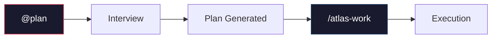

# Maestro Setup Guide

<!--
AGENT-QUICK-SETUP

1. Install plugin using tool's method (see table below)
2. Apply config block to user's global config file
3. Check `bd --version` - if missing, install CLI tools
4. Verify: skills loaded, bd available, Agent Mail configured
5. Run `@plan` to confirm skill loading works
-->

## Plugin Installation

| Tool | Command |
|------|---------|
| **Claude Code** | `/plugin install https://github.com/ReinaMacCredy/maestro` |
| **Amp** | `amp skill add https://github.com/ReinaMacCredy/maestro --global` |
| Codex | `git clone https://github.com/ReinaMacCredy/maestro ~/.codex/plugins/maestro` |
| Cursor | `git clone https://github.com/ReinaMacCredy/maestro ~/.cursor/plugins/maestro` |
| Gemini CLI | `git clone https://github.com/ReinaMacCredy/maestro ~/.gemini/plugins/maestro` |
| Manual | `git clone https://github.com/ReinaMacCredy/maestro <skill-directory>` |

---

## Global Config

Apply the config block below to your agent's global config file:

| Tool | Config Path |
|------|-------------|
| Claude Code | `~/.claude/CLAUDE.md` |
| Amp | `~/.config/amp/AGENTS.md` |
| Codex | `~/.codex/AGENTS.md` |
| Gemini CLI | `~/.gemini/GEMINI.md` |
| Cursor | `~/.cursor/rules/maestro.md` |

Replace any existing `<!-- BEGIN maestro-config -->` block or append:

<!-- BEGIN maestro-config -->
<!-- version: 3.0.0 | atlas | 2026-01-28 -->

## Maestro Workflow

Context-driven development with Atlas workflow system.

### Project Detection

Maestro project if any exist:
- `.atlas/` directory
- `.beads/` directory

When detected, use Atlas workflow commands.

### Triggers

| Category | Triggers |
|----------|----------|
| **Planning** | `@plan`, `ultraplan`, `/atlas-plan` |
| **Execution** | `/atlas-work`, `/ralph-loop`, `@tdd` |
| **Research** | `@oracle`, `@explore`, `@librarian`, `@metis`, `@momus` |
| **Track** | `fb` (file beads), `rb` (review beads), `bd *` (beads CLI) |
| **Session** | `finish branch`, `/cancel-ralph` |

### Session Protocol

**Start:**
```bash
bd ready --json                      # Find work
bd show <id>                         # Read context
bd update <id> --status in_progress  # Claim
```

**End:**
```bash
bd update <id> --notes "COMPLETED: X. NEXT: Y"
bd close <id> --reason completed
bd sync
```

### Critical Rules

- Use `--json` with `bd` for structured output
- Use `--robot-*` with `bv` (bare `bv` hangs)
- Never write production code without failing test first
- Always commit `.beads/` with code changes
- Orchestrator never edits directly - always delegates

<!-- END maestro-config -->

---

## CLI Tools Installation

### Beads CLI (bd)

```bash
# Via pip (recommended)
pip install beads-cli

# Or from source
git clone https://github.com/beads-org/beads-cli
cd beads-cli && pip install -e .
```

### System Dependencies

```bash
# macOS
brew install jq

# Ubuntu/Debian
sudo apt install jq
```

Verify installation:
```bash
bd --version
# Expected: bd version 0.x.x
```

---

## MCP Server Config

### Agent Mail (multi-agent coordination)

**Claude Code:**
```bash
claude mcp add agent-mail -s user -- npx @anthropic-ai/agent-mail
```

**Amp** (`~/.config/amp/settings.json`):
```json
{
  "mcpServers": {
    "agent-mail": {
      "command": "npx",
      "args": ["@anthropic-ai/agent-mail"]
    }
  }
}
```

**Codex** (`~/.codex/mcp.json`):
```json
{
  "servers": {
    "agent-mail": {
      "command": "npx",
      "args": ["@anthropic-ai/agent-mail"]
    }
  }
}
```

---

## MCPorter Toolboxes

CLI wrappers generated from MCP servers via [MCPorter](https://github.com/steipete/mcporter).

### Location

```
toolboxes/
└── agent-mail/
    └── agent-mail.js    # CLI wrapper for Agent Mail
```

### Usage

```bash
# From project root
toolboxes/agent-mail/agent-mail.js <command> [args...]

# Examples
toolboxes/agent-mail/agent-mail.js health-check
toolboxes/agent-mail/agent-mail.js send_message to:BlueLake subject:"Hello"
```

### When to Use

- Agent Mail MCP unavailable but CLI needed
- Scripting multi-agent coordination
- Debugging Agent Mail connectivity

---

## Verification Checklist

| Check | Command | Expected |
|-------|---------|----------|
| Plugin loaded | `@plan test` | Interview mode starts |
| Beads CLI | `bd --version` | Version output |
| Agent Mail (MCP) | `/mcp` (Claude Code) | `agent-mail` listed |
| Agent Mail (CLI) | `toolboxes/agent-mail/agent-mail.js health-check` | OK response |
| Project structure | `ls .atlas/` | `plans/`, `drafts/`, etc. |

---

## Quick Reference



| Action | Command |
|--------|---------|
| Start planning interview | `@plan` or `/atlas-plan` |
| Pre-planning consultation | `@metis` |
| Plan review | `@momus` |
| Execute plan | `/atlas-work` |
| Autonomous mode | `/ralph-loop` |
| Stop autonomous | `/cancel-ralph` |
| See available work | `bd ready --json` |
| Strategic advice | `@oracle` |
| Codebase search | `@explore` |
| External research | `@librarian` |
| TDD implementation | `@tdd` |

---

## Troubleshooting

| Problem | Solution |
|---------|----------|
| Skills not loading | Check plugin directory exists; run `@plan test` |
| `bd: command not found` | Install via `pip install beads-cli` |
| Agent ignores workflow | Use explicit trigger: `@plan`, `@tdd`, `/atlas-work` |
| Agent Mail not working | Check `/mcp` or run CLI health check |
| `bv` hangs | Always use `bv --robot-stdout` (never bare `bv`) |
| Orchestrator editing directly | Bug - orchestrator must always delegate |

> **Note:** Skills work without CLI tools, but `bd` is required for full functionality. See [REFERENCE.md](REFERENCE.md) for fallback policies.

---

## Next Steps

1. Start your first planning session: `@plan`
2. Review the generated plan with: `@momus`
3. Read the full tutorial: [TUTORIAL.md](TUTORIAL.md)
4. Quick command lookup: [REFERENCE.md](REFERENCE.md)
