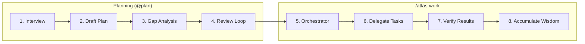
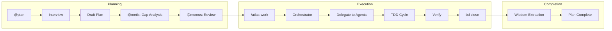

# Maestro: The Complete Guide

> **For humans**: Read this to understand what Maestro does and why it matters.
> **For agents**: See the Quick Reference at the end for triggers.

---

## Why This Exists

AI coding agents are powerful but forgetful. They:
- **Lose context** between sessions (compaction, restarts)
- **Let plans evaporate** into chat history
- **Write tests as afterthoughts** (or not at all)
- **Debug chaotically** without systematic approaches

Maestro solves these problems by giving agents a **structured methodology**:
- Interview-driven planning with specialized agents
- Persistent planning artifacts that survive sessions
- Task()-based delegation with specialized executors
- TDD enforcement and wisdom accumulation

---

## Key Insights (The "Aha" Moments)

1. **"Spend tokens once on a good plan; reuse it many times."**
   Long, fuzzy chats chew context. A structured interview + plan is cheaper to revisit.

2. **"Your project's state lives in git, not in the agent's memory."**
   Chat history is ephemeral. Beads issues persist in `.beads/` and survive compaction.

3. **"Beads are dependency-aware, not a flat todo list."**
   Encode constraints once ("A blocks B"). All later sessions respect them.

4. **"Agents are specialized, not general-purpose."**
   Prometheus interviews, Oracle advises, Kraken does TDD. Each does one thing well.

5. **"Evidence before assertions."**
   Don't claim "tests pass"—show the output. Don't claim "fixed"—show the verification.

---

## Core Concepts

### Atlas Workflow

Atlas is the interview-driven planning and execution system:

| Phase | Agent | Purpose |
|-------|-------|---------|
| **Planning** | `atlas-prometheus` | Interview to clarify requirements |
| **Gap Analysis** | `atlas-metis` | Identify hidden requirements |
| **Review** | `atlas-momus` | Validate plan quality |
| **Execution** | `atlas-orchestrator` | Delegate to specialized agents |
| **Implementation** | `atlas-leviathan/kraken/spark` | Do the actual work |

**State directory:**
```
.atlas/
├── plans/                    # Committed work plans
├── drafts/                   # Interview drafts
├── notepads/                 # Wisdom per plan
└── boulder.json              # Active execution state

.claude/
├── agents/                   # Agent definitions
├── commands/                 # Slash commands
├── plans/                    # Generated execution plans
└── skills/
    └── atlas/                # Main workflow skill
```

### Beads/Tracking (Issue Management)

Beads are persistent, dependency-aware issues that survive session boundaries:

```bash
bd ready --json      # What's unblocked?
bd show <id>         # Read context and notes
bd update <id> --status in_progress
bd close <id> --reason completed
```

The key insight: **notes survive compaction**. Write handoff context there.

### Atlas Agents

Agents are specialized—each does one thing well:

| Agent | Purpose | Trigger |
|-------|---------|---------|
| **atlas-prometheus** | Strategic planner, interview mode | `@plan` |
| **atlas-orchestrator** | Master delegator (never works directly) | `/atlas-work` |
| **atlas-leviathan** | General implementation | (orchestrator delegates) |
| **atlas-kraken** | TDD implementation, heavy refactors | `@tdd` |
| **atlas-spark** | Quick fixes, simple changes | (orchestrator delegates) |
| **atlas-oracle** | Strategic advisor (opus) | `@oracle` |
| **atlas-explore** | Codebase search | `@explore` |
| **atlas-librarian** | External docs/research | `@librarian` |
| **atlas-metis** | Pre-planning consultant | `@metis` |
| **atlas-momus** | Plan reviewer (approves with "OKAY") | `@momus` |

---

## The Atlas Pipeline

Maestro uses a structured pipeline combining planning and execution:



### Phase Details

| # | Phase | Agent | Purpose |
|---|-------|-------|---------|
| 1 | **Interview** | atlas-prometheus | Ask clarifying questions |
| 2 | **Draft Plan** | atlas-prometheus | Generate structured plan |
| 3 | **Gap Analysis** | atlas-metis | Identify hidden requirements |
| 4 | **Review Loop** | atlas-momus | Validate until "OKAY" |
| 5 | **Orchestrate** | atlas-orchestrator | Load plan, delegate work |
| 6 | **Execute** | atlas-leviathan/kraken/spark | Implement tasks |
| 7 | **Verify** | atlas-orchestrator | Verify subagent claims |
| 8 | **Wisdom** | atlas-orchestrator | Extract and persist learnings |

### Agent Selection

When orchestrator delegates, it selects agents based on task type:

| Task Type | Agent | Rationale |
|-----------|-------|-----------|
| TDD, refactor, heavy | `atlas-kraken` | Red-green-refactor cycle |
| Simple, typo, config | `atlas-spark` | Quick fix, minimal overhead |
| General implementation | `atlas-leviathan` | Default executor |

---

## Complete Workflow



**The flow:**
```
@plan → Interview → Plan → /atlas-work → Orchestrate → Execute → Verify
```

### Phase 1-4: Planning (`@plan`)

Start with an interview-driven planning session:

```
User: @plan

Agent (Prometheus): I'll help you plan this feature. Let me ask some questions:
- What problem are you trying to solve?
- Who are the users?
- What are the constraints?

User: [answers questions]

Agent: [creates draft plan]
Agent: Consulting Metis for gap analysis...
Agent: Consulting Momus for review...
Agent: Plan ready in .claude/plans/feature-name.md
```

**Output:** Structured plan in `.claude/plans/`

### Phase 5-8: Execution (`/atlas-work`)

Execute the plan via orchestrator:

```
User: /atlas-work

Agent (Orchestrator): Loading plan from .claude/plans/feature-name.md
  [delegates task 1 to atlas-leviathan]
  [verifies task 1 results]
  [delegates task 2 to atlas-kraken for TDD work]
  [verifies task 2 results]
  ...

Agent: All tasks complete. Wisdom extracted to .atlas/notepads/
```

**TDD Cycle (for atlas-kraken):**
1. **RED** — Write a failing test
2. **GREEN** — Write minimal code to pass
3. **REFACTOR** — Clean up while tests pass

---

## Multi-Session Example

### Session 1: Planning

```
User: @plan Add user invitation system

Agent: [Interview questions...]
Agent: [Creates draft plan]
Agent: [Metis gap analysis]
Agent: [Momus review → OKAY]

Agent: Plan ready. 12 tasks across 3 phases.
       Run /atlas-work to execute.
```

### Session 2: First Phase

```
User: /atlas-work

Agent: Loading plan...
  [Orchestrator delegates Phase 1 tasks]
  [atlas-leviathan: Database schema]
  [atlas-leviathan: API types]
  [Verification complete]

Agent: Phase 1 complete. 4/12 tasks done.
       Continue with next session or /ralph-loop for autonomous.
```

### Session 3: Autonomous Completion

```
User: /ralph-loop

Agent: Starting autonomous execution...
  [Phase 2: API endpoints via atlas-leviathan]
  [Phase 3: Email integration via atlas-kraken]
  [All tasks verified]

Agent: <promise>DONE</promise>
       Plan complete. Wisdom extracted.
```

---

## Autonomous Mode (Ralph Loop)

Ralph Loop enables autonomous execution until completion:

```bash
/ralph-loop       # Start autonomous execution
/cancel-ralph     # Stop if needed
```

**How it works:**
1. Orchestrator loads plan and executes tasks
2. After each task, checks for `<promise>DONE</promise>`
3. If not done, continues to next task
4. Loop terminates when all tasks complete or cancelled

---

## Common Scenarios

### Need Strategic Advice

```
User: @oracle Should we use WebSockets or SSE for real-time updates?

Agent (Oracle): [Deep analysis using opus model]
  - WebSockets: bidirectional, more complex
  - SSE: simpler, sufficient for server→client
  - Recommendation: SSE for your use case because...
```

### Need to Search Codebase

```
User: @explore Where is the authentication middleware?

Agent (Explore): [Searches codebase]
  Found in src/middleware/auth.ts:15
  - Uses JWT validation
  - Called from src/routes/api.ts:42
```

### Need External Documentation

```
User: @librarian How does Next.js 15 handle server components?

Agent (Librarian): [Fetches external docs]
  According to Next.js 15 documentation:
  - Server components are the default
  - Use 'use client' directive for client components
  ...
```

### Already Have a Plan

Skip interview, go straight to execution:

```bash
/atlas-work       # Execute existing plan
```

### Bug Investigation

```
User: @tdd Fix the billing calculation bug

Agent (Kraken): [TDD approach]
  RED: Writing failing test for edge case...
  GREEN: Fixing calculation...
  REFACTOR: Cleaning up...
```

---

## Quick Reference

### For Humans

| Task | Command |
|------|---------|
| Start planning interview | `@plan` |
| Pre-planning consultation | `@metis` |
| Review a plan | `@momus` |
| Execute plan | `/atlas-work` |
| Autonomous execution | `/ralph-loop` |
| Stop autonomous | `/cancel-ralph` |
| Strategic advice | `@oracle` |
| Search codebase | `@explore` |
| External research | `@librarian` |
| TDD implementation | `@tdd` |
| Code review | `@review` |
| Write documentation | `@docs` |
| See available work | `bd ready --json` |

### For Agents: Triggers

| Trigger | Agent | Action |
|---------|-------|--------|
| `@plan`, `ultraplan` | atlas-prometheus | Interview-driven planning |
| `/atlas-work` | atlas-orchestrator | Execute plan via delegation |
| `/ralph-loop` | atlas-orchestrator | Autonomous loop |
| `@oracle` | atlas-oracle | Strategic advice (opus) |
| `@explore` | atlas-explore | Codebase search |
| `@librarian` | atlas-librarian | External docs research |
| `@metis` | atlas-metis | Pre-planning gap analysis |
| `@momus` | atlas-momus | Plan review (approve with OKAY) |
| `@tdd` | atlas-kraken | TDD implementation |
| `@review` | atlas-code-reviewer | Code quality review |
| `@docs` | atlas-document-writer | Technical documentation |
| `fb` | - | File beads from plan |
| `rb` | - | Review beads |

### Critical Rules

1. **No production code without a failing test first** (use `--no-tdd` to disable)
2. **Orchestrator never edits directly** — always delegates via Task()
3. **Verify subagent claims** — agents can make mistakes
4. **Commit `.beads/` with code** — it's your persistent memory
5. **Evidence before assertions** — show test output, don't just claim "tests pass"
6. **Use `--json` with `bd`** — for structured output
7. **Use `--robot-*` with `bv`** — bare `bv` hangs

---

## Troubleshooting

| Issue | Solution |
|-------|----------|
| Agent forgets context | Run `bd show <id>` for notes |
| Plan seems incomplete | Run `@momus` to review |
| Tests pass immediately | You wrote code first. Delete it. Start with failing test. |
| Too many issues | Run `bd ready --json` for unblocked only |
| Orchestrator editing directly | Bug - must always delegate |
| Skill not loading | Use explicit trigger: `@plan`, `/atlas-work`, `@tdd` |
| `bv` hangs | Use `bv --robot-stdout` (never bare `bv`) |
| Agent Mail unavailable | Check `toolboxes/agent-mail/agent-mail.js health-check` |

---

## Tips

### Interview Thoroughly

The better the interview, the better the plan. Answer Prometheus's questions completely.

### Use Metis for Gap Analysis

Before finalizing a plan, `@metis` identifies hidden requirements you might miss.

### Use Momus for Review

Before executing, `@momus` reviews the plan and approves with "OKAY" or requests changes.

### Trust the Pipeline

The Atlas pipeline exists because it works. Interview → Plan → Execute.

### Review Beads Regularly

Run `rb` periodically to catch dependency issues early.

---

## See Also

- [SETUP_GUIDE.md](SETUP_GUIDE.md) — Installation instructions
- [REFERENCE.md](REFERENCE.md) — Complete command reference
- [AGENTS.md](AGENTS.md) — Agent configuration

---

*Built on foundations from [BMAD-METHOD](https://github.com/bmadcode/BMAD-METHOD), [conductor](https://github.com/cyanheads/conductor), [beads](https://github.com/beads-org/beads), and [Agent Mail](https://github.com/agent-mail/agent-mail).*
