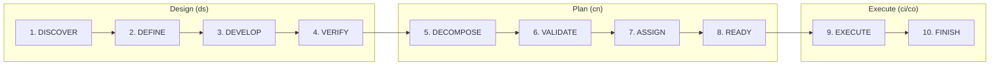
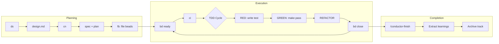

# Maestro: The Complete Guide

> **For humans**: Read this to understand what Maestro does and why it matters.  
> **For agents**: See the Quick Reference at the end for triggers.

---

## Why This Exists

AI coding agents are powerful but forgetful. They:
- **Lose context** between sessions (compaction, restarts)
- **Let plans evaporate** into chat history
- **Write tests as afterthoughts** (or not at all)
- **Debug chaotically** without systematic approaches

Maestro solves these problems by giving agents a **structured methodology**:
- Persistent planning artifacts that survive sessions
- Dependency-aware issue tracking
- Consistent workflows with TDD enforcement
- Context handoffs that bridge session boundaries

---

## Key Insights (The "Aha" Moments)

1. **"Spend tokens once on a good plan; reuse it many times."**  
   Long, fuzzy chats chew context. A structured spec+plan is cheaper to revisit.

2. **"Your project's state lives in git, not in the agent's memory."**  
   Chat history is ephemeral. Beads issues persist in `.beads/` and survive compaction.

3. **"Beads are dependency-aware, not a flat todo list."**  
   Encode constraints once ("A blocks B"). All later sessions respect them.

4. **"Skills are mental modes, not just commands."**  
   Invoking `tdd` or `ds` switches the agent into a specific methodology.

5. **"Evidence before assertions."**  
   Don't claim "tests pass"—show the output. Don't claim "fixed"—show the verification.

---

## Core Concepts

### Conductor (Planning)

Conductor creates structured planning artifacts that persist across sessions:

| Artifact | Purpose | Created By |
|----------|---------|------------|
| `design.md` | High-level architecture decisions | `ds` |
| `spec.md` | Requirements and acceptance criteria | `/conductor-newtrack` |
| `plan.md` | Task breakdown with status markers | `/conductor-newtrack` |
| `metadata.json` | Track state and validation info | `/conductor-newtrack` |

**Directory structure:**
```
conductor/
├── product.md              # Product context
├── tech-stack.md           # Technology choices
├── workflow.md             # Workflow preferences
├── CODEMAPS/               # Architecture docs
├── handoffs/               # Session context
│   └── <track>/
└── tracks/<track-id>/      # Per-track work
    ├── design.md
    ├── spec.md
    ├── plan.md
    └── metadata.json
```

### Beads/Tracking (Issue Management)

Beads are persistent, dependency-aware issues that survive session boundaries:

```bash
bd ready --json      # What's unblocked?
bd show <id>         # Read context and notes
bd update <id> --status in_progress
bd close <id> --reason completed
```

The key insight: **notes survive compaction**. Write handoff context there.

### Skills (Mental Modes)

Skills aren't scripts—they're methodologies the agent adopts:

| Skill | Trigger | What It Does |
|-------|---------|--------------| 
| **designing** | `ds` | Double Diamond design session |
| **conductor** | `ci`, `tdd` | TDD implementation |
| **tracking** | `fb`, `rb` | File/review beads |
| **orchestrator** | `co` | Multi-agent parallel execution |
| **handoff** | `ho` | Session context preservation |

---

## The 10-Phase Unified Pipeline

Maestro uses a unified pipeline that combines design and planning:



### Phase Details

| # | Phase | Type | Purpose | Exit Criteria |
|---|-------|------|---------|---------------|
| 1 | **DISCOVER** | Diverge | Explore problem + research context | Problem articulated |
| 2 | **DEFINE** | Converge | Frame problem + select approach | Approach selected |
| 3 | **DEVELOP** | Diverge | Architecture + components | Interfaces defined |
| 4 | **VERIFY** | Converge | Oracle audit + risk assessment | Oracle APPROVED |
| 5 | **DECOMPOSE** | Execute | Create beads (`fb`) | Beads filed |
| 6 | **VALIDATE** | Execute | Dependency check (`bv`) + Oracle review | Dependencies valid |
| 7 | **ASSIGN** | Execute | Track assignments | Tracks assigned |
| 8 | **READY** | Complete | Handoff to `ci`/`co` | Execution ready |
| 9 | **EXECUTE** | Implement | Run implementation | All beads completed |
| 10 | **FINISH** | Archive | Extract learnings | Track archived |

### Mode Routing

Complexity scoring determines execution mode:

| Score | Mode | Phases | Behavior |
|-------|------|--------|----------|
| < 4 | **SPEED** | 1,2,4,8 | Skip beads, advisory verification |
| 4-6 | **ASK** | User chooses | Optional A/P/C checkpoints |
| > 6 | **FULL** | All 10 | Full A/P/C, mandatory verification |

### A/P/C Checkpoints

At the end of phases 1-4 (FULL mode), you'll see:

```
[A] Advanced - Phase-specific deep dive
[P] Party    - Multi-agent feedback (BMAD v6)
[C] Continue - Proceed to next phase
[↩ Back]     - Return to previous phase
```

| After Phase | [A] Option |
|-------------|------------|
| 1 (DISCOVER) | Advanced assumption audit |
| 2 (DEFINE) | Scope stress-test |
| 3 (DEVELOP) | Architecture deep-dive |
| 4 (VERIFY) | Oracle runs automatically |

### Oracle Audit (Phase 4)

At Phase 4, the Oracle performs a 6-dimension review:

1. **Completeness** — All topics covered?
2. **Accuracy** — Aligned with current project state?
3. **Redundancy** — Overlapping content?
4. **Missing pieces** — Important gaps?
5. **Feasibility** — Can this be built?
6. **Risk** — What could go wrong?

The Oracle must APPROVE before proceeding. On HALT, address feedback first.

---

## Complete Workflow



**The flow:**
```
ds → /conductor-newtrack → /conductor-implement → /conductor-finish
```

### Phase 1-4: Design (`ds`)

Start with a Double Diamond design session:

```
User: ds

Agent: I'll help you design a new feature. What would you like to build?

User: User invitation system for our SaaS

Agent: [asks clarifying questions - one at a time]
Agent: [explores 2-3 approaches with trade-offs]
Agent: [presents design in sections for approval]
Agent: Design captured in design.md. Ready to create track?
```

**Output:** `conductor/tracks/<id>/design.md`

### Phase 5-8: Create Track (`cn` or `/conductor-newtrack`)

Convert design into actionable artifacts:

```
User: cn

Agent: [reads design.md]
Agent: [creates spec.md with acceptance criteria]
Agent: [creates plan.md with task breakdown]
Agent: [runs fb to create beads]
Agent: [runs rb to review dependencies]

Agent: Planning complete. 12 issues across 3 epics:
  • E1: Database schema (3 tasks, unblocked)
  • E2: API endpoints (5 tasks, blocked by E1)
  • E3: Email integration (4 tasks, blocked by E2)
```

**Output:** `spec.md`, `plan.md`, beads in `.beads/`

### Phase 9: Implement (`ci` or `/conductor-implement`)

Execute the plan with TDD (enabled by default):

```
User: ci

Agent: Executing E1: Database schema
  [claims inv-001: Create invitations table]
  [TDD: writes failing test]
  [TDD: implements to pass]
  [TDD: refactors]
  [closes inv-001]
  [claims inv-002...]
```

**TDD Cycle:**
1. **RED** — Write a failing test
2. **GREEN** — Write minimal code to pass
3. **REFACTOR** — Clean up while tests pass

Disable TDD with `--no-tdd` flag when appropriate.

### Phase 10: Finish (`/conductor-finish`)

Complete the track and extract learnings:

```
User: /conductor-finish

Agent: [verifies all beads closed]
Agent: [verifies tests passing]
Agent: [extracts learnings to AGENTS.md]
Agent: [archives track]
Agent: Track complete. Learnings extracted.
```

---

## Multi-Session Example

### Session 1: Design and Planning

```
User: ds

Agent: What would you like to design?

User: User invitation system

Agent: [Double Diamond session...]
Agent: Design captured. Create track?

User: yes

Agent: [creates spec + plan + beads]
Agent: Planning complete. 12 issues, 3 epics.
       E1 ready (unblocked).

User: ho

Agent: 📋 Handoff saved: invitations (design-end)
```

### Session 2: First Epic

```
Agent: 📋 Prior context: invitations (2h ago)

User: ci

Agent: Executing E1: Database schema
  [TDD cycle for inv-001]
  [TDD cycle for inv-002]
  [TDD cycle for inv-003]

Agent: Epic E1 complete. 3/12 done. Continue to E2?

User: no, stopping

Agent: 📋 Handoff saved: invitations (epic-end)
```

### Session 3: Continue and Finish

```
Agent: 📋 Prior context: invitations E1 complete (16h ago)

User: continue

Agent: Executing E2: API endpoints (now unblocked)
  [TDD cycles...]

Agent: E2 complete. E3 next?

User: yes

Agent: [E3 TDD cycles...]
Agent: All epics complete.

User: /conductor-finish

Agent: ✓ All beads closed
       ✓ Tests passing
       ✓ Learnings extracted
       Track archived.
```

---

## Handoff System

### The Problem

AI agents forget everything between sessions. Context windows fill up, sessions end, and the next agent starts from scratch.

### The Solution

Handoff persists context in **files that outlive sessions**:

| Artifact | What It Preserves |
|----------|-------------------|
| `design.md` | Architecture decisions, trade-offs |
| `spec.md` | Requirements, acceptance criteria |
| `plan.md` | Tasks with `[x]`/`[ ]` status |
| `.beads/` | Issues with notes field (key!) |
| `conductor/handoffs/` | Session snapshots |

### Handoff Triggers

| Trigger | When | Automatic |
|---------|------|-----------|
| `design-end` | After `/conductor-newtrack` | ✅ |
| `epic-start` | Before each epic | ✅ |
| `epic-end` | After epic closes | ✅ |
| `pre-finish` | Start of `/conductor-finish` | ✅ |
| `manual` | User runs `ho` | ❌ |
| `idle` | 30min gap detected | ✅ (prompted) |

### Commands

```bash
ho                    # Auto-detect (create or resume)
/conductor-handoff create   # Force save
/conductor-handoff resume   # Force load
```

### Writing Good Handoff Notes

The beads **notes field** is your session-to-session memory:

```bash
bd update <id> --notes "COMPLETED: Auth middleware. IN PROGRESS: Token refresh. NEXT: Add edge case tests."
```

Write like you're leaving instructions for yourself in two weeks with zero context.

---

## BMAD/Party Mode

**BMAD v6** provides multi-agent feedback through simulated expert personas.

When you select **[P] Party** at an A/P/C checkpoint:

1. System spawns 3-5 expert personas
2. Each reviews from their specialty (architect, PM, QA, etc.)
3. Feedback is synthesized into actionable items
4. You decide what to incorporate

**When to use Party:**
- Major architectural decisions
- Scope uncertainty
- Risk assessment needed
- Before committing to expensive approaches

---

## Common Scenarios

### Already Have a Plan

Skip design, go straight to beads:

```bash
fb                    # File beads from existing plan
bd ready --json       # See what's unblocked
ci                    # Execute with TDD
```

### Bug Investigation

```bash
bd create "Investigate billing 500" -t bug -p 0
tdd                   # Fix with TDD
bd close <id> --reason completed
```

### Track in Bad State

Validate and see issues:

```bash
/conductor-validate <track-id>
```

### Parallel Execution

When plan.md has Track Assignments:

```bash
co                    # Spawn parallel workers
```

Workers coordinate via Agent Mail, reserve files, report back.

---

## Quick Reference

### For Humans

| Task | Command |
|------|---------|
| Start design | `ds` |
| Create track | `cn` or `/conductor-newtrack` |
| See ready work | `bd ready --json` |
| Start implementation | `ci` or `/conductor-implement` |
| Parallel workers | `co` or `/conductor-orchestrate` |
| Autonomous mode | `ca` or `/conductor-autonomous` |
| Save context | `ho` or `/conductor-handoff` |
| Complete track | `/conductor-finish` |

### For Agents: Triggers

| Trigger | Skill | Action |
|---------|-------|--------|
| `ds` | designing | Double Diamond (phases 1-10) |
| `cn` | designing | Create track (phases 5-10) |
| `pl` | designing | Planning only (phases 5-10) |
| `fb` | tracking | File beads from plan |
| `rb` | tracking | Review beads |
| `ci` | conductor | Execute track with TDD |
| `co` | orchestrator | Spawn parallel workers |
| `ca` | conductor | Autonomous (Ralph) mode |
| `tdd` | conductor | RED-GREEN-REFACTOR cycle |
| `ho` | handoff | Save/load session context |
| `finish branch` | conductor | Finalize and merge/PR |

### Critical Rules

1. **No production code without a failing test first** (use `--no-tdd` to disable)
2. **Always checkpoint before session end** — notes field survives compaction
3. **Commit `.beads/` with code** — it's your persistent memory
4. **Evidence before assertions** — show test output, don't just claim "tests pass"
5. **Use `--json` with `bd`** — for structured output
6. **Use `--robot-*` with `bv`** — bare `bv` hangs

---

## Troubleshooting

| Issue | Solution |
|-------|----------|
| Agent forgets context | Run `bd show <id>` for notes |
| Plan seems incomplete | Run `rb` to review beads |
| Tests pass immediately | You wrote code first. Delete it. Start with failing test. |
| Too many issues | Run `bd ready --json` for unblocked only |
| Track in bad state | Run `/conductor-validate <track-id>` |
| Skill not loading | Use explicit trigger: `ds`, `ci`, `tdd` |
| `bv` hangs | Use `bv --robot-stdout` (never bare `bv`) |
| Agent Mail unavailable | Check `toolboxes/agent-mail/agent-mail.js health-check` |

---

## Tips

### Plan Before Each Epic

Before `ci`, let the agent strategize about the approach.

### Use Handoffs Liberally

Better to create too many handoffs than lose context.

### Trust the Pipeline

The 10-phase pipeline exists because it works. Don't skip phases unless you're in SPEED mode.

### Review Beads Regularly

Run `rb` periodically to catch dependency issues early.

---

## See Also

- [SETUP_GUIDE.md](SETUP_GUIDE.md) — Installation instructions
- [REFERENCE.md](REFERENCE.md) — Complete command reference
- [AGENTS.md](AGENTS.md) — Agent configuration

---

*Built on foundations from [BMAD-METHOD](https://github.com/bmadcode/BMAD-METHOD), [conductor](https://github.com/cyanheads/conductor), [beads](https://github.com/beads-org/beads), and [Agent Mail](https://github.com/agent-mail/agent-mail).*
