# Maestro: The Complete Guide

> **For humans**: Read this to understand what these skills do and why they matter.
> **For agents**: See the Quick Reference at the end for copy-paste triggers.

---

## Why This Exists

You're using AI coding agents to write code. That's great. But you've probably noticed some problems:

**The agent forgets what it was doing.** You come back the next day and it has no memory of yesterday's work. You have to re-explain everything.

**Plans evaporate into chat.** You discuss a feature for 20 minutes, then the agent jumps into coding without capturing what you agreed on. When context compacts, all that planning disappears.

**There's no clear "what's next."** You have 15 half-baked ideas but no structured way to see dependencies, blockers, or which task actually matters most.

**Tests are an afterthought.** The agent writes code first, maybe adds tests later. Those tests pass immediately, proving nothing.

**Debugging is chaotic.** When something breaks, the agent proposes random fixes instead of systematically tracing the problem.

**This plugin solves all of these problems.**

---

## Key Insights (Aha Moments)

Before diving in, understand these principles:

1. **"Spend tokens once on a good plan; reuse it many times."**
   Long, fuzzy chats chew context. A structured spec+plan document is cheaper to revisit.

2. **"Your project's state lives in git, not in Claude's memory."**
   Chat history is ephemeral. Beads issues persist in `.beads/` and survive compaction.

3. **"Beads are dependency-aware, not a flat todo list."**
   You encode constraints once ("A blocks B"). All later sessions respect them.

4. **"Skills are mental modes, not just commands."**
   Invoking `tdd` or `debug` switches the agent into a specific methodology, not just runs a script.

5. **"Evidence before assertions."**
   Don't claim "tests pass" — show the passing output. Don't claim "fixed" — show the verification.

---

## What Problem Does Each Skill Solve?

| Problem                      | What Happens                            | Skill That Fixes It                                |
| ---------------------------- | --------------------------------------- | -------------------------------------------------- |
| **Amnesia**                  | Agent forgets tasks between sessions    | `beads` — persistent issue tracking                |
| **Fuzzy planning**           | Vague discussions, no written spec      | `conductor` — structured specs + plans             |
| **No visibility**            | Can't see dependencies or blockers      | `beads` — dependency-aware graph                   |
| **Tests as afterthought**    | Tests written after code, prove nothing | `test-driven-development` — RED-GREEN-REFACTOR     |
| **Messy handoffs**           | Can't resume where you left off         | `beads` notes — session-surviving context          |
| **Conflicts in multi-agent** | Multiple agents edit same files         | `beads` + Village — file locking and task claiming |

These skills work together as a system, not a bag of independent tools.

---

## Part 2: The Core Workflow

The spine of Maestro is three components working together:

```
Conductor (Planning) → Beads + Village (Tracking & Coordination) → TDD (Execution)
```

Everything else in the plugin supports this core pipeline.

For detailed workflow architecture diagrams, see [docs/PIPELINE_ARCHITECTURE.md](./docs/PIPELINE_ARCHITECTURE.md).

---

## What is Handoff?

**Handoff** is the structured transfer of work between AI sessions. It's the core concept that makes multi-session development possible.

### The Fundamental Problem

AI coding assistants forget everything between sessions:

| What Happens                          | The Problem                                       |
| ------------------------------------- | ------------------------------------------------- |
| Context window fills up               | Earlier conversation gets "compacted" (forgotten) |
| Session ends (timeout, crash, closed) | All context is lost                               |
| New session starts                    | Agent has no memory of previous work              |
| You re-explain everything             | Wastes time, loses nuance                         |

### How Handoff Solves It

Handoff persists work context in **files that outlive sessions**:

```
Session 1 (Planning):
  Preflight: Mode detect (SA/MA), validate bd
  ds → design.md
  /conductor-newtrack → spec.md + plan.md + AUTO: epic + issues
  → HANDOFF (planning complete, ready for execution)

Session 2+ (Execution):
  Preflight: Resume session state
  /conductor-implement → AUTO: claim → TDD → close → sync
  → HANDOFF (epic complete)

Session 3+:
  /conductor-implement → execute Epic 2
  → HANDOFF (epic complete)
  ...continue until all epics done
```

Every artifact is a **checkpoint**. Handoff happens after planning completes, then again after each epic.

### Handoff Artifacts in Maestro

| Artifact | What It Preserves | Created By |
| -------- | ----------------- | ---------- |
| `design.md` | Architecture decisions, trade-offs | `/conductor-design` |
| `spec.md` | Requirements, acceptance criteria | `/conductor-newtrack` |
| `plan.md` | Task breakdown, status markers | `/conductor-newtrack` |
| `.beads/` | Issues, dependencies, notes | Auto via facade |
| `metadata.json` | Track state + planTasks mapping | `/conductor-newtrack` |
| `LEDGER.md` | Session state (mode, bound_track, bound_bead, tdd_phase) | Auto via facade |

### The Handoff Protocol

**At session end:**

```bash
bd update <id> --notes "COMPLETED: X. IN PROGRESS: Y. NEXT: Z."
git add -A && git commit -m "progress on feature"
git push
```

**At session start:**

```bash
bd ready --json          # What's unblocked?
bd show <id>             # Read notes for full context
```

The **notes field** is your session-to-session memory. Write it like leaving instructions for yourself in two weeks with zero context.

### Real-World Handoff Example

Here's an actual handoff block from a beads consolidation project. This context was passed from Session 1 (planning) to Session 2 (implementation):

```text
Continuing work from thread T-019b5488-3fb5-732f-821f-3c52476097da.

@conductor/tracks/beads-consolidation_20251225/plan.md
@conductor/tracks/beads-consolidation_20251225/spec.md
@conductor/tracks/beads-consolidation_20251225/design.md
@skills/beads/SKILL.md

- I completed a design session (ds) to consolidate 3 beads-related skills
  (beads, file-beads, review-beads) into a unified architecture
- I then ran file-beads (fb) to create 5 epics with 19 tasks total
- I ran review-beads (rb) which reviewed all 19 issues, added descriptions,
  acceptance criteria, and cross-epic dependencies
- All issues now have the "reviewed" label and proper blocking dependencies

Key decisions from design:
- Merge all 3 skills into 1 thin skill entry point at skills/beads/SKILL.md
- Move all logic to skills/beads/references/ directory
- Keep workflow.md lowercase (main entry point), UPPERCASE for supporting docs
- Delete skills/file-beads/, skills/review-beads/ after migration

5 epics to implement in order:
- my-workflow:3-9f7: Create Workflow Structure (6 tasks)
- my-workflow:3-v3g: Create Thin Skill (1 task)
- my-workflow:3-lyy: Delete Old Skills (4 tasks) - blocked by epics 1-2
- my-workflow:3-2nr: Update Documentation (3 tasks)
- my-workflow:3-qfm: Verification (5 tasks) - blocked by epics 1-4

First ready task: my-workflow:3-902n - Create skills/beads/references/ directory
```

**What makes this effective:**

| Element | Purpose |
| ------- | ------- |
| File references (`@path`) | Points to persistent artifacts the new session can read |
| Completed steps | Shows what's already done (ds, fb, rb) |
| Key decisions | Preserves architectural choices that shouldn't be re-debated |
| Epic summary with IDs | Concrete next steps with beads references |
| Blocking info | Execution order is clear |
| First ready task | Immediate action item |

**The pattern**: Summarize what happened, reference the files, list the decisions, identify next action.

### Another Example: Planning to Review Handoff

This handoff passes context from design/filing to the review phase:

```text
Continuing work from thread T-019b5487-c1f9-73dd-9620-0a746d3687c5.

@conductor/tracks/beads-consolidation_20251225/plan.md
@conductor/tracks/beads-consolidation_20251225/spec.md
@conductor/tracks/beads-consolidation_20251225/design.md
@skills/beads/SKILL.md
@skills/file-beads/SKILL.md
@skills/review-beads/SKILL.md

I completed a design session (ds) to consolidate 3 beads-related skills
(beads, file-beads, review-beads) into a unified architecture.

Key decisions from the design session:
- Merge all 3 skills into 1 thin skill entry point at skills/beads/SKILL.md
- Move all logic to skills/beads/references/ directory
- Rename file-beads.md to FILE_BEADS.md and review-beads.md to REVIEW_BEADS.md
- Put FILE_BEADS.md and REVIEW_BEADS.md inside skills/beads/references/
- Keep workflow.md lowercase (main entry point), UPPERCASE for supporting docs
- Delete skills/file-beads/, skills/review-beads/ after migration
- Update 14 documentation files that reference file-beads/review-beads

Final structure:
- skills/beads/SKILL.md - thin stub with Entry Points table
- skills/beads/references/workflow.md - main beads logic (bd trigger)
- skills/beads/references/FILE_BEADS.md - fb logic
- skills/beads/references/REVIEW_BEADS.md - rb logic

5 epics created:
- my-workflow:3-9f7: Create Workflow Structure (6 tasks)
- my-workflow:3-v3g: Create Thin Skill (1 task)
- my-workflow:3-lyy: Delete Old Skills (4 tasks)
- my-workflow:3-2nr: Update Documentation (3 tasks)
- my-workflow:3-qfm: Verification (5 tasks)

Hard links exist between skills/ and .claude/skills/ (same inode) -
updating one updates both.

Now I want to run rb (review-beads) to review and refine the filed beads
before implementation.

rb
```

**Key differences from implementation handoff:**

| Element | Purpose |
| ------- | ------- |
| More file references | Review needs access to original skill files being consolidated |
| Detailed key decisions | Reviewer needs full context to validate beads match design intent |
| Final structure preview | Shows target state for validation |
| Technical note (hard links) | Prevents errors during implementation |
| Explicit next action (`rb`) | Tells receiving session exactly what to do |

### Why This Works Without Amp

This pattern works with any AI coding tool:

- **Claude Code**: Uses `.beads/` and conductor files
- **Cursor/Windsurf**: Same files, same workflow
- **GitHub Copilot**: Can read the same markdown artifacts
- **Any future tool**: Files are plain markdown and JSON

**The key insight**: Your project's state lives in **git**, not in any AI's memory.

---

## Beads-Conductor Integration: Zero Manual Commands

When using Conductor commands, **you never need to run manual bd commands** in the happy path. Conductor automates the entire beads lifecycle through a facade pattern.

### Automatic Integration Points

| Conductor Command | What Beads Does (Automatically) |
|-------------------|--------------------------------|
| All commands | Preflight: checks bd availability, detects mode (SA/MA), creates session state |
| `/conductor-newtrack` | Creates epic + issues from plan.md, wires dependencies, updates planTasks mapping |
| `/conductor-implement` | Claims task, tracks TDD checkpoints (if `--tdd`), closes on completion |
| `/conductor-finish` | Compacts closed issues with AI summaries, cleans up old issues (>150 threshold) |
| `/conductor-status` | Syncs Conductor state with beads state, detects discrepancies |
| `/conductor-revise` | Reopens affected beads when spec/plan changes |

### How It Works

```text
/conductor-implement auth_20251225
│
├─ Preflight
│   └─ Check bd available, detect SA mode, create session state
│
├─ Claim Task
│   └─ (automatic) bd update <id> --status in_progress
│
├─ Work with TDD (if --tdd flag)
│   ├─ RED checkpoint: bd update --notes "RED phase..."
│   ├─ GREEN checkpoint: bd update --notes "GREEN phase..."
│   └─ REFACTOR checkpoint: bd update --notes "REFACTOR phase..."
│
├─ Close Task
│   └─ (automatic) bd close <id> --reason completed
│
└─ Sync (at session end)
    └─ (automatic) bd sync with retry
```

### When Manual bd IS Appropriate

You only need manual `bd` commands for:

- **Ad-hoc queries**: `bd search`, `bd list`, `bd show <id>`
- **Direct issue creation** outside Conductor flow
- **Debugging**: checking issue state, dependencies
- **Recovery** from failed automated operations

### Session State Files

The integration uses these files (auto-managed):

| File | Purpose |
|------|---------|
| `conductor/sessions/active/LEDGER.md` | Session state in frontmatter (mode, bound_track, bound_bead, tdd_phase) |
| `.conductor/session-lock_<track>.json` | Prevents concurrent sessions on same track |
| `conductor/tracks/<id>/metadata.json` | Track state + bidirectional mapping: plan task IDs ↔ bead IDs |

### SA vs MA Mode

| Mode | When | Operations |
|------|------|------------|
| **SA** (Single-Agent) | Default | Direct `bd` CLI calls |
| **MA** (Multi-Agent) | Village MCP available | Atomic claims, file reservations, handoffs |

Mode is detected at session start and locked for the session.

---

### A/P/C Checkpoints

Each phase ends with **A/P/C checkpoints**:

- **[A] Advanced** — Deeper analysis, challenge assumptions
- **[P] Party** — Multi-agent collaborative review (see Party Mode below)
- **[C] Continue** — Proceed to next phase
- **[↩ Back]** — Return to previous phase

#### Party Mode (Multi-Agent Review)

When you select `[P]` at an A/P/C checkpoint, Party Mode activates 2-3 expert agents for collaborative feedback:

| Module    | Agents                                                                                             |
| --------- | -------------------------------------------------------------------------------------------------- |
| **Core**  | BMad Master (Orchestrator)                                                                         |
| **BMM**   | John (PM), Mary (Analyst), Winston (Architect), Amelia (Dev), Bob (SM), Murat (QA), Sally (UX), Paige (Docs), Barry (Quick Flow) |
| **CIS**   | Carson (Brainstorm), Dr. Quinn (Problem Solver), Maya (Design Thinking), Victor (Innovation), Caravaggio (Presentation), Sophia (Storyteller) |

Agents respond in character, cross-talk, then synthesize insights. See `skills/design/references/bmad/workflows/party-mode/workflow.md` for details.

#### Design Tips: Getting Better Edge Case Coverage

During design sessions, use these phrases to get more thorough analysis:

| Say This                         | Agent Will                                |
| -------------------------------- | ----------------------------------------- |
| "stress test this design"        | Challenge assumptions, find failure modes |
| "what could go wrong?"           | Identify edge cases and error scenarios   |
| "consider concurrent access"     | Think about race conditions, locks        |
| "what if the user does X wrong?" | Explore invalid input handling            |
| "scale this to 10x"              | Find performance bottlenecks              |
| "security review"                | Check for vulnerabilities                 |

**Pro tip**: During A/P/C checkpoints, select **[A] Advanced** for automatic stress testing, or **[P] Party** to get multiple expert agents challenging your design. You can also just say "stress test" at any point to trigger edge case analysis.

**For humans**:

- Think of it as the "measure twice, cut once" step
- You'll answer 3-5 clarifying questions, then get a structured spec and phased plan
- The output lives in `conductor/tracks/<track_id>/` and persists across sessions

**For agents**:

- When user says "new feature" or "build X", prefer `/conductor-newtrack <description>`
- Always ask clarifying questions before generating specs
- Confirm summaries before generating large artifacts
- Output: `spec.md` (requirements + acceptance criteria) and `plan.md` (phased tasks)

**The 4-Phase Framework**:

| Phase            | Question to Answer                            | Conductor Output        |
| ---------------- | --------------------------------------------- | ----------------------- |
| **Requirements** | "Does the AI understand what we're building?" | Questions → `spec.md`   |
| **Plan**         | "Does this plan fit our architecture?"        | `spec.md` → `plan.md`   |
| **Implement**    | "Can this be tested independently?"           | Execute via beads + TDD |
| **Reflect**      | "Would I bet my job on this code?"            | Verify + close          |

**Directory Structure**:

```
conductor/
├── product.md          # Product vision, users, goals
├── tech-stack.md       # Technology choices
├── workflow.md         # Development standards (TDD, commits)
├── tracks.md           # Master track list with status
├── AGENTS.md           # Learnings hub (auto-updated by /conductor-finish)
└── tracks/
    └── auth_20251215/  # Track directory
        ├── design.md   # High-level design (from /conductor-design)
        ├── spec.md     # Requirements and acceptance criteria
        ├── plan.md     # Phased task list with status
        └── revisions.md # Revision history log (if any)
```

---

### Beads — Persistent Issue Tracking

**What it is**: A git-backed issue tracker that persists tasks across sessions and tracks dependencies.

**Why you need it**: It turns Conductor's plans into durable, executable steps that exist outside any one session. Chat history compacts; beads survive.

**Key insight**: Beads is the execution queue; Conductor is the blueprint.

**For humans**:

- Think of it as a todo list that understands "I can't do X until Y is done"
- Issues live in `.beads/` and get committed with your code
- Come back in 2 weeks, run `bd ready`, and pick up where you left off

**For agents**:

- After Conductor creates `plan.md`, immediately use `fb` (file beads) to convert it to issues
- At session start: `bd ready --json` to see what's unblocked
- At session end: Update notes with COMPLETED/IN_PROGRESS/NEXT format
- Always commit `.beads/` with code changes

**Core Commands**:

```bash
# Finding work
bd ready --json              # What's unblocked and ready?
bd blocked --json            # What's waiting on dependencies?
bd list --status in_progress # What's currently active?

# Working on issues
bd update bd-42 --status in_progress   # Claim a task
bd show bd-42                          # Read full context
bd close bd-42 --reason "Completed"    # Mark done

# Dependencies
bd dep add bd-child bd-blocker --type blocks   # A blocks B
bd dep add bd-new bd-current --type discovered-from  # Found during work
```

**What Survives Compaction**:

| Survives                            | Doesn't Survive      |
| ----------------------------------- | -------------------- |
| All bead data (issues, notes, deps) | Conversation history |
| Complete work history               | TodoWrite lists      |
| Key decisions in notes              | Recent discussion    |

**Writing Good Notes** (for post-compaction recovery):

```
COMPLETED: Specific deliverables ("implemented JWT refresh + rate limiting")
IN PROGRESS: Current state + next step ("testing reset flow, need email template")
BLOCKERS: What's preventing progress
KEY DECISIONS: Important context ("RS256 over HS256 per security review")
NEXT: Immediate next action
```

---

### Village — Multi-Agent Coordination

**What it is**: MCP server that adds atomic task claiming, file locking, and agent messaging to Beads.

**Why you need it**: When multiple Claude instances work on the same codebase, they can step on each other. Village prevents conflicts through file reservations and ensures only one agent claims each task.

**Key insight**: Single-agent workflows work fine without Village. Multi-agent workflows require it.

**For humans**:

- Think of it as "mutex locks for AI agents"
- One agent reserves a file, others wait or work on something else
- Tasks are claimed atomically — no two agents grab the same work

**For agents**:

- At session start: `init` to join workspace with your role
- Before work: `claim` to atomically get a task (replaces manual selection)
- Before editing: `reserve` to lock files
- When done: `done` releases locks and notifies team
- If blocked on a file: `msg` the owner, `inbox` to check responses

**Core Commands**:

```
# Joining and claiming
init team="backend" role="be"     # Join as backend developer
claim                              # Get next ready task for your role

# File coordination
reserve path="src/auth.ts"        # Lock file for editing (10 min TTL)
release path="src/auth.ts"        # Release when done

# Task completion
done id="bd-42" msg="Implemented JWT refresh"  # Complete + release all locks

# Communication
msg to="frontend" content="API ready"  # Direct message
inbox                              # Read your messages
status                             # See team state and locks
```

---

### TDD — Safe Execution

**What it is**: RED-GREEN-REFACTOR methodology for implementing each task.

**Why you need it**: Tests written after code pass immediately, proving nothing. Tests written first prove the test actually catches the bug.

**Key insight**: If you didn't watch the test fail, you don't know if it tests the right thing.

**For humans**:

- Every feature starts with a failing test
- Code is written to make the test pass, nothing more
- Refactoring happens only after tests are green

**For agents**:

- **Iron Law**: No production code without a failing test first
- Write code before the test? Delete it. Start over.
- Don't keep it as "reference" or "adapt" it — delete means delete

**The Cycle**:

```
RED     → Write one failing test (watch it fail)
GREEN   → Write minimal code to pass (watch it pass)
REFACTOR → Clean up (stay green)
REPEAT  → Next failing test
```

**Verification Checklist**:

- [ ] Every new function has a test
- [ ] Watched each test fail before implementing
- [ ] Failed for expected reason (feature missing, not typo)
- [ ] Wrote minimal code to pass
- [ ] All tests pass
- [ ] Output pristine (no errors, warnings)

---

### How They Connect

```
┌─────────────────────────────────────────────────────────────┐
│                    PREFLIGHT (automatic)                     │
│  Mode detect (SA/MA) → Validate bd → Create session state   │
└─────────────────────────────────────────────────────────────┘
                           ↓
┌─────────────────────────────────────────────────────────────┐
│                      CONDUCTOR                               │
│  /conductor-newtrack "Add user auth"                        │
│       ↓                                                      │
│  Questions → spec.md → plan.md                              │
│       ↓                                                      │
│  AUTO: Create epic + issues (metadata.json.beads)           │
└─────────────────────────────────────────────────────────────┘
                           ↓
┌─────────────────────────────────────────────────────────────┐
│                    BEADS (via facade)                        │
│  bd-001: Set up OAuth credentials                           │
│  bd-002: Implement auth flow (blocked by bd-001)            │
│  bd-003: Add token refresh (blocked by bd-002)              │
└─────────────────────────────────────────────────────────────┘
                           ↓
                    bd ready → pick bd-001
                    AUTO: claim (bd update --status in_progress)
                    reserve (MA mode only)
                           ↓
┌─────────────────────────────────────────────────────────────┐
│                    TDD (--tdd flag)                          │
│  RED:    test('OAuth credentials are configured')           │
│  GREEN:  Implement credential loading                        │
│  REFACTOR: Extract config helper                            │
│  (each phase: AUTO checkpoint to beads notes)               │
└─────────────────────────────────────────────────────────────┘
                           ↓
                    AUTO: close (bd close --reason completed)
                    AUTO: sync (bd sync with retry)
                           ↓
                    bd-002 becomes ready
```

**The Bridge Sentence**: Conductor turns ideas into structured documents. The facade automatically converts plans into trackable beads issues. Beads becomes your source of truth for "what's next." TDD describes _how_ to execute each issue safely.

---

### Epic Execution Flow

When implementing with `/conductor-implement`, work happens **one epic at a time**:

```
Epic 1: Authentication
├── [x] Setup OAuth config
├── [x] Create user model
└── [x] Implement login flow
        ↓
    EPIC COMPLETE
        ↓
    ┌─────────────────────────────────────────┐
    │  Choose your next action:               │
    │                                         │
    │  1. `rb` — Review remaining beads       │
    │     (recommended: catches mistakes)     │
    │                                         │
    │  2. Start epic bd-XXX                   │
    │     (continue to next epic)             │
    └─────────────────────────────────────────┘
```

**Why this matters**:

| Option             | When to use                              | Trade-off                        |
| ------------------ | ---------------------------------------- | -------------------------------- |
| **`rb` first**     | Complex plans, many epics remaining      | More tokens, fewer mistakes      |
| **Direct handoff** | Simple plans, confident in beads quality | Faster, but errors may propagate |

**For agents**: After completing an epic, STOP and present this choice. Do not auto-continue.

---

### Entry Points (You Don't Always Start at the Beginning)

The full pipeline assumes you're starting fresh. But you can jump in anywhere.

### Skip-Ahead Table

| You Already Have             | Skip To             | Trigger                                               |
| ---------------------------- | ------------------- | ----------------------------------------------------- |
| An idea to explore           | Design first        | `/conductor-design` → conductor/tracks/<id>/design.md |
| A plan (markdown, PRD, spec) | File beads directly | `fb` (beads skill)                                    |
| Existing issues/tasks        | Claim and execute   | `bd ready` → `bd update`                              |
| A bug to fix                 | Debug first         | `debug` → `systematic-debugging`                      |
| Code that needs tests        | Add tests           | `tdd` skill                                           |

### Why This Matters: Token Economics

Conductor generates context files (`spec.md`, `plan.md`). These files:

- Get loaded every session when working on a track
- Consume tokens in your context window
- Are valuable for complex, multi-phase features

**If you already have a plan from elsewhere** (Notion doc, GitHub issue, PRD from PM), skip Conductor and go straight to `fb` to convert it into beads. Don't regenerate what already exists.

**Rule of thumb**:

- **Complex feature, starting from scratch** → Full Conductor flow
- **Clear task, plan exists** → `fb` to file beads, then execute
- **Single bug or small fix** → Direct to `debug` or `tdd`
- **Exploratory/uncertain** → `/conductor-design` first

### The Minimal Path

For a quick task with no dependencies:

```bash
# Skip everything, just track and do
bd create "Fix login button alignment" -t bug -p 1
bd update bd-xyz --status in_progress
# ... use TDD to fix ...
bd close bd-xyz --reason "Fixed CSS flexbox alignment"
```

No Conductor, no elaborate planning. Match the process to the task.

---

## Part 3: Complete Session Walkthrough

Here's how everything fits together in a real coding session.

---

### Phase 1: Planning (Conductor)

**Goal**: Turn a fuzzy idea into a structured, executable plan.

#### Step 1: Initialize project (first time only)

```
/conductor-setup
```

This creates:

- `conductor/product.md` — Product vision
- `conductor/tech-stack.md` — Technology choices
- `conductor/workflow.md` — Development standards

#### Step 2: Create a new track

```
/conductor-newtrack "Add user authentication with OAuth"
```

The agent will:

1. Ask 3-5 clarifying questions based on track type
2. Generate `spec.md` with requirements and acceptance criteria
3. Generate `plan.md` with phased tasks

**Output structure**:

```
conductor/tracks/auth_20251215/
├── spec.md    # WHAT we're building
└── plan.md    # HOW we'll build it (phases + tasks)
```

#### Step 3: Review and confirm

Read the generated spec and plan. Adjust if needed. This is your last chance to catch scope issues cheaply.

---

### Phase 2: Filing (Beads) — Now Automatic

**Note**: `/conductor-newtrack` now automatically runs `fb` and `rb` via subagents after generating spec.md and plan.md. You typically don't need to run these manually.

#### What happens automatically

After `/conductor-newtrack` generates the plan:

1. **Subagent 1**: Runs `fb` (file beads) to create issues with dependencies
2. **Subagent 2**: Runs `rb` (review beads) to validate and refine issues

#### When to use `fb` manually (advanced)

Use `fb` directly only when:

- Re-filing from an **existing** plan (not just created by newtrack)
- Converting external specs (Notion, PRD, GitHub issues) to beads
- Recovering after manual plan edits

```
fb
```

The beads skill reads `plan.md` and creates beads issues with:

- One issue per task
- Dependencies encoded (`blocks`, `parent-child`)
- Priorities set

#### See what's ready

```bash
bd ready --json
```

Output shows unblocked issues ready to work on.

---

### Phase 3: Execution (TDD Loop)

**Goal**: Implement each task safely with tests.

#### Step 1: Claim a task

```bash
bd update bd-001 --status in_progress
bd show bd-001
```

Read the issue's description, design, and acceptance criteria.

#### Step 2: RED — Write failing test

```typescript
test("OAuth callback exchanges code for tokens", async () => {
  const result = await handleOAuthCallback({ code: "test-code" });
  expect(result.accessToken).toBeDefined();
  expect(result.refreshToken).toBeDefined();
});
```

Run it. Watch it fail.

```bash
npm test -- --grep "OAuth callback"
# FAIL: handleOAuthCallback is not defined
```

#### Step 3: GREEN — Write minimal code

```typescript
async function handleOAuthCallback({ code }) {
  const response = await fetch(tokenEndpoint, {
    method: "POST",
    body: new URLSearchParams({ code, grant_type: "authorization_code" }),
  });
  const data = await response.json();
  return { accessToken: data.access_token, refreshToken: data.refresh_token };
}
```

Run it. Watch it pass.

```bash
npm test -- --grep "OAuth callback"
# PASS
```

#### Step 4: REFACTOR — Clean up

Extract constants, improve names, add types. Keep tests green.

#### Step 5: Update progress

```bash
bd update bd-001 --notes "COMPLETED: OAuth token exchange. NEXT: Add PKCE support."
```

#### Step 6: Close when done

```bash
bd close bd-001 --reason "Implemented OAuth callback with token exchange"
```

The next blocked issue (bd-002) now becomes ready.

---

### Phase 4: Checkpointing

**Goal**: Preserve context for future sessions.

#### When to checkpoint

- Before ending session
- At major milestones
- When context is running low (>70% token usage)
- Before asking user for decisions

#### How to checkpoint

```bash
bd update bd-002 --notes "
COMPLETED: PKCE challenge generation, token exchange
IN PROGRESS: Refresh token rotation
KEY DECISION: Using httpOnly cookies (not localStorage) per security review
NEXT: Implement silent refresh in background
BLOCKERS: None
"
```

**Self-check**: "Could I resume this work in 2 weeks with zero conversation history?"

---

### Phase 5: Session End

**Goal**: Leave clean state for next session.

#### Step 1: Update notes on active work

```bash
bd update bd-002 --notes "IN PROGRESS: Refresh rotation 80% done. NEXT: Add retry logic."
```

#### Step 2: Commit everything

```bash
git add -A && git commit -m "feat: OAuth token exchange

Implements bd-001, progress on bd-002.
- Added handleOAuthCallback
- PKCE challenge flow working
- Token storage in httpOnly cookies"
```

**Important**: `.beads/` gets committed with your code. This is your persistent memory.

#### Step 3: Push

```bash
git push
```

#### Step 4: Sync documentation (after track completion)

When you complete a track (all epics done), run:

```
/conductor-finish
```

The `/conductor-finish` command:

1. Extracts learnings from work threads → `LEARNINGS.md`
2. Generates AI summaries for closed beads
3. Merges knowledge to `conductor/AGENTS.md`
4. Refreshes context docs (product.md, tech-stack.md, tracks.md, workflow.md)
5. Archives the track with A/K choice (Archive/Keep)
6. Regenerates CODEMAPS

**Why this matters**: Lessons learned during implementation often get lost when context compacts. `/conductor-finish` preserves them in version-controlled AGENTS.md files.

---

### Phase 6: Next Session Resume

**Goal**: Pick up exactly where you left off.

```bash
# What's in progress?
bd list --status in_progress --json

# What's ready to start?
bd ready --json

# Read context for active work
bd show bd-002
```

The notes field tells you:

- What was completed
- What's in progress
- What to do next
- Any blockers or decisions

No need to re-explain context. It's all in beads.

---

## Life in Threads

Here's what a feature looks like as a cluster of interconnected threads:

**Feature: BMAD V6 Integration**

```mermaid
flowchart TB
    ds["019b5c14              💬28<br/><br/>Design Session<br/>Double Diamond<br/><br/>📊152k/0k"]

    nt["019b5be9              💬1<br/><br/>conductor-newtrack<br/>spec + plan + beads<br/><br/>📊94k/0k"]

    p1["Phase-1               💬1<br/><br/>Foundation<br/>Directory + Config<br/><br/>📊30k/0k"]
    
    p23["Phase-23              💬2<br/><br/>25 Agents<br/>Core + BMM + CIS + BMB + BMGD<br/><br/>📊50k/0k"]
    
    p4["Phase-4               💬1<br/><br/>6 Workflows<br/>Party + CIS<br/><br/>📊40k/0k"]
    
    p56["Phase-56              💬1<br/><br/>Integration<br/>SKILL + Tests<br/><br/>📊26k/0k"]

    fin["019b5baf              💬28<br/><br/>conductor-finish<br/>Archive + Learnings<br/><br/>📊152k/0k"]

    ds --> nt
    nt --> p1
    nt --> p23
    nt --> p4
    nt --> p56
    p1 --> fin
    p56 --> fin

    classDef box fill:#0d1117,stroke:#30363d,color:#8b949e,stroke-width:1px
```



Look at all those tiny threads! The biggest is 152k tokens with 28 messages. The average is around 80k tokens. Add them all up and you're close to **~550k tokens** — but split across **6 focused threads**.

### Short Threads Are Best

**Agents get drunk if you feed them too many tokens.** They mess up, fall over, and pick fights with you.

**Breaking into short threads == breaking into small tasks.**

| Thread | Purpose | Tokens | Messages |
|--------|---------|--------|----------|
| `019b5c14` | Design Session (ds) | 152k | 28 |
| `019b5be9` | /conductor-newtrack | 94k | 1 |
| `Phase 1-6` | /conductor-implement | ~146k | 6 |
| `019b5baf` | /conductor-finish | 152k | 28 |

### The Flow (Bottom → Top)

1. **`ds`** — Design Session using Double Diamond. DISCOVER → DEFINE → DEVELOP → DELIVER.
2. **`/conductor-newtrack`** — One message creates spec.md, plan.md, and files beads.
3. **`/conductor-implement`** — Each phase is discrete. Phases run parallel when independent.
4. **`/conductor-finish`** — Archive learnings, update CODEMAPS, merge knowledge.

Each thread does one thing, has just the right context, and no more.

### Context Sharing Between Threads

- **Thread mentions**: Reference threads by ID using `@@`
- **Handoff**: Use `/conductor-newtrack` to pass design → spec → plan
- **Git state**: Run `git diff` or inspect previous commits
- **Artifacts**: `design.md`, `spec.md`, `plan.md` persist across sessions

---

## Part 4: Specialist Skills Quick Reference

Beyond the core workflow, Maestro includes specialist skills for specific situations.

---

### Planning & Exploration

| Skill       | Trigger                | When to Use                                                                                |
| ----------- | ---------------------- | ------------------------------------------------------------------------------------------ |
| `design`    | `ds`                   | Explore ideas with Double Diamond methodology, A/P/C checkpoints, and optional Party Mode. |
| `conductor` | `/conductor-newtrack`  | When you have a design and need spec.md + plan.md.                                         |
| `conductor` | `/conductor-implement` | Execute ONE epic from track, then choose: rb or handoff.                                   |

---

### Development

| Skill                            | Trigger    | When to Use                                                        |
| -------------------------------- | ---------- | ------------------------------------------------------------------ |
| `test-driven-development`        | `tdd`      | Every feature and bugfix. RED-GREEN-REFACTOR, no exceptions.       |
| `using-git-worktrees`            | —          | Starting feature work that needs isolation from current workspace. |
| `finishing-a-development-branch` | —          | Implementation complete, tests pass, ready to integrate.           |
| `subagent-driven-development`    | —          | Coordinating multiple subagents on independent tasks.              |
| `dispatching-parallel-agents`    | `dispatch` | 2+ independent tasks that can run in parallel.                     |

---

### Debugging (external: superpowers plugin)

| Skill                | Trigger | When to Use                                                              |
| -------------------- | ------- | ------------------------------------------------------------------------ |
| `root-cause-tracing` | `trace` | Errors deep in execution. Traces backward through call stack.            |
| `defense-in-depth`   | —       | Invalid data causes failures deep in execution. Validate at every layer. |

---

### Code Review (external: superpowers plugin)

| Skill                    | Trigger       | When to Use                                                               |
| ------------------------ | ------------- | ------------------------------------------------------------------------- |
| `requesting-code-review` | `review code` | Completing tasks, before merging. Get structured review of your work.     |
| `receiving-code-review`  | —             | When receiving feedback. Requires verification, not blind implementation. |

---

### Meta / Quality

| Skill                            | Trigger       | When to Use                                                     |
| -------------------------------- | ------------- | --------------------------------------------------------------- |
| `using-superpowers`              | —             | Session initialization. Establishes how to find and use skills. |
| `verification-before-completion` | —             | Before claiming work is complete. Evidence before assertions.   |
| `writing-skills`                 | `write skill` | Creating or editing skills.                                     |
| `sharing-skills`                 | `share skill` | Contributing skills upstream via PR.                            |

---

### Beads Helpers

| Skill                | Trigger | When to Use                                                                     |
| -------------------- | ------- | ------------------------------------------------------------------------------- |
| `beads` (file)       | `fb`    | Convert existing plans to beads (runs automatically after newtrack).            |
| `beads` (review)     | `rb`    | Review and refine beads (runs automatically after newtrack).                    |

---

### Optional External Tools

Some skills work best with optional CLI tools. The skills still provide value without them (as mental models), but CLIs make them concrete.

| Skill       | Optional CLI        | What CLI Adds                                                                         |
| ----------- | ------------------- | ------------------------------------------------------------------------------------- |
| `beads`     | `bd`                | Persistent issue database, `bd ready`, `bd show`                                      |
| `beads`     | `bv`                | Graph visualization, priority recommendations                                         |
| `conductor` | `/conductor-finish` | CODEMAPS: Token-aware architecture docs (regenerated in Phase 6)                      |
| `ground`    | —                   | Verification protocol: verify patterns against repo/web/history before implementation |

**If you have `bd` installed**: Commands like `bd ready --json` work directly.

**If you don't**: Treat "beads" as a conceptual task list. Track in GitHub Issues or markdown.

---

## Part 5: Troubleshooting & Scenarios

---

### Troubleshooting

| Problem                       | Solution                                                                |
| ----------------------------- | ----------------------------------------------------------------------- |
| `bd: command not found`       | Install via K&V setup or add `~/.local/bin` to PATH                     |
| Agent ignores the workflow    | Say trigger phrase explicitly: `tdd`, `debug`, `/conductor-design`      |
| Plan seems incomplete         | Use `rb` (review beads) to check and refine issues                      |
| Tests pass immediately        | You wrote code first. Delete it. Start with failing test.               |
| Context compacted, lost state | Run `bd show <issue-id>` — notes field has recovery context             |
| Too many issues, overwhelmed  | Run `bd ready` for unblocked only, or `bd blocked` to clear bottlenecks |
| Conductor files eating tokens | Skip Conductor if you already have a plan. Use `fb` directly.           |
| Track in inconsistent state   | Run `/conductor-validate <track-id>` — auto-repairs state files         |
| Missing state files           | Validation auto-creates if spec.md + plan.md exist and are valid        |
| Corrupted JSON in track       | Validation HALTs — manual intervention required                         |

---

### Scenario A: New Feature From Scratch

**Problem**: "Build user invitations for our SaaS."

**Flow**:

```
/conductor-setup                    # First time only
/conductor-newtrack "user invitations feature"
  → Answer clarifying questions
  → Review spec.md and plan.md
  → (automatic) fb + rb via subagents
bd ready --json                     # See what's unblocked
bd update bd-001 --status in_progress
  → TDD loop for each task
  → bd close when done
```

**Value**: Full pipeline prevents scope creep, lost context, and untested code.

---

### Scenario B: Bugfix in Legacy Code

**Problem**: "Intermittent 500 in the billing endpoint."

**Flow**:

```
bd create "Investigate billing 500 errors" -t bug -p 0
bd update bd-xyz --status in_progress
debug                               # Systematic debugging skill
  → Phase 1: Reproduce
  → Phase 2: Isolate
  → Phase 3: Identify root cause
  → Phase 4: Fix with TDD
trace                               # If needed: trace backward through stack
verification-before-completion      # Show evidence of fix
bd close bd-xyz --reason "Fixed race condition in invoice calculation"
```

**Value**: Systematic approach prevents random fix attempts. TDD prevents regression.

---

### Scenario C: Messy Project Recovery

**Problem**: "We have 20 half-done tasks and no idea what to prioritize."

**Flow**:

```
bd list                             # See everything
bd blocked --json                   # Find what's stuck
rb                                  # Review and clean up issues
  → Merge duplicates
  → Add missing dependencies
  → Adjust priorities
bd ready --json                     # Now see what's actually actionable
/conductor-newtrack "Stabilization" # Optional: create recovery track
```

**Value**: Beads brings order to chaos. Dependencies surface what actually matters.

---

### Scenario D: "I Already Have a Plan"

**Problem**: "PM gave us a detailed spec in Notion. Just execute it."

**Flow**:

```
# Skip Conductor entirely
fb                                  # File beads from existing plan
  → Paste or reference the Notion spec
  → Agent converts to beads issues
bd ready --json
  → Pick first unblocked issue
  → TDD execution
```

**Value**: Don't regenerate what exists. Save tokens. Go straight to execution.

---

### Scenario E: Improving the Workflow

**Problem**: "We keep making the same mistakes. How do we learn?"

**Flow**:

```
# Capture patterns as you go
# If pattern is reusable:
write skill                         # Create new skill
  → Encode the pattern
  → Add to .claude/skills/ or contribute upstream
share skill                         # Optional: PR to upstream
```

**Value**: Encode learnings into skills for future reuse.

---

## Part 6: Quick Reference

### For Agents: Copy-Paste Triggers

**Session Start**:

```
bd ready --json                     # What's unblocked?
bd list --status in_progress --json # What's active?
bd show <id>                        # Read context
```

**Planning**:

```
/conductor-setup                    # Initialize project (once)
/conductor-newtrack "description"   # New feature/bug track
/conductor-design                   # Design before implementing
fb                                  # File beads from plan
rb                                  # Review beads
```

**Execution**:

```
tdd                                 # Enter TDD mode
debug                               # Systematic debugging
trace                               # Root cause tracing
dispatch                            # Parallel subagents
```

**Progress**:

```bash
bd update <id> --status in_progress
bd update <id> --notes "COMPLETED: X. IN PROGRESS: Y. NEXT: Z."
bd close <id> --reason "summary"
```

**Session End**:

```bash
git add -A && git commit -m "message"
git push
```

---

### For Agents: Critical Rules

1. **No production code without a failing test first** — TDD is not optional
2. **Always checkpoint before session end** — Notes field survives compaction
3. **Commit `.beads/` with code** — It's your persistent memory
4. **Evidence before assertions** — Show test output, not just "tests pass"
5. **Match process to task size** — Small fix? Skip Conductor. Big feature? Full flow.

---

### For Humans: What to Remember

1. **Start with `bd ready`** — See what's actually unblocked
2. **Use `/conductor-design` when uncertain** — Design before committing
3. **Skip Conductor if you have a plan** — Go straight to `fb`
4. **Commit before leaving** — `git add -A && git commit && git push`

---

### Trigger Phrase Cheatsheet

| Phrase                          | Skill Activated                                         |
| ------------------------------- | ------------------------------------------------------- |
| `/conductor-setup`              | conductor (setup)                                       |
| `ds`                            | design (Double Diamond design session)                  |
| `/conductor-design`             | conductor (design with A/P/C + Party Mode)              |
| `/conductor-newtrack`           | conductor (new track)                                   |
| `/conductor-implement`          | conductor (implement)                                   |
| `/conductor-status`             | conductor (status)                                      |
| `/conductor-revert`             | conductor (revert)                                      |
| `/conductor-revise`             | conductor (revise spec/plan)                            |
| `/conductor-finish`             | conductor (complete track: learnings, refresh, archive) |
| `tdd`                           | test-driven-development                                 |
| `trace`, `find source`          | root-cause-tracing                                      |
| `flaky`, `race condition`       | condition-based-waiting                                 |
| `fb`, `file beads`              | beads (file)                                            |
| `rb`, `review beads`            | beads (review)                                          |
| `dispatch`                      | dispatching-parallel-agents                             |
| `write skill`                   | writing-skills                                          |
| `share skill`                   | sharing-skills                                          |
| `review code`                   | requesting-code-review                                  |
| `doc-sync`, `/conductor-finish` | conductor (finish workflow)                             |
| `init`, `claim`, `done`         | beads-village (multi-agent)                             |
| `/ground`                       | grounding (context alignment)                           |
| `/decompose-task`               | task decomposition                                      |

---

## Part 7: Tips & Tricks

### Plan Before Each Epic

Before running `/conductor-implement`, switch to plan mode first. This lets the agent read the epic context and plan its approach before writing code.

| Tool        | How to Enable Plan Mode               |
| ----------- | ------------------------------------- |
| Claude Code | Press `Shift+Tab` to toggle plan mode |
| Codex       | Use `/create-plan` skill              |
| Other tools | Check for plan/think mode in settings |

**Why it matters**: Agents perform better when they understand context before acting. Plan mode forces the agent to read beads, review dependencies, and strategize before writing code.

### Handoff Across Tools

Different tools handle session transitions differently:

**Amp** has a dedicated handoff tool for context management. Use the handoff command from the command palette to draft a new thread with relevant files and context. Amp works best with small, focused threads. You can also reference other threads by pasting a URL or `@T-<thread-id>`.

Examples:

- "Execute phase one of the created plan"
- "Apply the same fix from @T-abc123 to this issue"

**Claude Code / Codex**: These tools don't have handoff. Run `/compact` before ending session to checkpoint progress. Your beads notes survive; conversation doesn't.

| Tool        | Handoff Method                                                        |
| ----------- | --------------------------------------------------------------------- |
| Amp         | Handoff command (command palette) or reference threads with `@T-<id>` |
| Claude Code | `/compact` before session end                                         |
| Codex       | `/compact` before session end                                         |

---

_Built on foundations from [BMAD-METHOD](https://github.com/bmad-code-org/BMAD-METHOD), [superpowers](https://github.com/obra/superpowers), [conductor](https://github.com/NguyenSiTrung/conductor), [beads](https://github.com/steveyegge/beads), and [Knowledge & Vibes](https://github.com/kyleobrien91/knowledge-and-vibes)._
