# Design: Auto-Continuity

## Overview

Make session continuity automatic for hookless agents (Amp, Gemini CLI, Codex) by integrating ledger operations into Conductor workflow entry points.

## Problem Statement

> **Maestro users on hookless agents lose session context because continuity requires manual commands (`continuity load/save/handoff`) that are easily forgotten, creating friction and context loss across sessions.**

## Solution

Embed ledger operations into Conductor workflow entry points:

| Entry Point | Ledger Action |
|-------------|---------------|
| `ds` | Load prior context before DISCOVER |
| `/conductor-implement` | Load + bind to track/bead |
| `/conductor-finish` | Handoff + archive |

**No manual commands.** Workflow handles it automatically.

## Architecture

```
┌─────────────────────────────────────────────────────┐
│ AGENTS.md                                           │
│ "Check for skills BEFORE ANY RESPONSE"              │
│ "Load maestro-core first"                           │
└─────────────────────────────────────────────────────┘
                        ↓
┌─────────────────────────────────────────────────────┐
│ maestro-core                                        │
│ Routes to appropriate skill                         │
│ Documents session lifecycle (but doesn't execute)   │
└─────────────────────────────────────────────────────┘
                        ↓
┌─────────────────────────────────────────────────────┐
│ Conductor Workflows                                 │
│ ds → ledger load                                    │
│ /conductor-implement → ledger load + bind           │
│ /conductor-finish → ledger handoff + archive        │
└─────────────────────────────────────────────────────┘
```

## Design Decisions

### D1: Conductor-Only Continuity

**Decision:** Only Conductor workflows trigger ledger operations. Ad-hoc work skips ledger.

**Rationale:** 
- Keeps it simple
- Ad-hoc tasks don't need multi-session context
- Avoids overhead for trivial tasks

### D2: No Separate Session Lifecycle Skill

**Decision:** Session lifecycle is documented in maestro-core but executed by Conductor.

**Rationale:**
- Avoids duplication
- Conductor already has Phase 0.5 (load) and Phase 6.5 (handoff)
- Single source of truth

### D3: Layered Auto-Load Mechanism

**Decision:** Three layers ensure continuity loads:
1. AGENTS.md instruction → load maestro-core
2. maestro-core → routes to Conductor
3. Conductor entry points → ledger operations

**Rationale:**
- Defense in depth
- Works across agents that honor AGENTS.md
- Graceful degradation if layers fail

## Files to Update

### User-Facing Documentation

| File | Change |
|------|--------|
| `docs/GLOBAL_CONFIG.md` | Replace "Amp-Specific Continuity" with "Session Lifecycle (All Agents)" |
| `AGENTS.md` | Remove manual continuity commands section |
| `conductor/AGENTS.md` | Remove gotcha about manual commands |

### Skill Files

| File | Change |
|------|--------|
| `skills/maestro-core/SKILL.md` | Add Session Lifecycle section |
| `skills/maestro-core/references/hierarchy.md` | Update loading order note |
| `skills/conductor/references/ledger/amp-setup.md` | Add deprecation notice |
| `skills/conductor/references/workflows/setup.md` | Remove manual protocol prompt |

## Workflow Integration

```mermaid
flowchart LR
    DS["ds"] --> DS_LOAD["📥 ledger load"]
    DS_LOAD --> DESIGN["DISCOVER..."]
    
    IMPL["/conductor-implement"] --> IMPL_LOAD["📥 ledger load + bind"]
    IMPL_LOAD --> EXEC["TDD cycle..."]
    
    FINISH["/conductor-finish"] --> FINISH_HAND["📤 ledger handoff"]
    FINISH_HAND --> ARCHIVE["Archive track"]
```



## Acceptance Criteria

| # | Criteria | Verification |
|---|----------|--------------|
| 1 | No user-facing docs say "run continuity load manually" | `grep -r "continuity load" docs/` |
| 2 | maestro-core documents session lifecycle | Read SKILL.md |
| 3 | GLOBAL_CONFIG.md has "Session Lifecycle" section | Read file |
| 4 | `ds` loads LEDGER if exists | Start design session |
| 5 | `/conductor-implement` loads + binds | Test implement |
| 6 | `/conductor-finish` archives LEDGER | Test finish |

## Risks & Mitigations

| Risk | Mitigation |
|------|------------|
| Agents ignore AGENTS.md instruction | Document in GLOBAL_CONFIG.md per-agent behavior |
| LEDGER.md not found | Graceful skip with no error |
| Stale LEDGER loaded | Keep 24h auto-archive rule |

## Effort Estimate

| Task | Hours |
|------|-------|
| Update docs/GLOBAL_CONFIG.md | 0.5 |
| Update maestro-core | 0.5 |
| Update AGENTS.md files | 0.5 |
| Deprecate amp-setup.md | 0.25 |
| Update setup workflow | 0.25 |
| Verification | 0.5 |
| **Total** | **2.5** |

## Design Session

- **Thread:** http://localhost:8317/threads/T-019b693d-e4e7-7664-b1d4-4a0c47f32ed2
- **Date:** 2025-12-29
- **Mode:** Full Double Diamond with Advanced audit
- **Checkpoints:** [A] at DISCOVER, [A] at DEVELOP

## Approval

✅ Design approved
