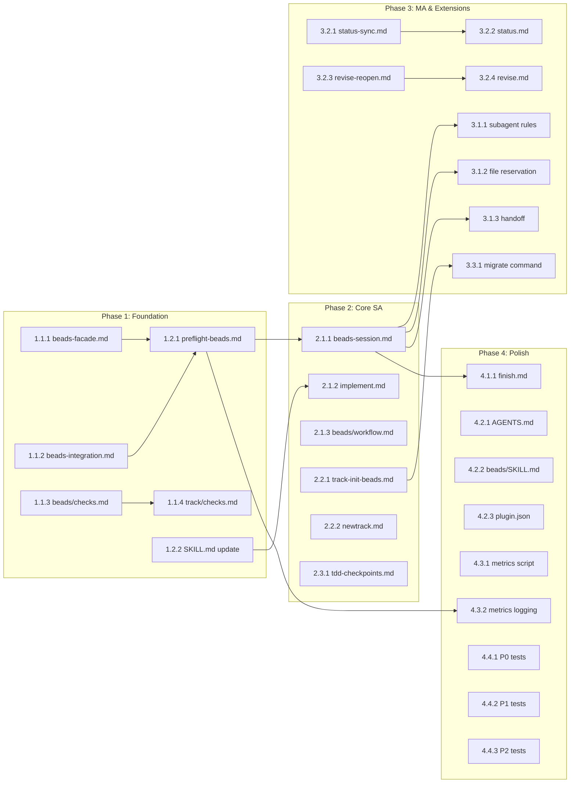

# Beads-Conductor Integration Plan

**Track ID:** beads-conductor-integration_20251225  
**Version:** 1.0.0  
**Status:** Ready for Implementation

---

## Phase 1: Foundation (Week 1)

### Epic 1.1: State Validation & Master Reference

**Goal:** Establish validation logic and documentation foundation.

#### Tasks

- [ ] 1.1.1: Create `skills/conductor/references/beads-facade.md`
  - Define facade contract (checkAvailability, createEpicFromPlan, syncToGit, claimTask, closeTask, updateTddPhase)
  - Document error types and recovery behavior
  - Include input/output examples
  - **Est:** 140-180 lines

- [ ] 1.1.2: Create `skills/conductor/references/beads-integration.md`
  - Document all 13 integration points
  - SA vs MA mode flows
  - State file schemas
  - Output format specification
  - **Est:** 200-260 lines

- [ ] 1.1.3: Create `skills/conductor/references/validation/beads/checks.md`
  - `.fb-progress.json` schema validation
  - planTasks mapping validation
  - R/S/M prompt for malformed plans
  - Unsynced state detection
  - **Est:** 120-160 lines

- [ ] 1.1.4: Update `skills/conductor/references/validation/track/checks.md`
  - Add `.fb-progress.json` to file existence matrix
  - Hook beads validation reference
  - Add session-lock detection
  - **Est:** 70-110 lines

### Epic 1.2: Preflight System

**Goal:** Implement mode detection and session initialization.

#### Tasks

- [ ] 1.2.1: Create `workflows/conductor/preflight-beads.md`
  - Mode detection algorithm (SA/MA)
  - bd availability check with HALT behavior
  - Village MCP detection
  - Session state file creation
  - Stale session recovery
  - Concurrent session lock handling
  - **Est:** 130-170 lines

- [ ] 1.2.2: Update `skills/conductor/SKILL.md`
  - Add Beads-Conductor integration overview section
  - Document dual-mode architecture
  - Add `--tdd` flag documentation
  - Document preflight behavior
  - **Est:** 70-110 lines

---

## Phase 2: Core Single-Agent (Week 2)

### Epic 2.1: Session Lifecycle

**Goal:** Implement claim, close, and sync operations for SA mode.

#### Tasks

- [ ] 2.1.1: Create `workflows/conductor/beads-session.md`
  - SA session flow: claim → work → close → sync
  - MA session flow: init → claim → reserve → done
  - Close with reasons (completed/skipped/blocked)
  - Subagent read-only rules
  - Retry logic for bd failures
  - Pending operations persistence
  - **Est:** 160-220 lines

- [ ] 2.1.2: Update `workflows/implement.md`
  - Add preflight-beads call at start
  - Integrate claim operation before task execution
  - Add close operation after task completion
  - Add sync operation at session end
  - Document TDD checkpoint triggers
  - **Est:** 80-120 lines

- [ ] 2.1.3: Update `workflows/beads/workflow.md`
  - Add Conductor integration section
  - Document when manual bd is appropriate
  - Add MA constraints documentation
  - **Est:** 50-90 lines

### Epic 2.2: Track Initialization

**Goal:** Implement plan.md → beads conversion.

#### Tasks

- [ ] 2.2.1: Create `workflows/conductor/track-init-beads.md`
  - plan.md parsing and validation
  - R/S/M prompt implementation
  - `--strict` flag for CI
  - Epic creation from plan title
  - Issue creation from tasks
  - Dependency wiring
  - planTasks mapping update
  - **Est:** 110-150 lines

- [ ] 2.2.2: Update `workflows/newtrack.md`
  - Add beads track-init call
  - Handle existing beads (link vs create)
  - Update `.fb-progress.json` with mapping
  - **Est:** 70-110 lines

### Epic 2.3: TDD Checkpoints (Opt-in)

**Goal:** Implement RED/GREEN/REFACTOR tracking.

#### Tasks

- [ ] 2.3.1: Create `workflows/conductor/tdd-checkpoints-beads.md`
  - `--tdd` flag detection
  - RED phase checkpoint (test written)
  - GREEN phase checkpoint (test passes)
  - REFACTOR phase checkpoint (code clean)
  - Notes format specification
  - Skip logic when no tests detected
  - **Est:** 110-150 lines

---

## Phase 3: Multi-Agent & Extensions (Week 3)

### Epic 3.1: Multi-Agent Coordination

**Goal:** Implement MA-specific features.

#### Tasks

- [ ] 3.1.1: Add subagent rules to Task tool injection
  - Document read-only bd access (show, ready, list)
  - Block write operations (update, close, create)
  - Structured result return format
  - **Est:** 60-80 lines (in beads-session.md)

- [ ] 3.1.2: Implement file reservation protocol
  - reserve() before file edits
  - release() after completion
  - Auto-release on done()
  - Conflict escalation to leader
  - **Est:** 40-60 lines (in beads-session.md)

- [ ] 3.1.3: Implement handoff file-as-message
  - Handoff file format: `handoff_<from>_to_<to>.json`
  - Timestamp ordering for processing
  - 24hr TTL with warning
  - **Est:** 40-60 lines (in beads-session.md)

### Epic 3.2: Status Sync & Revise

**Goal:** Implement status sync and revise/reopen features.

#### Tasks

- [ ] 3.2.1: Create `workflows/conductor/status-sync-beads.md`
  - Query Conductor state
  - Query Beads state
  - Discrepancy detection
  - Reconciliation suggestions
  - **Est:** 110-150 lines

- [ ] 3.2.2: Update `workflows/status.md`
  - Add beads status sync call
  - Display discrepancies
  - **Est:** 60-90 lines

- [ ] 3.2.3: Create `workflows/conductor/revise-reopen-beads.md`
  - Identify affected beads from spec/plan changes
  - Reopen vs create-new logic
  - Lineage preservation for cleaned-up beads
  - planTasks mapping update
  - **Est:** 110-150 lines

- [ ] 3.2.4: Update `workflows/revise.md`
  - Add beads reopen integration
  - Document lineage for compacted beads
  - **Est:** 60-90 lines

### Epic 3.3: Migration Command

**Goal:** Implement migration for existing tracks.

#### Tasks

- [ ] 3.3.1: Create `commands/conductor-migrate-beads.md`
  - Scan: find tracks without beads integration
  - Analyze: parse plan.md to identify tasks
  - Confirm: show migration plan to user
  - Execute: create beads or link existing
  - Verify: validate planTasks mapping
  - **Est:** 80-120 lines

---

## Phase 4: Finish & Polish (Week 4)

### Epic 4.1: Compact/Cleanup

**Goal:** Implement compaction and cleanup at track finish.

#### Tasks

- [x] 4.1.1: Update `workflows/finish.md`
  - Add beads compaction phase (bd compact)
  - Add cleanup threshold check (>150 closed)
  - Add bd cleanup integration
  - Add Village state cleanup
  - **Est:** 60-90 lines

### Epic 4.2: Documentation Updates

**Goal:** Complete all documentation updates.

#### Tasks

- [x] 4.2.1: Update `AGENTS.md`
  - Refresh Beads Workflow Integration section
  - Add facade explanation
  - Update session start/end checklists
  - Add metrics.jsonl documentation
  - **Est:** 50-80 lines

- [x] 4.2.2: Update `skills/beads/SKILL.md`
  - Add Conductor-awareness section
  - Document facade abstraction
  - Document SA/MA behaviors
  - **Est:** 40-70 lines

- [x] 4.2.3: Update `.claude-plugin/plugin.json`
  - Update description
  - Add beads integration keywords
  - Add new commands
  - **Est:** 20-40 lines

- [x] 4.2.4: Update `docs/GLOBAL_CONFIG.md`
  - Add `--tdd` flag documentation
  - Update session protocol with heartbeat
  - Add preflight behavior note
  - **Est:** 30-50 lines

- [x] 4.2.5: Update `README.md`
  - Add Beads-Conductor integration to feature list
  - Update workflow description
  - **Est:** 20-40 lines

- [x] 4.2.6: Update `TUTORIAL.md`
  - Add integrated workflow section
  - Document zero-manual-bd-commands flow
  - **Est:** 40-70 lines

### Epic 4.3: Instrumentation

**Goal:** Implement usage metrics collection.

#### Tasks

- [x] 4.3.1: Create `scripts/beads-metrics-summary.sh`
  - Read `.conductor/metrics.jsonl`
  - Aggregate events (ma_attempt, manual_bd, tdd_cycle)
  - Print weekly summary
  - **Est:** 60-100 lines

- [x] 4.3.2: Add metrics logging to preflight
  - Log ma_attempt events
  - Log manual_bd usage
  - Log tdd_cycle completions
  - **Est:** 20-40 lines (in preflight-beads.md)

### Epic 4.4: Testing

**Goal:** Complete test scenario verification.

#### Tasks

- [ ] 4.4.1: Verify P0 test scenarios (T1-T12)
  - Preflight detects bd, HALTs if unavailable
  - Track-init creates epic and issues
  - Close updates bead with reason
  - Sync retries and persists unsynced

- [ ] 4.4.2: Verify P1 test scenarios (T13-T18)
  - MA mode uses Village claim
  - File reservation works
  - Handoff file-as-message works
  - Subagents restricted to read-only

- [ ] 4.4.3: Verify P2 test scenarios (T19-T22)
  - Status sync detects discrepancies
  - Revise reopens affected beads
  - Graceful degradation MA→SA
  - Metrics logged

---

## Summary

| Phase | Epics | Tasks | Est. Lines |
|-------|-------|-------|------------|
| 1: Foundation | 2 | 6 | 700-990 |
| 2: Core SA | 3 | 6 | 580-840 |
| 3: MA & Extensions | 3 | 8 | 660-900 |
| 4: Finish & Polish | 4 | 11 | 340-570 |
| **Total** | **12** | **31** | **2,280-3,300** |

---

## Dependencies

---

## Risk Mitigation

| Risk | Mitigation in Plan |
|------|-------------------|
| Behavioral change | Phase 4 includes AGENTS.md update with clear migration path |
| Partial failure | Phase 2 includes retry logic and pending operations |
| MA race conditions | Phase 3 implements atomic Village operations |
| plan.md format variations | Phase 2 includes R/S/M prompt |
| bd version incompatibility | Phase 1 preflight includes version check |
