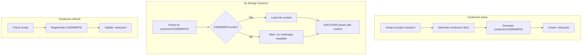

# Design: Codemaps Integration into Conductor

## Problem Statement

Agents and humans need codebase orientation when starting work on a project. The standalone `codemaps` skill provides this, but it's disconnected from the Conductor workflow — users must invoke it manually and remember to refresh it.

## Solution

Merge codemaps functionality into Conductor:
1. Generate `conductor/CODEMAPS/` during `/conductor-setup`
2. **Auto-regenerate during `/conductor-finish`** (primary refresh path)
3. Manual regenerate via `/conductor-refresh` (backup for edge cases)
4. Auto-load during `ds` (design session) for context
5. Enhance with Mermaid flow diagrams
6. Delete standalone `skills/codemaps/` after merge

### Trigger Points

| Command | CODEMAPS Action |
|---------|-----------------|
| `/conductor-setup` | Generate initial |
| `/conductor-finish` | Auto-regenerate (code just changed) |
| `/conductor-refresh` | Manual regenerate (edge cases) |
| `ds` | Load for context |

**Flags:**
- `/conductor-finish --skip-codemaps` — skip regeneration (for batch finishing)

## Architecture

### Before

```
skills/codemaps/           # Standalone skill
  SKILL.md
  references/
    CODEMAPS_TEMPLATE.md

CODEMAPS/                  # At project root (if manually created)
```

### After

```
skills/codemaps/           # DELETED

conductor/
  CODEMAPS/                # Integrated location
    .meta.json             # Generation metadata
    overview.md            # Always generated
    [module].md            # Based on project structure

skills/conductor/
  SKILL.md                 # Updated with codemaps section
  references/
    CODEMAPS_TEMPLATE.md   # Moved from codemaps skill

workflows/
  setup.md                 # Updated to generate CODEMAPS/
  refresh.md               # Updated to regenerate CODEMAPS/
```

## Data Flow



### Design Session Integration

```
ds (design session)
    ↓
Check for conductor/CODEMAPS/
    ↓
If exists:
  → Load overview.md + relevant module maps
  → "📚 Loaded CODEMAPS for context"
  → Agent has architecture understanding for DISCOVER phase
    ↓
If missing:
  → "⚠️ No CODEMAPS found. Consider running /conductor-refresh first."
  → Continue anyway (codemaps optional but recommended)
```

**Why this matters:**
- Design decisions are better when agent understands existing architecture
- DISCOVER phase can reference actual file paths and patterns
- Reduces "where does this go?" questions during DEVELOP phase

## Enhanced Codemaps Features

### Current → Enhanced

| Feature | Current | Enhanced |
|---------|---------|----------|
| Key files | Table only | + Mermaid diagrams |
| Data flow | ASCII art | Mermaid flowcharts |
| Structure | Static | Auto-detect project type |
| Location | Root or manual | `conductor/CODEMAPS/` |

### Generated Files

**v1: Simple approach — agent generates what's needed**

```
/conductor-setup
    ↓
Analyze project structure
    ↓
Generate conductor/CODEMAPS/:
  - overview.md (always)
  - [module].md for each significant area detected
    ↓
"✅ Generated CODEMAPS: overview.md, skills.md, workflows.md"
```

**No prompts during setup** — generate everything the agent deems useful. Setup should be comprehensive.

**Why this works:**
- Setup is a one-time cost, so generate fully
- Agent uses judgment on what's "significant"
- No interruptions during setup flow
- User can delete unwanted files later

**overview.md contents:**

```markdown
# [Project Name] Codemap

## Summary
[One paragraph: what this project does]

## Directory Structure
```
project/
├── src/           # Source code
├── tests/         # Test files
├── docs/          # Documentation
└── ...
```

## Key Files
| File | Purpose |
|------|---------|
| `src/index.ts` | Main entry point |
| `package.json` | Dependencies |
| ... | ... |

## Data Flow
[Mermaid diagram if structure is obvious]
```

**Module codemaps:** Agent generates one file per significant area it identifies (api.md, database.md, skills.md, etc.) based on what it observes in the codebase.

### .meta.json Structure

```json
{
  "generated": "2024-12-23T10:30:00Z",
  "generator": "/conductor-setup",
  "project_type": "plugin",
  "files_generated": ["overview.md", "skills.md", "conductor.md"]
}
```

## Files to Modify

| File | Change |
|------|--------|
| `workflows/setup.md` | Add Phase 7: CODEMAPS Generation |
| `workflows/refresh.md` | Add `codemaps` scope option |
| `skills/conductor/references/finish-workflow.md` | Add CODEMAPS regeneration as final step |
| `skills/design/SKILL.md` | Add CODEMAPS loading at session start |
| `skills/conductor/SKILL.md` | Add CODEMAPS section, document integration, add `--skip-codemaps` flag |
| `skills/conductor/references/CODEMAPS_TEMPLATE.md` | Move from codemaps skill |

## Files to Delete

| File | Reason |
|------|--------|
| `skills/codemaps/SKILL.md` | Merged into conductor |
| `skills/codemaps/references/CODEMAPS_TEMPLATE.md` | Moved to conductor |

## Documentation Updates

| File | Update |
|------|--------|
| `README.md` | Remove codemaps from Utilities, add to Conductor output |
| `AGENTS.md` | Update available skills list |
| `TUTORIAL.md` | Update if codemaps mentioned |

## User Feedback

After CODEMAPS generation:
```
✅ Generated architecture codemaps in conductor/CODEMAPS/
   - overview.md
   - [other files based on detection]
```

## Edge Cases

### Setup Behavior

| Case | Handling |
|------|----------|
| CODEMAPS/ exists | Prompt: "CODEMAPS exists. Regenerate? [Y/n]" |
| Empty/minimal project | Generate minimal overview.md with directory tree only |
| Generation fails | Warn user, continue setup without blocking |

### Finish Behavior

| Case | Handling |
|------|----------|
| Normal finish | Regenerate CODEMAPS as last step |
| `--skip-codemaps` flag | Skip regeneration |
| User-modified files | Check `.meta.json`, warn before overwrite |
| Finish aborted | CODEMAPS regen is last step — prior work preserved |
| No prior CODEMAPS | Generate fresh |

### Refresh Behavior

| Case | Handling |
|------|----------|
| CODEMAPS/ doesn't exist | Generate fresh (same as setup) |
| User-modified files | Check `.meta.json` for `user_modified: true`, warn before overwrite |
| Partial CODEMAPS/ | Regenerate all files |
| No conductor/ directory | Error: "Run /conductor-setup first" |

### Scale Limits

| Constraint | Limit |
|------------|-------|
| Directory scan depth | Top 2 levels only |
| Key files per codemap | Max 50 files |
| Module codemaps | Max 10 files |

### Monorepo Support

```
Detect monorepo patterns:
  - packages/
  - apps/
  - workspaces in package.json

If monorepo:
  conductor/CODEMAPS/
    overview.md           # Root-level summary
    packages/
      package-a.md        # Per-package codemap
      package-b.md
```

### User Modification Tracking

`.meta.json` structure:
```json
{
  "generated": "2024-12-23T10:30:00Z",
  "generator": "/conductor-setup",
  "files": {
    "overview.md": { "generated": true, "user_modified": false },
    "skills.md": { "generated": true, "user_modified": true }
  }
}
```

On refresh: warn if `user_modified: true` before overwriting.

## Implementation Order

1. Move `CODEMAPS_TEMPLATE.md` to `skills/conductor/references/`
2. Update `workflows/setup.md` with Phase 7
3. Update `workflows/refresh.md` with codemaps scope
4. Update `skills/conductor/SKILL.md` with documentation
5. Move demo CODEMAPS/ to `conductor/CODEMAPS/`
6. Delete `skills/codemaps/`
7. Update README.md, AGENTS.md

## Success Criteria

- [ ] `/conductor-setup` creates `conductor/CODEMAPS/` with at least overview.md
- [ ] `/conductor-refresh` with scope `codemaps` regenerates CODEMAPS/
- [ ] `.meta.json` contains valid metadata
- [ ] Old `skills/codemaps/` deleted
- [ ] Documentation updated

## Risks

| Risk | Likelihood | Mitigation |
|------|------------|------------|
| Break existing conductor flow | Medium | Test setup/refresh after changes |
| Mermaid diagrams too complex | Low | Keep to 2 simple diagrams |
| Users miss old standalone skill | Low | Not heavily used |

## Party Mode Consensus

- **Victor (Strategist)**: On track, cap scope at v1 diagrams
- **Sally (UX)**: Consider `/codemap` alias for future
- **Dr. Quinn (Solver)**: No blockers, ship it
- **Sophia (Storyteller)**: Narrative is clean

---

*Design approved via Double Diamond session. Ready for `/conductor-newtrack`.*
