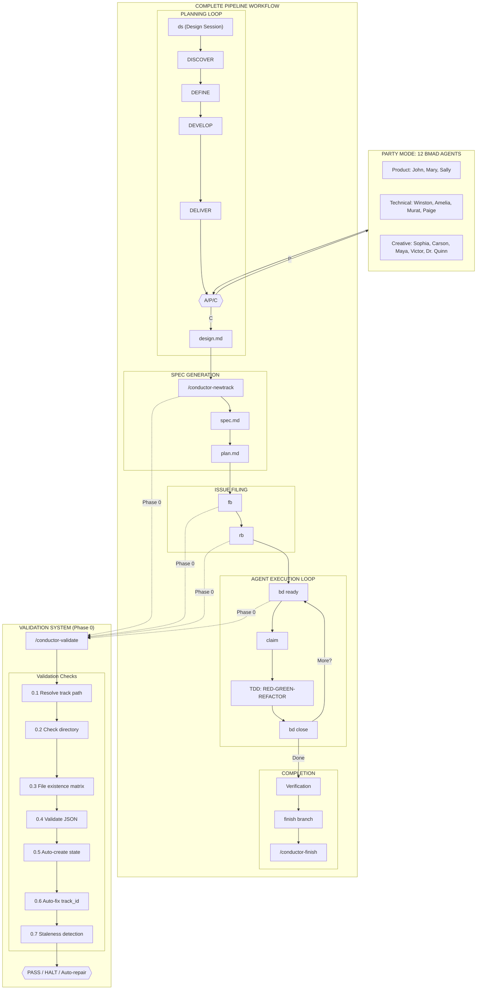

# Development Workflow

## Methodology

Context-driven development with TDD execution.

## Complete Pipeline Architecture



For detailed pipeline documentation, see [docs/PIPELINE_ARCHITECTURE.md](../docs/PIPELINE_ARCHITECTURE.md).

## 4-Phase Framework

| Phase            | Purpose                       | Output           |
| ---------------- | ----------------------------- | ---------------- |
| **Requirements** | Understand problem completely | `spec.md`        |
| **Plan**         | Design before code            | `plan.md`        |
| **Implement**    | Build with TDD                | Tested code      |
| **Reflect**      | Verify before shipping        | Reviewed, merged |

## TDD Cycle

**Iron Law**: No production code without a failing test first.

```
RED     → Write one failing test (watch it fail)
GREEN   → Write minimal code to pass (watch it pass)
REFACTOR → Clean up (stay green)
REPEAT  → Next failing test
```

## Commit Conventions

Use [Conventional Commits](https://www.conventionalcommits.org/):

```
<type>(<scope>): <description>

[optional body]

[optional footer(s)]
```

**Types**:

- `feat`: New feature
- `fix`: Bug fix
- `docs`: Documentation only
- `style`: Formatting, no code change
- `refactor`: Code change, no new feature or fix
- `test`: Adding or updating tests
- `chore`: Maintenance tasks

**Examples**:

```
feat(conductor): add /conductor-setup command
fix(beads): resolve dependency cycle detection
test(tdd): add coverage for edge cases
docs: update README installation instructions
```

## Code Review

**Before merging**:

1. Run `review code` trigger for code review
2. Address all feedback with technical rigor
3. Verify all tests pass
4. Ensure documentation is updated

**Review checklist**:

- [ ] Tests cover new functionality
- [ ] No breaking changes without migration path
- [ ] SKILL.md frontmatter is valid
- [ ] References are correctly linked

## Coverage Target

- **Goal**: >80% for core skill logic
- **Method**: Skills are documentation, so "coverage" = completeness of instructions

## Task Status Markers

```
[ ]  Pending/New
[~]  In Progress
[x]  Completed (optionally with 7-char commit SHA)
```

## Session Protocol

**Start**:

```bash
bd ready --json              # Find available work
bd show <issue-id>           # Read context
bd update <id> --status in_progress  # Claim it
```

**End**:

```bash
bd update <id> --notes "COMPLETED: X. NEXT: Y"
bd close <id> --reason "summary"
git add -A && git commit && git push
```

## Verification Before Completion

**Evidence before assertions**:

1. Run the tests, show they pass
2. Run the linter, show no errors
3. Run validation commands
4. Only then claim "done"
