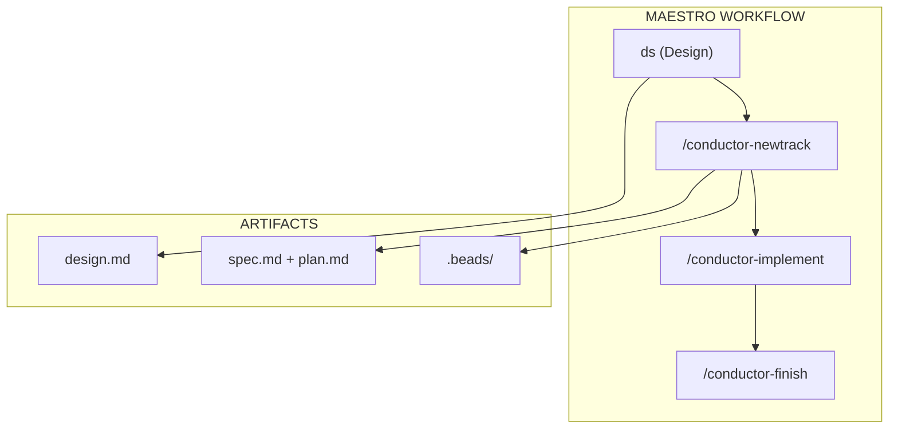
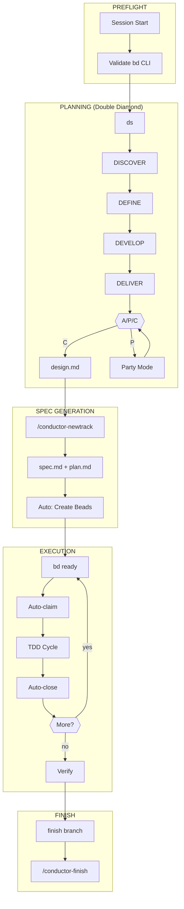
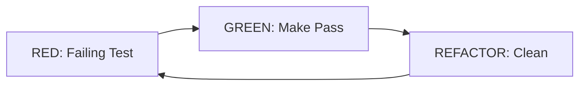
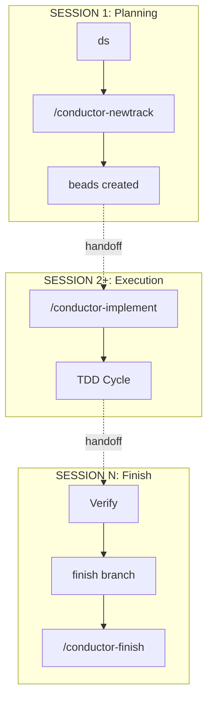

# Architecture

System architecture, skill hierarchy, and workflow pipeline for Maestro.

## System Overview



## Skill Hierarchy

Five-level hierarchy with clear dependencies:

| Level | Skill | Purpose | Depends On |
|-------|-------|---------|------------|
| **1** | `conductor` | Orchestration, planning, execution | - |
| **2** | `orchestrator` | Multi-agent parallel execution | conductor |
| **3** | `design` | Double Diamond sessions, BMAD | conductor |
| **4** | `beads` | Issue tracking, dependencies | conductor |
| **5** | Specialized | git-worktrees, writing-skills | Any above |

### Skill Loading Rules

```
conductor → orchestrator → design → beads → specialized
     ↑______________|___________|________|
              (all depend on conductor)
```

- **conductor** loads first for all `/conductor-*` commands
- **orchestrator** auto-loads when `## Track Assignments` found in plan.md
- **design** loads for `ds` or `/conductor-design`
- **beads** loads for `fb`, `rb`, or `bd` commands

## Complete Pipeline



### TDD Micro-Loop



**Iron Law**: No production code without a failing test first.

## Beads Integration (Facade Pattern)

Zero manual `bd` commands in the happy path. All beads operations abstracted behind Conductor.

### Integration Points

| Phase | Conductor Command | Beads Action (Automatic) |
|-------|-------------------|--------------------------| 
| Preflight | All commands | Validate `bd` CLI |
| Track Init | `/conductor-newtrack` | Create epic + issues, wire deps |
| Claim | `/conductor-implement` | `bd update --status in_progress` |
| TDD | Default | `bd update --notes "RED/GREEN..."` |
| Close | `/conductor-implement` | `bd close --reason completed\|skipped\|blocked` |
| Sync | Session end | `bd sync` with retry |
| Compact | `/conductor-finish` | AI summaries for closed |
| Cleanup | `/conductor-finish` | Remove oldest when >150 |

### Unified Architecture

Orchestrator uses Agent Mail for multi-agent coordination. All beads operations go through `bd` CLI.

## BMAD Agents (Party Mode)

25 specialized agents invoked via **[P] Party** at A/P/C checkpoints.

### Core Module (1)

| Agent | Name | Focus |
|-------|------|-------|
| Orchestrator | BMad Master 🧙 | Agent coordination |

### BMM Module (9)

| Agent | Name | Focus |
|-------|------|-------|
| PM | John | Product priorities, roadmap |
| Analyst | Mary | Requirements, metrics |
| Architect | Winston | System design, patterns |
| Developer | Amelia | Implementation, quality |
| SM | Bob | Sprint planning, facilitation |
| QA | Murat | Testing, edge cases |
| UX | Sally | User needs, accessibility |
| Docs | Paige | Documentation, tutorials |
| Quick Flow | Barry | Rapid prototyping, MVP |

### CIS Module (6)

| Agent | Name | Focus |
|-------|------|-------|
| Brainstormer | Carson | Wild ideas, 10x thinking |
| Problem Solver | Dr. Quinn | Root cause, debugging |
| Design Thinker | Maya | Methodology, iteration |
| Strategist | Victor | Long-term vision |
| Presentation | Caravaggio | Visual design, demos |
| Storyteller | Sophia | Narrative, empathy |

### BMB Module (3)

| Agent | Name | Focus |
|-------|------|-------|
| Agent Builder | Bond 🤖 | Agent design patterns |
| Module Builder | Morgan 🏗️ | System integration |
| Workflow Builder | Wendy 🔄 | Process automation |

### BMGD Module (6)

| Agent | Name | Focus |
|-------|------|-------|
| Game Architect | Cloud Dragonborn 🏛️ | Engine, multiplayer |
| Game Designer | Samus Shepard 🎲 | Mechanics, narrative |
| Game Developer | Link Freeman 🕹️ | Unity, cross-platform |
| Game QA | GLaDOS 🧪 | Test automation |
| Game Scrum Master | Max 🎯 | Sprint orchestration |
| Game Solo Dev | Indie 🎮 | Quick flow, shipping |

### Agent Selection

Party Mode selects 3 agents: **Primary** (best match), **Secondary** (complement), **Tertiary** (devil's advocate).

## Session Flow



### Handoff Mechanism

| Artifact | Preserves |
|----------|-----------|
| `design.md` | Architecture decisions |
| `spec.md` | Requirements, criteria |
| `plan.md` | Tasks with status |
| `.beads/` | Issue state, notes |

**At session end**: `bd update --notes "COMPLETED: X. NEXT: Y."`  
**At session start**: `bd ready --json` → `bd show <id>`

## Quick Reference

| Component | Trigger | Purpose |
|-----------|---------|---------|
| Design | `ds` | Double Diamond exploration |
| Spec Gen | `/conductor-newtrack` | Create spec + plan + beads |
| Execution | `/conductor-implement` | TDD cycle per task |
| Parallel | `/conductor-orchestrate` | Multi-agent dispatch |
| Finish | `/conductor-finish` | Complete track |
| Validate | `/conductor-validate` | Health checks |

### Fallback Policy

| Condition | Action |
|-----------|--------|
| `bd` unavailable | HALT |
| `conductor/` missing | DEGRADE (standalone) |
| Agent Mail unavailable | HALT |

### Close Reasons

- `completed` — Task done successfully
- `skipped` — Task not needed
- `blocked` — Cannot proceed

## Related

- [README.md](../README.md) — Overview and installation
- [TUTORIAL.md](../TUTORIAL.md) — Complete workflow guide
- [.claude/skills/conductor/](../.claude/skills/conductor/) — Planning skill
- [.claude/skills/design/](../.claude/skills/design/) — Double Diamond + Party Mode
- [.claude/skills/orchestrator/](../.claude/skills/orchestrator/) — Parallel execution
