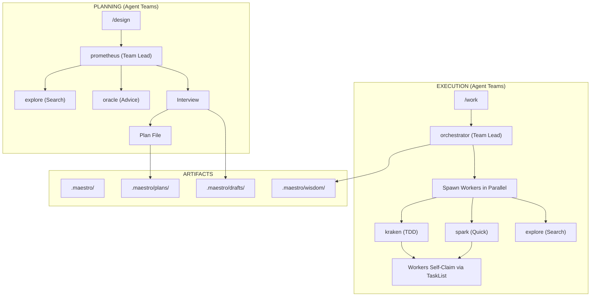

# Architecture

System architecture for Maestro.

## Overview



## Agents

| Agent | Purpose | Model | Team Lead? | Team Tools? |
|-------|---------|-------|------------|-------------|
| `prometheus` | Interview-driven planner | sonnet | Yes | Full (Task, Teammate, SendMessage, TaskList, TaskUpdate) |
| `orchestrator` | Execution coordinator | sonnet | Yes | Full (Task, Teammate, SendMessage, TaskList, TaskUpdate) |
| `kraken` | TDD implementation | sonnet | No | Self-claim (TaskList, TaskGet, TaskUpdate, SendMessage) |
| `spark` | Quick fixes | sonnet | No | Self-claim (TaskList, TaskGet, TaskUpdate, SendMessage) |
| `oracle` | Strategic advisor | opus | No | Self-claim (TaskList, TaskGet, TaskUpdate, SendMessage) |
| `explore` | Codebase search | sonnet | No | Self-claim (TaskList, TaskGet, TaskUpdate, SendMessage) |

## Source of Truth

| What | Where | NOT here |
|------|-------|----------|
| /design workflow | `.claude/commands/design.md` | Agent definitions |
| /work workflow | `.claude/commands/work.md` | Agent definitions |
| Agent identity | `.claude/agents/{name}.md` | Commands or docs |
| Skill reference | `.claude/skills/maestro/SKILL.md` | README or CLAUDE.md |

## Directory Structure

```
.claude/
├── agents/          # 6 agent definitions (identity + constraints)
│   ├── prometheus.md
│   ├── orchestrator.md
│   ├── kraken.md
│   ├── spark.md
│   ├── oracle.md
│   └── explore.md
├── commands/        # /design, /work (full workflows)
│   ├── design.md
│   └── work.md
├── hooks/
│   └── hooks.json
└── skills/
    └── maestro/
        └── SKILL.md

.maestro/            # Runtime state
├── plans/
├── drafts/
└── wisdom/
```

## Hooks

| Hook | Trigger | Purpose |
|------|---------|---------|
| `orchestrator-guard.sh` | PreToolUse(Write/Edit) | Prevents orchestrator from editing directly |
| `verification-injector.sh` | PostToolUse(Task) | Reminds to verify task results |
