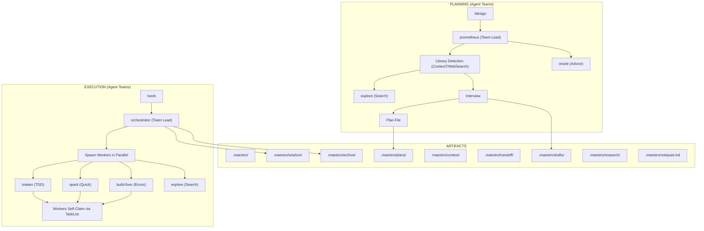

# Architecture

System architecture for Maestro.

## Overview



## Agents

| Agent | Purpose | Model | Team Lead? | Team Tools |
|-------|---------|-------|------------|------------|
| `prometheus` | Interview-driven planner. Detects libraries via Context7 MCP | sonnet | Yes | Full (Task, TeamCreate, TeamDelete, SendMessage, TaskList, TaskUpdate) |
| `orchestrator` | Execution coordinator | sonnet | Yes | Full (Task, TeamCreate, TeamDelete, SendMessage, TaskList, TaskUpdate) |
| `kraken` | TDD implementation | sonnet | No | Self-claim (TaskList, TaskGet, TaskUpdate, SendMessage) |
| `spark` | Quick fixes | sonnet | No | Self-claim (TaskList, TaskGet, TaskUpdate, SendMessage) |
| `build-fixer` | Build/compile/lint error specialist | sonnet | No | Self-claim (TaskList, TaskGet, TaskUpdate, SendMessage) |
| `oracle` | Strategic advisor | opus | No | Self-claim (TaskList, TaskGet, TaskUpdate, SendMessage) |
| `critic` | Post-implementation reviewer | opus | No | Self-claim (TaskList, TaskGet, TaskUpdate, SendMessage) |
| `security-reviewer` | Security analysis specialist | opus | No | Self-claim (TaskList, TaskGet, TaskUpdate, SendMessage) |
| `explore` | Codebase search | sonnet | No | Self-claim (TaskList, TaskGet, TaskUpdate, SendMessage) |
| `leviathan` | Deep plan reviewer | opus | No | Self-claim (TaskList, TaskGet, TaskUpdate, SendMessage) |
| `wisdom-synthesizer` | Knowledge consolidation | haiku | No | Self-claim (TaskList, TaskGet, TaskUpdate, SendMessage) |
| `progress-reporter` | Status tracking | haiku | No | Self-claim (TaskList, TaskGet, TaskUpdate, SendMessage) |

Note: `prometheus` and `explore` use built-in Claude Code agent types (Plan and Explore) and do not have custom agent definition files.

## Source of Truth

| What | Where | NOT here |
|------|-------|----------|
| /design workflow | `.claude/skills/design/SKILL.md` | Agent definitions |
| /work workflow | `.claude/skills/work/SKILL.md` | Agent definitions |
| Agent identity | `.claude/agents/{name}.md` | Commands or docs |
| Skill reference | `.claude/skills/maestro/SKILL.md` | README or CLAUDE.md |

## Directory Structure

```
.claude/
├── agents/          # 10 agent definitions (identity + constraints)
│   ├── orchestrator.md
│   ├── kraken.md
│   ├── spark.md
│   ├── build-fixer.md
│   ├── oracle.md
│   ├── critic.md
│   ├── security-reviewer.md
│   ├── leviathan.md
│   ├── wisdom-synthesizer.md
│   └── progress-reporter.md
├── hooks/
│   └── hooks.json
├── scripts/         # Hook scripts
└── skills/          # 20 skill definitions
    ├── maestro/SKILL.md          # Overview and reference
    ├── design/SKILL.md           # /design workflow
    ├── work/SKILL.md             # /work workflow
    ├── review/SKILL.md           # /review workflow
    ├── reset/SKILL.md            # /reset workflow
    ├── status/SKILL.md           # /status workflow
    ├── setup-check/SKILL.md      # /setup-check workflow
    ├── setup/SKILL.md            # /setup workflow
    ├── plan-template/SKILL.md    # /plan-template workflow
    ├── styleguide/SKILL.md       # /styleguide workflow
    ├── pipeline/SKILL.md         # /pipeline workflow
    ├── analyze/SKILL.md          # /analyze workflow
    ├── note/SKILL.md             # /note workflow
    ├── learner/SKILL.md          # /learner workflow
    ├── security-review/SKILL.md  # /security-review workflow
    ├── ultraqa/SKILL.md          # /ultraqa workflow
    ├── research/SKILL.md         # /research workflow
    ├── project-conventions/SKILL.md
    ├── context7/SKILL.md
    └── git-worktrees/SKILL.md

.maestro/            # Runtime state
├── plans/           # Unexecuted work plans (active)
├── archive/         # Executed plans (moved after /work completes)
├── drafts/          # Interview drafts (created during /design)
├── context/         # Project context files (product, tech stack, guidelines)
├── handoff/         # Session recovery JSON
├── wisdom/          # Accumulated learnings from past executions
├── research/        # Research session state and findings
└── notepad.md       # Persistent notes (decisions, context, constraints)
```

## Hooks

| Hook | Trigger | Purpose |
|------|---------|---------|
| `session-start.sh` | SessionStart | Session initialization (surfaces skills, plans, wisdom, notepad) |
| `subagent-context.sh` | SubagentStart | Injects plan context into worker subagents |
| `orchestrator-guard.sh` | PreToolUse(Write/Edit) | Prevents orchestrator from editing directly |
| `plan-protection.sh` | PreToolUse(Write/Edit) | Blocks kraken/spark from editing plans |
| `verification-injector.sh` | PostToolUse(Task) | Reminds to verify task results |
| `remember-extractor.sh` | PostToolUse(Task) | Extracts remember tags from task output |
| `plan-validator.sh` | PostToolUse(Write) | Warns if plan missing required sections |
| `wisdom-injector.sh` | PostToolUse(Read) | Surfaces wisdom files when a plan is read |
| `error-detector.sh` | PostToolUse(Bash) | Detects build/test errors in command output |
| `bash-history.sh` | PostToolUse(Bash) | Tracks command history for context |
| `plan-context-injector.sh` | PreCompact | Injects active plan context into compaction summary |
| `worker-persistence.sh` | Stop | Persists worker state on session end |
| `keyword-detector.sh` | UserPromptSubmit | Detects keywords in user prompts for skill activation |
| `skill-injector.sh` | UserPromptSubmit | Injects matching skill context into prompts |
