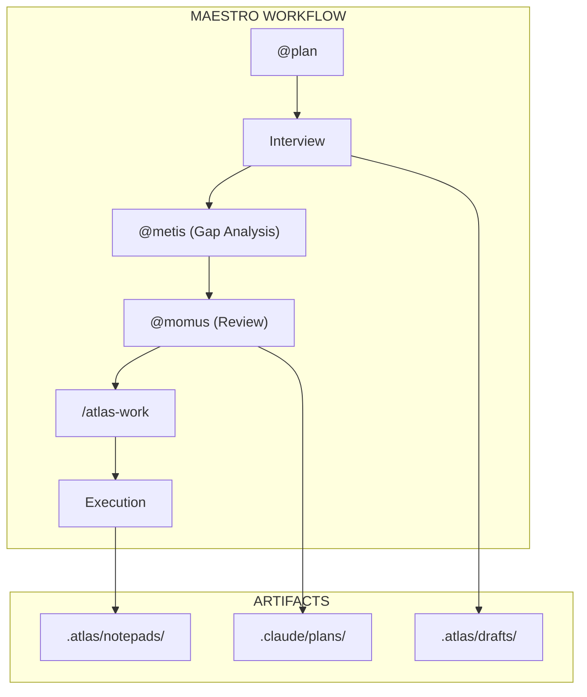
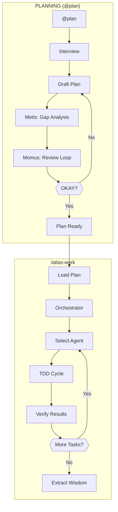
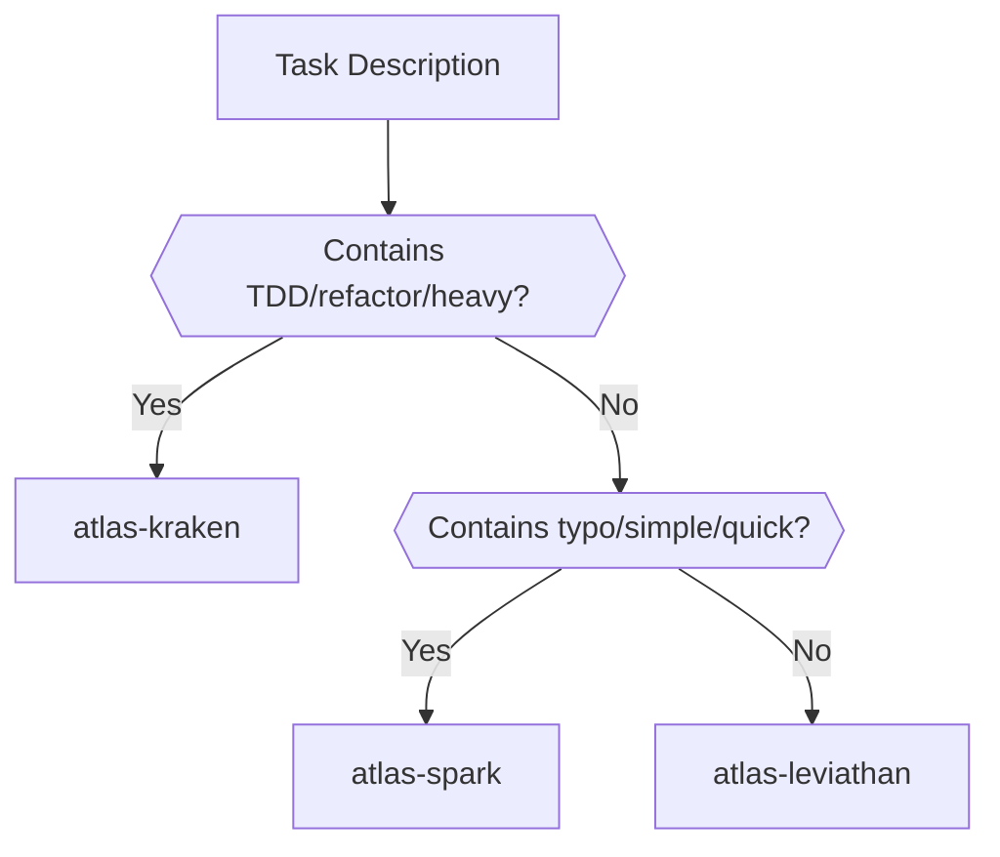
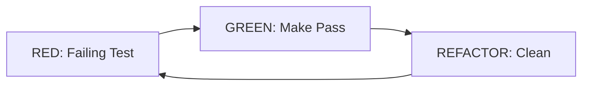
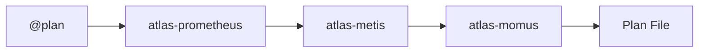
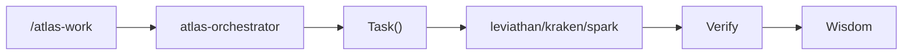
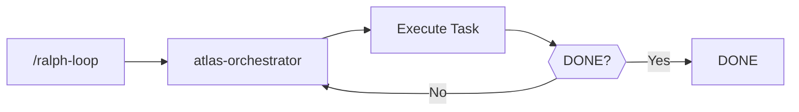
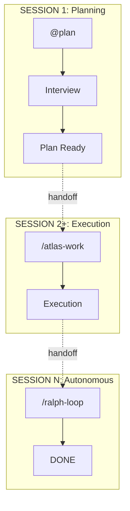

# Architecture

System architecture, agent hierarchy, and workflow pipeline for Maestro.

## System Overview



## Agent Hierarchy

12 specialized agents with clear delegation patterns:

| Agent | Purpose | Model | Chains To |
|-------|---------|-------|-----------|
| `atlas-prometheus` | Strategic planner, interview mode | sonnet | metis, momus, oracle |
| `atlas-orchestrator` | Master delegator (never works directly) | sonnet | ALL implementing + read-only agents |
| `atlas-leviathan` | Focused task executor | sonnet | (terminal) |
| `atlas-kraken` | TDD implementation | sonnet | (terminal) |
| `atlas-spark` | Quick fixes | sonnet | (terminal) |
| `atlas-oracle` | Strategic advisor | opus | (read-only) |
| `atlas-explore` | Codebase search | sonnet | (read-only) |
| `atlas-librarian` | External docs | sonnet | (read-only) |
| `atlas-metis` | Pre-planning consultant | sonnet | (read-only) |
| `atlas-momus` | Plan reviewer | sonnet | (read-only) |
| `atlas-code-reviewer` | Code quality review | sonnet | (read-only) |
| `atlas-document-writer` | Technical documentation | sonnet | (terminal) |

### Agent Chaining Rules

```
atlas-prometheus → atlas-metis, atlas-momus, atlas-oracle (consultation only)
         ↓
    [plan file]
         ↓
atlas-orchestrator → atlas-leviathan/kraken/spark + ALL read-only agents
         ↓
     [terminal executors - no further delegation]
```

- **Prometheus** chains to consultants during planning
- **Orchestrator** delegates ALL work (never edits directly)
- **Terminal agents** (leviathan, kraken, spark) do actual implementation
- **Read-only agents** (oracle, explore, librarian, metis, momus, code-reviewer) only analyze

## Complete Pipeline



### Agent Selection Logic



### TDD Micro-Loop



**Iron Law**: No production code without a failing test first.

## Planning Chain



### Phase Details

| Phase | Agent | Purpose | Output |
|-------|-------|---------|--------|
| Interview | atlas-prometheus | Ask clarifying questions | `.atlas/drafts/` |
| Gap Analysis | atlas-metis | Identify hidden requirements | Feedback |
| Review Loop | atlas-momus | Validate plan quality | "OKAY" or revisions |
| Finalize | atlas-prometheus | Generate plan | `.claude/plans/` |

## Execution Chain



### Orchestrator Protocol

| Phase | Action |
|-------|--------|
| 1. Load | Find most recent plan in `.claude/plans/` |
| 2. Initialize | Create `.atlas/boulder.json` execution state |
| 3. Delegate | Task() to specialized agents with 7-section prompts |
| 4. Verify | Verify subagent claims (agents can make mistakes) |
| 5. Complete | Update plan checkboxes, extract wisdom to notepads |

### 7-Section Prompt Format

When spawning agents, orchestrator uses:

```markdown
## CONTEXT
## OBJECTIVE
## SCOPE
## REQUIREMENTS
## REQUIRED SKILLS
## CONSTRAINTS
## VERIFICATION
```

## Autonomous Chain (Ralph Loop)



| Phase | Action |
|-------|--------|
| Start | `/ralph-loop` activates autonomous execution |
| During | Orchestrator iterates tasks, delegates, verifies |
| End | Detection of `<promise>DONE</promise>` stops loop |

## Session Flow



### Handoff Mechanism

| Artifact | Preserves |
|----------|-----------|
| `.claude/plans/` | Plan structure, task status |
| `.atlas/notepads/` | Accumulated wisdom |
| `.atlas/boulder.json` | Execution state |
| `.beads/` | Issue state, notes |

**At session end**: `bd update --notes "COMPLETED: X. NEXT: Y."`
**At session start**: `bd ready --json` → `bd show <id>`

## Directory Structure

```
.atlas/
├── plans/                    # Committed work plans
├── drafts/                   # Interview drafts
├── notepads/                 # Wisdom per plan
├── boulder.json              # Active execution state
└── ralph-loop.local.md       # Ralph autonomous loop state

.claude/
├── agents/                   # Agent definitions (symlinks)
├── commands/                 # Slash commands (/atlas-plan, etc.)
├── hooks/                    # Hook configuration
├── plans/                    # Generated execution plans
├── scripts/                  # Hook scripts
└── skills/
    └── atlas/                # Main workflow skill
        └── references/
            ├── agents/       # Atlas agent definitions
            ├── workflows/    # Workflow documentation
            └── guides/       # Usage guides

.beads/
├── beads.db                  # SQLite database
└── beads.jsonl               # Export format

toolboxes/
└── agent-mail/               # CLI wrapper for Agent Mail
```

## Quick Reference

| Component | Trigger | Purpose |
|-----------|---------|---------|
| Planning | `@plan` | Interview-driven planning |
| Gap Analysis | `@metis` | Pre-planning consultation |
| Review | `@momus` | Plan validation |
| Execution | `/atlas-work` | Orchestrated execution |
| Autonomous | `/ralph-loop` | Run until complete |
| Strategic | `@oracle` | High-IQ advice (opus) |
| Search | `@explore` | Codebase search |
| Research | `@librarian` | External docs |
| TDD | `@tdd` | Test-driven implementation |

### Fallback Policy

| Condition | Action |
|-----------|--------|
| `bd` unavailable | HALT |
| `.atlas/` missing | DEGRADE (standalone) |
| Agent Mail unavailable | HALT |

## Related

- [README.md](../README.md) — Overview and installation
- [TUTORIAL.md](../TUTORIAL.md) — Complete workflow guide
- [.claude/skills/atlas/SKILL.md](../.claude/skills/atlas/SKILL.md) — Atlas workflow skill
- [.claude/skills/atlas/references/agents/](../.claude/skills/atlas/references/agents/) — Agent definitions
