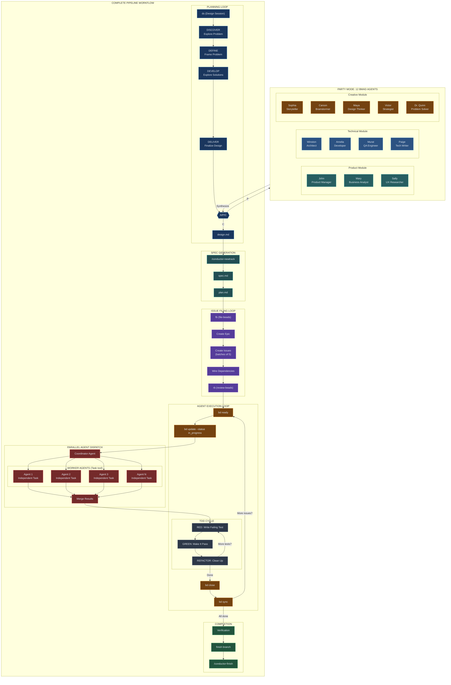
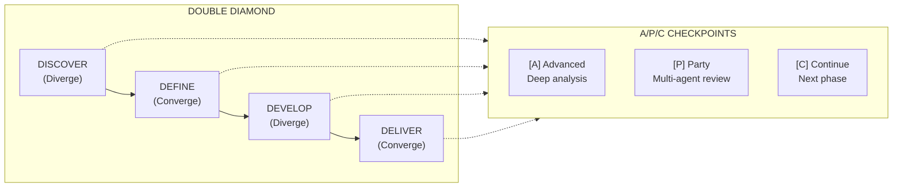
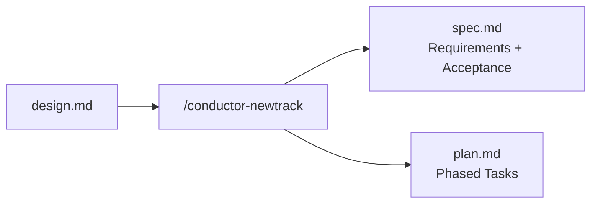
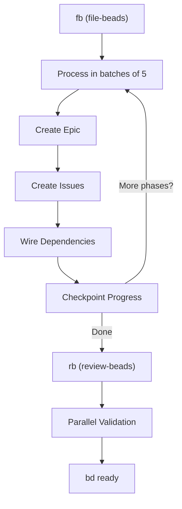
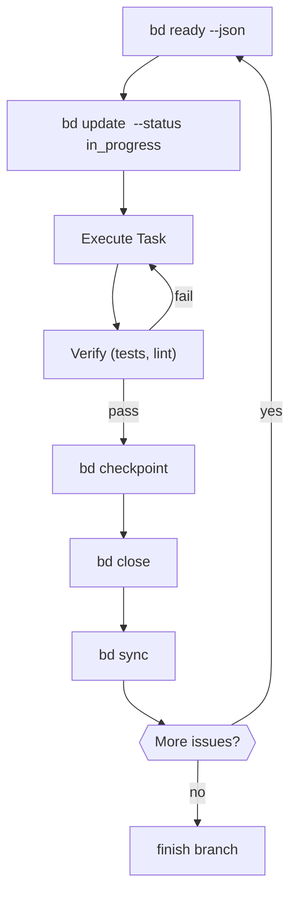
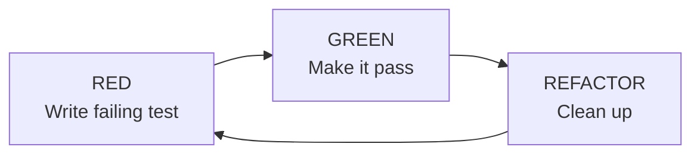
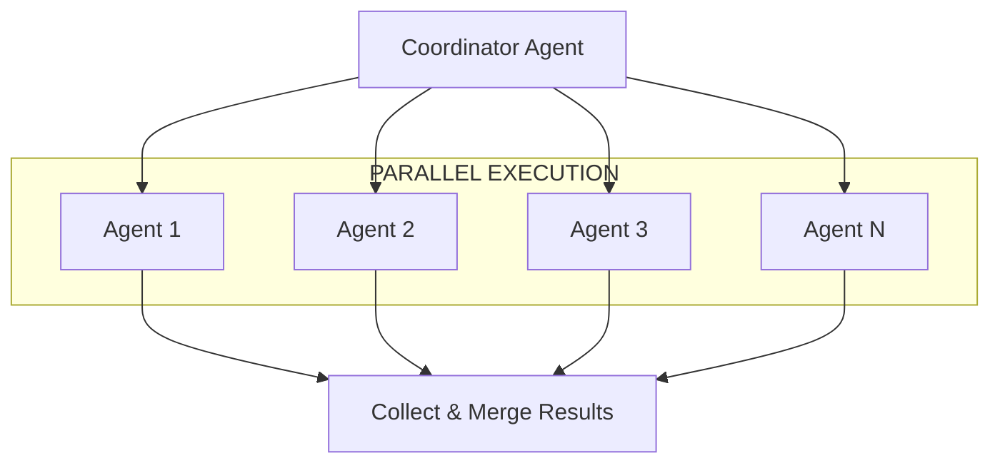
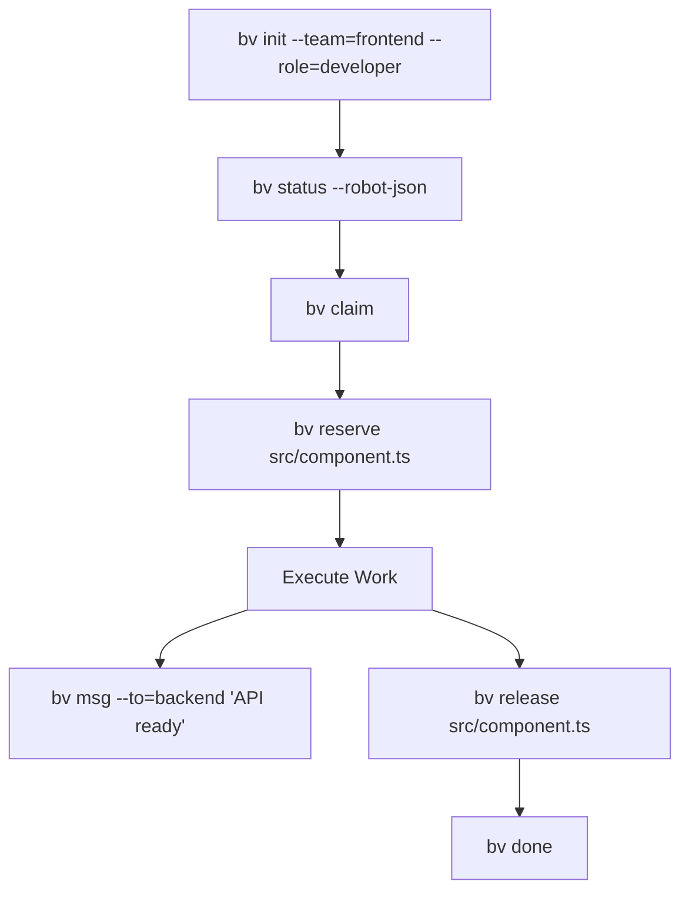
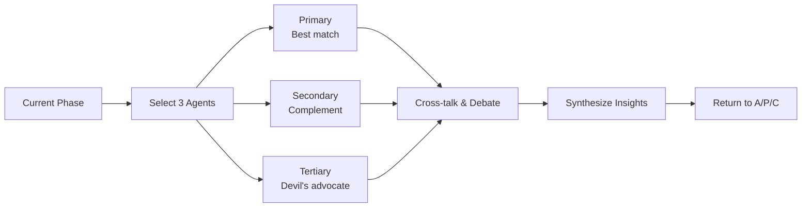
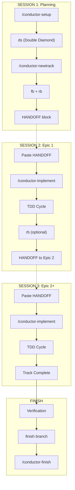

# Pipeline Architecture

Complete workflow pipeline with all loops, agent dispatch patterns, and the 12 BMAD agents.

## Complete Pipeline Overview

---

## Workflow Loops

### 1. Planning Loop (Double Diamond)

**Trigger**: `ds` or `/conductor-design`

**Output**: `conductor/tracks/{id}/design.md`

---

### 2. Spec Generation

**Trigger**: `/conductor-newtrack {track_id}`

**Output**: `spec.md` + `plan.md`

---

### 3. Issue Filing Loop (Beads)

**Trigger**: `fb` then `rb`

**State Files**:
- `.fb-progress.json` - Resume capability
- `.fb-progress.lock` - Concurrent session lock

---

### 4. Agent Execution Loop

**Trigger**: `/conductor-implement` or `Start epic <id>`

---

### 5. TDD Micro-Loop

**Trigger**: `tdd`

**Iron Law**: No production code without a failing test first.

---

### 6. Parallel Agent Dispatch

**Trigger**: `dispatch` or when 2+ independent tasks identified

**Use Cases**:
- Independent file modifications
- Parallel test execution
- Multi-file refactoring

---

### 7. Beads Village (Multi-Agent Coordination)

**Trigger**: Multi-agent collaborative work

**Commands**:
| Command | Purpose |
|---------|---------|
| `bv init` | Join workspace with team/role |
| `bv claim` | Atomic task claiming |
| `bv reserve` | Lock files |
| `bv msg` | Team messaging |
| `bv done` | Complete task |

---

## The 12 BMAD Agents (Party Mode)

Invoked via **[P] Party** at any A/P/C checkpoint.

### Product Module

| Agent | Name | Focus |
|-------|------|-------|
| PM | John | Product priorities, roadmap, stakeholder needs |
| Analyst | Mary | Requirements, metrics, business value |
| UX | Sally | User needs, flows, accessibility |

### Technical Module

| Agent | Name | Focus |
|-------|------|-------|
| Architect | Winston | System design, patterns, scalability |
| Developer | Amelia | Implementation, code quality, performance |
| QA | Murat | Testing, edge cases, reliability |
| Docs | Paige | Documentation, API specs, tutorials |

### Creative Module

| Agent | Name | Focus |
|-------|------|-------|
| Storyteller | Sophia | Narrative, user journey, empathy |
| Brainstormer | Carson | Wild ideas, 10x thinking, innovation |
| Design Thinker | Maya | Methodology, process, iteration |
| Strategist | Victor | Long-term vision, trade-offs, positioning |
| Problem Solver | Dr. Quinn | Root cause analysis, debugging, solutions |

### Agent Selection

Party Mode selects 3 agents based on context:
- **Primary**: Best expertise match
- **Secondary**: Complementary perspective
- **Tertiary**: Devil's advocate

---

## Complete Session Flow

---

## Quick Reference

| Loop | Trigger | Purpose |
|------|---------|---------|
| Planning | `ds` | Design exploration (Double Diamond) |
| Spec Gen | `/conductor-newtrack` | Create spec.md + plan.md |
| Issue Filing | `fb` → `rb` | Create trackable beads |
| Agent Execution | `bd ready` → claim → close | Do the work |
| TDD | `tdd` | RED → GREEN → REFACTOR |
| Parallel Dispatch | `dispatch` | 2+ independent tasks |
| Village | `bv init` | Multi-agent coordination |
| Completion | `finish branch` → `/conductor-finish` | Finalize work |

---

## Related Documentation

- [README.md](../README.md) - Overview and installation
- [TUTORIAL.md](../TUTORIAL.md) - Complete workflow guide
- [workflows/party-mode/workflow.md](../workflows/party-mode/workflow.md) - Party Mode details
- [skills/design/SKILL.md](../skills/design/SKILL.md) - Double Diamond methodology
- [skills/dispatching-parallel-agents/SKILL.md](../skills/dispatching-parallel-agents/SKILL.md) - Parallel dispatch
