# Pipeline Architecture

Complete workflow pipeline with all loops, agent dispatch patterns, the 25 BMAD agents, and Beads-Conductor facade integration.

## Complete Pipeline Overview

```mermaid
flowchart TB
    subgraph PIPELINE["COMPLETE PIPELINE WORKFLOW"]
        direction TB

        subgraph PREFLIGHT["PREFLIGHT (All Commands)"]
            PF_START["Session Start"]
            PF_MODE["Mode Detection<br/>(SA/MA)"]
            PF_BD["Validate bd CLI"]
            PF_STATE["Create Session State"]
        end

        subgraph PLANNING["PLANNING LOOP"]
            DS["ds (Design Session)"]
            DISCOVER["DISCOVER<br/>Explore Problem"]
            DEFINE["DEFINE<br/>Frame Problem"]
            DEVELOP["DEVELOP<br/>Explore Solutions"]
            DELIVER["DELIVER<br/>Finalize Design"]
            APC{{"A/P/C"}}
            DESIGND["design.md"]
        end

        subgraph SPEC["SPEC GENERATION + BEADS"]
            NEWTRACK["/conductor-newtrack"]
            SPECMD["spec.md"]
            PLANMD["plan.md"]
            AUTO_FB["Auto: Create Epic + Issues"]
            FB_PROGRESS[".fb-progress.json"]
        end

        subgraph AGENT_LOOP["AGENT EXECUTION LOOP"]
            READY["bd ready"]
            AUTO_CLAIM["Auto: bd update --status in_progress"]

            subgraph TDD["TDD CYCLE (--tdd flag)"]
                RED["RED: Write Failing Test"]
                GREEN["GREEN: Make It Pass"]
                REFACTOR["REFACTOR: Clean Up"]
            end

            AUTO_CLOSE["Auto: bd close"]
            AUTO_SYNC["Auto: bd sync"]
        end

        subgraph DISPATCH["PARALLEL AGENT DISPATCH"]
            COORDINATOR["Coordinator Agent"]

            subgraph WORKERS["WORKER AGENTS (read-only bd)"]
                W1["Agent 1"]
                W2["Agent 2"]
                WN["Agent N"]
            end

            MERGE["Merge Results"]
        end

        subgraph FINISH["COMPLETION"]
            VERIFY["Verification"]
            BRANCH["finish branch"]
            FINISH_CMD["/conductor-finish"]
            COMPACT["Auto: Compact closed issues"]
            CLEANUP["Auto: Cleanup >150 closed"]
        end
    end

    subgraph FACADE["BEADS-CONDUCTOR FACADE"]
        direction LR
        SA["SA Mode<br/>Direct bd CLI"]
        MA["MA Mode<br/>Village MCP"]
        HEARTBEAT["Heartbeat<br/>(5 min updates)"]
        PENDING["Pending Ops<br/>(crash recovery)"]
    end

    subgraph BMAD["PARTY MODE: 25 BMAD AGENTS"]
        subgraph CORE["Core Module"]
            MASTER["BMad Master 🧙<br/>Orchestrator"]
        end

        subgraph BMM["BMM Module"]
            PM["John<br/>Product Manager"]
            ANALYST["Mary<br/>Business Analyst"]
            ARCH["Winston<br/>Architect"]
            DEV["Amelia<br/>Developer"]
            SM["Bob<br/>Scrum Master"]
            QA["Murat<br/>QA Engineer"]
            UX["Sally<br/>UX Researcher"]
            DOCS["Paige<br/>Tech Writer"]
            QUICK["Barry<br/>Quick Flow"]
        end

        subgraph CIS["CIS Module"]
            BRAIN["Carson<br/>Brainstormer"]
            SOLVER["Dr. Quinn<br/>Problem Solver"]
            DESIGN["Maya<br/>Design Thinker"]
            STRAT["Victor<br/>Strategist"]
            PRESENT["Caravaggio<br/>Presentation"]
            STORY["Sophia<br/>Storyteller"]
        end

        subgraph BMB["BMB Module"]
            AGENT_B["Bond 🤖<br/>Agent Builder"]
            MODULE_B["Morgan 🏗️<br/>Module Builder"]
            WORKFLOW_B["Wendy 🔄<br/>Workflow Builder"]
        end

        subgraph BMGD["BMGD Module"]
            GAME_ARCH["Cloud Dragonborn 🏛️<br/>Game Architect"]
            GAME_DESIGN["Samus Shepard 🎲<br/>Game Designer"]
            GAME_DEV["Link Freeman 🕹️<br/>Game Developer"]
            GAME_QA["GLaDOS 🧪<br/>Game QA"]
            GAME_SM["Max 🎯<br/>Game Scrum Master"]
            GAME_SOLO["Indie 🎮<br/>Game Solo Dev"]
        end
    end

    subgraph VALIDATION["VALIDATION SYSTEM (Phase 0)"]
        direction TB
        VALIDATE["/conductor-validate"]

        subgraph CHECKS["Validation Checks"]
            V01["0.1 Resolve track path"]
            V02["0.2 Check directory"]
            V03["0.3 File existence matrix"]
            V04["0.4 Validate JSON + beads"]
            V05["0.5 Auto-create state"]
            V06["0.6 Auto-fix track_id"]
            V07["0.7 Staleness + sync detection"]
        end

        OUTCOMES{{"PASS / HALT / Auto-repair"}}
    end

    PF_START --> PF_MODE --> PF_BD --> PF_STATE
    PF_STATE --> DS

    DS --> DISCOVER
    DISCOVER --> DEFINE
    DEFINE --> DEVELOP
    DEVELOP --> DELIVER
    DELIVER --> APC
    APC -->|"C"| DESIGND
    APC -->|"P"| BMAD
    BMAD -->|"Synthesize"| APC
    DESIGND --> NEWTRACK

    NEWTRACK --> SPECMD
    SPECMD --> PLANMD
    PLANMD --> AUTO_FB
    AUTO_FB --> FB_PROGRESS
    FB_PROGRESS --> READY

    READY --> AUTO_CLAIM
    AUTO_CLAIM --> COORDINATOR
    COORDINATOR --> W1 & W2 & WN
    W1 & W2 & WN --> MERGE
    MERGE --> RED
    RED --> GREEN
    GREEN --> REFACTOR
    REFACTOR -->|"More tests?"| RED
    REFACTOR -->|"Done"| AUTO_CLOSE
    AUTO_CLOSE --> AUTO_SYNC
    AUTO_SYNC -->|"More issues?"| READY
    AUTO_SYNC -->|"All done"| VERIFY

    VERIFY --> BRANCH
    BRANCH --> FINISH_CMD
    FINISH_CMD --> COMPACT --> CLEANUP

    VALIDATE --> V01 --> V02 --> V03 --> V04 --> V05 --> V06 --> V07 --> OUTCOMES

    NEWTRACK -.->|"Phase 0"| VALIDATE
    AUTO_FB -.->|"Phase 0"| VALIDATE
    READY -.->|"Phase 0"| VALIDATE

    PF_MODE -.-> FACADE
    AUTO_CLAIM -.-> FACADE
    AUTO_CLOSE -.-> FACADE
    AUTO_SYNC -.-> FACADE

    classDef preflight fill:#1e3a5f,stroke:#60a5fa,color:#e2e8f0
    classDef planning fill:#1a365d,stroke:#63b3ed,color:#e2e8f0
    classDef spec fill:#234e52,stroke:#4fd1c5,color:#e2e8f0
    classDef beads fill:#553c9a,stroke:#b794f4,color:#e2e8f0
    classDef dispatch fill:#742a2a,stroke:#fc8181,color:#e2e8f0
    classDef agent fill:#744210,stroke:#f6ad55,color:#e2e8f0
    classDef tdd fill:#2d3748,stroke:#a0aec0,color:#e2e8f0
    classDef finish fill:#22543d,stroke:#68d391,color:#e2e8f0
    classDef facade fill:#4c1d95,stroke:#a78bfa,color:#e2e8f0
    classDef bmad fill:#553c9a,stroke:#b794f4,color:#e2e8f0
    classDef core fill:#1e3a5f,stroke:#60a5fa,color:#e2e8f0
    classDef bmm fill:#2c5282,stroke:#63b3ed,color:#e2e8f0
    classDef cis fill:#744210,stroke:#f6ad55,color:#e2e8f0
    classDef bmb fill:#065f46,stroke:#34d399,color:#e2e8f0
    classDef bmgd fill:#7c2d12,stroke:#fb923c,color:#e2e8f0
    classDef validation fill:#4a1d6e,stroke:#9f7aea,color:#e2e8f0

    class PF_START,PF_MODE,PF_BD,PF_STATE preflight
    class DS,DISCOVER,DEFINE,DEVELOP,DELIVER,APC,DESIGND planning
    class NEWTRACK,SPECMD,PLANMD,AUTO_FB,FB_PROGRESS spec
    class COORDINATOR,W1,W2,WN,MERGE dispatch
    class READY,AUTO_CLAIM,AUTO_CLOSE,AUTO_SYNC agent
    class RED,GREEN,REFACTOR tdd
    class VERIFY,BRANCH,FINISH_CMD,COMPACT,CLEANUP finish
    class SA,MA,HEARTBEAT,PENDING facade
    class PM,ANALYST,UX,ARCH,DEV,SM,QA,DOCS,QUICK bmm
    class MASTER core
    class STORY,BRAIN,DESIGN,STRAT,SOLVER,PRESENT cis
    class AGENT_B,MODULE_B,WORKFLOW_B bmb
    class GAME_ARCH,GAME_DESIGN,GAME_DEV,GAME_QA,GAME_SM,GAME_SOLO bmgd
    class VALIDATE,V01,V02,V03,V04,V05,V06,V07,OUTCOMES validation
```

---

## Beads-Conductor Facade Integration

The facade pattern abstracts all beads operations behind Conductor commands. Zero manual `bd` commands in the happy path.

### Integration Points

| Phase | Conductor Command | Beads Action (Automatic) |
|-------|-------------------|--------------------------|
| Preflight | All commands | Mode detect (SA/MA), validate `bd`, create session state |
| Track Init | `/conductor-newtrack` | Create epic + issues from plan.md, wire dependencies |
| Claim | `/conductor-implement` | `bd update --status in_progress` |
| TDD Checkpoints | `--tdd` flag | `bd update --notes "RED/GREEN/REFACTOR..."` |
| Close | `/conductor-implement` | `bd close --reason completed\|skipped\|blocked` |
| Sync | All (session end) | `bd sync` with retry, pending ops recovery |
| Compact | `/conductor-finish` | AI summaries for closed issues |
| Cleanup | `/conductor-finish` | Remove oldest when >150 closed |

### Dual-Mode Architecture

| Mode | Description | Operations |
|------|-------------|------------|
| **SA** (Single-Agent) | Direct `bd` CLI calls | Default, one agent working |
| **MA** (Multi-Agent) | Village MCP server | Parallel agents, atomic claims, file reservations |

Mode is detected at session start and locked for the session.

### State Files

| File | Location | Purpose |
|------|----------|---------|
| `session-state_<agent>.json` | `.conductor/` | Per-agent session tracking |
| `session-lock_<track>.json` | `.conductor/` | Concurrent session prevention |
| `.fb-progress.json` | `tracks/<id>/` | Bidirectional planTasks mapping |
| `pending_*.jsonl` | `.conductor/` | Failed operations for replay |
| `metrics.jsonl` | `.conductor/` | Usage metrics (append-only) |

### Error Handling

| Scenario | Behavior |
|----------|----------|
| `bd` unavailable | **HALT** - cannot proceed |
| Village unavailable in MA | **Degrade** to SA mode |
| Session lock stale (>10 min) | Force-release and proceed |
| `bd sync` fails | Retry 3x, log to pending ops |

---

## Workflow Loops

### 1. Planning Loop (Double Diamond)

**Trigger**: `ds` or `/conductor-design`

**Output**: `conductor/tracks/{id}/design.md`

---

### 2. Spec Generation

**Trigger**: `/conductor-newtrack {track_id}`

**Output**: `spec.md` + `plan.md`

---

### 3. Issue Filing Loop (Beads)

**Trigger**: `fb` then `rb`

**State Files**:

- `.fb-progress.json` - Resume capability
- `.fb-progress.lock` - Concurrent session lock

---

### 4. Agent Execution Loop

**Trigger**: `/conductor-implement` or `Start epic <id>`

---

### 5. TDD Micro-Loop

**Trigger**: `tdd`

**Iron Law**: No production code without a failing test first.

---

### 6. Parallel Agent Dispatch

**Trigger**: `dispatch` or when 2+ independent tasks identified

**Use Cases**:

- Independent file modifications
- Parallel test execution
- Multi-file refactoring

---

### 7. Beads Village (Multi-Agent Coordination)

**Trigger**: Multi-agent collaborative work

**Commands**:
| Command | Purpose |
|---------|---------|
| `bv init` | Join workspace with team/role |
| `bv claim` | Atomic task claiming |
| `bv reserve` | Lock files |
| `bv msg` | Team messaging |
| `bv done` | Complete task |

---

## The 25 BMAD Agents (Party Mode)

Invoked via **[P] Party** at any A/P/C checkpoint.

### Core Module

| Agent       | Name        | Focus                                          |
| ----------- | ----------- | ---------------------------------------------- |
| Orchestrator| BMad Master 🧙 | Agent coordination, workflow orchestration  |

### BMM Module

| Agent     | Name    | Focus                                          |
| --------- | ------- | ---------------------------------------------- |
| PM        | John    | Product priorities, roadmap, stakeholder needs |
| Analyst   | Mary    | Requirements, metrics, business value          |
| Architect | Winston | System design, patterns, scalability           |
| Developer | Amelia  | Implementation, code quality, performance      |
| SM        | Bob     | Sprint planning, ceremonies, team facilitation |
| QA        | Murat   | Testing, edge cases, reliability               |
| UX        | Sally   | User needs, flows, accessibility               |
| Docs      | Paige   | Documentation, API specs, tutorials            |
| Quick Flow| Barry   | Rapid prototyping, MVP, fast iteration         |

### CIS Module

| Agent          | Name       | Focus                                     |
| -------------- | ---------- | ----------------------------------------- |
| Brainstormer   | Carson     | Wild ideas, 10x thinking, innovation      |
| Problem Solver | Dr. Quinn  | Root cause analysis, debugging, solutions |
| Design Thinker | Maya       | Methodology, process, iteration           |
| Strategist     | Victor     | Long-term vision, trade-offs, positioning |
| Presentation   | Caravaggio | Visual design, slides, demos              |
| Storyteller    | Sophia     | Narrative, user journey, empathy          |

### BMB Module

| Agent           | Name   | Focus                                          |
| --------------- | ------ | ---------------------------------------------- |
| Agent Builder   | Bond 🤖   | Agent design patterns, BMAD compliance      |
| Module Builder  | Morgan 🏗️ | Module architecture, system integration     |
| Workflow Builder| Wendy 🔄  | Process design, state management, automation|

### BMGD Module

| Agent           | Name             | Focus                                     |
| --------------- | ---------------- | ----------------------------------------- |
| Game Architect  | Cloud Dragonborn 🏛️ | Engine design, multiplayer architecture|
| Game Designer   | Samus Shepard 🎲    | Mechanics, player psychology, narrative |
| Game Developer  | Link Freeman 🕹️     | Unity, Unreal, cross-platform shipping  |
| Game QA         | GLaDOS 🧪           | Test automation, performance profiling  |
| Game Scrum Master| Max 🎯            | Sprint orchestration, GDD to stories    |
| Game Solo Dev   | Indie 🎮            | Quick flow, rapid prototyping, shipping |

### Agent Selection

Party Mode selects 3 agents based on context:

- **Primary**: Best expertise match
- **Secondary**: Complementary perspective
- **Tertiary**: Devil's advocate

---

## Complete Session Flow

---

## Quick Reference

| Loop              | Trigger                               | Purpose                             |
| ----------------- | ------------------------------------- | ----------------------------------- |
| Planning          | `ds`                                  | Design exploration (Double Diamond) |
| Spec Gen          | `/conductor-newtrack`                 | Create spec.md + plan.md            |
| Issue Filing      | `fb` → `rb`                           | Create trackable beads              |
| Agent Execution   | `bd ready` → claim → close            | Do the work                         |
| TDD               | `tdd`                                 | RED → GREEN → REFACTOR              |
| Parallel Dispatch | `dispatch`                            | 2+ independent tasks                |
| Village           | `bv init`                             | Multi-agent coordination            |
| Completion        | `finish branch` → `/conductor-finish` | Finalize work                       |

---

## Related Documentation

- [README.md](../README.md) - Overview and installation
- [TUTORIAL.md](../TUTORIAL.md) - Complete workflow guide
- [skills/design/references/bmad/workflows/party-mode/workflow.md](../skills/design/references/bmad/workflows/party-mode/workflow.md) - Party Mode details
- [skills/design/SKILL.md](../skills/design/SKILL.md) - Double Diamond methodology
- [skills/dispatching-parallel-agents/SKILL.md](../skills/dispatching-parallel-agents/SKILL.md) - Parallel dispatch
