# Manual Workflow Guide

This guide explains how to work with Conductor commands manually without relying on skills or auto-activation. Use this when you need precise control over the workflow or when skills don't behave as expected.

---

## Life in Threads

Here's what a feature looks like as a cluster of interconnected threads:

**Feature: BMAD V6 Integration**

```mermaid
flowchart TB
    ds["019b5c14              💬28<br/><br/>Design Session<br/>Double Diamond<br/><br/>📊152k/0k"]

    nt["019b5be9              💬1<br/><br/>conductor-newtrack<br/>spec + plan + beads<br/><br/>📊94k/0k"]

    p1["Phase-1               💬1<br/><br/>Foundation<br/>Directory + Config<br/><br/>📊30k/0k"]
    
    p23["Phase-23              💬2<br/><br/>25 Agents<br/>Core + BMM + CIS + BMB + BMGD<br/><br/>📊50k/0k"]
    
    p4["Phase-4               💬1<br/><br/>6 Workflows<br/>Party + CIS<br/><br/>📊40k/0k"]
    
    p56["Phase-56              💬1<br/><br/>Integration<br/>SKILL + Tests<br/><br/>📊26k/0k"]

    fin["019b5baf              💬28<br/><br/>conductor-finish<br/>Archive + Learnings<br/><br/>📊152k/0k"]

    ds --> nt
    nt --> p1
    nt --> p23
    nt --> p4
    nt --> p56
    p1 --> fin
    p56 --> fin

    classDef box fill:#0d1117,stroke:#30363d,color:#8b949e,stroke-width:1px
```



**Short Threads Are Best**: Agents get drunk if you feed them too many tokens. Breaking into short threads == breaking into small tasks.

| Thread | Purpose | Tokens | Messages |
|--------|---------|--------|----------|
| `019b5c14` | Design Session (ds) | 152k | 28 |
| `019b5be9` | /conductor-newtrack | 94k | 1 |
| `Phase 1-6` | /conductor-implement | ~146k | 6 |
| `019b5baf` | /conductor-finish | 152k | 28 |

Each thread does one thing, has just the right context, and no more.

---

## Understanding Handoff

**Handoff** is the structured transfer of work context between AI agent sessions. It solves a fundamental problem: AI agents have limited memory and sessions expire, but real software projects span days, weeks, or months.

### The Problem Handoff Solves

When working with AI coding assistants:
- **Context windows are limited** - Agents can only "remember" recent conversation
- **Sessions end unexpectedly** - Crashes, timeouts, or simply closing the terminal
- **Work spans multiple sessions** - Complex features take many conversations to complete
- **Multiple agents may collaborate** - Different sessions may work on related tasks

Without handoff, each new session starts from scratch, losing all previous decisions, progress, and context.

### How Handoff Works

Handoff persists work context in files that survive session boundaries:

| Artifact | Purpose | Survives |
|----------|---------|----------|
| `design.md` | High-level architecture decisions | ✓ |
| `spec.md` | Requirements and acceptance criteria | ✓ |
| `plan.md` | Step-by-step implementation tasks | ✓ |
| Beads/Issues | Trackable work items with status | ✓ |

**The handoff flow:**
```
Session 1 (Planning):
  ds → design.md
  /conductor-newtrack → spec.md + plan.md + beads
  rb → reviewed beads
  → HANDOFF (planning complete)

Session 2+ (Execution):
  /conductor-implement → execute Epic 1 → HANDOFF
  /conductor-implement → execute Epic 2 → HANDOFF
  ...one epic per session until done
```

### Why This Matters (Even Without Amp)

This pattern applies to any AI-assisted development:

1. **Resumability** - Any future session can continue work by reading the artifacts
2. **Auditability** - Decisions are documented, not lost in chat history
3. **Collaboration** - Humans can review and modify plans between sessions
4. **Reliability** - Progress isn't lost if a session fails mid-task

> **Tip**: Different tools handle handoff differently:
> - **Amp**: Use handoff command from command palette, or reference threads with `@T-<id>`
> - **Claude Code / Codex**: Run `/compact` before ending session

### Conductor's Handoff Implementation

In this workflow, handoff happens through:

```
ds → design.md → /conductor-newtrack → spec.md + plan.md + beads
```

Each artifact is a checkpoint. If a session ends after creating `design.md`, the next session runs `/conductor-newtrack` to continue. If it ends after creating `plan.md`, the next session runs `/conductor-implement` to execute tasks.

---

## Why Manual Mode?

Skills are convenient but can sometimes:
- Skip steps or misinterpret context
- Not follow the exact workflow sequence
- Miss state file updates

Manual command invocation gives you **full control** over each step.

## Prerequisites

Before using any command, ensure:
1. Git is installed and initialized in your project
2. You have write access to the project directory
3. For implementation: `conductor/` directory exists with required files

## Command Workflows

### 1. `/conductor:setup` (or `/conductor-setup`)

**Purpose**: Initialize a new project with Conductor methodology.

**When to use**: First time setting up Conductor in any project.

**Manual workflow**:

```
Step 1: Run the command
   /conductor:setup

Step 2: Answer project type questions
   - Brownfield (existing code) vs Greenfield (new project)
   - If brownfield: approve codebase scan

Step 3: Complete each section (max 5 questions each)
   a) Product Guide → creates product.md
   b) Tech Stack → creates tech-stack.md
   c) Workflow → creates workflow.md

Step 4: Create initial track (optional)
   - Approve track proposal
   - Review generated spec.md and plan.md

Step 5: Verify artifacts
   conductor/
   ├── product.md
   ├── tech-stack.md
   ├── workflow.md
   ├── tracks.md
   ├── AGENTS.md           # Learnings hub
   ├── CODEMAPS/           # Architecture documentation
   └── tracks/<track_id>/
       ├── metadata.json
       ├── .track-progress.json
       ├── design.md
       ├── spec.md
       └── plan.md
```

**State files**: Track-level state in `conductor/tracks/<track_id>/`
- `.track-progress.json` - Spec/plan generation checkpoints
- `.fb-progress.json` - Beads filing state (resume capability)
- `.fb-progress.lock` - Concurrent session lock (30min timeout)

**Troubleshooting**:
- If setup stalls: Check state files for current progress
- To restart: Delete `conductor/` directory and re-run

---

### 2. `/conductor:design` (or `/conductor-design`)

**Purpose**: Design a feature through collaborative dialogue before creating spec/plan.

**When to use**: When you want to explore and design a feature before committing to a track.

**Manual workflow**:

```
Step 1: Run the command (optionally with description)
   /conductor:design "Add user authentication"
   # or without description for interactive mode
   /conductor:design

Step 2: Load context
   - Reads conductor/product.md, tech-stack.md, workflow.md
   - Resumes from existing design.md if present

Step 3: Collaborative design dialogue
   a) Understanding phase - one question at a time
      - Purpose, constraints, success criteria
      - Prefers multiple choice when possible
   b) Exploring approaches - 2-3 options with trade-offs
      - Lead with recommendation
   c) Presenting design - 200-300 word sections
      - Ask after each: "Does this look right so far?"
      - Cover: architecture, components, data flow, error handling, testing

Step 4: Ground the design
   - Verify external libraries/APIs with web_search
   - Confirm existing patterns with Grep/finder
   - Check past decisions with git log

Step 5: Write design.md
   conductor/tracks/<track_id>/design.md created with:
   - Overview
   - Goals and Non-Goals
   - Architecture and Components
   - Data and Interfaces
   - Risks and Open Questions
   - Acceptance and Success Criteria

Step 6: Offer track creation
   - "Create track now (spec + plan)?"
   - Yes → runs newtrack workflow
   - No → "Run /conductor-newtrack <track_id> later"
```

**Generated artifacts**:
```
conductor/tracks/<shortname_YYYYMMDD>/
├── design.md       # High-level design from dialogue
```

**Next step**: Run `/conductor-newtrack <track_id>` to create spec.md and plan.md from design.

---

### 3. `/conductor:newTrack` (or `/conductor-newtrack`)

**Purpose**: Create a new feature or bug fix track.

**When to use**: Starting work on a new feature or bug.

**Manual workflow**:

```
Step 1: Run the command (optionally with description)
   /conductor:newTrack "Add user authentication"
   # or without description for interactive mode
   /conductor:newTrack

Step 2: Define track details
   - Type: feature, bug, or improvement
   - Priority: critical, high, medium, low
   - Dependencies: link to other tracks (optional)
   - Time estimate (optional)

Step 3: Answer specification questions (max 5)
   - Requirements, acceptance criteria
   - Review generated spec.md

Step 4: Answer planning questions (max 5)
   - Implementation approach
   - Review generated plan.md with phases/tasks

Step 5: Approve artifacts
   - Confirm spec and plan look correct
   - Track is added to tracks.md
```

**Generated artifacts**:
```
conductor/tracks/<shortname_YYYYMMDD>/
├── metadata.json   # Track configuration
├── design.md       # High-level design
├── spec.md         # Requirements
└── plan.md         # Implementation plan
```

**Track ID format**: `<shortname>_<YYYYMMDD>` (e.g., `auth_20251219`)

---

### 4. `/conductor:implement` (or `/conductor-implement`)

**Purpose**: Execute tasks from a track's plan.

**When to use**: After approving a track's plan.

> **Tip**: Before running this command, switch to plan mode first. This lets the agent read epic context before writing code.
> - Claude Code: Press `Shift+Tab` to toggle plan mode
> - Codex: Use `/create-plan` skill

**Manual workflow**:

```
Step 1: Run the command
   /conductor:implement
   # or specify track
   /conductor:implement auth_20251219

Step 2: Track selection (if not specified)
   - First non-completed track is auto-selected
   - Confirm selection

Step 3: Check dependencies
   - Warning shown if dependent tracks incomplete
   - Choose to proceed or wait

Step 4: Resume check
   - If implement_state.json exists, resume from last task
   - Otherwise start from first task

Step 5: For each task, follow TDD workflow:
   a) Mark task [~] in progress
   b) Write failing tests (Red)
   c) Implement to pass (Green)
   d) Refactor if needed
   e) Verify coverage (>80%)
   f) Commit with conventional message
   g) Update plan.md: [~] → [x] + SHA

Step 6: Phase completion
   - Run full test suite
   - Manual verification with user
   - Create checkpoint commit

Step 7: Track completion
   - Update tracks.md: [~] → [x]
   - Sync documentation (optional updates to product.md, tech-stack.md)
   - Archive/delete/skip option
```

**State file**: `conductor/tracks/<track_id>/implement_state.json`
- Tracks current phase and task
- Enables pause/resume across sessions

**Status markers in plan.md**:
- `[ ]` - Pending
- `[~]` - In progress
- `[x]` - Completed (with commit SHA)
- `[!]` - Blocked (with reason)

---

### 5. `/conductor:status` (or `/conductor-status`)

**Purpose**: Display project progress overview.

**When to use**: Check current state of all tracks.

**Manual workflow**:

```
Step 1: Run the command
   /conductor:status

Step 2: Review output
   - Overall progress percentage
   - Tracks grouped by priority
   - Current active track and task
   - Blocked items
   - Dependency graph
```

**No state file**: Read-only command.

---

### 6. `/conductor:validate` (or `/conductor-validate`)

**Purpose**: Check project integrity and fix issues.

**When to use**: 
- After manual edits to conductor files
- When something seems broken
- Periodic health check

**Manual workflow**:

```
Step 1: Run the command
   /conductor:validate

Step 2: Review findings
   - Missing files
   - Orphan tracks (in directory but not tracks.md)
   - Invalid metadata
   - Status inconsistencies

Step 3: Choose fix option
   A) Auto-fix all issues
   B) Fix specific issues
   C) Skip (report only)
```

---

### 7. `/conductor:block` (or `/conductor-block`)

**Purpose**: Mark a task as blocked.

**When to use**: Task cannot proceed due to external dependency.

**Manual workflow**:

```
Step 1: Run the command
   /conductor:block

Step 2: Select blocked task
   - Choose from in-progress or pending tasks

Step 3: Provide reason
   - "Waiting for API credentials"
   - "Blocked by team review"

Step 4: Verify update
   - Task marked [!] in plan.md
   - Reason recorded
```

**Blocker format in plan.md**:
```markdown
- [!] Task name [BLOCKED: Waiting for API credentials]
```

---

### 8. `/conductor:skip` (or `/conductor-skip`)

**Purpose**: Skip current task and move to next.

**When to use**: Task is not applicable or should be deferred.

**Manual workflow**:

```
Step 1: Run the command
   /conductor:skip

Step 2: Confirm task to skip

Step 3: Provide justification
   - Recorded in plan.md

Step 4: Implementation moves to next task
```

---

### 9. `/conductor:revise` (or `/conductor-revise`)

**Purpose**: Update spec/plan when implementation reveals issues.

**When to use**: 
- Requirements change mid-implementation
- Plan needs adjustment based on discoveries

**Manual workflow**:

```
Step 1: Run the command
   /conductor:revise

Step 2: Select what to revise
   A) Spec only
   B) Plan only
   C) Both
   D) Design (architecture/approach fundamentally wrong)

Step 3: Describe changes needed

Step 4: Review proposed updates
   - Diff view of changes

Step 5: Approve changes
   - Recorded in revisions.md
```

**Issue Analysis Decision Tree** (used during `/conductor:implement`):

| Issue Type | Indicators | Action |
|------------|------------|--------|
| Implementation Bug | Typo, logic error, missing import | Fix directly |
| Spec Issue | Requirement wrong, missing, impossible | Revise spec |
| Plan Issue | Missing task, wrong order, task too big | Revise plan |
| Blocked | External dependency, need user input | Mark blocked |

**Revision log**: `conductor/tracks/<track_id>/revisions.md`

---

### 10. `/conductor:revert` (or `/conductor-revert`)

**Purpose**: Git-aware revert of work.

**When to use**: Need to undo implementation work.

**Manual workflow**:

```
Step 1: Run the command
   /conductor:revert

Step 2: Select revert scope
   A) Entire track
   B) Specific phase
   C) Single task

Step 3: Review commits to revert
   - Shows commit list with messages

Step 4: Confirm revert
   - Creates revert commits
   - Updates plan.md status markers
```

---

### 11. `/conductor:archive` (or `/conductor-archive`)

**Purpose**: Move completed tracks to archive.

**When to use**: Clean up after track completion.

**Manual workflow**:

```
Step 1: Run the command
   /conductor:archive

Step 2: Select tracks to archive
   - Only completed [x] tracks shown

Step 3: Confirm

Step 4: Tracks moved to conductor/archive/
```

---

### 12. `/conductor:finish` (or `/conductor-finish`)

**Purpose**: Complete a track with learnings extraction, context refresh, and archival.

> **Note**: `/conductor-refresh` is deprecated. Use `/conductor-finish` which includes context refresh as Phase 4.

**When to use**: 
- Track implementation is complete
- All beads closed, tests passing
- Ready to archive and extract learnings

**Manual workflow**:

```
Step 1: Run the command
   /conductor:finish

Step 2: Pre-flight validation
   - Verifies all beads closed
   - Checks tests passing

Step 3: Extract learnings
   - Reviews completed work
   - Updates AGENTS.md with discoveries

Step 4: Context refresh (formerly /conductor-refresh)
   - Syncs product.md, tech-stack.md
   - Updates code_styleguides/

Step 5: Archive track
   - Moves to conductor/archive/
   - Preserves metadata
```

---

## State Files Reference

| File | Purpose | Location |
|------|---------|----------|
| `setup_state.json` | Setup progress | `conductor/` |
| `implement_state.json` | Implementation resume | `conductor/tracks/<id>/` |
| `metadata.json` | Track configuration | `conductor/tracks/<id>/` |

## Tips for Manual Usage

1. **Always check state files** before running commands to understand current progress

2. **Use `/conductor:status`** frequently to see the big picture

3. **Run `/conductor:validate`** after manual edits to catch issues

4. **Commit frequently** - each task should have its own commit

5. **Keep plan.md updated** - status markers are the source of truth

6. **Use conventional commits**:
   - `feat(scope): description`
   - `fix(scope): description`
   - `docs(scope): description`
   - `conductor(plan): Mark task complete`

## Common Issues

| Issue | Solution |
|-------|----------|
| Command stalls | Check state file, resume or restart |
| Wrong track selected | Use explicit track ID parameter |
| Task stuck in progress | Manually update `[~]` to `[ ]` in plan.md |
| Dependency loop | Use `/conductor:validate` to detect |
| Missing files | Run `/conductor:setup` or `/conductor:validate` |
