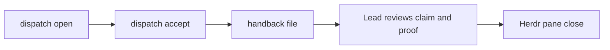
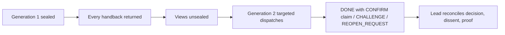

Coordination lanes are Herdr panes, never subprocess agents created by Maestro.
The Lead owns topology and delivery; Maestro owns the durable contract and
return packet.

## Lane lifecycle



The stored dispatch is the assignment. Acceptance binds its session to the
Peer role, the handback returns a claim, and only the Lead's review can accept
that claim before the pane closes.

## Lane types

- `scout` holds a no-write lease: discovery only, reports state.
- `decision` holds a no-write lease: investigates alternatives and recommends.
- `delivery` owns bounded writes inside the declared mutation scope.
- `challenge` holds a no-write lease: tries to break a premise or candidate and
  returns findings, not fixes.
- `shadow` holds a no-write lease beside the owner and returns comparison
  evidence that is never a candidate or a work write lease.

A no-write lease is enforced at the store, not at the filesystem: the lane
gate refuses `work start` to a session holding a no-write dispatch, and
nothing intercepts what the harness writes. The table says which boundary is
which. A soft-audited boundary is binding on the role and checkable after
the fact, not prevented.

| Boundary | Enforced by | Soft-audited |
|---|---|---|
| work write lease | `LEASE_HELD` on `work start`; the lane gate for no-write dispatch holders | file writes by the harness |
| council seal | `handback show`, `handback list`, and attention hide sealed returns | the SQLite file and note files on disk stay readable |
| one handback per dispatch | `HANDBACK_EXISTS` | the truth of the claim |
| untargeted accept | opener confirmation before work or handback | which pane the brief reached |
| Supervisor sub-agents | `Agent` and `Task` denied in the room's Claude settings | Codex, and any Peer pane in a repository |
| Supervisor project writes | `MAESTRO_READ_ONLY=1` on the `hm` brief | every other verb the room session runs |
| external effects (push, tag, publish, deploy, spend, delete) | nothing | the Human gate in the role contract |
| tool and call budgets | nothing | the assignment text |

## Open a dispatch

After the Lead creates the work item and opens an unwatched Herdr lane pane, it
stores the complete contract:

```sh
maestro dispatch open <work-id> --objective "<observable outcome>" --owned-scope "<paths or responsibility>" --excluded-scope "<explicit non-goals>" --mutation "<no-write or write-bounded paths>" --stop-condition "<done or blocked boundary>" --lane delivery --evidence-required "source: <falsifier>" --pane <pane-id> --target-session <session-id>
```

For a Codex pane whose session does not exist until its first turn, the Lead
opens the pane-bound dispatch without `--target-session`, sends the real stored
contract as the first prompt, then verifies the holder after acceptance.

The Lead reads the stored contract and work context before sending it:

```sh
maestro dispatch show <dispatch-id>
maestro dispatch list <work-id>
```

## Accept the lane

The Peer begins by accepting exactly the stored dispatch:

```sh
maestro dispatch accept <dispatch-id>
```

Acceptance binds the session to the Peer role without taking the work write
lease. A delivery Peer starts the assigned work separately when the contract
requires the write lease.

## Return a handback

The Peer stops at the contract boundary and files the complete return packet:

```sh
maestro handback file <dispatch-id> --status DONE --claim "<current belief>" --proof "source: <falsifier>" --assumptions "None" --residual-risks "None" --incidental-findings "None"
```

The Lead reads the handback, checks its evidence, decides whether the work is
complete, and only then closes or reuses the lane pane. A handback is a claim,
not acceptance. A Peer that discovers a topology dependency returns
`DEPENDENCY_REQUEST`; one that discovers the assignment needs several
independent judgments returns `COUNCIL_REQUEST`. The Lead either opens the
required work or council, or records why it declined with `maestro work note`.

## Herdr procedure

The full `~/maestro/lane.md` procedure has the Lead create an unwatched lane
tab, split panes, start the requested harness, resolve session identity, store
and send the exact dispatch, wait for `working`, then wait for any terminal
Herdr state. Both `idle` and `done` mean to read the handback; `blocked` needs
inspection. A wait that returns without a state is re-armed. No Maestro verb
pushes a brief into a pane or calls Herdr.

## Councils

Concurrent dispatches in one generation on the same work item form a council.
The council remains sealed until every lane returns, which prevents one view
from biasing another. The Lead reconciles the complete set; it does not count
votes.

When the returned views conflict or the risk warrants cross-examination, the
Lead opens a second generation on the same work item. Each new dispatch quotes
the other Peers' handbacks verbatim and asks one targeted question. Peers never
prompt each other. They answer by handback with `DONE` and a `CONFIRM` claim,
`CHALLENGE`, or `REOPEN_REQUEST` (`CONFIRM` is claim text, not a status), and
the Lead records the final decision, dissent, and next
proof. A third round requires a new question.



Implementation of the ruling belongs on separate work, not as a later
dispatch that silently changes council membership.
