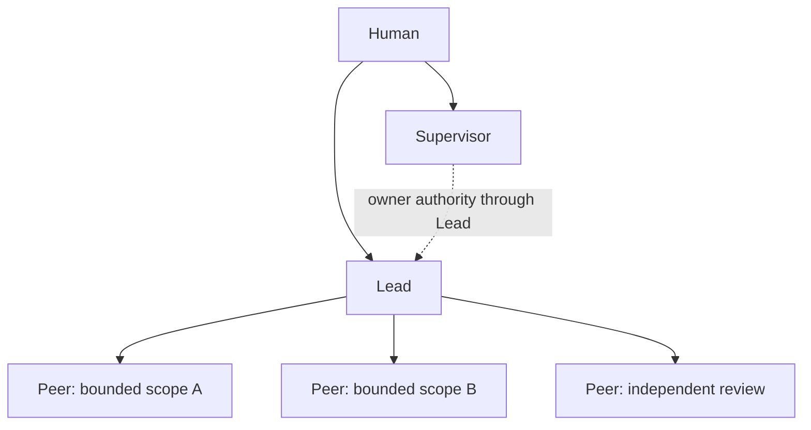
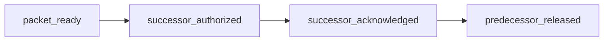

Read the complete role contract from the installed runtime:

```sh
maestro recipe show slp
```

## Human

The Human owns purpose, priority, risk, and every external effect, including
push, publish, deploy, send, spend, and delete. The Human creates, replaces,
and revokes the Supervisor and Leads, and accepts at the owner boundary.

## Supervisor

The Supervisor lives in `~/maestro` and is the owner's embodiment across
registered projects. It filters attention, governs in the owner's name, and
carries Human authority in full: every authority listed for the Human above is
the room's to exercise, the external effects included. It normally works
through each project's Lead, and does not dispatch a Peer directly, edit
project code, or accept a technical candidate.

Full authority includes intervening in any team to stop or correct an error:
freezing work, overriding or superseding a team decision, redirecting or
replacing a `supervisor-<team>` or a Lead, and ordering a correction. A code
correction still goes through that team's Lead and its lanes unless the room
explicitly takes a lane over.

Every external effect runs only behind the room's gate: push, tag, release,
publish, deploy, `maestro update`, remotes, deletion, machine config. The gate
is a locked room decision that names the exact candidate and the verified
evidence, never straight from a Lead's prompt, with the command and its output
recorded. The authority is the room's; the gate is what makes it safe to hold.

The room has exactly one Supervisor. `~/maestro/IDENTITY.md` binds its owner,
project scope, reporting target, observation boundary, raw transcript access,
write authority, acceptance authority, recovery or replacement lease, the
external-effect gate, and review date. Raw transcript access stays denied: the
room reads stores and handbacks, not panes.

Write authority and acceptance authority are soft-audited, and so is the gate:
nothing in the runtime refuses a push from a room that skipped its decision.
The binding is the contract, not a gate in code.

The installer also denies Claude's `Agent` and `Task` tools in the Supervisor
room. Codex has no equivalent hook and remains bound by the role contract.

## Lead

A session started in a repository working tree is that repository's Lead. The
Lead owns the project outcome, problem framing, the smallest sufficient
topology, one write owner per moving scope, dependencies, integration,
candidate identity, verification strategy, and engineering acceptance inside
the Human lease.

A scope has exactly one active Lead. A large project may have several scopes,
each with its own Lead, but the root Lead owns integration and release. A scope
dependency travels as a work item and handback, not as a second Lead on the
same moving scope.

## Peer

A pane the Lead opened with a dispatch becomes a Peer when it accepts that
stored contract. The Peer owns independent judgment or bounded delivery and
proof for its own writes. It does not own topology, scope beyond the
assignment, project acceptance, or external effects.

A Peer may return `DONE`, `BLOCKED`, `UNTESTABLE`, `UNKNOWN`, `FAILED`,
`CHALLENGE`, `REOPEN_REQUEST`, `DEPENDENCY_REQUEST`, or `COUNCIL_REQUEST`.
Unknown and partial results stay explicit; they are never rounded up to
acceptance.

## Teams

A team is one Herdr workspace. A session reads its role from its agent name
prefix and its team from the workspace it sits in, never from cwd: cwd decides
only which store a verb reads, so two teams on one repository share a store and
stay separate teams. One team cwd maps to exactly one workspace, and the opener
reuses a matching workspace before creating one.

| name | what it is | writes? |
|---|---|---|
| `supervisor-<team>` | the team's one record holder: locks decisions, receives done reports, holds the owner gates for the team | yes, records |
| `advisor-<team>` | counsel for the record holder when it is stuck or the owner is away | no |
| `observer-<team>` | drift watch for as long as the team is working | no |
| `lead-<repo basename>` | Lead of that repository; a team spanning repositories holds several | yes, in that repository |
| `consult-<repo basename>` | the Lead's counterpart beside it | no |
| `peer-<dispatch id>` | one bounded assignment | inside its mutation boundary |

The observer reads the panes of its own workspace and speaks to whoever drifts
as `[from observer][suspected] <pane> <quoted evidence> <why>`, once per issue
and again only on new evidence. It never changes an assignment, never freezes,
never runs a write verb, and never writes the store: the addressee or
`supervisor-<team>` decides, and `supervisor-<team>` records. Its triggers are
countable rather than a matter of taste: the same failure a third time, a pane
claim contradicting `maestro status` or `maestro work show`, a role answering a
question type it does not own, a pane silent past its stop condition, and
self-doubt phrases repeated in one turn.

`observer-<team>` splits sensor from judgment: a small shell watcher in its own
pane matches the countable triggers and wakes the model with
`[watch] <pane> <state> <matched lines>`; the model then reads further, checks
the store with `MAESTRO_READ_ONLY=1` so the read leaves no trace in a store it
does not own, and either speaks or stays silent. That prefix is
[observer mode](/guides/observer-mode/), the read-only store mode; the role and
the mode share a word, not a definition. The watcher is not a maestro
process: no verb starts it, it opens no store, and it dies with its pane.

Between a team and the room there is one channel, and it runs upward:
`supervisor-<team>` reports to the room with
`herdr agent prompt supervisor "[from supervisor-<team>][report|ask|done w<room-id>] ..."`.
Leads, advisors, observers and peers never prompt the room, and the room reaches
a team only through its `supervisor-<team>`, except for a Lead it opened and
still owns. A misrouted report fails closed: a supervisor answers a
`[from lead]` prompt from a Lead it does not own with the single line
`not my supervisor: send to supervisor-<team>`, neither verifying nor recording
it, because absorbing it would leave that team's record holder never learning
the work closed.

The room at `~/maestro` is its own workspace and opens no agent there; it opens
each team's panes in that team's workspace. Team membership, the observer's
read scope, one workspace per team cwd, and the room's clean workspace are all
soft-audited.

## SLP topology



The topology has one write owner per moving scope. The Supervisor is not the
writer or the technical acceptance owner while a Lead holds the scope; when it
intervenes it says so and takes the lane over rather than writing beside the
Lead. Peers do not create sub-topology unless
the assignment grants it, and Human decisions or scope changes reach Peers
through the Lead. Two sessions holding parent work in one repository are
split-brain; the later session stops and reads `maestro status`.

## Lead handoff

A Lead continues or is replaced only through a frozen packet at a bounded stop
point. The packet records the objective, scope, current state, current write
owner, accepted decisions, failed approaches, successful patterns, evidence
index, active risks and blockers, and exact resume point. A narrative summary
without those fields is incomplete.

Each receipt is drafted as
`maestro decision draft "<receipt> <bundle-id>" --work <id>` and then locked.
Its literal first token is `packet_ready`, `successor_authorized`,
`successor_acknowledged`, or `predecessor_released`.



The outgoing Lead records `packet_ready`. The owner, through the Supervisor,
records `successor_authorized`; the successor may reject an incomplete packet
before recording `successor_acknowledged`; the owner then records
`predecessor_released`. The predecessor stops writing at release.
Packet completeness, receipt order, and break-before-make are soft-audited.
