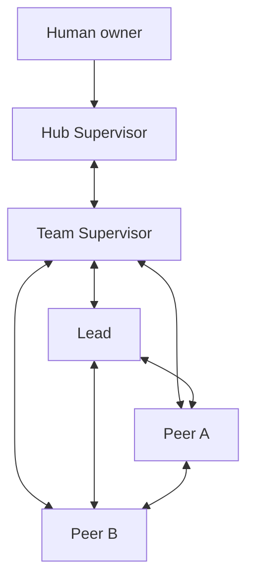
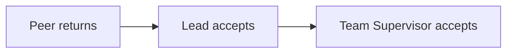

SLP v2 has four roles. The Human remains the owner above the system, but is not
an additional team seat.

SLP is a cooperative-agent protocol, not a shell security sandbox. Maestro
checks the nine SLP operations at their supported boundaries: Hub operations
must run from the Hub room, while project role operations require the current
generation's stored Herdr pane binding. It does not block native commands,
administrative Maestro commands, or direct Herdr calls; topology and
external-effect limits remain obligations enforced by the Human and host
policy. Within those operations, `MAESTRO_SESSION_ID` and
`MAESTRO_SESSION_PID` do not grant an SLP role; a missing, mismatched, or
prior-generation pane binding fails closed. The pane identity is
`HERDR_PANE_ID`, or, when an agent's shell dropped the variable, the value the
nearest ancestor process still carries.

## Topology

Every double arrow is a direct conversation channel in the SLP protocol. The
supported Hub flow has no Hub-to-Lead or Hub-to-Peer channel; unrestricted
Herdr itself is outside that guarantee.

## Authority

| Role | Owns | SLP operations |
| --- | --- | --- |
| Hub Supervisor | team creation, cross-team status, owner decisions, emergency stop | `team start`, emergency `team stop`, `status`, `decide` |
| Team Supervisor | team coordination and acceptance | `team stop`, `status`, `work add`, `work note`, `work accept`, `decide` |
| Lead | technical coordination and Peer acceptance | `status`, `work add`, `work take`, `work note`, `work return`, `work accept`, `decide` |
| Peer | bounded execution and independent judgment | `status`, `work take`, `work note`, `work return` |

Each team seat runs as a native harness profile (`claude --agent
maestro-<name>` or `codex --profile maestro-<name>`) rendered by `maestro
install` from the profile file the Workspace Pack names; the mandate is the
seat's system prompt, so it survives `/clear` and compaction. Attention is the
seat's own `work note --blocked`, pushed one seat up, plus the generation's
runtime pane, which turns a `blocked` or idle-while-holding pane into a
`stall:dialog` or `stall:silence` entry and the d763 nudge (Hub d96, d97); no
model judges attention.

## Hub Supervisor

The Hub Supervisor lives in `~/maestro`. It starts teams, maintains the
canonical Workspace Pack, reads cross-team status and records owner or
cross-team decisions. It communicates with each team only through that team's
Team Supervisor.

External effects still require Human authority. Recording a decision does not
execute its native tool.

## Team Supervisor

The Team Supervisor is the team's record holder and acceptance owner. It
communicates directly with the Hub Supervisor, Lead and every Peer. It assigns
work to the Lead, accepts Lead returns and stops the team when all work is
done.

## Lead

The Lead owns technical decomposition, integration, verification strategy and
Peer acceptance. It communicates directly with Team Supervisor and every
Peer. A Lead may assign independent work to several Peers without making their
conversation dependent on a stored envelope.

## Peer

A Peer takes work assigned to its identity, records material notes and returns
results. It may speak directly to Team Supervisor, Lead and other Peers. It
does not accept its own work and does not settle team decisions.

## Conversation and records

Natural conversation needs no record ID. Chat alone does not mutate work,
authority or accepted decisions. Record these changes before they govern:

- changed objective or acceptance: create new work; the existing contract is immutable;
- material context on the same contract: `maestro work note`;
- settled technical, team or owner choice: `maestro decide`;
- a fact only the seat above can settle, while keeping the item: `maestro work note --blocked`;
- completed or blocked execution: `maestro work return`;
- reviewer acceptance: `maestro work accept`.

## One acceptance boundary above the worker

This keeps execution and acceptance separate without adding review roles or a
second lifecycle.
