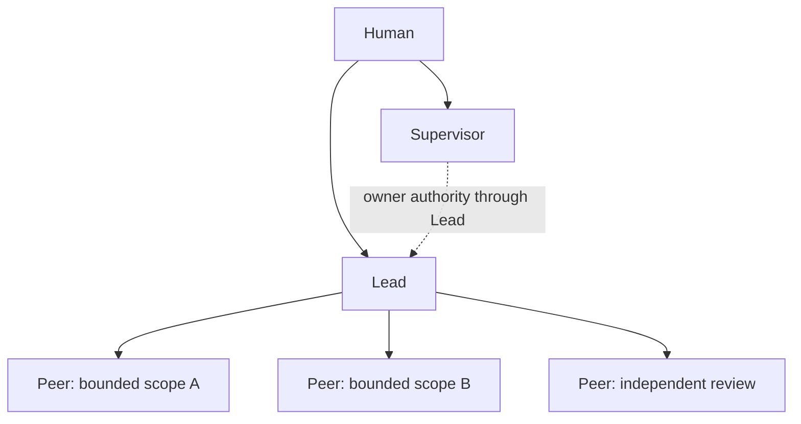
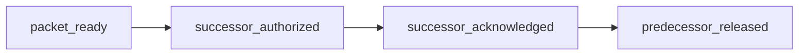

Read the complete role contract from the installed runtime:

```sh
maestro recipe show slp
```

## Human

The Human owns purpose, priority, risk, and every external effect, including
push, publish, deploy, send, spend, and delete. The Human creates, replaces,
and revokes the Supervisor and Leads, and accepts at the owner boundary.

## Supervisor

The Supervisor lives in `~/maestro` and represents the owner across registered
projects. It filters attention, governs in the owner's name, and carries Human
authority through each project's Lead. It never dispatches a Peer directly,
edits project code, or accepts a technical candidate.

The room has exactly one Supervisor. `~/maestro/IDENTITY.md` binds its owner,
project scope, reporting target, observation boundary, raw transcript access,
write authority, acceptance authority, recovery or replacement lease, and
review date. Raw transcript access, project writes, technical acceptance, and
recovery are denied unless the owner explicitly changes that binding.

Write authority and acceptance authority are soft-audited: the room's `hm`
brief runs read-only (`MAESTRO_READ_ONLY=1`), but a session that changes
directory into a project can run write verbs there. The binding is the
contract, not a gate.

The installer also denies Claude's `Agent` and `Task` tools in the Supervisor
room. Codex has no equivalent hook and remains bound by the role contract.

## Lead

A session started in a repository working tree is that repository's Lead. The
Lead owns the project outcome, problem framing, the smallest sufficient
topology, one write owner per moving scope, dependencies, integration,
candidate identity, verification strategy, and engineering acceptance inside
the Human lease.

A scope has exactly one active Lead. A large project may have several scopes,
each with its own Lead, but the root Lead owns integration and release. A scope
dependency travels as a work item and handback, not as a second Lead on the
same moving scope.

## Peer

A pane the Lead opened with a dispatch becomes a Peer when it accepts that
stored contract. The Peer owns independent judgment or bounded delivery and
proof for its own writes. It does not own topology, scope beyond the
assignment, project acceptance, or external effects.

A Peer may return `DONE`, `BLOCKED`, `UNTESTABLE`, `UNKNOWN`, `FAILED`,
`CHALLENGE`, `REOPEN_REQUEST`, `DEPENDENCY_REQUEST`, or `COUNCIL_REQUEST`.
Unknown and partial results stay explicit; they are never rounded up to
acceptance.

## SLP topology



The topology has one write owner per moving scope. The Supervisor is never the
writer or technical acceptance owner. Peers do not create sub-topology unless
the assignment grants it, and Human decisions or scope changes reach Peers
through the Lead. Two sessions holding parent work in one repository are
split-brain; the later session stops and reads `maestro status`.

## Lead handoff

A Lead continues or is replaced only through a frozen packet at a bounded stop
point. The packet records the objective, scope, current state, current write
owner, accepted decisions, failed approaches, successful patterns, evidence
index, active risks and blockers, and exact resume point. A narrative summary
without those fields is incomplete.

The store receipts are ordered:



The outgoing Lead records `packet_ready`. The owner, through the Supervisor,
records `successor_authorized`; the successor may reject an incomplete packet
before recording `successor_acknowledged`; the owner then records
`predecessor_released`. The predecessor stops writing at release.
