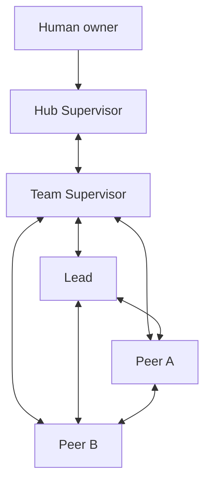
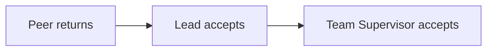

SLP v2 has four roles. The Human remains the owner above the system, but is not
an additional team seat.

## Topology

Every double arrow is a direct conversation channel. The Hub Supervisor has no
direct channel to the Lead or Peers.

## Authority

| Role | Owns | SLP operations |
| --- | --- | --- |
| Hub Supervisor | team creation, cross-team status, owner decisions, emergency stop | `team start`, emergency `team stop`, `status`, `decide` |
| Team Supervisor | team coordination and acceptance | `team stop`, `status`, `work add`, `work note`, `work accept`, `decide` |
| Lead | technical coordination and Peer acceptance | `status`, `work add`, `work take`, `work note`, `work return`, `work accept`, `decide` |
| Peer | bounded execution and independent judgment | `status`, `work take`, `work note`, `work return` |

## Hub Supervisor

The Hub Supervisor lives in `~/maestro`. It starts teams, maintains the
canonical Workspace Pack, reads cross-team status and records owner or
cross-team decisions. It communicates with each team only through that team's
Team Supervisor.

External effects still require Human authority. Recording a decision does not
execute its native tool.

## Team Supervisor

The Team Supervisor is the team's record holder and acceptance owner. It
communicates directly with the Hub Supervisor, Lead and every Peer. It assigns
work to the Lead, accepts Lead returns and stops the team when all work is
done.

## Lead

The Lead owns technical decomposition, integration, verification strategy and
Peer acceptance. It communicates directly with Team Supervisor and every
Peer. A Lead may assign independent work to several Peers without making their
conversation dependent on a stored envelope.

## Peer

A Peer takes work assigned to its identity, records material notes and returns
results. It may speak directly to Team Supervisor, Lead and other Peers. It
does not accept its own work and does not settle team decisions.

## Conversation and records

Natural conversation needs no record ID. Chat alone does not mutate work,
authority or accepted decisions. Record these changes before they govern:

- changed objective or acceptance: `maestro work note`;
- settled technical, team or owner choice: `maestro decide`;
- completed or blocked execution: `maestro work return`;
- reviewer acceptance: `maestro work accept`.

## One acceptance boundary above the worker

This keeps execution and acceptance separate without adding review roles or a
second lifecycle.
