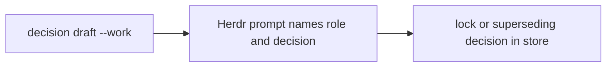

## Work items

Maestro uses one work entity for features, tasks, bugs, chores, implementation,
ideas, and research. Work can form a parent tree, depend on other items, carry a
live lease, and end with claims and proofs.

Parentless write-like work needs either a child breakdown or an explicit atomic
reason:

```sh
maestro work add "<title>" --kind task --atomic-reason "<why this is one bounded unit>" --acceptance "<observable result>"
```

Use `maestro work show <id>` to read its blockers, children, notes, lease, and
evidence. Use `maestro ready` to see which work can start.

## Decisions

Draft the settled choice with its rationale and rejected alternative, then lock
it as a separate transition:

```sh
maestro decision draft "<choice>" --rationale "<why, including the rejected alternative>" --work <work-id>
maestro decision lock <decision-id>
```

To replace a locked decision, draft a new one with `--supersedes
<decision-id>` and lock the replacement. Supersession takes effect at lock,
not while the replacement remains a draft. History is never rewritten.

## Talking across roles

Herdr carries the words; the store carries the truth. A prompt alone has no
durable provenance, so a question that needs an owner or Supervisor decision
starts as a draft linked to the work:

```sh
maestro decision draft "<choice>" --rationale "<why, options>" --work <work-id>
herdr agent prompt <name> "[from lead][ask <decision-id>] <question>"
```

The answer is recorded, not merely prompted. When the Supervisor relays an
owner instruction, it locks the draft with
`maestro decision lock <decision-id>`. Supervisor advice is a default, not an
owner instruction: the Lead locks the matching draft or drafts a superseding
decision whose rationale starts `supervisor default, not owner instruction`.

Questions that are not decisions are notes on the same work item:

```sh
maestro work note <work-id> "<question>"
```

Peers prompt only the Lead and prefix the message with `[from peer]` and the
dispatch id. Peers never prompt the Supervisor, and the Supervisor never
prompts a Peer.



## Method tiers

Decide the tier from the request before any recon:

- **quickfix**: the diff fits in one sentence and hits no Full trigger. Work
  directly, verify inline, and create no store record. If the change grows
  beyond that sentence, stop and add a work item.
- **Light**: the work lasts one session on one branch and its acceptance fits
  in one sentence. Use `maestro work add`, `maestro work start`, and
  `maestro work done` so ready, attention, and brief can see it.
- **Full**: the work spans sessions, branches, or agents on the same moving
  scope, is high risk, or repeats a failed fix. Link the work to a bundle:

```sh
maestro bundle open <bundle-id> --work <work-id>
```

The active bundle contains `SPEC.md` for the contract, `NOTES.md` for the
handoff, and `VERIFY.md` for scenarios and results. Close it only after the
verification table passes:

```sh
maestro bundle close <bundle-id>
```

## Claims and proofs

Complete held work with an observable claim paired to evidence that could
falsify it:

```sh
maestro work done <work-id> --claim "test: <behavior>" --proof "source: <falsifier>"
```

Evidence layers are `source`, `artifact`, `installed`, `live`, and `journey`.
Claim only as far as the last proven link and name untested links explicitly.

## Default policy gates

- `policy-breakdown` requires parentless write-like work to have a child
  breakdown or `--atomic-reason`; open write-like children block their parent.
- `policy-dispatch` blocks completion or cancellation while a dispatch lacks a
  handback and blocks work start while a sealed council is open.
- `policy-proof` requires opaque `--evidence` or paired `--claim` and `--proof`
  on completion.

The TDD, QA, research, witness, and lifecycle policy plugins ship disabled and
can be enabled per repository.
