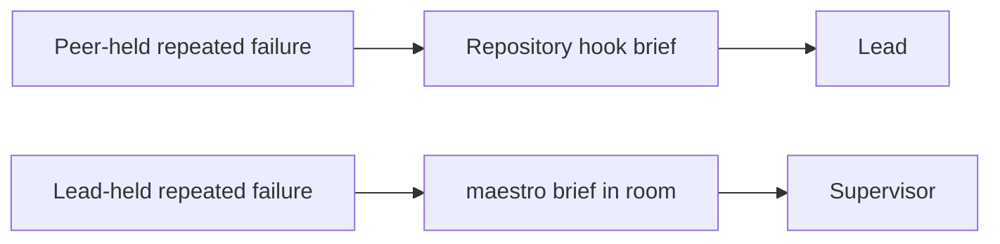

## Scan one repository

```sh
maestro attention
```

Attention is computed from current store state when read. It does not deliver a
mailbox message and does not require a daemon. The detector set is:

- `STALLED_LEASE`
- `REPEATED_FAILURE`
- `DECISION_STALE`
- `SCOPE_COLLISION`
- `DISPATCH_UNACCEPTED`
- `DISPATCH_UNRETURNED`
- `HANDBACK_UNREVIEWED`
- `LESSONS_PENDING`

`LESSONS_PENDING` is the improver's trigger. It is raised for a project when
five lessons are pending for it, or when seven days have passed since the last
improver run in that project, whichever comes first; before any run, the oldest
pending lesson starts that clock. It is grouped by the lesson's project tag,
because the room relays "run improver" to the Lead of the doctrine the lessons
target. The improver never runs per correction.

Threshold flags tune stale leases, draft decisions, and unreturned dispatches.
For a compact machine-readable result, run:

```sh
maestro attention --json
```

## Failure routing

`REPEATED_FAILURE` follows the holder role. Failures on a Peer-held lease go
only to the repository hook brief, where the Lead owns recovery. Failures on a
Lead-held lease go only to the room brief, where the Supervisor owns the next
governance question. `maestro attention` still lists both and names the holder
role and route.



## Brief all registered repositories

```sh
maestro brief
```

Brief reads `~/maestro/registry`, opens each registered repository with
`MAESTRO_READ_ONLY=1`, and reports only what needs attention. Missing
repositories are named and skipped. When every repository is running normally,
the brief says so in one line instead of listing ordinary progress.

The Supervisor room's `hm` shell function focuses the `maestro` Herdr workspace
and prints this brief. It returns to the shell and does not start an agent.

The Supervisor separates observation, hypothesis, and verdict. It answers an
attention packet with an open question to the Lead, a recommendation, a
decision relayed in the owner's name, or a freeze when the owner granted that
recovery lease. It does not inspect raw pane transcripts or edit the project.
