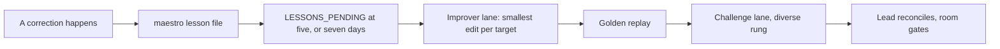

A correction you type into a pane is spent when that pane closes. Doctrine, the
recipes and skills and Workspace Protocols a session actually reads, is the only
thing that outlives it. This loop is how one becomes the other: corrections are
filed as records, a pile of them triggers one improver lane, and the edit that
lane proposes is gated before it becomes the rule everyone reads next.



## File the correction where it happened

```sh
maestro lesson file "the Lead re-recorded a peer's row and blocked its ship" \
  --target "recipes/slp.md, Lane procedure" \
  --expected "coordinate and wait; never record another lane's row" \
  --why "two writers on one row leaves neither able to close" \
  --evidence w521 --evidence h44
```

A lesson names the doctrine it corrects, what happened, what was expected, why,
and the ids that evidence it. The target is a place a later edit can land: a
recipe section, a rule in `lane.md` or `lead.md`, a room template, a
`skills/maestro-*` file, or a repository's Workspace Protocol. `--evidence`
repeats and takes work, handback, or decision ids.

File it at the moment of the correction, not at the end of the round. The
improver reads lessons and nothing else, which is exactly what makes the minute
it costs worth spending: a note in a transcript will not be read again.

### Who files one

The owner, the room, a `supervisor-<team>`, and a Lead file lessons directly.
A Peer has no filing channel of its own: a finding it makes travels in its **handback**, and
the Lead decides whether it becomes a lesson. Filing is scoped to the roles that
already hold record authority, so a bounded lane cannot rewrite the rules that
bound it.

## Wait for the threshold

Nothing runs per correction. `maestro attention` raises `LESSONS_PENDING` for a
project when **five pending lessons** have accumulated for it, or when **seven
days** have passed since that project's last improver run, whichever comes
first; before any run, the oldest pending lesson starts that clock. See
[Attention and brief](/guides/attention-and-brief/) for the rest of that scan.

The threshold is the point. Running per correction would make every correction a
negotiation, and a pile is what shows which rule was actually ambiguous: three
lessons on one sentence are one edit, and the second one usually tells you which
reading was wrong.

The room relays "run the improver" to the Lead of the doctrine those lessons
target. Recipes, room templates and managed skills go to the upstream maestro
Lead; a repository's Workspace Protocol goes to that repository's Lead.

## The improver lane

The Lead opens **one delivery lane on the strong rung** with the shared
`maestro-improve` skill, whose only parameter is the target. The skill ships
with the install; see [Recipes, skills, and
plugins](/guides/recipes-skills-plugins/).

```sh
maestro lesson list --project maestro   # pending only, by design
maestro lesson show l12
```

The lane groups pending lessons by target and proposes, per group, the
**smallest edit** that would have prevented what happened. Doctrine is read
under load, so a sentence that removes an ambiguity beats a paragraph that adds
a procedure; if the existing text already covers it, the lesson is a rejection
rather than an edit. Each group lands as one commit on a branch, carrying the
evidence ids of every lesson in it, so a later reader gets from the rule back to
the incident that shaped it.

```sh
maestro lesson process l12 --commit 8cc27daa
maestro lesson process l13 --answer "lane.md already says a lane never records another lane's row"
```

A lesson is marked processed by pointing at the commit that carries its edit, or
answered with the reason it produced none. Both stop it counting toward the next
threshold, and a lesson is **never deleted** either way: a rejected one stays
readable, because wrong feedback is still data about which rule confused someone.
"Out of scope" is not an answer; name the text that already covers it.

## The replay gate

Doctrine has golden scenarios: a script of maestro commands and the transcript
it produced beside it, `tests/scenarios/<name>.script` and `<name>.golden`,
replayed against a fresh store.

```sh
bun test tests/scenario-golden.test.ts
```

An improver edit is accepted only when the replay still matches the golden set,
or matches the change a lesson explicitly asked for. Drift no lesson asked for
is a regression in the doctrine, not an improvement. When a lesson did ask for
it, re-record and ship both together:

```sh
MAESTRO_GOLDEN_UPDATE=1 bun test tests/scenario-golden.test.ts
```

The new golden travels in the same commit as the edit, so the diff shows the
behaviour that changed next to the sentence that changed it. A doctrine edit no
scenario covers is an edit nothing can falsify: add the scenario in the same
commit rather than leaving the rule unwatched. The harness is also a
prerequisite for the first improver run in a project: lessons accumulate and
`LESSONS_PENDING` stays visible, but the room does not relay "run the improver"
until there is something to replay against. [SLP
scenarios](/guides/slp-scenarios/) covers what the scripts do and do not pin.

## The challenge lane

Every improver run is followed by a challenge lane on the **diverse rung**: a
different model family reads the same lessons and the proposed diff, and asks
whether each edit follows its lesson and breaks no other rule. The Lead
reconciles the two, reports done, and the room holds the gate.

Doctrine governs every later lane, which makes it the most material change in
the repository, and a Lead does not accept a material change alone. A doctrine
edit approved only by the model that wrote it is the failure this pairing exists
to prevent.

## Read what a project already learned

```sh
maestro lesson render
```

The room renders `~/maestro/PROJECT/<project>.md`, one file per project tag,
from its own store plus every store in `~/maestro/registry`, read through a
read-only child. Pending and processed lessons both appear, so a new team
inherits the whole record rather than the pending tail of it.

Like `registry`, these files are a view and are **never hand-edited**; the way
to change one is to file or process a lesson. The room hands that path in the
prompt that starts a Lead, and a new Lead reads it before its first card.

## Verbs

Full flags for `lesson`, `attention` and the rest are in the [CLI
reference](/reference/cli/).

| Verb | What it does |
|---|---|
| `lesson file` | Records a correction against a doctrine target with its evidence. |
| `lesson list [--all] [--project <value>]` | Lists pending lessons; `--all` includes processed ones. |
| `lesson show <id>` | Reads one lesson and its evidence. |
| `lesson process <id> --commit \| --answer` | Marks a lesson processed by its edit or by the reason it produced none. |
| `lesson render` | Writes the per-project view under `~/maestro/PROJECT/`. |

## What it looks like when it goes wrong

- A correction is relayed by hand instead of filed: it reaches one session and dies there.
- A Peer files lessons directly: a bounded lane is editing the rules that bound it.
- The improver runs per correction: every correction becomes a negotiation, and no pattern ever aggregates.
- A lesson is left pending because it is wrong: pending means unread, and it keeps pulling the threshold.
- An edit rewrites the section rather than the ambiguous sentence: the reading that was ambiguous is lost.
- The replay drifts and the edit lands anyway: the golden set stopped being a gate.
- The Lead lands the branch without the challenge lane: one model marked its own work on the rules everyone reads.
