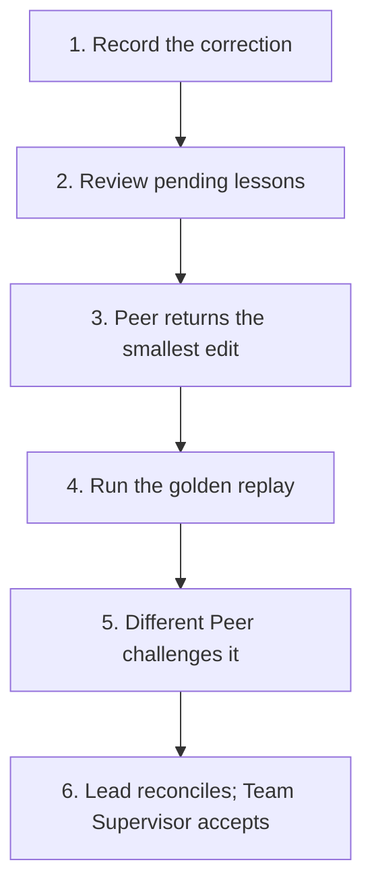

Self-improvement is an administrative Maestro workflow outside the nine SLP
operations. Inside a running team, the actual implementation and challenge use
the same four-state work lifecycle as every other task.

## The loop



The vertical layout keeps every step readable on narrow screens. All Mermaid
diagrams on this site use white nodes with black text, borders and arrows.

## 1. File the correction

Record what happened where it happened:

```sh
maestro lesson file "A Peer changed scope without recording it" \
  --target "SLP shared contract" \
  --expected "create new work when the objective contract changes" \
  --why "chat alone does not mutate authority" \
  --evidence w42
```

A lesson is durable input, not an automatic rule change. The owner, Hub
Supervisor, Team Supervisor or Lead may file it. A Peer reports the issue in
its work return or note; its reviewer decides whether to file a lesson.

## 2. Review the pending set

```sh
maestro lesson list
maestro lesson show <lesson-id>
```

Group only lessons that point to the same target and failure mechanism.
Thematic similarity alone is not enough to merge them.

## 3. Assign the smallest doctrine edit

Lead creates one bounded work item for an improver Peer:

```sh
maestro work add "Apply the smallest SLP correction for lessons l3 and l7" \
  --to peer-improver
```

The Peer takes the work, edits only the named target, and returns the candidate
with its falsifier:

```sh
maestro work take <work-id>
maestro work return <work-id> "candidate: smallest contract edit; source: focused replay now passes; residual risk: challenge not run"
```

Lead does not accept yet.

## 4. Run the golden replay

The golden replay reproduces the original failure against the candidate. It
must be able to fail for the same reason the lesson was filed. A generic lint
or prose review is not a substitute.

Record the exact result on the work item:

```sh
maestro work note <work-id> "golden replay: PASS; source: <exact command or scenario>"
```

## 5. Challenge with a different Peer

Create separate no-fix challenge work for a Peer that did not author the
candidate:

```sh
maestro work add "Try to break the doctrine candidate for l3 and l7; findings only" \
  --to peer-challenge
```

The challenge Peer takes and returns that work normally. A finding routes back
to rework through a reviewer note. A clean challenge is evidence, not automatic
acceptance.

## 6. Reconcile and process the lessons

When the replay and challenge both support the candidate, Lead accepts the Peer
work and records any settled doctrine choice:

```sh
maestro work accept <improver-work-id>
maestro work accept <challenge-work-id>
maestro decide "Adopt the smallest verified doctrine correction" \
  --why "the original replay and an independent challenge both pass" \
  --work <improver-work-id>
```

Team Supervisor accepts the Lead's overall return at the next boundary.

Mark each lesson processed by the commit carrying the correction, or by a
specific answer when no edit is warranted:

```sh
maestro lesson process <lesson-id> --commit <commit>
maestro lesson process <lesson-id> --answer "existing contract already covers this case"
```

Nothing deletes a lesson.

## Render the readable view

```sh
maestro lesson render
```

The rendered project files under `~/maestro/PROJECT/` are generated views.
Edit the source lesson or accepted doctrine, then render again; never hand-edit
the rendered view.

## Gates

- No doctrine edit without an original failure or concrete correction.
- No acceptance from the Peer that authored the candidate.
- No broad rewrite when one target-specific edit fixes the replay.
- No challenge finding silently folded into the candidate; record rework.
- No lesson marked processed before the accepted edit or answer exists.
