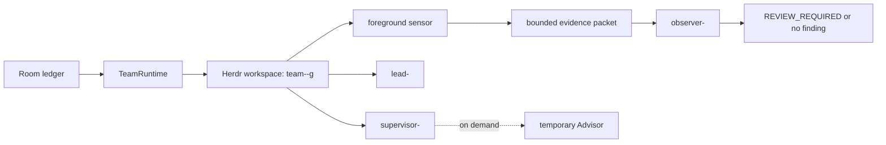

A supervised team is not a collection of panes that happen to share a name.
It is one generation recorded in the Supervisor Room ledger, backed by
deterministic Herdr resources, and accepted only after a fresh runtime receipt
proves every required postcondition.

Run these commands from the Room store. Project stores receive only a verified
binding to the Room ledger; they do not keep a copied `READY` value.

## Topology

The baseline generation contains `supervisor-<team>`, the repository Lead,
`observer-<team>`, and a dedicated foreground sensor process. Advisor and
dispatch Peers are bounded operations, not baseline readiness seats.

The familiar agent names are authority aliases. Generation ownership lives in
the resource key and pane label, such as `team:<team>:g<n>:observer`; fresh
inspection rejects the same required alias if it also exists in another
workspace.



Pane labels, an old workspace, a prompt attempt, or an earlier receipt are not
readiness. A legacy pane-only team is unmanaged until `team open` creates or
adopts a generation and proves it.

## Open and prove readiness

```sh
maestro team open <team> \
  --repo <repository> \
  --operation <stable-id> \
  --requested-by supervisor \
  --wait-ms 30000 \
  --json
```

`team open` records its attempt before any runtime command. It creates or
adopts deterministic generation resources, delivers the role bootstrap
prompts, starts the foreground sensor, probes Observer delivery, and then
inspects the complete topology. A bounded failure returns `STARTING` with exact
missing postconditions; it never rounds partial startup up to success.

For an existing team, `status` is snapshot-only. Use `health` or
`await-ready` for fresh runtime evidence:

```sh
maestro team status <team> --json
maestro team health <team> \
  --operation <stable-id> \
  --requested-by supervisor-<team> \
  --json
maestro team await-ready <team> \
  --operation <stable-id> \
  --requested-by supervisor-<team> \
  --wait-ms 30000 \
  --json
```

| Stage / health / review | Verdict | Consequence |
|---|---|---|
| `ACTIVE / READY / CLEAR` | `OPERABLE` | consequential project gates may proceed |
| `ACTIVE / READY / REVIEW_REQUIRED` | `REVIEW_HOLD` | bounded work may continue; completion and final acceptance stop |
| `ACTIVE / DEGRADED / *` | `DRAINING` | only bounded return, notes, release, inspection, repair, and stop remain |
| any non-`ACTIVE` stage | `CLOSED` | normal team work is denied |

Missing, dead, mismatched, or duplicate required resources make the team
non-operable. Health inspection records evidence but never restarts a role.
Maestro plugins that perform an external effect emit `external.effect` before
the effect so TeamControl can deny it under a non-operable verdict. Shell
effects outside that plugin event remain behind the separate Human gate.

## Supervised checks and Observer review

A supervised check is the boss-style one-shot inspection. It is bound to one
question, generation, evidence window, and stop; it does not install a watcher.

```sh
maestro team review spot-check <team> \
  --operation <stable-id> \
  --requested-by supervisor-<team> \
  --question "<one question>" \
  --window "<bounded evidence window>" \
  --stop "<one verdict>" \
  --json
```

The foreground sensor handles the fixed semantic triggers and sends only
capped evidence packets. Observer does not receive a continuous whole-team
transcript and has no work, decision, reconcile, or general store authority.
It can submit one finding only with the packet's live capability. A validated
finding sets `REVIEW_REQUIRED`; `supervisor-<team>` resolves it with rationale:

```sh
maestro team review clear <team> \
  --operation <stable-id> \
  --requested-by supervisor-<team> \
  --rationale "<why the finding is resolved>" \
  --json

maestro team review escalate <team> \
  --operation <stable-id> \
  --requested-by supervisor-<team> \
  --rationale "<why this is now a health failure>" \
  --json
```

Clear preserves health. Escalation writes separate review and health receipts
and moves an active generation to `DEGRADED`.

## Ask Advisor only when needed

Advisor is created or adopted for one decision-focused consultation, returns
one recommendation, and is closed at the declared stop:

```sh
maestro team advise <team> \
  --operation <stable-id> \
  --requested-by supervisor-<team> \
  --decision <decision-id> \
  --question "<one question>" \
  --context <record> \
  --stop-condition "<bounded return>" \
  --timeout-ms 120000 \
  --json
```

The registered Lead may also request Advisor. Advisor receives no project
work, lease, decision, reconcile, or store authority.

## Repair explicitly

Only named resources are repaired, followed by a complete readiness proof:

```sh
maestro team reconcile <team> \
  --operation <stable-id> \
  --requested-by supervisor-<team> \
  --resource observer \
  --resource sensor \
  --json
```

Valid resource names are `workspace`, `supervisor`, `lead`, `observer`, and
`sensor`. Reconcile does not clear a review hold.

## Authority and emergency override

While a team is active, `supervisor-<team>` authorizes routine reconcile,
review resolution, normal stop, and force stop. A foreground Room session
executes the runtime mutation, so every receipt stores `requestedBy` separately
from `executedBy`.

Room emergency authority is fail-closed. A Room request is rejected while the
team Supervisor is reachable. When a fresh inspection proves that Supervisor
absent or unreachable, use:

```sh
--requested-by supervisor \
--override-reason "<why override is necessary>" \
--override-evidence "<fresh absence or reachability evidence>"
```

Explicit owner intervention uses:

```sh
--requested-by owner \
--owner-intervention \
--override-reason "<why override is necessary>" \
--override-evidence "<owner decision or instruction>"
```

These fields establish who may act. They are separate from force-stop
`--reason` and `--evidence`, which authorize possible loss.

## Stop and prove absence

```sh
maestro team stop <team> \
  --operation <stable-id> \
  --requested-by supervisor-<team> \
  --wait-ms 30000 \
  --json
```

Stop records `STOPPING` before drain, closes new gates, gives work seats a
bounded chance to return evidence and release leases, then stops the sensor and
Observer. The external Room session closes `supervisor-<team>` last. `STOPPED`
is recorded only after fresh inspection proves all generation-owned resources
absent.

A timeout remains `STOPPING` with exact leftovers. Forced stop requires
`--force --reason <value> --evidence <value>` and records possible loss; it
cannot claim graceful completion.

See the complete flags in the [CLI reference](/reference/cli/#team).
