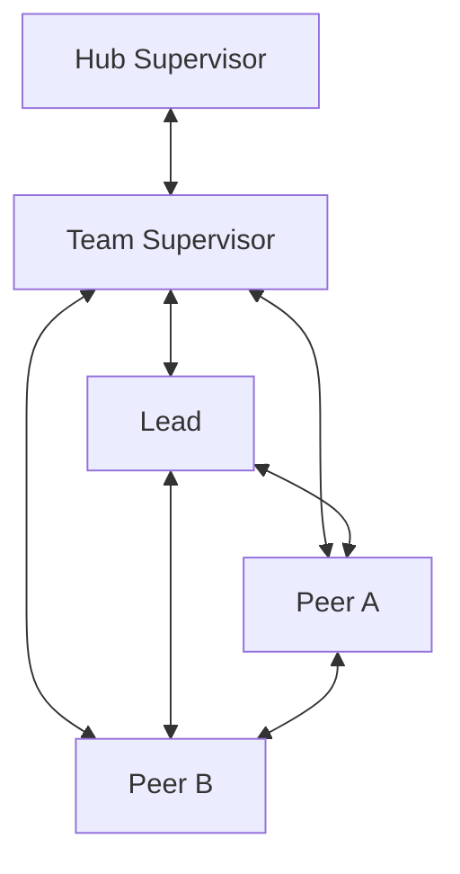
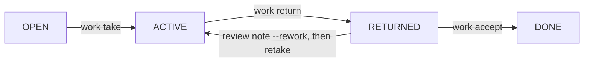

An SLP team is one generation with exactly one Team Supervisor, exactly one
Lead, one Observer, and zero or more Peers. Maestro stores material state; Herdr provides the
live workspace and direct conversations.

For installation paths and data ownership, start with
[SLP setup and storage](/getting-started/slp-setup/).

## Topology



Every displayed edge is a direct bidirectional conversation channel. In the
supported SLP flow, the Hub Supervisor reaches the team only through its Team
Supervisor; it never manages the Lead or Peers directly.

The Observer is the only seat outside the work lifecycle and the sentinel the
only background process; there is no Advisor, scheduler, health or reconcile
layer.

SLP is a cooperative-agent protocol, not a shell security sandbox. Maestro
checks the nine SLP operations at their supported boundaries: Hub operations
must run from the Hub room, while project role operations require the current
generation's stored Herdr pane binding. It does not block native commands,
administrative Maestro commands, or direct Herdr calls; topology and
external-effect limits remain obligations enforced by the Human and host
policy.

## Public operations

SLP roles use exactly nine operations:

```text
maestro team start
maestro team stop
maestro status [work-id]
maestro work add
maestro work take
maestro work note
maestro work return
maestro work accept
maestro decide
```

Flags configure one operation; they are not separate tools. Development and
administrative Maestro commands remain outside the SLP role toolbelt.

## Start

Run start from the Hub room:

```sh
cd ~/maestro
maestro team start /absolute/path/to/project "<observable objective>"
```

One call pins the Workspace Pack, creates or reuses one Herdr workspace, opens
Team Supervisor, Lead and Observer, launches the sentinel tab, and creates
initial `OPEN` work for the Lead. Peers
have no lifecycle command: a Lead creates assigned work and Maestro reuses or
opens the named Peer in the same operation.

```sh
maestro work add "<bounded objective>" --to peer-api
```

## Work lifecycle



- `work add` creates assigned `OPEN` work.
- `work take` lets the assignee take `OPEN` work, or `RETURNED` work with the
  unused reviewer grant for its current return revision.
- `work note` records material context without changing state.
- `work note --blocked` keeps the state and pushes
  `[from <role>][<id> BLOCKED] <summary>; read: maestro status <id>` to the
  seat above the caller. `work note --stall` is the Observer's nudge.
- `work return` carries the result, proof, blocker and residual risk when they
  apply.
- `work accept` is performed by the reviewer: Lead accepts Peer work and Team
  Supervisor accepts Lead work.

A Peer never accepts its own work. A holder that needs a fact from above
records `work note --blocked` and keeps the item; a holder that cannot
continue returns it with the blocker. There is no `BLOCKED` state. Rework is `work note --rework` by the correct
reviewer followed by one retake by the same assignee.

A reviewer may close `OPEN` or `RETURNED` work as cancelled:

```sh
maestro work accept <work-id> --outcome cancelled
```

`ACTIVE` work must return first unless Hub emergency-stops the team.

## Decisions

Record a settled choice in one operation:

```sh
maestro decide "<choice>" --why "<reason>"
```

Inside the team workspace, use `--work <id>` to link work. At Hub, a unique
work id resolves directly; if the same id exists in several teams, qualify it
as `<team-id>:<work-id>`. Use `--replaces <decision-id>` to replace an older
immutable decision. Unresolved discussion stays in chat or a work note.

Lead decides technical scope, Team Supervisor decides team scope, and Hub
Supervisor decides owner or cross-team scope. Peers propose through direct
conversation or a work note.

## Status

```sh
maestro status
maestro status <work-id>
```

Status is read-only and role-scoped. Hub sees teams, projects, generations,
pack identity, roles, Watch and sentinel state and work counts. Team roles see their team
and the work that requires return or acceptance. Work status includes its
objective, owner, state, notes, current return, acceptance and linked
decisions.

There is no separate team health, review or reconcile layer; the sentinel
packet goes only to the Observer.

## Watch Pane

The Team Supervisor may use existing Herdr pane control to open at most one
foreground Watch Pane. It labels and refreshes currently available raw output
from team panes. It is not an agent and never prompts, writes to the store,
gates work or intervenes.

Watch failure does not block work. Status exposes only `watch: on|off`. Raw
transcript is runtime-only and is deleted at stop.

## Observer and sentinel

`team start` opens the Observer seat after the Lead and runs
`maestro-slp-observe` in a fresh tab of the team workspace. Every five
minutes, and at once when a role pane turns blocked, the sentinel reads the
project store and the recent tail of every role pane and prompts the Observer
with one packet. The Observer answers a stall with

```sh
maestro work note <work-id> "<evidence>" --stall repeat|silence|dialog
```

Maestro stores the note with flag `stall:<kind>`, pushes
`[from observer][<id>] <kind> <evidence>; stop and run: maestro work note <id> "<what you need>" --blocked`
to the seat the item waits on, and copies it to the Team Supervisor (to the
Hub `supervisor` agent when the Team Supervisor is that seat). The same stall
on an unchanged item is stored but not pushed (`nudge suppressed`). Status
exposes `sentinel: on|off` beside `watch`; thresholds are fixed and the seat
has no opt-out.

Three limits seen in the lab. A command Codex runs in a background terminal
shows in the packet as a working pane with no repeats until it ends, so the
item's unchanged age carries the stall. A Team Supervisor's `--blocked` needs
a Hub agent pane named `supervisor`; without one the line becomes a warning on
the caller's terminal and the store remains the truth. A sentinel that has
exited (`sentinel off` while the generation is RUNNING) is relaunched by
repeating the identical `team start`.

## Stop

```sh
maestro team stop <team-id>
```

Normal stop changes nothing while unfinished work remains and lists those work
items. Once all work is `DONE`, shutdown closes Peers, Lead, Observer, the
sentinel tab, Watch and runtime transcript, then Team Supervisor. A transient foreground non-agent pane in the
Hub performs the self-closing sequence; it is internal and adds no public
operation. Maestro records `STOPPED` only after the team workspace is absent.
A partial close stays `RUNNING`, so repeating the same command continues
cleanup. The pinned pack and durable records remain.

Hub Supervisor performs emergency stop from `~/maestro`:

```sh
maestro team stop <team-id> --emergency --reason "<why this generation is abandoned>"
```

Unfinished work keeps its current `OPEN`, `ACTIVE`, or `RETURNED` value and is
marked abandoned with actor, reason, generation, and time. The next start
creates new work in a new generation and cannot mutate the abandoned records.

## Hard cut from the previous SLP

SLP v2 does not wrap or emulate the old team lifecycle. Removed commands fail
with a message naming the corresponding new operation. Old records remain
read-only legacy history and are not translated into the four-state work
model. See the compact mapping in the [CLI reference](/reference/cli/).
