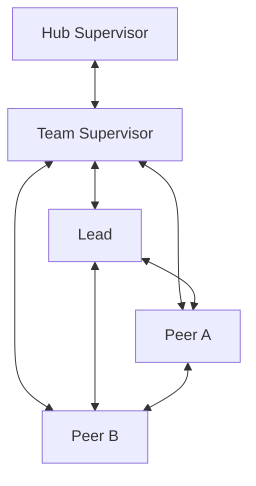

An SLP team is one generation with exactly one Team Supervisor, exactly one
Lead, and zero or more Peers. Maestro stores material state; Herdr provides the
live workspace and direct conversations.

For installation paths and data ownership, start with
[SLP setup and storage](/getting-started/slp-setup/).

## Topology



Every displayed edge is a direct bidirectional conversation channel. The Hub
Supervisor reaches the team only through its Team Supervisor; it never manages
the Lead or Peers directly.

There is no Observer, Advisor, sensor, scheduler or background agent role.

## Public operations

SLP roles use exactly nine operations:

```text
maestro team start
maestro team stop
maestro status [work-id]
maestro work add
maestro work take
maestro work note
maestro work return
maestro work accept
maestro decide
```

Flags configure one operation; they are not separate tools. Development and
administrative Maestro commands remain outside the SLP role toolbelt.

## Start

Run start from the Hub room:

```sh
cd ~/maestro
maestro team start /absolute/path/to/project "<observable objective>"
```

One call pins the Workspace Pack, creates or reuses one Herdr workspace, opens
Team Supervisor and Lead, and creates initial `OPEN` work for the Lead. Peers
have no lifecycle command: a Lead creates assigned work and Maestro reuses or
opens the named Peer in the same operation.

```sh
maestro work add "<bounded objective>" --to peer-api
```

## Work lifecycle


- `work add` creates assigned `OPEN` work.
- `work take` lets the assignee take `OPEN` or `RETURNED` work.
- `work note` records material context without changing state.
- `work return` carries the result, proof, blocker and residual risk when they
  apply.
- `work accept` is performed by the reviewer: Lead accepts Peer work and Team
  Supervisor accepts Lead work.

A Peer never accepts its own work. Blocked work is returned with the blocker;
there is no `BLOCKED` state. Rework is a reviewer note followed by the same
assignee taking the returned work again.

A reviewer may close `OPEN` or `RETURNED` work as cancelled:

```sh
maestro work accept <work-id> --outcome cancelled
```

`ACTIVE` work must return first unless Hub emergency-stops the team.

## Decisions

Record a settled choice in one operation:

```sh
maestro decide "<choice>" --why "<reason>"
```

Use `--work <id>` to link work and `--replaces <decision-id>` to replace an
older immutable decision. Unresolved discussion stays in chat or a work note.

Lead decides technical scope, Team Supervisor decides team scope, and Hub
Supervisor decides owner or cross-team scope. Peers propose through direct
conversation or a work note.

## Status

```sh
maestro status
maestro status <work-id>
```

Status is read-only and role-scoped. Hub sees teams, projects, generations,
pack identity, roles, Watch state and work counts. Team roles see their team
and the work that requires return or acceptance. Work status includes its
objective, owner, state, notes, current return, acceptance and linked
decisions.

There is no separate team health, attention, review, packet or reconcile
layer.

## Watch Pane

The Team Supervisor may use existing Herdr pane control to open at most one
foreground Watch Pane. It labels and refreshes currently available raw output
from team panes. It is not an agent and never prompts, writes to the store,
gates work or intervenes.

Watch failure does not block work. Status exposes only `watch: on|off`. Raw
transcript is runtime-only and is deleted at stop.

## Stop

```sh
maestro team stop <team-id>
```

Normal stop changes nothing while unfinished work remains and lists those work
items. Once all work is `DONE`, shutdown closes Peers, Lead, Watch and runtime
transcript, then Team Supervisor. The pinned pack and durable records remain.

Hub Supervisor performs emergency stop from `~/maestro`:

```sh
maestro team stop <team-id> --emergency
```

Unfinished work keeps its current state, and the next start creates a new
generation.

## Hard cut from the previous SLP

SLP v2 does not wrap or emulate the old team lifecycle. Removed commands fail
with a message naming the corresponding new operation. Old records remain
read-only legacy history and are not translated into the four-state work
model. See the compact mapping in the [CLI reference](/reference/cli/).
