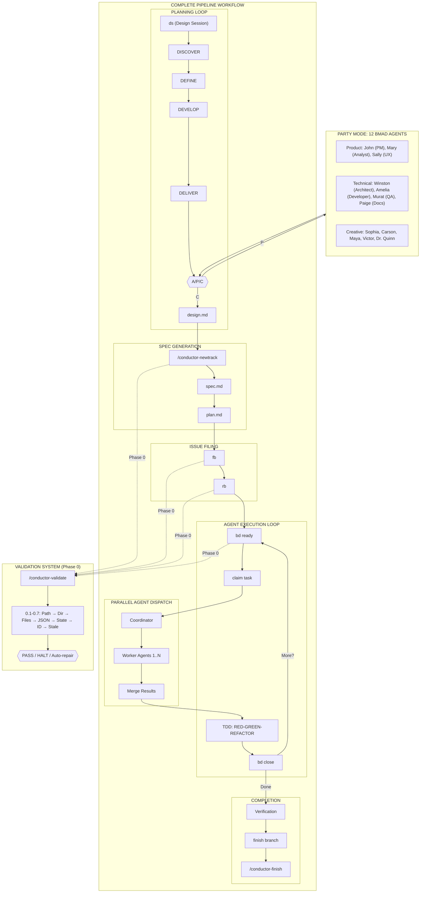

# Conductor Workflow Definitions

This directory contains the **single source of truth** for all Conductor workflow logic.

## Complete Pipeline Architecture



For detailed pipeline documentation, see [docs/PIPELINE_ARCHITECTURE.md](../../../docs/PIPELINE_ARCHITECTURE.md).

## Purpose

The workflow definitions in this directory are designed to be:

- **Format-agnostic**: Written in markdown, can be referenced by TOML commands, Claude skills, or any other implementation
- **Centralized**: One place to update workflow logic that applies across all implementations
- **Consistent**: Ensures all AI agents follow the same protocols

## Directory Structure

```
skills/conductor/references/workflows/
├── README.md              # This file
├── setup.md               # Project initialization workflow
├── newtrack.md            # Track creation workflow
├── implement.md           # Task implementation workflow
├── finish.md              # Track completion workflow (7 phases: Phase 0-6)
├── status.md              # Progress reporting workflow
├── revert.md              # Git-aware revert workflow
├── validate.md            # Project validation workflow
├── revise.md              # Spec/plan revision workflow
├── party-mode/            # Multi-agent collaborative review
│   ├── workflow.md        # Party Mode orchestration
│   └── agents/            # 12 BMAD agent definitions
├── agent-coordination/    # Multi-agent file coordination (via agent_mail MCP)
│   ├── workflow.md        # Core protocol
│   ├── patterns/          # parallel-dispatch, subagent-prompt, session-lifecycle, graceful-fallback, execution-routing
│   └── examples/          # Annotated dispatch examples
├── context-engineering/   # Session lifecycle and routing for context management
│   ├── session-lifecycle.md  # RECALL + ROUTE orchestration
│   └── references/        # anchored-state-format.md, design-routing-heuristics.md
├── conductor/             # Conductor-specific workflow extensions
│   ├── beads-session.md   # Beads claim/close/sync protocol
│   ├── preflight-beads.md # Session initialization
│   ├── checkpoint.md      # Progress checkpointing facade
│   └── remember.md        # Handoff protocol facade
└── schemas/
    ├── metadata.schema.json        # Track metadata structure
    ├── implement_state.schema.json # Implementation state tracking
    ├── setup_state.schema.json     # Setup progress state
    └── finish_state.schema.json    # Finish workflow state (Phase 0-6)
```

## How to Use

### For TOML Commands (Gemini CLI)

Reference these workflows in your prompt sections:

```toml
prompt = """
Follow the workflow defined in ~/.gemini/extensions/conductor/skills/conductor/references/workflows/setup.md
"""
```

### For Claude Skills/Commands

Import the workflow logic in your markdown prompts:

```markdown
# Reference: skills/conductor/references/workflows/implement.md

Execute the task implementation workflow as defined.
```

### For Other Implementations

Read and adapt the workflow steps for your specific implementation while maintaining the core logic.

## Maintaining Consistency

When updating workflow logic:

1. **Update the workflow file first** in this directory
2. **Update any implementation-specific files** that reference the workflow
3. **Update schemas** if state file structures change
4. **Test across implementations** to ensure consistency

## Schema Validation

JSON schemas in the `schemas/` directory define the structure of state files:

- Use these for validation in your implementation
- Ensures all implementations produce compatible state files

## Core Principles

All workflows share these principles:

1. **Validate tool calls**: Every operation must be verified
2. **Resume capability**: State files enable resumable operations
3. **User confirmation**: Critical actions require explicit approval
4. **Error handling**: Failures are announced and handled gracefully
5. **Git integration**: All changes are properly committed and documented
