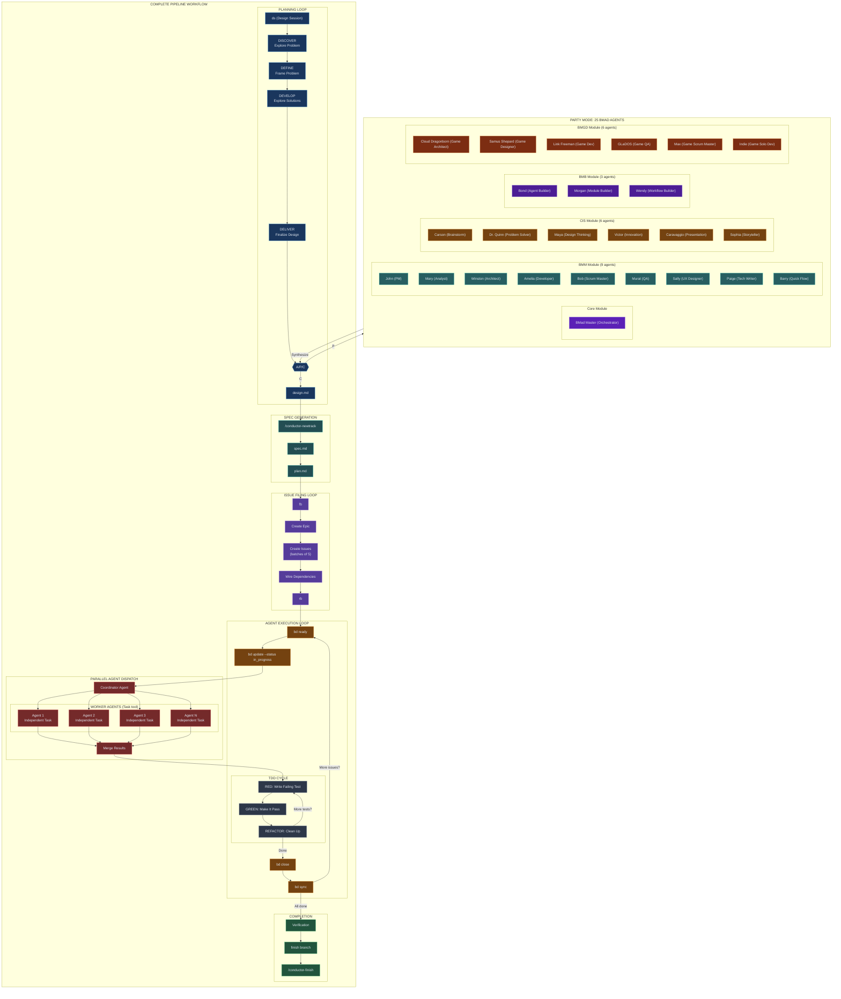

## Prerequisites

**REQUIRED SUB-SKILL:** [maestro-core](../maestro-core/SKILL.md)

Load maestro-core first for orchestration context (hierarchy, HALT/DEGRADE policies, trigger routing).

# Design Session (ds)

Turn ideas into fully-formed designs through collaborative dialogue using the Double Diamond methodology.

## When To Use

Trigger on:

- User types `ds`
- User runs `/conductor-design`
- User wants to brainstorm or explore an idea
- User says "design a feature" or "let's think through X"
- Before creating a conductor track

## Session Initialization

When starting a design session:

### 0. Load Continuity Context

Check for prior session context:

1. Run `continuity load` workflow
2. If `conductor/sessions/active/LEDGER.md` exists:
   - Display prior context summary
   - Show: `📋 Prior context: <goal summary>`
3. If missing: Start fresh session

**Non-blocking:** Continue normally if no prior context exists.

### 1. Load CODEMAPS for Context

Check for `conductor/CODEMAPS/` directory:

**If exists:**

1. Load `overview.md` (always)
2. Load relevant module codemaps based on topic (skills.md, api.md, etc.)
3. Display: `📚 Loaded CODEMAPS for context`

**If missing:**

1. Display: `⚠️ No CODEMAPS found. Run /conductor-setup to generate initial CODEMAPS.`
2. Continue session normally (CODEMAPS are optional but recommended)

### 2. Verify Conductor Setup

Check for `conductor/` directory with core files:

- `product.md` - Product vision
- `tech-stack.md` - Technical constraints
- `workflow.md` - Development standards

If missing: Display `Conductor unavailable. Standalone mode. Run /conductor-setup to enable full features.` and continue session.

> **Note:** In standalone mode, CODEMAPS and product context are skipped. Double Diamond still works but without project-specific context.

### 3. Complexity Scoring (Design Routing)

After loading context, evaluate task complexity to determine routing:

**Scoring Criteria** (max 18 points):

| Factor | Weight | Check |
|--------|--------|-------|
| Multiple epics | +3 | Work spans multiple epics |
| Cross-module | +2 | Changes touch multiple modules |
| New abstractions | +3 | Creating new patterns/interfaces |
| External deps | +2 | New external dependencies |
| Files > 5 | +1 | Touching more than 5 files |
| Unclear scope | +2 | Scope not well-defined |
| Security/auth | +2 | Involves security or authentication |
| Data migration | +3 | Database or data migration |

**Display COMPLEXITY_EXPLAINER:**

```text
┌─ COMPLEXITY EXPLAINER ─────────────────┐
│ Factor              │ Score │          │
├─────────────────────┼───────┼──────────┤
│ Multiple epics      │   0   │          │
│ Cross-module        │   2   │ ✓        │
│ New abstractions    │   0   │          │
│ External deps       │   0   │          │
│ Files > 5           │   1   │ ✓        │
│ Unclear scope       │   0   │          │
│ Security/auth       │   0   │          │
│ Data migration      │   0   │          │
├─────────────────────┼───────┼──────────┤
│ TOTAL               │   3   │ SPEED    │
└─────────────────────────────────────────┘
```

**Routing Decision:**

| Score | Route | Description |
|-------|-------|-------------|
| < 4 | SPEED MODE | 1-phase quick design, minimal ceremony |
| 4-6 | ASK USER | Soft zone: "[S]peed or [F]ull?" |
| > 6 | FULL MODE | 4-phase Double Diamond with A/P/C |

**Soft Zone Behavior (score 4-6):**
- Prompt: "Score is X (soft zone). [S]peed or [F]ull?"
- After 2 prompts without response → default to FULL
- Track prompt count in session

**Escalation:**
- User can type `[E]` during SPEED mode to escalate to FULL
- Escalation preserves current progress and enters DEFINE phase

See [design-routing-heuristics.md](references/design-routing-heuristics.md) for full scoring details.

### SPEED Mode Flow

For simple tasks (score < 4):

1. **Quick Discovery** - 2-3 clarifying questions max
2. **Output** - Generate design.md directly
3. **Handoff** - "Design complete. Run `/conductor-newtrack` to continue."

No A/P/C checkpoints in SPEED mode (unless user escalates with `[E]`).

### FULL Mode Flow

For complex tasks (score > 6 or user-selected):

Proceed with full Double Diamond (4 phases, A/P/C checkpoints).

## Double Diamond Framework

The session flows through four phases, alternating between divergent and convergent thinking:

```
    DISCOVER          DEFINE           DEVELOP          DELIVER
   (Diverge)        (Converge)        (Diverge)        (Converge)
      ◇                ◇                ◇                ◇
     / \              / \              / \              / \
    /   \            /   \            /   \            /   \
   -----------      -----------      -----------      -----------
   Explore the      Frame the        Explore          Finalize
     Problem        Problem          Solutions        the Design
```



For detailed pipeline documentation, see [docs/PIPELINE_ARCHITECTURE.md](../../docs/PIPELINE_ARCHITECTURE.md).

## The Process

### Phase 1: DISCOVER (Diverge)

**Goal:** Understand the problem deeply before jumping to solutions.

- Explore the problem space broadly
- Ask about pain points, users, impact, constraints
- One question at a time, prefer multiple choice
- **Exit:** Problem clearly articulated, users identified

#### Transition: DISCOVER → DEFINE

**GROUNDING EXECUTION (Mini, Advisory ⚠️):**

1. **Run:** `finder` with query: "similar problems to [problem statement]"
2. **Calculate confidence:**
   - 3+ matches → HIGH
   - 1-3 matches → MEDIUM
   - 0 matches → LOW
   - Timeout (5s) → MEDIUM + warning
   - Error → LOW
3. **Display:**
   ```
   ┌─ GROUNDING (Mini) ──────────────────────┐
   │ Query: [problem summary]                │
   │ Found: [N] matches                      │
   │ Confidence: [HIGH/MEDIUM/LOW]           │
   │ Status: ✓ Complete                      │
   └─────────────────────────────────────────┘
   ```
4. **On skip:** Log warning, display `⚠️ Grounding skipped`, proceed (Advisory allows skip)
5. **Proceed** to A/P/C checkpoint

---

### Phase 2: DEFINE (Converge)

**Goal:** Synthesize discoveries into a clear problem statement.

- Create a one-sentence problem statement
- Define success criteria (measurable)
- Bound the scope (in/out)
- Present 2-3 approaches with trade-offs
- **Exit:** Problem statement agreed, approach selected

#### Transition: DEFINE → DEVELOP

**GROUNDING EXECUTION (Mini, Advisory ⚠️):**

1. **Run:**
   - `finder` with query: "existing patterns for [selected approach]"
   - `Grep` for key terms from problem statement
2. **Calculate confidence:**
   - 3+ matches → HIGH
   - 1-3 matches → MEDIUM
   - 0 matches → LOW
   - Timeout (5s) → MEDIUM + warning
   - Error → LOW
3. **Display:**
   ```
   ┌─ GROUNDING (Mini) ──────────────────────┐
   │ Query: [approach summary]               │
   │ Found: [N] matches                      │
   │ Confidence: [HIGH/MEDIUM/LOW]           │
   │ Status: ✓ Complete                      │
   └─────────────────────────────────────────┘
   ```
4. **On skip:** Log warning, display `⚠️ Grounding skipped`, proceed (Advisory allows skip)
5. **Proceed** to A/P/C checkpoint

---

### Phase 3: DEVELOP (Diverge)

**Goal:** Design the solution architecture and components.

- Present design in 200-300 word sections
- Cover: architecture, components, data model, user flow, errors, testing
- Ask after each section: "Does this look right so far?"
- Be ready to revise earlier sections
- **Exit:** Architecture understood, components defined

#### Transition: DEVELOP → DELIVER

**GROUNDING EXECUTION (Standard, Gatekeeper 🚫):**

1. **Run in sequence:**
   - `Grep` for patterns mentioned in design
   - `finder` for affected files
   - `web_search` if external APIs/libraries referenced (skip if none)
2. **Timeout:** 10s soft, 15s hard
3. **Calculate confidence:**
   - 3+ matches → HIGH
   - 1-3 matches → MEDIUM
   - 0 matches → LOW
   - Timeout → MEDIUM (degraded) + warning
   - Error → LOW
4. **Display:**
   ```
   ┌─ GROUNDING (Standard) ──────────────────┐
   │ Sources: repo ✓ | web ✓/⊘              │
   │ Found: [N] matches                      │
   │ Confidence: [HIGH/MEDIUM/LOW]           │
   │ Status: ✓ Complete                      │
   └─────────────────────────────────────────┘
   ```
5. **HALT if not run:**
   ```
   ┌─ GROUNDING REQUIRED ────────────────────┐
   │ 🚫 Cannot proceed without grounding     │
   │                                         │
   │ [R]un grounding  [S]kip with warning    │
   └─────────────────────────────────────────┘
   ```
6. **On skip:** Display warning banner, log for audit, proceed
7. **Proceed** to A/P/C checkpoint only after grounding complete or user skips

---

### Phase 4: DELIVER (Converge)

**Goal:** Finalize the design and prepare for implementation.

- **Full Grounding (required)** - verify against codebase and current docs
- Ensure acceptance criteria are testable
- Document risks and open questions
- **Exit:** Design verified and approved

#### Transition: DELIVER → Complete

**GROUNDING EXECUTION (Full + Impact Scan, Mandatory 🔒):**

1. **Run in parallel:**
   - **Full cascade:** repo (`Grep`, `finder`) → web (`web_search`) → history (`find_thread`)
   - **Impact scan:** `finder` for all files mentioned in design
2. **Timeout:** 45s soft, 60s hard
3. **Calculate confidence:**
   - 3+ matches from cascade → HIGH
   - 1-3 matches → MEDIUM
   - 0 matches or all sources failed → LOW
   - Timeout → MEDIUM (degraded) + warning
4. **Display:**
   ```
   ┌─ GROUNDING (Full) ──────────────────────┐
   │ Sources: repo ✓ | web ✓ | history ✓    │
   │ Impact: [N] files identified            │
   │ Confidence: [HIGH/MEDIUM/LOW]           │
   │ Status: ✓ Verified                      │
   └─────────────────────────────────────────┘
   ```
5. **BLOCK if:**
   - Grounding not run
   - Confidence = LOW
   - All sources failed
   
   Display:
   ```
   ┌─ GROUNDING REQUIRED ────────────────────┐
   │ 🔒 Cannot proceed: [reason]             │
   │                                         │
   │ To override, type:                      │
   │ SKIP_GROUNDING: <your justification>    │
   └─────────────────────────────────────────┘
   ```
6. **On empty justification:** Reject, require actual reason
7. **On valid skip:** Log override with reason, add warning banner to design, proceed
8. **Proceed** to design approval only after grounding verified or user provides justification

---

## A/P/C Checkpoints

At the end of each phase, present the checkpoint menu:

```
📍 End of [PHASE] phase.

Choose:
[A] Advanced - deeper analysis, assumption audit
[P] Party - multi-perspective feedback from expert agents
[C] Continue - proceed to next phase
[↩ Back] - return to previous phase
```

### [A] Advanced Mode

Phase-specific deep dives:

- **DISCOVER:** Challenge assumptions, explore biases, consider alternative users
- **DEFINE:** Stress-test scope, challenge metrics, identify hidden dependencies
- **DEVELOP:** Deep-dive components, explore alternatives, security/performance review
- **DELIVER:** Edge case audit, security check, documentation completeness

### [P] Party Mode

Invokes multi-agent collaborative review using BMAD v6 integration. See `references/bmad/workflows/party-mode/workflow.md`.

**25 Agents Available:**
- **Core (1):** BMad Master (🧙) - Orchestrator
- **BMM (9):** PM, Analyst, Architect, Developer, Scrum Master, Test Architect, UX Designer, Tech Writer, Quick Flow Solo Dev
- **CIS (6):** Brainstorming Coach, Problem Solver, Design Thinking Coach, Innovation Strategist, Presentation Master, Storyteller
- **BMB (3):** Agent Builder, Module Builder, Workflow Builder
- **BMGD (6):** Game Architect, Game Designer, Game Dev, Game QA, Game Scrum Master, Game Solo Dev

**Selection:** BMad Master selects 2-3 agents based on topic relevance:
- **Primary:** Best expertise match
- **Secondary:** Complementary perspective
- **Tertiary:** Devil's advocate

**CIS Workflow Triggers:**
- `*brainstorm` - 36 ideation techniques
- `*design-thinking` - 5-phase human-centered design
- `*innovate` - Strategic innovation planning
- `*problem-solve` - Systematic problem resolution
- `*story` - Narrative design

**Language:** Agents respond in English.

Agents respond in character, cross-talk (max 2 rounds), then synthesize insights.

## Loop-Back Support

User can say "revisit [PHASE]" at any time to return to an earlier phase. When looping back:

1. Summarize what was established
2. Ask what to reconsider
3. Update subsequent phases if decisions change

## Tiered Grounding System

Grounding is **automatic** at phase transitions with tiered intensity based on mode.

### Grounding Matrix

| Mode | Phase Transition | Tier | Enforcement |
|------|------------------|------|-------------|
| SPEED | Any | Light | Advisory ⚠️ |
| FULL | DISCOVER→DEFINE | Mini | Advisory ⚠️ |
| FULL | DEFINE→DEVELOP | Mini | Advisory ⚠️ |
| FULL | DEVELOP→DELIVER | Standard | Gatekeeper 🚫 |
| FULL | DELIVER→Complete | Full + Impact Scan | Mandatory 🔒 |

### Tier Descriptions

- **Light:** 1 source (repo), 3s timeout - quick verification
- **Mini:** 1-2 sources, 5s timeout - basic alignment check
- **Standard:** Cascade (repo → web → history), 10s - full verification
- **Full:** All sources + Impact Scan subagent, 45s - complete validation

### Grounding State Tracking

Track grounding completion across phases in session memory:

```
grounding_state = {
    "DISCOVER→DEFINE": { "completed": true, "confidence": "HIGH", "timestamp": "..." },
    "DEFINE→DEVELOP": { "completed": true, "confidence": "MEDIUM", "timestamp": "..." },
    "DEVELOP→DELIVER": null,  // Not yet reached
    "DELIVER→Complete": null
}
```

**Update state after each grounding execution:**
1. Set `completed: true`
2. Record confidence level (HIGH/MEDIUM/LOW)
3. Store timestamp

**Display state block at each transition:**
```
┌─ GROUNDING STATE ──────────────────────────┐
│ ✓ DISCOVER→DEFINE: HIGH                    │
│ ✓ DEFINE→DEVELOP: MEDIUM                   │
│ ○ DEVELOP→DELIVER: pending                 │
│ ○ DELIVER→Complete: pending                │
└────────────────────────────────────────────┘
```

**On loop-back ("revisit [PHASE]"):**
1. Reset grounding state for that transition and all subsequent
2. Display "(reset)" marker in state block

### Phase-Specific Grounding

**DISCOVER → DEFINE:**
- Check for similar problems in codebase
- Source: repo (Grep, finder)

**DEFINE → DEVELOP:**
- Verify external APIs/libraries are current
- Source: web if external refs, else repo

**DEVELOP → DELIVER:**
- Confirm existing patterns and conventions
- Source: cascade (repo → web → history)
- **Blocks if skipped** (Gatekeeper)

**DELIVER → Complete:**
- Full architectural verification + impact scan
- Source: all + parallel impact scan subagent
- **Blocks if fails or low confidence** (Mandatory)

See [references/grounding.md](references/grounding.md) for complete documentation.

---

## Grounding Enforcement

### Enforcement Levels

| Level | Symbol | Behavior |
|-------|--------|----------|
| Advisory | ⚠️ | Log skip, warn, proceed |
| Gatekeeper | 🚫 | Block if grounding not run |
| Mandatory | 🔒 | Block if fails or low confidence; no skip allowed |

### Enforcement Actions

| Action | When | Result |
|--------|------|--------|
| `PROCEED` | Grounding passed | Continue to next phase |
| `WARN` | Advisory skip | Show warning, continue |
| `RUN_GROUNDING` | Gatekeeper/Mandatory skip | Block until grounding runs |
| `MANUAL_VERIFY` | All sources failed | Block, require explicit user confirmation with justification |
| `RETRY_GROUNDING` | Low confidence at Mandatory | Block, require retry |

> **Note:** `MANUAL_VERIFY` is not a bypass—it requires the user to explicitly confirm independent verification and creates an audit trail.

### Blocking Behavior

When blocked at DEVELOP→DELIVER or DELIVER→Complete, the UI displays a dynamic message based on the failure type. The reason, action, and available options vary by failure type and enforcement level.

**UI options by enforcement level:**
- **Advisory**: `[R]un grounding`, `[S]kip with warning`, `[C]ancel`
- **Gatekeeper**: `[R]un grounding`, `[S]kip with warning` (logs warning), `[C]ancel`
- **Mandatory**: `[R]un grounding`, `[C]ancel` (no skip option)

**Example blocking messages:**

```
┌─ GROUNDING REQUIRED ─────────────────────┐
│ ❌ Cannot proceed: Grounding not run     │
│                                          │
│ Action: RUN_GROUNDING                    │
│ Run: /ground <design summary>            │
│                                          │
│ [R]un grounding  [C]ancel                │
└──────────────────────────────────────────┘
```

```
┌─ VERIFICATION REQUIRED ──────────────────┐
│ ❌ Cannot proceed: All sources failed    │
│                                          │
│ Action: MANUAL_VERIFY                    │
│ Options:                                 │
│   • Retry with different query           │
│   • SKIP_GROUNDING: <reason>             │
│     (Mandatory only - requires reason)   │
└──────────────────────────────────────────┘
```

```
┌─ RETRY REQUIRED ─────────────────────────┐
│ ⚠️ Cannot proceed: Confidence too low    │
│   (score: 0.42, required: 0.70)          │
│                                          │
│ Action: RETRY_GROUNDING                  │
│ Suggestion: Refine query or add sources  │
└──────────────────────────────────────────┘
```

**Manual Override (Mandatory enforcement only):**

When all automated sources fail, user may override with explicit confirmation:

1. User must type: `SKIP_GROUNDING: <reason>`
2. Override is logged to `grounding/<transition>.json` with:
   - `"manual_override": true`
   - `"override_reason": "<user reason>"`
   - `"timestamp": "<ISO timestamp>"`
3. Design document receives warning banner:
   ```
   ⚠️ GROUNDING SKIPPED - Manual verification claimed by user
   ```

This provides an escape hatch for edge cases (network outage, novel domain) while maintaining auditability.

### Impact Scan at DELIVER

At DELIVER→Complete, runs in parallel with full grounding:

1. Analyzes design to identify affected files
2. Returns: file list, change types, risks, dependencies
3. Merges with grounding result
4. Blocks if high-risk files detected without review

See [references/grounding/impact-scan-prompt.md](references/grounding/impact-scan-prompt.md).

### Edge Case Handling

#### Truncation (100+ matches)

When grounding returns many results:
```
┌─ GROUNDING (Mini) ──────────────────────────┐
│ Query: [problem summary]                    │
│ Found: 100+ matches (showing top 10)        │
│ Confidence: HIGH                            │
│ Note: Results truncated for display         │
└─────────────────────────────────────────────┘
```

#### Empty Justification Rejection

If user types `SKIP_GROUNDING:` or `SKIP_GROUNDING: ` (empty/whitespace):
```
┌─ INVALID JUSTIFICATION ────────────────────┐
│ ❌ Justification cannot be empty            │
│                                            │
│ Please provide a reason:                   │
│ SKIP_GROUNDING: <actual reason here>       │
└────────────────────────────────────────────┘
```

#### Conditional Tool Skipping

Skip tools when not applicable:
- **No external refs in design:** Skip `web_search`, use repo-only
- **No history context needed:** Skip `find_thread`

Display which tools were skipped:
```
┌─ GROUNDING (Standard) ─────────────────────┐
│ Sources: repo ✓ | web ⊘ (no external refs) │
│ Confidence: HIGH                           │
└────────────────────────────────────────────┘
```

#### Loop-Back State Reset

When user says "revisit [PHASE]":
1. Reset grounding state for that transition and all subsequent
2. Display updated state:
```
┌─ GROUNDING STATE (reset) ──────────────────┐
│ ✓ DISCOVER→DEFINE: HIGH                    │
│ ○ DEFINE→DEVELOP: reset (was MEDIUM)       │
│ ○ DEVELOP→DELIVER: pending                 │
│ ○ DELIVER→Complete: pending                │
└────────────────────────────────────────────┘
```

#### Network Failure Handling

When `web_search` fails due to network error:
```
┌─ GROUNDING (Standard, degraded) ───────────┐
│ Sources: repo ✓ | web ✗ (network error)    │
│ Confidence: MEDIUM (degraded)              │
│ Note: Web verification skipped             │
└────────────────────────────────────────────┘
```

Proceed with degraded confidence; do not block on optional sources.

## After the Design

### Review and Handoff

1. Ask: "Review the design?"
2. Address any feedback
3. When approved, say: **"Design approved. Run `/conductor-newtrack {track_id}` to generate spec, plan, and file beads."**

If a track doesn't exist yet, suggest running `/conductor-newtrack <description>` first.

For the full implementation workflow after design, see `skills/conductor/SKILL.md`.

## Key Principles

- **One question at a time** - Don't overwhelm
- **Multiple choice preferred** - Easier to answer
- **YAGNI ruthlessly** - Remove unnecessary features
- **Explore alternatives** - Always propose 2-3 approaches
- **Incremental validation** - Present in sections, validate each
- **Be flexible** - Go back when something doesn't make sense
- **Ground everything** - Verify before finalizing
