# Design Session (ds)

Turn ideas into fully-formed designs through collaborative dialogue using the Double Diamond methodology.

## When to Use

Trigger on:
- User types `ds`
- User runs `/conductor-design`
- User wants to brainstorm or explore an idea
- User says "design a feature" or "let's think through X"
- Before creating a conductor track

## Double Diamond Framework

The session flows through four phases, alternating between divergent and convergent thinking:

```
    DISCOVER          DEFINE           DEVELOP          DELIVER
   (Diverge)        (Converge)        (Diverge)        (Converge)
      ◇                ◇                ◇                ◇
     / \              / \              / \              / \
    /   \            /   \            /   \            /   \
   -----------      -----------      -----------      -----------
   Explore the      Frame the        Explore          Finalize
     Problem        Problem          Solutions        the Design
```



```mermaid
flowchart TB
    subgraph PIPELINE["WORKFLOW PIPELINE"]
        direction TB
        
        subgraph SETUP["SETUP"]
            TRIGGER["ds / /conductor-design"]
            CHECK["Verify conductor/<br/>(product.md, tech-stack.md, workflow.md)"]
        end
        
        subgraph DIAMOND1["DIAMOND 1: UNDERSTAND PROBLEM"]
            DISCOVER["DISCOVER (Diverge)<br/>• Explore problem space<br/>• 5 Whys, edge cases<br/>• Mini-ground: codebase check"]
            DEFINE["DEFINE (Converge)<br/>• Problem statement<br/>• Success criteria<br/>• YAGNI filtering"]
        end
        
        subgraph DIAMOND2["DIAMOND 2: DESIGN SOLUTION"]
            DEVELOP["DEVELOP (Diverge)<br/>• 3+ approaches<br/>• Trade-off analysis<br/>• Wild/10x option"]
            DELIVER["DELIVER (Converge)<br/>• Architecture, Components<br/>• Data Model, User Flow<br/>• FULL GROUNDING required"]
        end
        
        subgraph HANDOFF["HANDOFF"]
            DESIGNMD["design.md saved to<br/>conductor/tracks/{id}/"]
            NEXT["Next: fb to file beads<br/>or /conductor-newtrack"]
        end
    end
    
    subgraph APC["A/P/C CHECKPOINTS"]
        A["[A] Advanced<br/>Deeper analysis"]
        P["[P] Party Mode<br/>12 Expert Agents"]
        C["[C] Continue<br/>Next phase"]
        BACK["[↩ Back]<br/>Revisit prior phase"]
    end
    
    subgraph AGENTS["PARTY MODE: 12 AGENTS (BMAD v6)"]
        subgraph PRODUCT["Product Module"]
            PM["📋 John (PM)"]
            ANALYST["📊 Mary (Analyst)"]
            UX["🎨 Sally (UX)"]
        end
        
        subgraph TECHNICAL["Technical Module"]
            ARCH["🏗️ Winston (Architect)"]
            DEV["💻 Amelia (Developer)"]
            QA["🧪 Murat (QA)"]
            DOCS["📚 Paige (Docs)"]
        end
        
        subgraph CREATIVE["Creative Module"]
            STORY["📖 Sophia (Storyteller)"]
            BRAIN["🧠 Carson (Brainstorm)"]
            DESIGN["🎯 Maya (Design Thinking)"]
            STRAT["⚡ Victor (Strategist)"]
            SOLVER["🔬 Dr. Quinn (Solver)"]
        end
    end
    
    TRIGGER --> CHECK
    CHECK --> DISCOVER
    DISCOVER --> APC
    APC --> DEFINE
    DEFINE --> APC
    APC --> DEVELOP
    DEVELOP --> APC
    APC --> DELIVER
    DELIVER --> APC
    APC --> DESIGNMD
    DESIGNMD --> NEXT
    
    P -.-> AGENTS
    AGENTS -.->|"Synthesize & Return"| APC
```

## The Process

### Phase 1: DISCOVER (Diverge)

**Goal:** Understand the problem deeply before jumping to solutions.

- Explore the problem space broadly
- Ask about pain points, users, impact, constraints
- One question at a time, prefer multiple choice
- **Exit:** Problem clearly articulated, users identified

### Phase 2: DEFINE (Converge)

**Goal:** Synthesize discoveries into a clear problem statement.

- Create a one-sentence problem statement
- Define success criteria (measurable)
- Bound the scope (in/out)
- Present 2-3 approaches with trade-offs
- **Exit:** Problem statement agreed, approach selected

### Phase 3: DEVELOP (Diverge)

**Goal:** Design the solution architecture and components.

- Present design in 200-300 word sections
- Cover: architecture, components, data model, user flow, errors, testing
- Ask after each section: "Does this look right so far?"
- Be ready to revise earlier sections
- **Exit:** Architecture understood, components defined

### Phase 4: DELIVER (Converge)

**Goal:** Finalize the design and prepare for implementation.

- **Full Grounding (required)** - verify against codebase and current docs
- Ensure acceptance criteria are testable
- Document risks and open questions
- **Exit:** Design verified and approved

## A/P/C Checkpoints

At the end of each phase, present the checkpoint menu:

```
📍 End of [PHASE] phase.

Choose:
[A] Advanced - deeper analysis, assumption audit
[P] Party - multi-perspective feedback from expert agents
[C] Continue - proceed to next phase
[↩ Back] - return to previous phase
```

### [A] Advanced Mode

Phase-specific deep dives:
- **DISCOVER:** Challenge assumptions, explore biases, consider alternative users
- **DEFINE:** Stress-test scope, challenge metrics, identify hidden dependencies
- **DEVELOP:** Deep-dive components, explore alternatives, security/performance review
- **DELIVER:** Edge case audit, security check, documentation completeness

### [P] Party Mode

Invokes multi-agent collaborative review. See `workflows/party-mode/workflow.md`.

Selects 3 relevant agents based on topic:
- **Primary:** Best expertise match
- **Secondary:** Complementary perspective
- **Tertiary:** Devil's advocate

Agents respond in character, cross-talk, then synthesize insights.

## Loop-Back Support

User can say "revisit [PHASE]" at any time to return to an earlier phase. When looping back:

1. Summarize what was established
2. Ask what to reconsider
3. Update subsequent phases if decisions change

## Grounding Requirements

**Mini-grounding** at each phase transition:
- DISCOVER → DEFINE: Check for similar problems in codebase
- DEFINE → DEVELOP: Verify external APIs/libraries
- DEVELOP → DELIVER: Confirm existing patterns and conventions

**Full grounding** before DELIVER completion:
- Verify all architectural decisions against current reality
- Use `web_search`, `Grep`, `finder`, `git log`
- Do NOT proceed to documentation without grounding

## After the Design

### Review and Handoff

1. Ask: "Review the design?"
2. Address any feedback
3. When approved, say: **"Design approved. Say `fb` to convert into beads issues."**

If a track doesn't exist yet, suggest running `/conductor-newtrack <description>` first.

For the full implementation workflow after design, see `skills/conductor/SKILL.md`.

## Key Principles

- **One question at a time** - Don't overwhelm
- **Multiple choice preferred** - Easier to answer
- **YAGNI ruthlessly** - Remove unnecessary features
- **Explore alternatives** - Always propose 2-3 approaches
- **Incremental validation** - Present in sections, validate each
- **Be flexible** - Go back when something doesn't make sense
- **Ground everything** - Verify before finalizing
