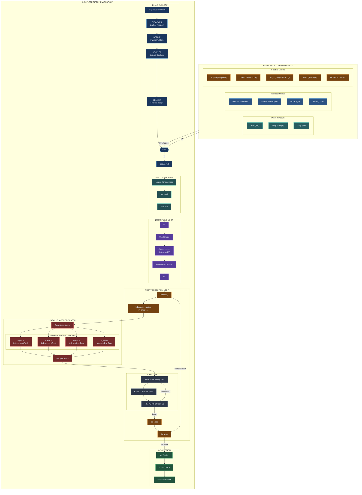

# Design Session (ds)

Turn ideas into fully-formed designs through collaborative dialogue using the Double Diamond methodology.

## When To Use

Trigger on:

- User types `ds`
- User runs `/conductor-design`
- User wants to brainstorm or explore an idea
- User says "design a feature" or "let's think through X"
- Before creating a conductor track

## Session Initialization

When starting a design session:

### 1. Load CODEMAPS for Context

Check for `conductor/CODEMAPS/` directory:

**If exists:**

1. Load `overview.md` (always)
2. Load relevant module codemaps based on topic (skills.md, api.md, etc.)
3. Display: `📚 Loaded CODEMAPS for context`

**If missing:**

1. Display: `⚠️ No CODEMAPS found. Run /conductor-setup to generate initial CODEMAPS.`
2. Continue session normally (CODEMAPS are optional but recommended)

### 2. Verify Conductor Setup

Check for `conductor/` directory with core files:

- `product.md` - Product vision
- `tech-stack.md` - Technical constraints
- `workflow.md` - Development standards

If missing, suggest: `Run /conductor-setup first for full context.`

### 3. Complexity Scoring (Design Routing)

After loading context, evaluate task complexity to determine routing:

**Scoring Criteria** (max 18 points):

| Factor | Weight | Check |
|--------|--------|-------|
| Multiple epics | +3 | Work spans multiple epics |
| Cross-module | +2 | Changes touch multiple modules |
| New abstractions | +3 | Creating new patterns/interfaces |
| External deps | +2 | New external dependencies |
| Files > 5 | +1 | Touching more than 5 files |
| Unclear scope | +2 | Scope not well-defined |
| Security/auth | +2 | Involves security or authentication |
| Data migration | +3 | Database or data migration |

**Display COMPLEXITY_EXPLAINER:**

```text
┌─ COMPLEXITY EXPLAINER ─────────────────┐
│ Factor              │ Score │          │
├─────────────────────┼───────┼──────────┤
│ Multiple epics      │   0   │          │
│ Cross-module        │   2   │ ✓        │
│ New abstractions    │   0   │          │
│ External deps       │   0   │          │
│ Files > 5           │   1   │ ✓        │
│ Unclear scope       │   0   │          │
│ Security/auth       │   0   │          │
│ Data migration      │   0   │          │
├─────────────────────┼───────┼──────────┤
│ TOTAL               │   3   │ SPEED    │
└─────────────────────────────────────────┘
```

**Routing Decision:**

| Score | Route | Description |
|-------|-------|-------------|
| < 4 | SPEED MODE | 1-phase quick design, minimal ceremony |
| 4-6 | ASK USER | Soft zone: "[S]peed or [F]ull?" |
| > 6 | FULL MODE | 4-phase Double Diamond with A/P/C |

**Soft Zone Behavior (score 4-6):**
- Prompt: "Score is X (soft zone). [S]peed or [F]ull?"
- After 2 prompts without response → default to FULL
- Track prompt count in session

**Escalation:**
- User can type `[E]` during SPEED mode to escalate to FULL
- Escalation preserves current progress and enters DEFINE phase

See [design-routing-heuristics.md](references/design-routing-heuristics.md) for full scoring details.

### SPEED Mode Flow

For simple tasks (score < 4):

1. **Quick Discovery** - 2-3 clarifying questions max
2. **Output** - Generate design.md directly
3. **Handoff** - "Design complete. Run `/conductor-newtrack` to continue."

No A/P/C checkpoints in SPEED mode (unless user escalates with `[E]`).

### FULL Mode Flow

For complex tasks (score > 6 or user-selected):

Proceed with full Double Diamond (4 phases, A/P/C checkpoints).

## Double Diamond Framework

The session flows through four phases, alternating between divergent and convergent thinking:

```
    DISCOVER          DEFINE           DEVELOP          DELIVER
   (Diverge)        (Converge)        (Diverge)        (Converge)
      ◇                ◇                ◇                ◇
     / \              / \              / \              / \
    /   \            /   \            /   \            /   \
   -----------      -----------      -----------      -----------
   Explore the      Frame the        Explore          Finalize
     Problem        Problem          Solutions        the Design
```



For detailed pipeline documentation, see [docs/PIPELINE_ARCHITECTURE.md](../../docs/PIPELINE_ARCHITECTURE.md).

## The Process

### Phase 1: DISCOVER (Diverge)

**Goal:** Understand the problem deeply before jumping to solutions.

- Explore the problem space broadly
- Ask about pain points, users, impact, constraints
- One question at a time, prefer multiple choice
- **Exit:** Problem clearly articulated, users identified

### Phase 2: DEFINE (Converge)

**Goal:** Synthesize discoveries into a clear problem statement.

- Create a one-sentence problem statement
- Define success criteria (measurable)
- Bound the scope (in/out)
- Present 2-3 approaches with trade-offs
- **Exit:** Problem statement agreed, approach selected

### Phase 3: DEVELOP (Diverge)

**Goal:** Design the solution architecture and components.

- Present design in 200-300 word sections
- Cover: architecture, components, data model, user flow, errors, testing
- Ask after each section: "Does this look right so far?"
- Be ready to revise earlier sections
- **Exit:** Architecture understood, components defined

### Phase 4: DELIVER (Converge)

**Goal:** Finalize the design and prepare for implementation.

- **Full Grounding (required)** - verify against codebase and current docs
- Ensure acceptance criteria are testable
- Document risks and open questions
- **Exit:** Design verified and approved

## A/P/C Checkpoints

At the end of each phase, present the checkpoint menu:

```
📍 End of [PHASE] phase.

Choose:
[A] Advanced - deeper analysis, assumption audit
[P] Party - multi-perspective feedback from expert agents
[C] Continue - proceed to next phase
[↩ Back] - return to previous phase
```

### [A] Advanced Mode

Phase-specific deep dives:

- **DISCOVER:** Challenge assumptions, explore biases, consider alternative users
- **DEFINE:** Stress-test scope, challenge metrics, identify hidden dependencies
- **DEVELOP:** Deep-dive components, explore alternatives, security/performance review
- **DELIVER:** Edge case audit, security check, documentation completeness

### [P] Party Mode

Invokes multi-agent collaborative review. See `references/party-mode/workflow.md`.

Selects 3 relevant agents based on topic:

- **Primary:** Best expertise match
- **Secondary:** Complementary perspective
- **Tertiary:** Devil's advocate

Agents respond in character, cross-talk, then synthesize insights.

## Loop-Back Support

User can say "revisit [PHASE]" at any time to return to an earlier phase. When looping back:

1. Summarize what was established
2. Ask what to reconsider
3. Update subsequent phases if decisions change

## Grounding Requirements

**Mini-grounding** at each phase transition:

- DISCOVER → DEFINE: Check for similar problems in codebase
- DEFINE → DEVELOP: Verify external APIs/libraries
- DEVELOP → DELIVER: Confirm existing patterns and conventions

**Full grounding** before DELIVER completion:

- Verify all architectural decisions against current reality
- Use `web_search`, `Grep`, `finder`, `git log`
- Do NOT proceed to documentation without grounding

## After the Design

### Review and Handoff

1. Ask: "Review the design?"
2. Address any feedback
3. When approved, say: **"Design approved. Run `/conductor-newtrack {track_id}` to generate spec, plan, and file beads."**

If a track doesn't exist yet, suggest running `/conductor-newtrack <description>` first.

For the full implementation workflow after design, see `skills/conductor/SKILL.md`.

## Key Principles

- **One question at a time** - Don't overwhelm
- **Multiple choice preferred** - Easier to answer
- **YAGNI ruthlessly** - Remove unnecessary features
- **Explore alternatives** - Always propose 2-3 approaches
- **Incremental validation** - Present in sections, validate each
- **Be flexible** - Go back when something doesn't make sense
- **Ground everything** - Verify before finalizing
