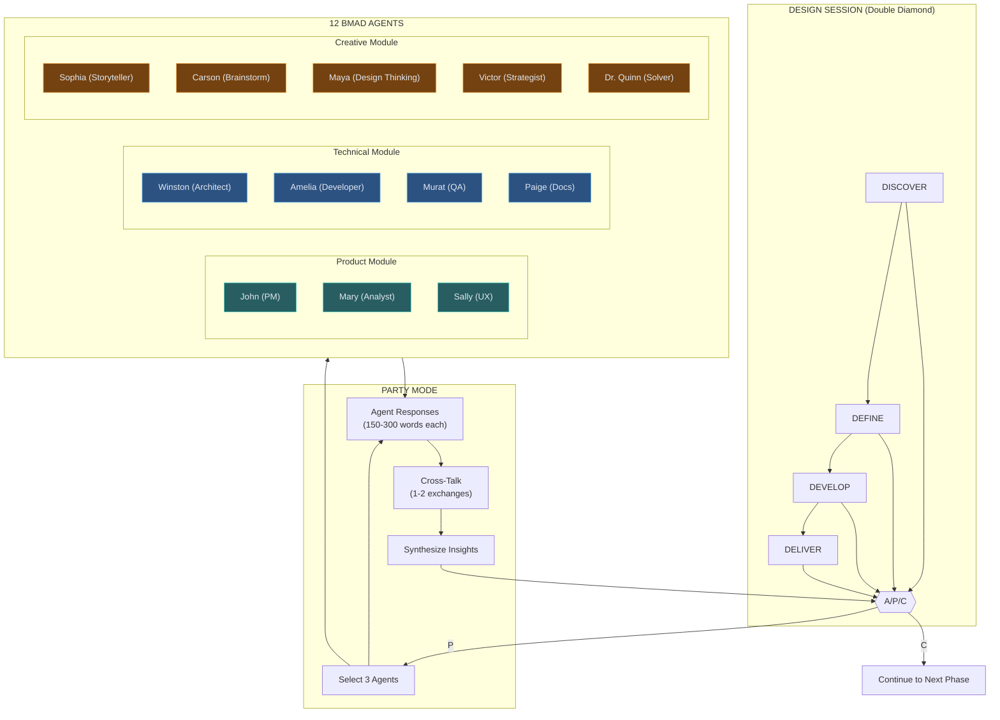

# Party Mode Workflow

Multi-agent collaborative design workflow using LLM-as-orchestrator pattern.

Triggered from A/P/C checkpoints in the design session (`skills/design/SKILL.md`) used by `/conductor-design` or `ds` (`skills/conductor/SKILL.md`).

## Complete Pipeline Integration



For complete pipeline documentation, see [docs/PIPELINE_ARCHITECTURE.md](../../../../docs/PIPELINE_ARCHITECTURE.md).

## Purpose

Party Mode brings multiple expert perspectives into design sessions. When triggered via [P] at A/P/C checkpoints, 2-3 relevant agents provide multi-perspective feedback, cross-talk, and synthesis before returning to the main flow.

## Prerequisites

- Conductor environment set up (`conductor/` directory exists)
- Active design session in progress
- User selected [P] at an A/P/C checkpoint

---

## Agent Registry

| ID              | Name      | Icon | Module    | Expertise                                                          |
| --------------- | --------- | ---- | --------- | ------------------------------------------------------------------ |
| pm              | John      | 📋   | product   | Product strategy, roadmaps, prioritization, stakeholder management |
| analyst         | Mary      | 📊   | product   | Data analysis, metrics, research, market insights                  |
| ux              | Sally     | 🎨   | product   | User experience, usability, accessibility, user research           |
| architect       | Winston   | 🏗️   | technical | System design, distributed systems, scalability, tech debt         |
| developer       | Amelia    | 💻   | technical | Implementation, code quality, developer experience, pragmatism     |
| qa              | Murat     | 🧪   | technical | Testing strategy, edge cases, quality gates, risk assessment       |
| docs            | Paige     | 📚   | technical | Documentation, API design, developer onboarding, clarity           |
| storyteller     | Sophia    | 📖   | creative  | Narrative, user stories, communication, empathy                    |
| brainstorm      | Carson    | 🧠   | creative  | Ideation, lateral thinking, "what if" scenarios, volume            |
| design-thinking | Maya      | 🎯   | creative  | Design methodology, problem framing, human-centered design         |
| strategist      | Victor    | ⚡   | creative  | Business strategy, competitive analysis, positioning               |
| solver          | Dr. Quinn | 🔬   | creative  | Problem decomposition, root cause analysis, systematic solutions   |

**Agent Files:** `skills/design/references/party-mode/agents/{module}/{id}.md`

---

## Selection Rules

When Party Mode is triggered, select agents based on topic relevance:

### Selection Algorithm

1. **Analyze Context**: Extract key themes from current discussion (e.g., "API design", "user onboarding", "performance")

2. **Score Agents**: Match themes against each agent's expertise

   - Direct expertise match: +3 points
   - Related expertise: +1 point
   - Module diversity bonus: +1 point (prefer cross-module perspectives)

3. **Select Trio**:
   - **Primary**: Highest score, best expertise match
   - **Secondary**: Second highest, complementary perspective
   - **Tertiary**: Devil's advocate or contrasting viewpoint

### Selection Examples

| Topic                  | Primary             | Secondary              | Tertiary             |
| ---------------------- | ------------------- | ---------------------- | -------------------- |
| API Design             | Winston (Architect) | Paige (Docs)           | Amelia (Developer)   |
| User Onboarding        | Sally (UX)          | Sophia (Storyteller)   | John (PM)            |
| Performance Issues     | Winston (Architect) | Murat (QA)             | Dr. Quinn (Solver)   |
| Feature Prioritization | John (PM)           | Mary (Analyst)         | Victor (Strategist)  |
| Creative Block         | Carson (Brainstorm) | Maya (Design Thinking) | Sophia (Storyteller) |

---

## Response Format

Each agent responds in character using this format:

```
[Icon] **[Name]**: [Response in character voice]
```

**Example:**

```
🏗️ **Winston**: Looking at this from an architectural standpoint, I'd recommend starting with the data model. If we get that right, the rest follows naturally. Let's not over-engineer the API layer until we understand the access patterns.

💻 **Amelia**: I agree with Winston on the data model, but I'd push back slightly—we should also consider developer ergonomics early. A beautiful architecture that's painful to implement won't get built correctly.

🧪 **Murat**: Before we go further, what are our testing constraints? I'm seeing some edge cases in the auth flow that could bite us if we don't address them in the design phase.
```

---

## Cross-Talk Patterns

Agents should interact naturally:

### Building On Ideas

```
🎯 **Maya**: What if we framed this as a journey rather than a feature?

📖 **Sophia**: I love that framing, Maya. If it's a journey, we need to ask: what's the user's "before" state and "after" state? The transformation is the story.
```

### Respectful Disagreement

```
📋 **John**: We should prioritize the enterprise features—that's where the revenue is.

📊 **Mary**: I hear you, John, but our data shows 80% of enterprise conversions start with self-serve trials. Cutting self-serve could hurt enterprise in the long run.
```

### Synthesis

```
🔬 **Dr. Quinn**: Let me try to synthesize what I'm hearing. Winston wants architectural clarity, Amelia wants developer ergonomics, and Murat wants testability. These aren't mutually exclusive—a well-documented data model with clear contracts satisfies all three.
```

---

## Session Flow

### 1. Trigger

User selects [P] at A/P/C checkpoint.

### 2. Context Handoff

```
📍 **Party Mode Activated**

Current phase: [DISCOVER/DEFINE/DEVELOP/DELIVER]
Topic: [Current discussion topic]
Key questions: [What we're trying to resolve]

Consulting: [Icon] [Name], [Icon] [Name], [Icon] [Name]
```

### 3. Agent Responses

Each selected agent provides their perspective (150-300 words each).

### 4. Cross-Talk

Agents may respond to each other (1-2 exchanges maximum).

### 5. Synthesis

Consolidate insights:

```
📍 **Party Mode Synthesis**

Key insights:
- [Insight 1 from Agent A]
- [Insight 2 from Agent B]
- [Insight 3 from Agent C]

Points of agreement: [What agents aligned on]
Tensions to resolve: [Where agents disagreed]
Recommended next step: [Suggested action]
```

### 6. Return

Resume main Double Diamond flow with synthesized insights.

---

## Limits

- **Max Rounds**: 2 cross-talk exchanges before synthesis
- **Max Agents**: 3 per Party Mode session
- **Timeout**: If user doesn't engage after synthesis, return to main flow

---

## Custom Agents

Users can add custom agents in `skills/design/references/party-mode/custom/` directory. See `skills/design/references/party-mode/custom/README.md` for format.

Custom agents are discovered automatically and added to selection pool with `custom` module tag.

---

## External Mode (Token Saving)

For token-intensive sessions, Party Mode can be run externally via ChatGPT or Gemini web interfaces.

### Why Use External Mode?

- **Save tokens**: Multi-agent discussions consume many tokens; offload to free/flat-rate web interfaces
- **Parallel work**: Run Party Mode in browser while continuing implementation in IDE
- **Unlimited context**: Web interfaces often have larger context windows

### How to Use

#### Option 1: Copy-Paste Prompt

When [P] is selected, user can say "external" to get a copyable prompt:

```
📍 **Party Mode (External)**

Copy this prompt to ChatGPT/Gemini:

---
You are facilitating a design discussion with these experts:

[Agent 1 persona summary]
[Agent 2 persona summary]
[Agent 3 persona summary]

Topic: [Current discussion topic]
Context: [Brief summary of design session so far]

Have each expert respond in character, then synthesize insights.
---

Paste the synthesis back here when done.
```

#### Option 2: Custom GPT / Gemini Gem

Create a persistent Party Mode assistant:

1. Create new Custom GPT or Gemini Gem
2. Upload agent files from `skills/design/references/party-mode/agents/` as knowledge
3. Use this system prompt:

```
You are a Party Mode facilitator. When given a design topic:
1. Select 2-3 relevant experts from your knowledge base
2. Have each respond in character (150-300 words)
3. Allow 1-2 cross-talk exchanges
4. Synthesize key insights, agreements, and tensions
```

4. Use for all Party Mode sessions - share link with team

### Returning to Main Flow

After external Party Mode:

1. Paste synthesis back into design session
2. Say "continue" to resume Double Diamond flow
3. Agent insights are incorporated into design decisions
