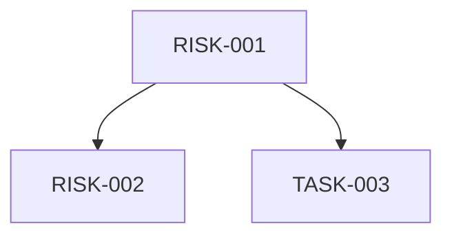
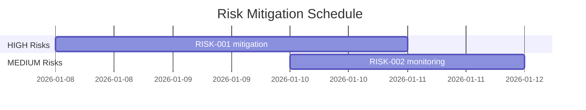

# Synthesis Phase: Gap Analysis & Risk Classification

> **Purpose:** Bridge discovery findings to actionable spec.md by identifying gaps, classifying risks, and synthesizing approach.

## Overview

The Synthesis phase transforms raw discovery output into structured specifications:

```
discovery.md ──┬──> Oracle Gap Analysis ──> Risk Classification ──> spec.md
               │
design.md ─────┘ (if exists)
```

## Oracle Gap Analysis Workflow

### Inputs

| Input | Required | Source |
|-------|----------|--------|
| `discovery.md` | ✅ Yes | Discovery phase output |
| `design.md` | ❌ Optional | Design session output (if Double Diamond used) |

### Oracle Prompt Template

```markdown
## Gap Analysis Request

### Context
- Discovery findings: [link to discovery.md]
- Design output: [link to design.md or "N/A"]

### Analysis Goals
1. Identify gaps between current state and desired outcome
2. Surface hidden dependencies not captured in discovery
3. Flag areas requiring clarification before implementation
4. Assess approach viability given codebase constraints

### Required Output
- **GAPS:** Missing information or unclear requirements
- **RISKS:** Technical and process risks with severity
- **APPROACH_REFINEMENT:** Adjustments to proposed approach
- **CLARIFICATIONS_NEEDED:** Questions for stakeholders
```

### Oracle Output Structure

```yaml
gaps:
  - id: GAP-001
    description: "Missing error handling strategy for API failures"
    severity: high
    resolution: "Define retry policy in spec"
    
  - id: GAP-002
    description: "Unclear state management approach"
    severity: medium
    resolution: "Clarify in design or spec"

risks:
  - id: RISK-001
    type: technical
    description: "External API rate limits unknown"
    level: HIGH
    mitigation: "Add circuit breaker pattern"

approach_refinements:
  - original: "Direct database writes"
    refined: "Use transaction wrapper for atomicity"
    reason: "Discovered existing pattern in codebase"
```

## Risk Classification

### Risk Levels

| Level | Criteria | Action |
|-------|----------|--------|
| **LOW** | Pattern exists in codebase, well-understood | Proceed with confidence |
| **MEDIUM** | Variation of existing pattern, some unknowns | Document assumptions, monitor |
| **HIGH** | Novel approach or external integration | Spike first, add contingency |

### Risk Indicators Decision Tree

```
Pattern exists in codebase?
├── YES ──────────────────────────────────> LOW base risk
│
└── NO ───> External dependency involved?
            ├── YES ─────────────────────> HIGH risk
            │
            └── NO ───> Blast radius >5 files?
                        ├── YES ─────────> HIGH risk
                        │
                        └── NO ──────────> MEDIUM risk
```

### Detailed Decision Criteria

#### Pattern Exists (LOW base)

Check for pattern existence:
```bash
# Search for similar patterns
Grep "pattern_name" --path src/
glob "**/*similar*.ts"
```

Criteria for "pattern exists":
- Same language/framework usage
- Similar data flow structure
- Existing tests demonstrating pattern
- Documentation or examples in codebase

#### External Dependency (HIGH)

External dependencies include:
- Third-party APIs
- New npm/pip packages
- External services (databases, queues, etc.)
- Authentication providers
- CDN or asset hosts

#### Blast Radius Assessment

| Files Affected | Risk Adjustment |
|---------------|-----------------|
| 1-2 files | No adjustment |
| 3-5 files | +1 level if MEDIUM |
| 6+ files | Automatic HIGH |

Blast radius calculation:
```bash
# Estimate affected files
bd show <id> --json | jq '.files'
```

## spec.md Schema

After synthesis, generate `spec.md` with:

```markdown
# Specification: [Feature Name]

## Approach

### Selected Strategy
[From design.md or synthesized from discovery]

### Rationale
[Why this approach was chosen]

### Key Decisions
- Decision 1: [choice] because [reason]
- Decision 2: [choice] because [reason]

## Risks

### Risk Matrix

| ID | Description | Level | Mitigation |
|----|-------------|-------|------------|
| RISK-001 | [description] | HIGH/MEDIUM/LOW | [mitigation strategy] |

### Risk Dependencies


## Acceptance Criteria

### Functional Requirements
- [ ] AC-001: [Criterion with measurable outcome]
- [ ] AC-002: [Criterion with measurable outcome]

### Non-Functional Requirements
- [ ] Performance: [specific metric]
- [ ] Security: [specific requirement]
- [ ] Accessibility: [specific standard]

### Definition of Done
- [ ] All acceptance criteria pass
- [ ] Tests written and passing
- [ ] Documentation updated
- [ ] Code reviewed
```

## Linking to Risk Map

After synthesis, risks should be documented in `risk-map.md`:

```markdown
# Risk Map: [Track ID]

## Active Risks

| ID | Risk | Level | Owner | Status | Mitigation |
|----|------|-------|-------|--------|------------|
| RISK-001 | API rate limits | HIGH | @dev | OPEN | Circuit breaker |

## Risk Timeline



## Risk Resolution Log

| Date | Risk ID | Action | Outcome |
|------|---------|--------|---------|
| 2026-01-08 | RISK-001 | Added circuit breaker | Downgraded to MEDIUM |
```

See [risk-map.md](./risk-map.md) for full risk tracking template.

## Integration with Pipeline

```
Discovery ──> Synthesis ──> Planning
    │            │             │
    v            v             v
discovery.md  spec.md      plan.md
              risk-map.md
```

### Handoff Checklist

Before proceeding to planning:
- [ ] All HIGH risks have mitigation strategies
- [ ] Gaps resolved or documented as assumptions
- [ ] Approach validated against codebase patterns
- [ ] Acceptance criteria are measurable
- [ ] Risk map created with owners assigned

## Related References

- [discovery.md](./discovery.md) - Discovery phase details
- [risk-map.md](./risk-map.md) - Risk tracking template
- [pipeline.md](./pipeline.md) - Full planning pipeline overview
